# **Prediction of In Vivo Single-Cell Gene Expression of Portal Hepatocytes**

This demonstrates the application of scVIDR to predict gene expression changes in liver cell types, focusing on portal hepatocytes treated with 30 μg/kg TCDD. It includes UMAP visualizations of latent spaces, PCA comparisons, regression plots for predicted vs. observed gene expression, and performance evaluations using R² scores across models and gene sets.

## Importing Required Libraries

Essential libraries are imported for data handling, single-cell analysis, statistical computations, and visualization.

```python
import sys
sys.path.insert(1, '../vidr/')

# Import the VIDR functions
from vidr import VIDR
from utils import *

import scanpy as sc
import scgen as scg
import pandas as pd
import numpy as np
import torch
import seaborn as sns
import gseapy as gp
from scipy import stats
from scipy import linalg
from scipy import spatial
from anndata import AnnData
from scipy import sparse
from statannotations.Annotator import Annotator
from matplotlib import pyplot as plt

#For calculating statistical distance
import geomloss
import pykeops
import pykeops
pykeops.clean_pykeops()          # just in case old build files are still present
pykeops.test_numpy_bindings()    # perform the compilation

import scvi
sc.set_figure_params(dpi = 150)
sc.settings.figdir = "../figures"
sns.set_style("dark")
```


## Loading Data
The single-cell dataset is loaded in AnnData format.

```python
adata = sc.read_h5ad("../data/nault2021_singleDose.h5ad")
```

## Data Preprocessing
Filters specific cell types, normalizes expression, selects the top 5000 highly variable genes, and formats dose information.

```python
#Prepare Data Set
cell_types_of_int = ["Hepatocytes - central", "Hepatocytes - portal", "Cholangiocytes", "Stellate Cells", "Portal Fibroblasts", "Endothelial Cells"]
adata = adata[adata.obs['celltype'].isin(cell_types_of_int)]

sc.pp.normalize_total(adata)
sc.pp.log1p(adata)
sc.pp.highly_variable_genes(adata, n_top_genes=5000)

adata.obs["dose"] = [str(d) for d in adata.obs.Dose]
adata = adata[:,adata.var.highly_variable]

```

## Training the Model
Prepare data for training, instantiate the VIDR model, and load pre-trained weights.

```python
#Training model
cell = "Hepatocytes - portal"
train_adata, test_adata = prepare_data(adata, "celltype", "dose", cell, "30", normalized = True)
train_adata.obs["cell_dose"] = [f"{j}_{str(i)}" for (i,j) in zip(train_adata.obs["Dose"], train_adata.obs["celltype"])]
model = VIDR(train_adata, linear_decoder = False)
#     model.train(
#     max_epochs=100,
#     batch_size=128,
#     early_stopping=True,
#     early_stopping_patience=25)
    
#     model.save(f"../../data/VAE_Binary_Prediction_Dioxin_5000g_{cell}.pt")
vae = model.load(f"../../data/VAE_Binary_Prediction_Dioxin_5000g_{cell}.pt/", train_adata)
```


## Figure 2A: UMAP Projection of Latent Space
UMAP visualization highlights the differences between control and treated samples in latent space.

```python
#UMAP Projection of latent space
latent_X = vae.get_latent_representation(adata)
latent_adata = sc.AnnData(X=latent_X, obs=adata.obs.copy())
cell_dose = [f"{j}_{str(i)}" for (i,j) in zip(adata.obs["Dose"], adata.obs["celltype"])]
training = ["Train" if i != cell+"_30" else "Test" for i in cell_dose]
latent_adata.obs["Cell_Dose"] = cell_dose
latent_adata.obs["Training Split"] = training

sc.pp.neighbors(latent_adata)
sc.tl.umap(latent_adata)

ax = sc.pl.umap(latent_adata, color=['Cell_Dose'], frameon=True,palette = "Paired", save ="2A1.svg")
```


 
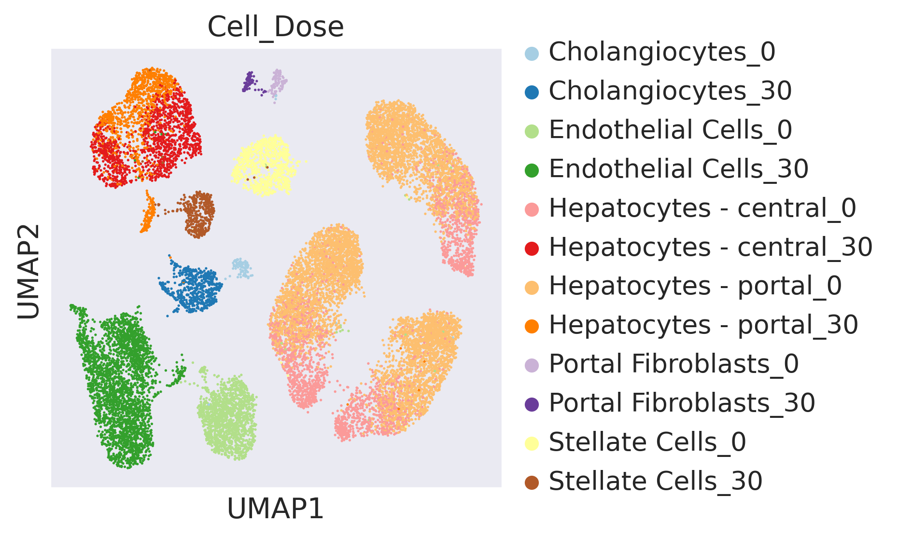
    


```python
sc.pl.umap(latent_adata, color=['Training Split'], frameon=True,palette ="Dark2", save="2A2.svg")
```

    
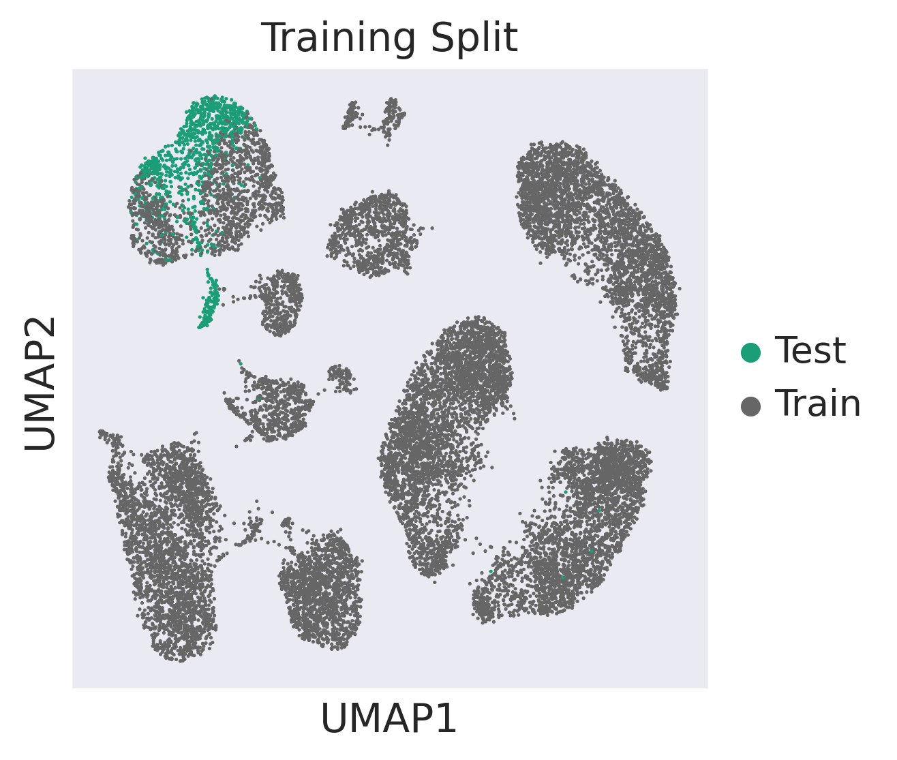
    


## Figure 2B: PCA Plots Comparing Prediction Models

Predicts gene expression under treatment and control without regression, combines the data, visualizes it using PCA, identifies differentially expressed genes, and evaluates prediction accuracy using R².

```python
model = vae
pred, delta = model.predict(
ctrl_key="0",
treat_key="30",
cell_type_to_predict=cell,
regression = False)
pred.obs["dose"] = 'pred'
ctrl_adata = adata[((adata.obs['celltype'] == cell) & (adata.obs["dose"] == "0"))]
treat_adata = adata[((adata.obs['celltype'] == cell) & (adata.obs["dose"] == "30"))]
eval_adata1 = ctrl_adata.concatenate(treat_adata, pred)
treatments = []
for i in eval_adata1.obs["dose"]:
    if i == "0":
        treatments.append("Control")
    elif i == "30":
        treatments.append("TCDD")
    else:
        treatments.append("VAEArith")
eval_adata1.obs["Treatment"] = treatments
sc.tl.pca(eval_adata1)
sc.pl.pca(eval_adata1, color = "Treatment", frameon = True, title = "", save = "2B1.svg")
CD4T = adata[adata.obs["celltype"] ==cell]
sc.tl.rank_genes_groups(CD4T, groupby="dose", method="wilcoxon")
diff_genes = CD4T.uns["rank_genes_groups"]["names"]["30"]
r2_value = model.reg_mean_plot(
eval_adata1,
axis_keys={"x": "pred", "y": "30"},
gene_list=diff_genes[:10],
top_100_genes = diff_genes[:100],
labels={"x": "Predicted Expression", "y": "Real Expression"},
path_to_save="../figures/2B2.svg",
show=True,
legend=False, title = "VAEArith")
print(r2_value)
```


    
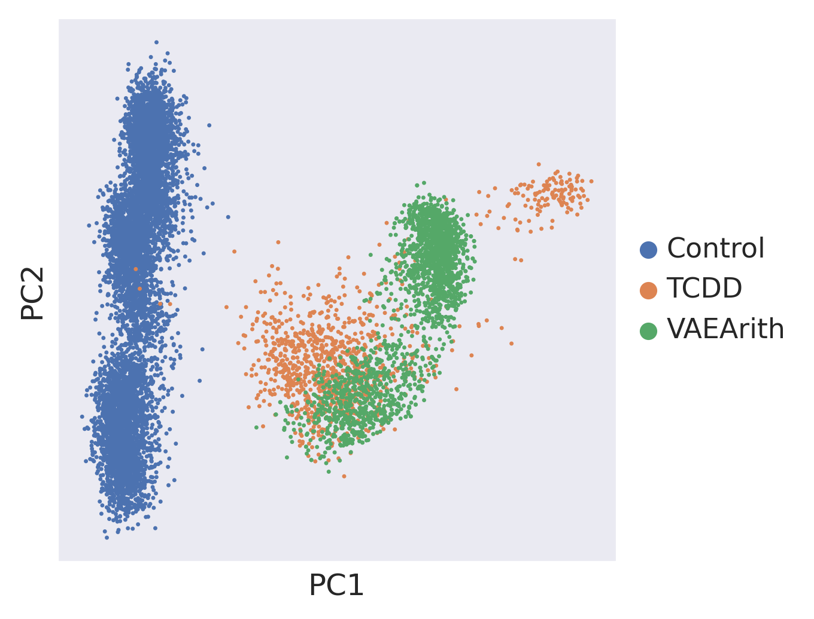
    

    
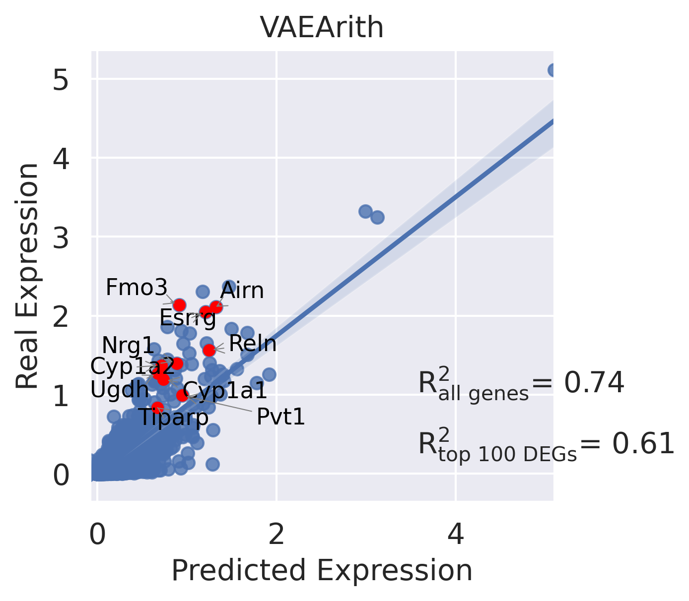
    


    (0.7412729808604916, 0.6055730593169139)


## Figure 2C: Regression Analysis with Predicted Data

Predicts gene expression under treatment and control using regression, combines predicted and real data, and visualizes the results with PCA and regression plots. It also identifies differentially expressed genes and evaluates model accuracy using the R² value.


```python
model = vae
pred, delta, reg = model.predict(
ctrl_key="0",
treat_key="30",
cell_type_to_predict=cell,
regression = True)
pred.obs["dose"] = 'pred'
ctrl_adata = adata[((adata.obs['celltype'] == cell) & (adata.obs["dose"] == "0"))]
treat_adata = adata[((adata.obs['celltype'] == cell) & (adata.obs["dose"] == "30"))]
eval_adata2 = ctrl_adata.concatenate(treat_adata, pred)
treatments = []
for i in eval_adata2.obs["dose"]:
    if i == "0":
        treatments.append("Control")
    elif i == "30":
        treatments.append("TCDD")
    else:
        treatments.append("scVIDR")
eval_adata2.obs["Treatment"] = treatments
sc.tl.pca(eval_adata2)
sc.pl.pca(eval_adata2, color = "Treatment", frameon = True, title = "", save = "2C1.svg")
CD4T = adata[adata.obs["celltype"] ==cell]
sc.tl.rank_genes_groups(CD4T, groupby="dose", method="wilcoxon")
diff_genes = CD4T.uns["rank_genes_groups"]["names"]["30"]
r2_value = model.reg_mean_plot(
eval_adata2,
axis_keys={"x": "pred", "y": "30"},
gene_list=diff_genes[:10],
top_100_genes = diff_genes[:100],
labels={"x": "Predicted Expression", "y": "Real Expression"},
path_to_save="../figures/Figure2C2.svg",
show=True,
legend=False, title = "scVIDR")
print(r2_value)
```


    
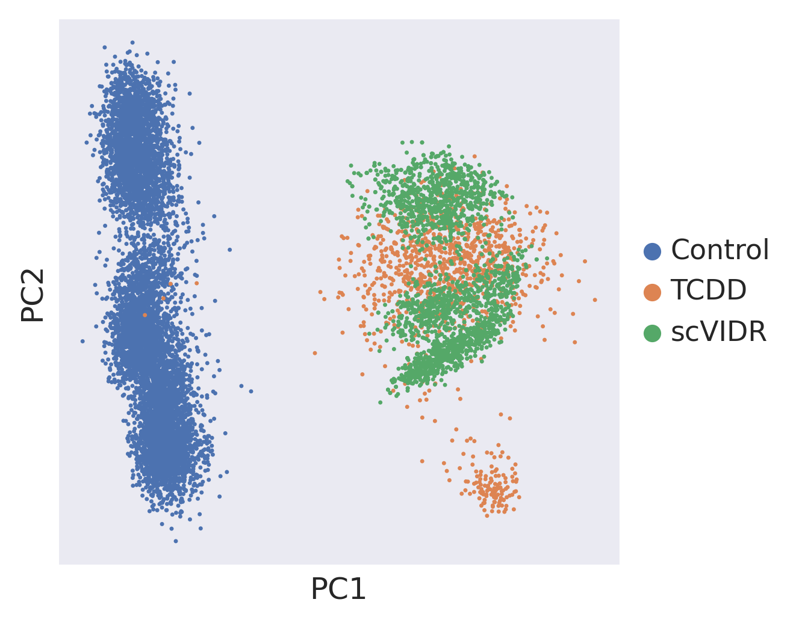
    


    
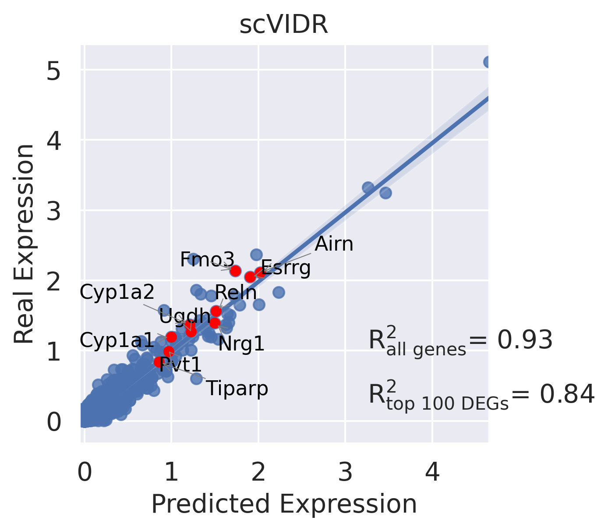
    


    (0.9331575277168523, 0.8371578892235645)


## Figure 2D: Comparison of Gene Expression Across Treatments
Combining predicted and real data to compare gene expression across treatments and visualizes **Cyp1a2** expression using a violin plot.


```python
eval_adata = eval_adata1.concatenate(eval_adata2)
eval_adata.obs
```


<div style="overflow-x: auto; width: 100%; max-width: 100vw;">
<style scoped>
    .dataframe tbody tr th:only-of-type {
        vertical-align: middle;
    }

    .dataframe tbody tr th {
        vertical-align: top;
    }

    .dataframe thead th {
        text-align: right;
    }
</style>
<table border="1" class="dataframe">
  <thead>
    <tr style="text-align: right;">
      <th></th>
      <th>Dose</th>
      <th>batch</th>
      <th>celltype</th>
      <th>dose</th>
      <th>_scvi_batch</th>
      <th>_scvi_labels</th>
      <th>_scvi_local_l_mean</th>
      <th>_scvi_local_l_var</th>
      <th>cell_dose</th>
      <th>Treatment</th>
    </tr>
  </thead>
  <tbody>
    <tr>
      <th>AAACCCACAGTTAGGG_1-0-0-0</th>
      <td>0</td>
      <td>0</td>
      <td>Hepatocytes - portal</td>
      <td>0</td>
      <td>NaN</td>
      <td>NaN</td>
      <td>NaN</td>
      <td>NaN</td>
      <td>NaN</td>
      <td>Control</td>
    </tr>
    <tr>
      <th>AAACCCAGTGCCTGCA_1-0-0-0</th>
      <td>0</td>
      <td>0</td>
      <td>Hepatocytes - portal</td>
      <td>0</td>
      <td>NaN</td>
      <td>NaN</td>
      <td>NaN</td>
      <td>NaN</td>
      <td>NaN</td>
      <td>Control</td>
    </tr>
    <tr>
      <th>AAACGAACATAGAATG_1-0-0-0</th>
      <td>0</td>
      <td>0</td>
      <td>Hepatocytes - portal</td>
      <td>0</td>
      <td>NaN</td>
      <td>NaN</td>
      <td>NaN</td>
      <td>NaN</td>
      <td>NaN</td>
      <td>Control</td>
    </tr>
    <tr>
      <th>AAACGAAGTCGATTAC_1-0-0-0</th>
      <td>0</td>
      <td>0</td>
      <td>Hepatocytes - portal</td>
      <td>0</td>
      <td>NaN</td>
      <td>NaN</td>
      <td>NaN</td>
      <td>NaN</td>
      <td>NaN</td>
      <td>Control</td>
    </tr>
    <tr>
      <th>AAACGCTTCGGCATCG_1-0-0-0</th>
      <td>0</td>
      <td>0</td>
      <td>Hepatocytes - portal</td>
      <td>0</td>
      <td>NaN</td>
      <td>NaN</td>
      <td>NaN</td>
      <td>NaN</td>
      <td>NaN</td>
      <td>Control</td>
    </tr>
    <tr>
      <th>...</th>
      <td>...</td>
      <td>...</td>
      <td>...</td>
      <td>...</td>
      <td>...</td>
      <td>...</td>
      <td>...</td>
      <td>...</td>
      <td>...</td>
      <td>...</td>
    </tr>
    <tr>
      <th>ATAGAGAAGGTCCCGT_3-0-0-2-1</th>
      <td>0</td>
      <td>1</td>
      <td>Hepatocytes - portal</td>
      <td>pred</td>
      <td>0.0</td>
      <td>3.0</td>
      <td>5.716166</td>
      <td>0.067732</td>
      <td>Hepatocytes - portal_0</td>
      <td>scVIDR</td>
    </tr>
    <tr>
      <th>TTCCTTCTCTCCCAAC_3-0-0-2-1</th>
      <td>0</td>
      <td>1</td>
      <td>Hepatocytes - portal</td>
      <td>pred</td>
      <td>0.0</td>
      <td>3.0</td>
      <td>5.716166</td>
      <td>0.067732</td>
      <td>Hepatocytes - portal_0</td>
      <td>scVIDR</td>
    </tr>
    <tr>
      <th>CAGCACGAGCTCCGAC_2-0-0-2-1</th>
      <td>0</td>
      <td>1</td>
      <td>Hepatocytes - portal</td>
      <td>pred</td>
      <td>0.0</td>
      <td>3.0</td>
      <td>5.716166</td>
      <td>0.067732</td>
      <td>Hepatocytes - portal_0</td>
      <td>scVIDR</td>
    </tr>
    <tr>
      <th>AACCATGCAGGCCCTA_1-0-0-2-1</th>
      <td>0</td>
      <td>1</td>
      <td>Hepatocytes - portal</td>
      <td>pred</td>
      <td>0.0</td>
      <td>3.0</td>
      <td>5.716166</td>
      <td>0.067732</td>
      <td>Hepatocytes - portal_0</td>
      <td>scVIDR</td>
    </tr>
    <tr>
      <th>CACGGGTTCGCACGAC_2-0-0-2-1</th>
      <td>0</td>
      <td>1</td>
      <td>Hepatocytes - portal</td>
      <td>pred</td>
      <td>0.0</td>
      <td>3.0</td>
      <td>5.716166</td>
      <td>0.067732</td>
      <td>Hepatocytes - portal_0</td>
      <td>scVIDR</td>
    </tr>
  </tbody>
</table>
<p>21902 rows × 10 columns</p>
</div>


```python
ax = sc.pl.violin(eval_adata, ["Cyp1a2"], groupby = "Treatment", rotation = 0, palette = "tab10", save = "2D.svg")
```
    
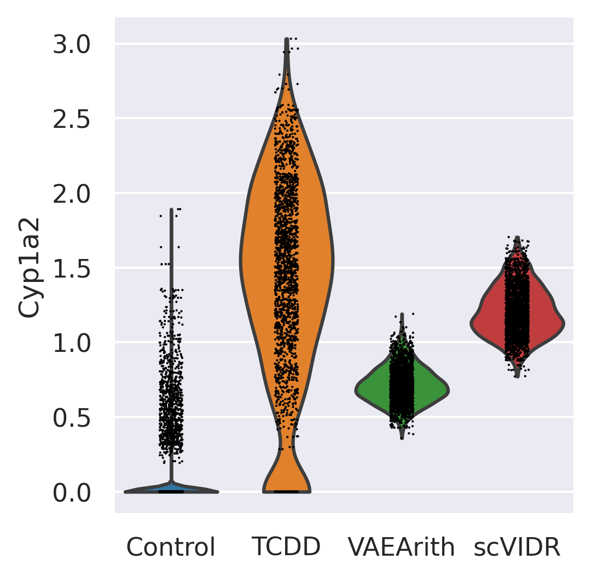
    


# Figure 2E: Comprehensive Analysis of Gene Expression Predictions Across Cell Types
Each cell type in the dataset is analyzed to predict gene expression changes between control and treated conditions. First, VIDR models are trained for each cell type, evaluated using non-regression-based predictions, and their performance is quantified. Next, pre-trained scVIDR models are used to make regression-based predictions for more precise analysis. Differentially expressed genes are identified for both approaches, and R² metrics are calculated to assess the accuracy of predictions.


```python
df_list = []
celltypes = np.unique(adata.obs["celltype"])
for cell in celltypes:
    print(cell)
    train_adata, test_adata = prepare_data(adata, "celltype", "dose", cell, "30", normalized = True)

    model = VIDR(train_adata, linear_decoder = False)
    model.train(
    max_epochs=100,
    batch_size=128,
    early_stopping=True,
    early_stopping_patience=25)
    
    model.save(f"../data/VAE_Binary_Prediction_Dioxin_5000g_{cell}.pt", overwrite = True)
    model = model.load(f"../data/VAE_Binary_Prediction_Dioxin_5000g_{cell}.pt/", train_adata)
    
    model_name = "VAEArith"
    
    pred, delta = model.predict(
    ctrl_key="0",
    treat_key="30",
    cell_type_to_predict=cell,
    regression = False)
    
    pred.obs["dose"] = 'pred'
    ctrl_adata = adata[((adata.obs['celltype'] == cell) & (adata.obs["dose"] == "0"))]
    treat_adata = adata[((adata.obs['celltype'] == cell) & (adata.obs["dose"] == "30"))]
    eval_adata = ctrl_adata.concatenate(treat_adata, pred)
    
    CD4T = adata[adata.obs["celltype"] ==cell]
    sc.tl.rank_genes_groups(CD4T, groupby="dose", method="wilcoxon")
    diff_genes = CD4T.uns["rank_genes_groups"]["names"]["30"]
    
    r2_df = calculate_r2_singledose(
        eval_adata, cell,
        model_name, 
        "dose", 
        {"x":"pred", "y":"30"}, 
        diff_genes=diff_genes[:100], 
        random_sample_coef = 0.8,
        n_iter = 500
    )
    df_list.append(r2_df)
```

 


```python
for cell in celltypes:
    print(cell)
    train_adata, test_adata = prepare_data(adata, "celltype", "dose", cell, "30", normalized = True)

    model = VIDR(train_adata, linear_decoder = False)
#     model.train(
#     max_epochs=100,
#     batch_size=128,
#     early_stopping=True,
#     early_stopping_patience=25)
    
#     model.save(f"../../data/VAE_Binary_Prediction_Dioxin_5000g_{cell}.pt")
    model = model.load(f"../../data/VAE_Binary_Prediction_Dioxin_5000g_{cell}.pt/", train_adata)
    
    model_name = "scVIDR"
    
    pred, delta, reg = model.predict(
    ctrl_key="0",
    treat_key="30",
    cell_type_to_predict=cell,
    regression = True)
    
    pred.obs["dose"] = 'pred'
    ctrl_adata = adata[((adata.obs['celltype'] == cell) & (adata.obs["dose"] == "0"))]
    treat_adata = adata[((adata.obs['celltype'] == cell) & (adata.obs["dose"] == "30"))]
    eval_adata = ctrl_adata.concatenate(treat_adata, pred)
    
    CD4T = adata[adata.obs["celltype"] ==cell]
    sc.tl.rank_genes_groups(CD4T, groupby="dose", method="wilcoxon")
    diff_genes = CD4T.uns["rank_genes_groups"]["names"]["30"]
    
    r2_df = calculate_r2_singledose(
        eval_adata, cell,
        model_name, 
        "dose", 
        {"x":"pred", "y":"30"}, 
        diff_genes=diff_genes[:100], 
        random_sample_coef = 0.8,
        n_iter = 500
    )
    df_list.append(r2_df)
```


```python
r2_values_allCells_df = pd.concat(df_list)
```


```python
r2_values_allCells_df.to_csv("../data/SingleDose_Model_Results.csv")
```

Comparing R<sup>2</sup> values of scVIDR and VAEArith across gene sets with statistical annotations.

```python
order = ['scVIDR', 'VAEArith']
hue_order = ["All HVGs", "DEGs"]
ax = sns.boxplot(x = "Model", y = "R^2",  data = r2_values_allCells_df, hue = "Gene Set", order = order, hue_order = hue_order)
pairs = [
    (('scVIDR','All HVGs'), ('VAEArith', 'All HVGs')),
    (('scVIDR','DEGs'), ('VAEArith', 'DEGs'))
]
annotator = Annotator(ax, pairs, data=r2_values_allCells_df, x="Model", y="R^2", hue = "Gene Set", order = order)
annotator.configure(test='Mann-Whitney-gt', text_format='star', loc='outside')
annotator.apply_and_annotate()
plt.ylabel(r"$R^2$")
plt.savefig("../figures/Figure2E.svg", bbox_inches = "tight")
plt.show()
```


    
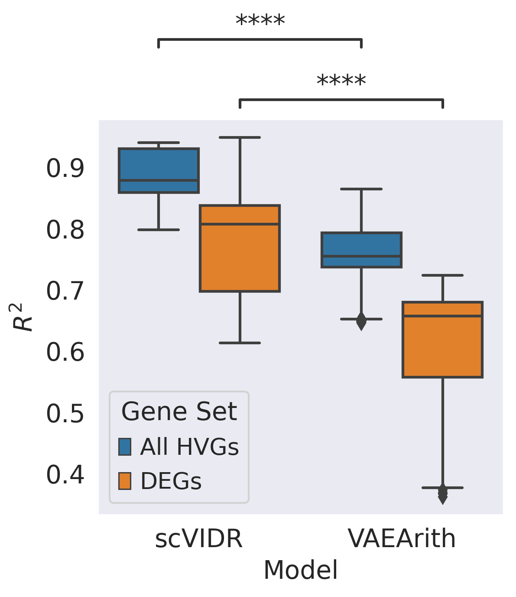
    


```python
df = r2_values_allCells_df[r2_values_allCells_df["Gene Set"] == "DEGs"]
```

Comparing R² values of scVIDR and VAEArith across cell types using a bar plot.

```python
order = ['scVIDR', 'VAEArith']
hue_order = ["All HVGs", "DEGs"]
ax = sns.barplot(x = "Cell", y = "R^2",  data = r2_values_allCells_df, hue = "Model", hue_order=order)
plt.ylabel("$R^2$ Top 100 DEGs")
plt.xticks(rotation = 90)
```


    
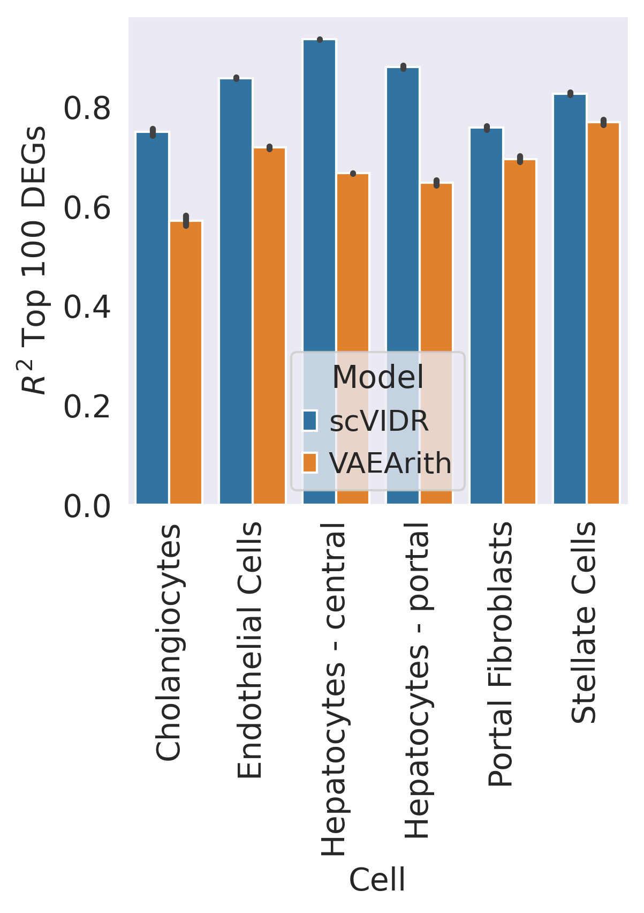
    


Identifies differentially expressed genes (DEGs) between treatment groups for each cell type, performs KEGG pathway enrichment analysis, and visualizes enriched pathways with bar plots.

```python
for cell in celltypes:
    print(cell)
    
    CD4T = adata[adata.obs["celltype"] ==cell]
    sc.tl.rank_genes_groups(CD4T, groupby="dose", method="wilcoxon")
    diff_genes = CD4T.uns["rank_genes_groups"]["names"]["30"]
    glist = diff_genes[:100]
    CD4T.
```


```python
for cell in celltypes:
    print(cell)
    
    CD4T = adata[adata.obs["celltype"] ==cell]
    sc.tl.rank_genes_groups(CD4T, groupby="dose", method="wilcoxon")
    diff_genes = CD4T.uns["rank_genes_groups"]["names"]["30"]
    glist = diff_genes[:125]
    print(glist[:10])
    glist = glist.tolist()
    enr = gp.enrichr(gene_list=glist,
                     gene_sets=["KEGG_2019_Mouse"],
                     organism='Mouse', # don't forget to set organism to the one you desired! e.g. Yeast
                     description='test_name',
                     outdir='test/enrichr_kegg',
                     # no_plot=True,
                     cutoff=0.5 # test dataset, use lower value from range(0,1)
                    )
    gp.plot.barplot(enr.res2d, title = f"{cell}")
    plt.show()
```


    
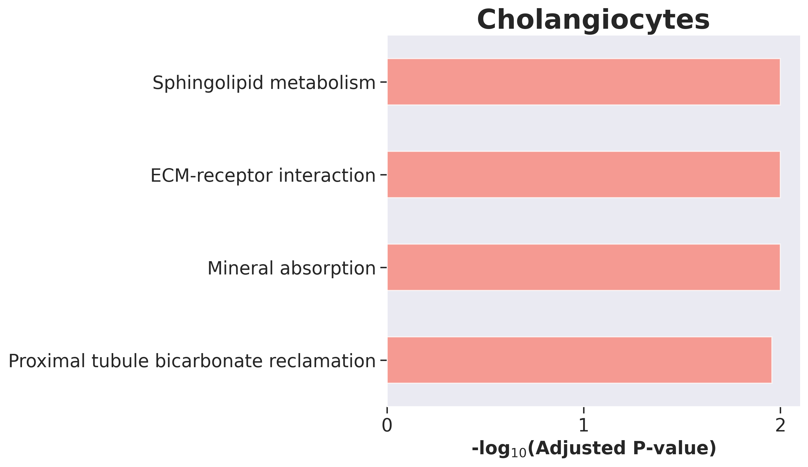
    


    
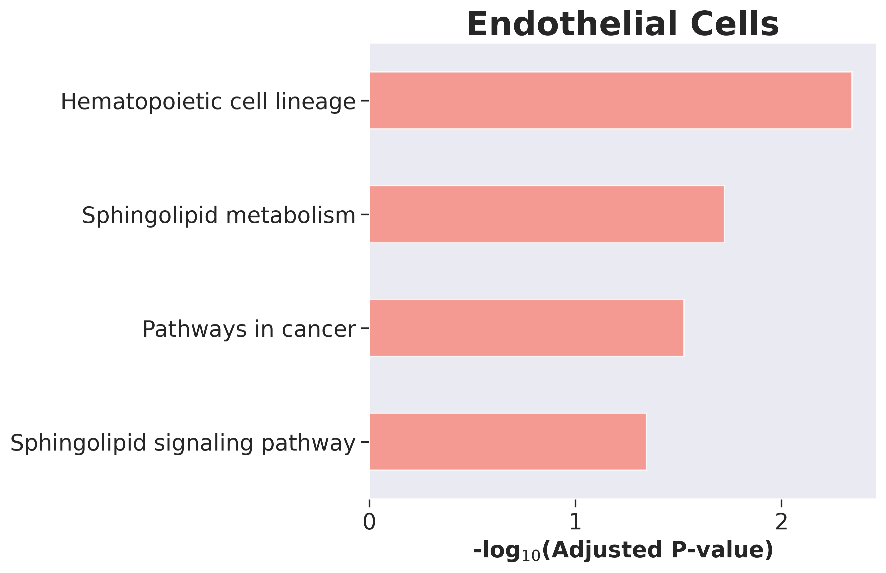
    


    
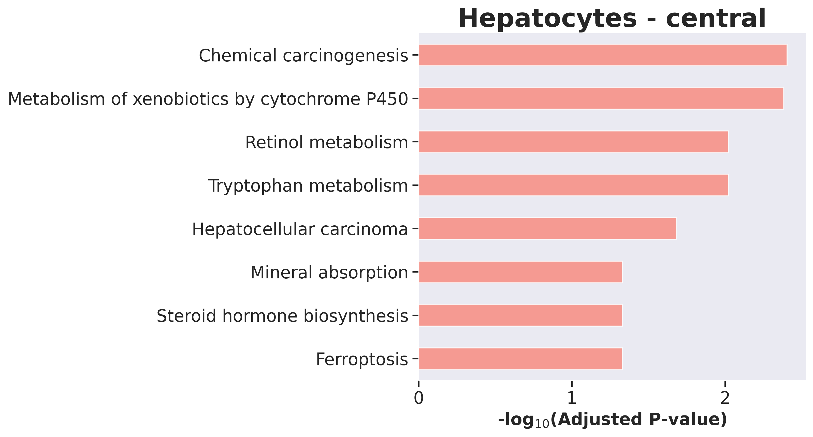
    


    
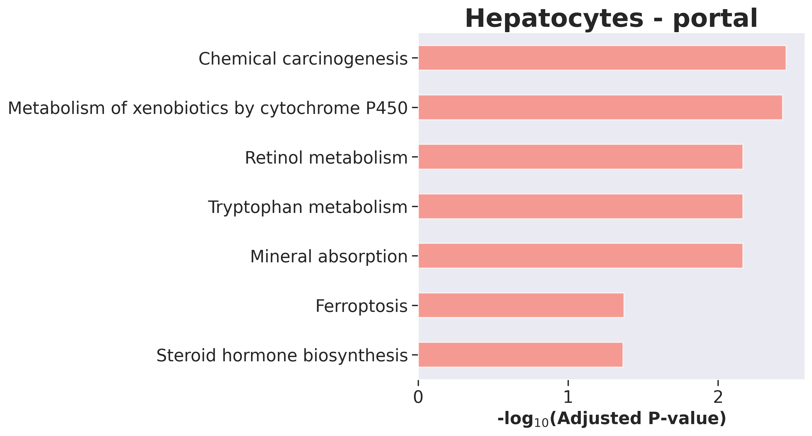
    


    
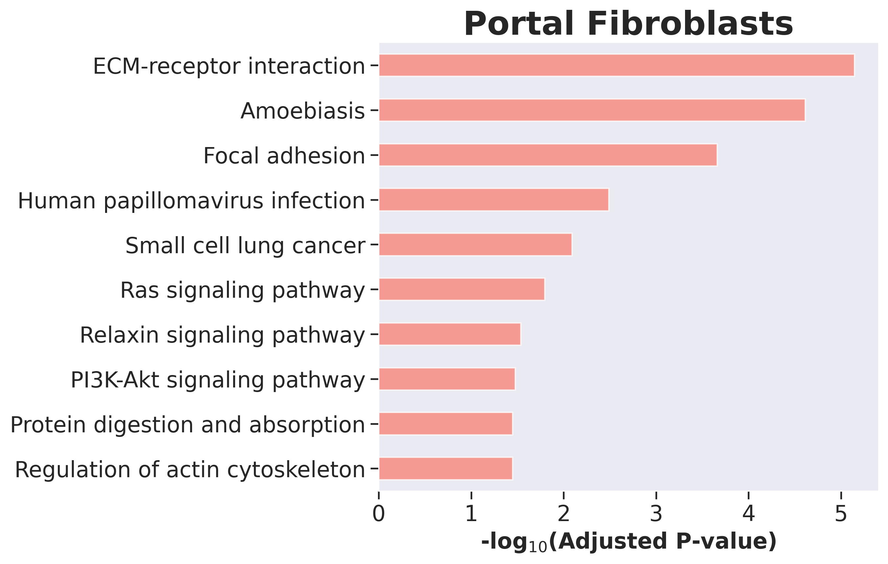
    


    
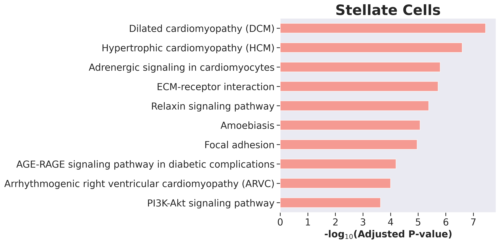
    


Identifies and visualizes differentially expressed genes (DEGs) across cell types within the treated group (dose=30) using a Wilcoxon rank-sum test.

```python
CD4T = adata[adata.obs["dose"] == "30"]
```


```python
sc.tl.rank_genes_groups(CD4T, groupby="celltype", method="wilcoxon", )
```


```python
diff_genes = CD4T.uns["rank_genes_groups"]["names"]
```


```python
sc.pl.rank_genes_groups(CD4T)
```


    
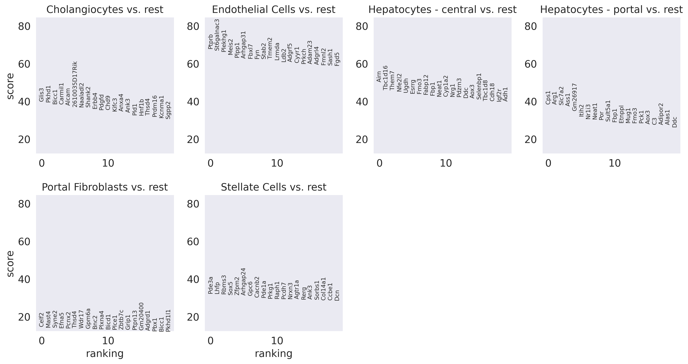
    


Identifies and visualizes differentially expressed genes (DEGs) across cell types within the treated group (dose=30) using a Wilcoxon rank-sum test. differentially expressed genes (DEGs) between treatment groups for each cell type, performs WikiPathways enrichment analysis, and visualizes enriched pathways with bar plots.


```python
for cell in cell_types_of_int:
    diff_genes = CD4T.uns["rank_genes_groups"]["names"][cell]
    glist = diff_genes[:100]
    print(glist[:10])
    glist = glist.tolist()
    enr = gp.enrichr(gene_list=glist,
                     gene_sets=["WikiPathways_2019_Mouse"],
                     organism='Mouse', # don't forget to set organism to the one you desired! e.g. Yeast
                     description='test_name',
                     outdir='test/enrichr_kegg',
                     # no_plot=True,
                     cutoff=0.5 # test dataset, use lower value from range(0,1)
                    )
    gp.plot.barplot(enr.res2d, title = f"{cell}")
    plt.show()
```

    ['Airn' 'Tbc1d16' 'Them7' 'Nfe2l2' 'Ugdh' 'Esrrg' 'Fmo3' 'Fabp12' 'Fbp1'
     'Neat1']


    
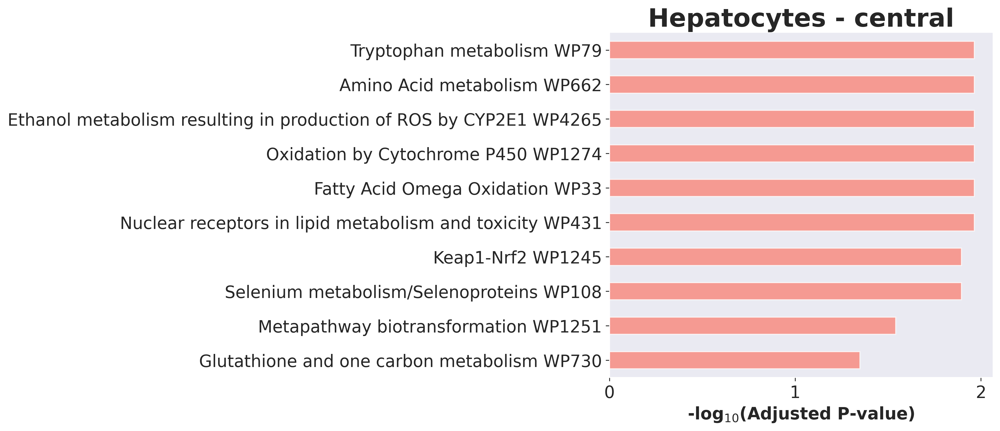
    


    ['Cps1' 'Arg1' 'Slc7a2' 'Ass1' 'Gm26917' 'Itih2' 'Nr1i3' 'Neat1' 'Por'
     'Sult5a1']


    
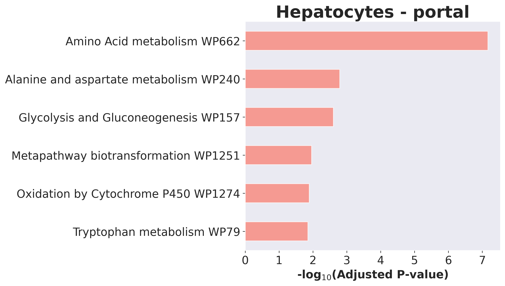
    


    ['Glis3' 'Pkhd1' 'Bicc1' 'Carmil1' 'Alcam' '2610035D17Rik' 'Naaladl2'
     'Shank2' 'Erbb4' 'Pdgfd']


    
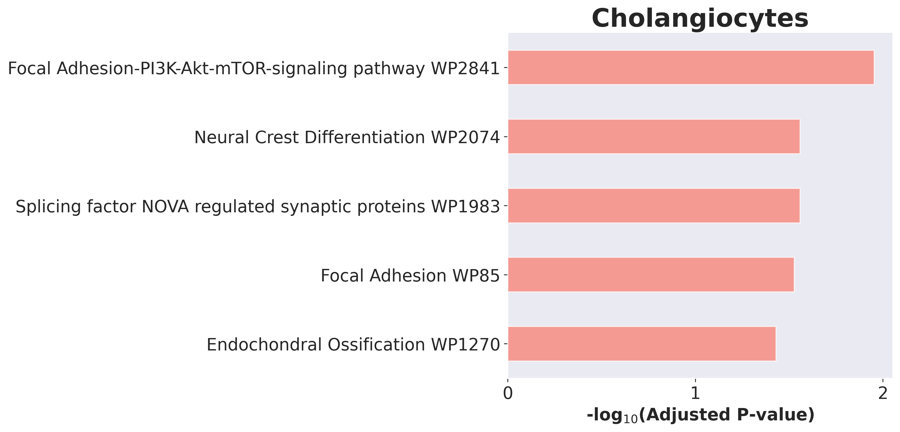
    


    ['Pde3a' 'Lhfp' 'Rbms3' 'Sox5' 'Zfpm2' 'Arhgap24' 'Gpc6' 'Cacnb2' 'Pde1a'
     'Prkg1']


    
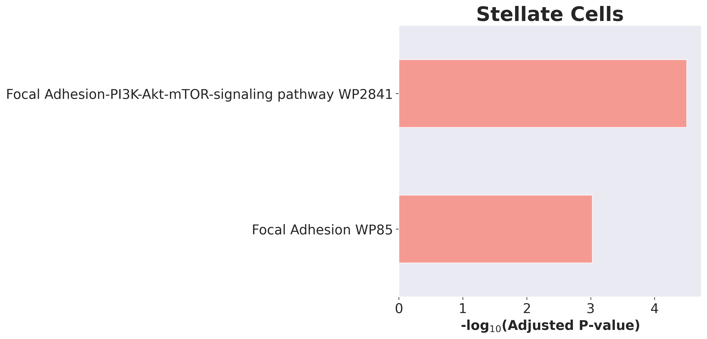
    


    ['Celf2' 'Mast4' 'Syne2' 'Efna5' 'Pcnx2' 'Thsd4' 'Wdr17' 'Gpm6a' 'Bnc2'
     'Plxna4']


    
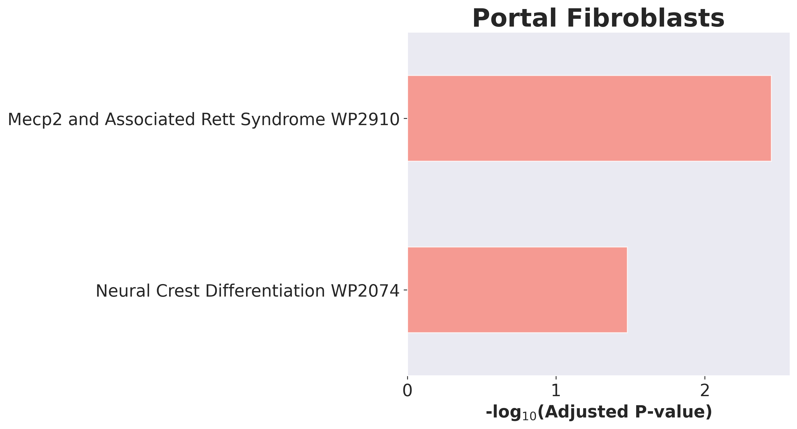
    


    ['Ptprb' 'St6galnac3' 'Plekhg1' 'Meis2' 'Plpp1' 'Arhgap31' 'Fbxl7' 'Fyn'
     'Stab2' 'Tmem2']


  

    
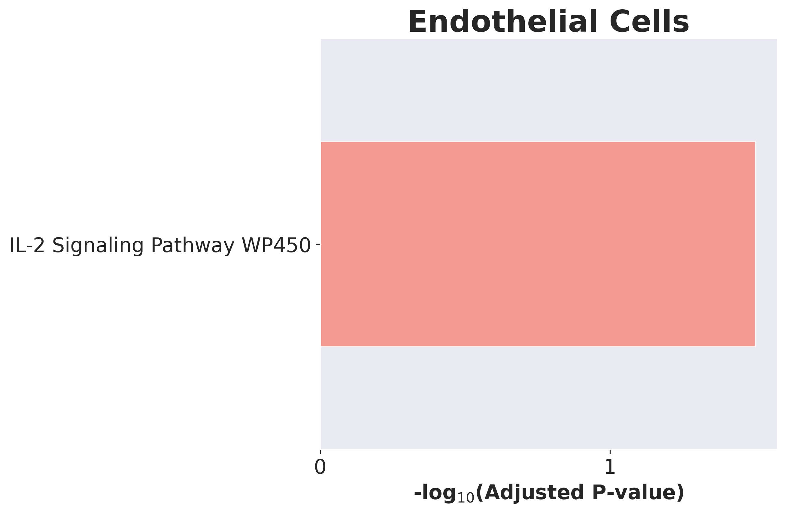
    


Calculates Jaccard similarity between top 50 DEGs of cell types, creates a similarity matrix, and visualizes it as a heatmap.

```python
jaccard_sim = lambda x, y: len(set(x) & set(y))/len(set(x) | set(y))
```


```python
jaccard_sim(CD4T.uns["rank_genes_groups"]["names"]["Portal Fibroblasts"][:100], CD4T.uns["rank_genes_groups"]["names"]["Cholangiocytes"][:100])
```


    0.09289617486338798


```python
N = len(cell_types_of_int)
dist_mat = np.zeros([N, N])
for i in range(N):
    for j in range(N):
        cell_i = cell_types_of_int[i]
        cell_j = cell_types_of_int[j]
        diff_i = CD4T.uns["rank_genes_groups"]["names"][cell_i][:50]
        diff_j = CD4T.uns["rank_genes_groups"]["names"][cell_j][:50]
        dist_ij = jaccard_sim(diff_i, diff_j)
        dist_mat[i, j] = dist_ij
```


```python
dist_df = pd.DataFrame(dist_mat, columns=cell_types_of_int, index = cell_types_of_int)
```


```python
sns.heatmap(dist_df, cmap = "coolwarm")
```


    
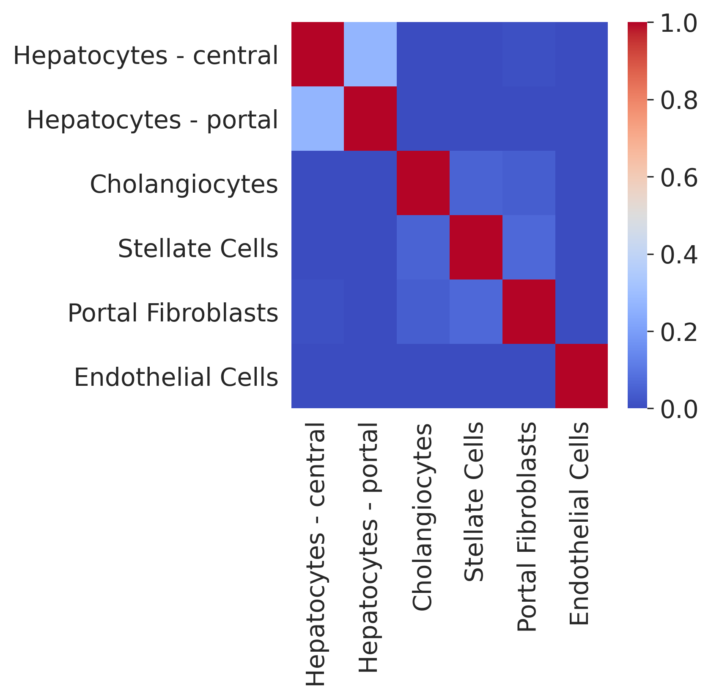
    


```python
mmd = geomloss.SamplesLoss("sinkhorn")
cos = torch.nn.CosineSimilarity(dim = 1, eps = 1e-6)
```


```python
for cell in cell_types_of_int:
    x = latent_adata[((adata.obs['celltype'] == cell) & (adata.obs["dose"] == "0"))]
    y = latent_adata[((adata.obs['celltype'] == cell) & (adata.obs["dose"] == "30"))]
    x_tensor = torch.Tensor(x.X)
    y_tensor = torch.Tensor(y.X)
    print(f"{cell}: {mmd(x_tensor, y_tensor)}")
```

    Hepatocytes - central: 267.10369873046875


