# **Prediction of In Vivo Single-Cell TCDD Dose-Response Across Mouse Liver Cell Types**

This study utilizes mouse liver snRNA-seq data across eight TCDD doses (0.01 to 30 μg/kg) and a control to evaluate scVIDR's ability to predict dose-response gene expression. The analysis highlights scVIDR's superior performance over scGen in predicting highly variable genes (HVGs) and differentially expressed genes (DEGs) across various doses. Key results include UMAP representations of latent spaces, dose-response predictions for Ahrr, and performance evaluations using R² scores across liver cell types and doses.


## Importing Required Libraries

Imports necessary libraries and functions for modeling, single-cell analysis, statistical evaluation, and visualization. Configures plotting parameters and suppresses warnings.

```python
import sys
sys.path.insert(1, '../vidr/')

#Import VIDR functions
from vidr import VIDR
from PCAEval import PCAEval
from utils import *

#Import important modules
import scanpy as sc
import scgen as scg
import pandas as pd
import numpy as np
import torch
import seaborn as sns
from scipy import stats
from scipy import linalg
from scipy import spatial
from anndata import AnnData
from scipy import sparse
from statannotations.Annotator import Annotator
from matplotlib import pyplot as plt

#For calculating statistical distance
import geomloss
import pykeops
import pykeops
pykeops.clean_pykeops()          
pykeops.test_numpy_bindings() 


import warnings
warnings.filterwarnings("ignore")

sc.set_figure_params(dpi = 150, frameon = True)
sns.set_style("dark")
sc.set_figure_params(dpi = 150)
sc.settings.figdir = "../figures"
sns.set_style("dark")
```

## Data Loading and Preprocessing

Loads the multi-dose dataset, filters out immune cells to retain relevant liver cell types, normalizes and log-transforms the data, selects the top 5000 highly variable genes, and converts the dose information into a categorical variable.

```python
#Import Data
adata = sc.read_h5ad("../data/nault2021_multiDose.h5ad")


#Remove Immune Cells
cell_types_of_int = ["Hepatocytes - central", "Hepatocytes - portal", "Cholangiocytes", "Stellate Cells", "Portal Fibroblasts", "Endothelial Cells"]
adata = adata[adata.obs['celltype'].isin(cell_types_of_int)]

#Preporces data

sc.pp.normalize_total(adata)
sc.pp.log1p(adata)
sc.pp.highly_variable_genes(adata, n_top_genes = 5000)
adata = adata[:, adata.var.highly_variable]

#Make dose categorical
adata.obs["dose"] = [str(i) for i in adata.obs["Dose"]]
```

## Loading the VIDR Model
Prepares the training and testing datasets for portal hepatocytes across TCDD doses, initializes a VIDR model, and loads a pre-trained VIDR model specific to this cell type and dose-response data.

```python
doses = [0.0,0.01, 0.03, 0.1, 0.3, 1.0, 3.0, 10.0, 30.0]
cell = "Hepatocytes - portal"
model_name = "VAE"
train_adata, test_adata = prepare_cont_data(adata, "celltype", "dose", "Dose", cell, 0, normalized=True)
model = VIDR(train_adata, linear_decoder = False)
#     model.train(
#     max_epochs=100,
#     batch_size=128,
#     early_stopping=True,
#     early_stopping_patience=25)
    
#     model.save(f"../../data/VAE_Cont_Prediction_Dioxin_5000g_{cell}.pt")
model = model.load(f"../data/VAE_Cont_Prediction_Dioxin_5000g_{cell}.pt", train_adata)
```


Defines the range of TCDD doses (0.01 to 30 μg/kg) along with a control dose for dose-response analysis.

```python
doses = [0.0,0.01, 0.03, 0.1, 0.3, 1.0, 3.0, 10.0, 30.0]
```

## Regression and Evaluation Across TCDD Doses
Performs regression-based predictions of gene expression across multiple TCDD doses using the VIDR model. For each dose, differentially expressed genes are identified, and regression plots are generated to compare predicted and actual gene expression. R² values are calculated to quantify the model's performance for all genes and the top 100 differentially expressed genes.

```python
#Regression   
regression = True
dr_dict, delta, reg = model.predict(
    ctrl_key='0.0',
    treat_key='30.0',
    cell_type_to_predict=cell,
    regression = regression,
    continuous = True,
    doses = doses)

for key in dr_dict.keys():
    dr_dict[key].obs["Dose"] = f'{key} VIDR'

ctrl_adata = adata[((adata.obs['celltype'] == cell) & (adata.obs['Dose'] == 0))]
eval_dict1 = {}

for d in doses[1:]:
    stim_adata = adata[((adata.obs['celltype'] == cell) & (adata.obs['Dose'] == d))]
    eval_dict1[d] = ctrl_adata.concatenate(stim_adata, dr_dict[d])
    eval_dict1[d].obs["dose"] = [str(i) if type(i) == float else i for i in eval_dict1[d].obs['Dose']]

for d in doses[1:]:
    cell_adata = adata[adata.obs["celltype"] ==cell]
    sc.tl.rank_genes_groups(cell_adata, groupby="dose", method="wilcoxon")
    diff_genes = cell_adata.uns["rank_genes_groups"]["names"][str(d)]
    print(f"{d}")
    r2_value1 = model.reg_mean_plot(
        eval_dict1[d],
        condition_key = "dose",
        cell_type_key = "celltype",
        axis_keys={"x": f"{d} VIDR", "y": f"{d}"},
        gene_list=diff_genes[:10],
        top_100_genes = diff_genes[:25],
        labels={"x": "predicted", "y": "ground truth"},
        path_to_save="./reg_mean1.pdf",
        show=True,
        legend=False)
    r2_value2 = model.reg_mean_plot(
        eval_dict1[d],
        condition_key = "dose",
        cell_type_key = "celltype",
        axis_keys={"x": f"0.0", "y": f"{d}"},
        gene_list=diff_genes[:10],
        top_100_genes = diff_genes[:25],
        labels={"x": "predicted", "y": "ground truth"},
        path_to_save="./figures/reg_mean1.pdf",
        show=False,
        legend=False)
    print(f"Model: {model_name}\n Cell: {cell}\n Regression: {regression} \n Dose: {d} \n R2 All: {r2_value1[0]/r2_value2[0]} \n R2 Top 100: {r2_value1[1]/r2_value2[1]}")
```

   


    Dose = 0.01


    
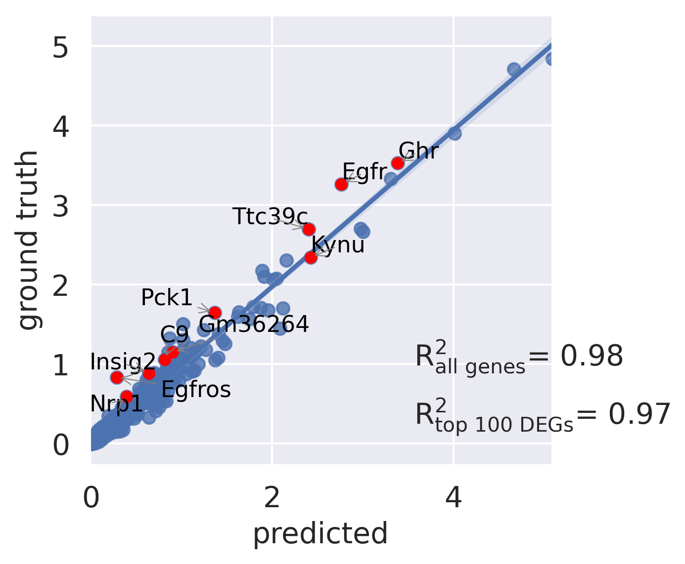
    


    Trying to set attribute `.obs` of view, copying.


    Model: VAE
     Cell: Hepatocytes - portal
     Regression: True 
     Dose: 0.01 
     R2 All: 0.9998365886415364 
     R2 Top 100: 0.9996258058759293


    ... storing 'dose' as categorical


    Dose = 0.03


    
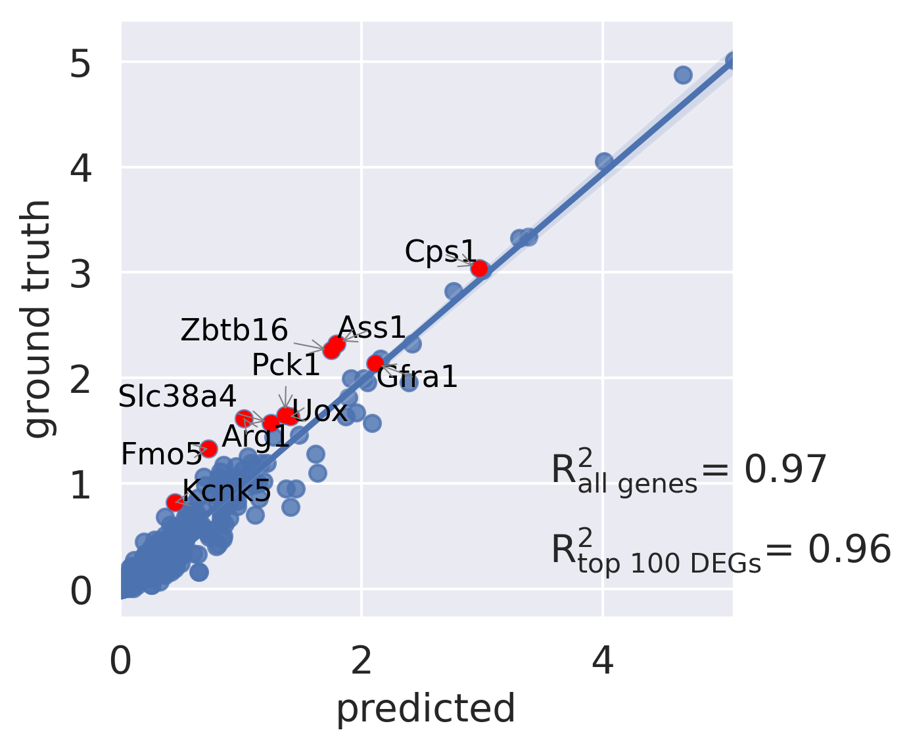
    


    Trying to set attribute `.obs` of view, copying.


    Model: VAE
     Cell: Hepatocytes - portal
     Regression: True 
     Dose: 0.03 
     R2 All: 0.9994310986600337 
     R2 Top 100: 1.0036983240887611


    ... storing 'dose' as categorical


    Dose = 0.1


    
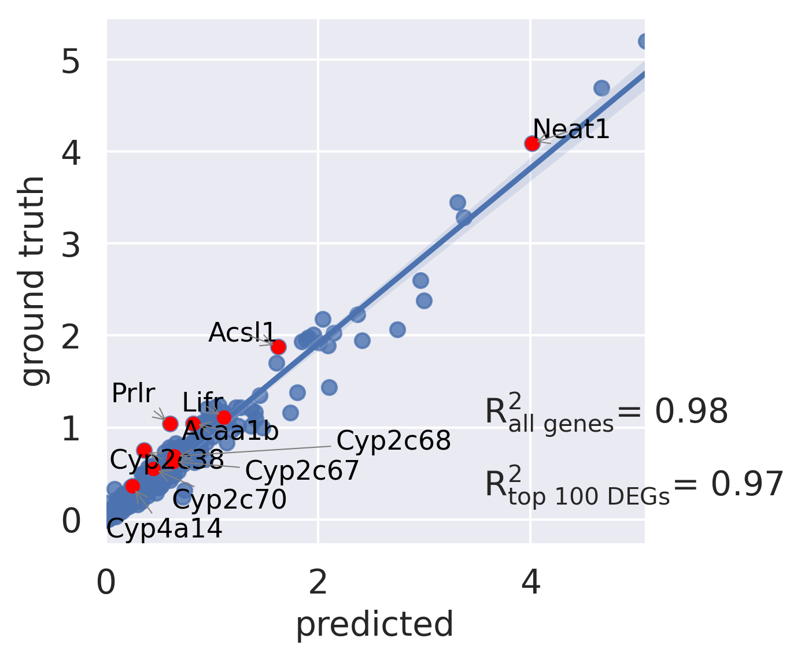
    


    Trying to set attribute `.obs` of view, copying.


    Model: VAE
     Cell: Hepatocytes - portal
     Regression: True 
     Dose: 0.1 
     R2 All: 1.0017792971327764 
     R2 Top 100: 1.004977132859977


    ... storing 'dose' as categorical


    Dose = 0.3


    
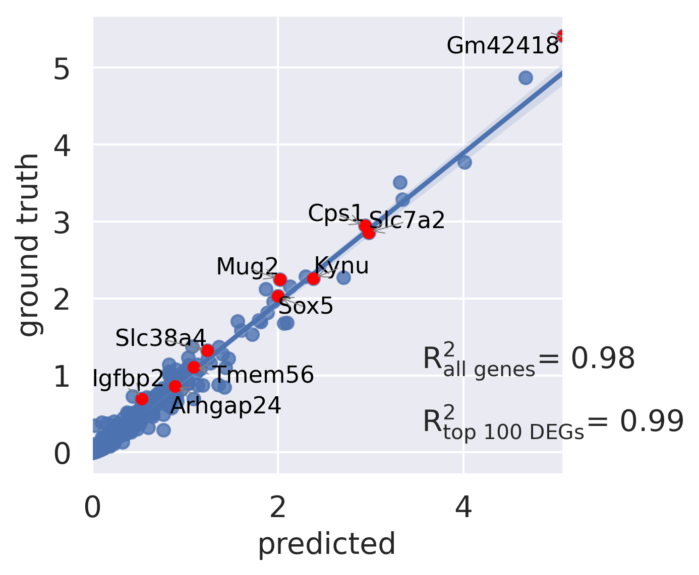
    


    Trying to set attribute `.obs` of view, copying.


    Model: VAE
     Cell: Hepatocytes - portal
     Regression: True 
     Dose: 0.3 
     R2 All: 1.0005741023645782 
     R2 Top 100: 1.0003103972683154


    ... storing 'dose' as categorical


    Dose = 1.0


    
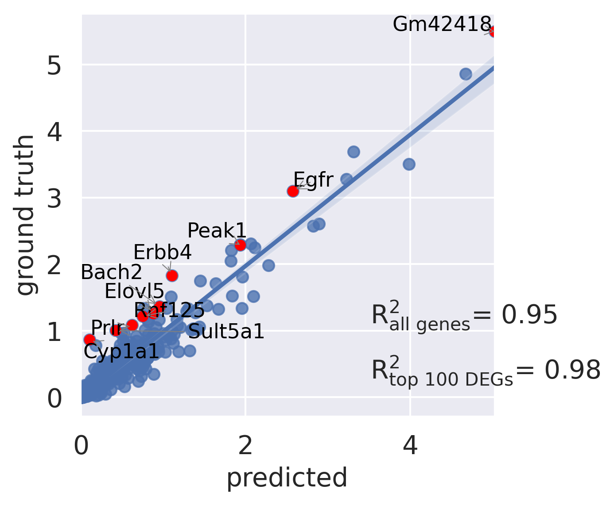
    


    Trying to set attribute `.obs` of view, copying.


    Model: VAE
     Cell: Hepatocytes - portal
     Regression: True 
     Dose: 1.0 
     R2 All: 1.005549147681544 
     R2 Top 100: 1.016663184905941


    ... storing 'dose' as categorical


    Dose = 3.0


    
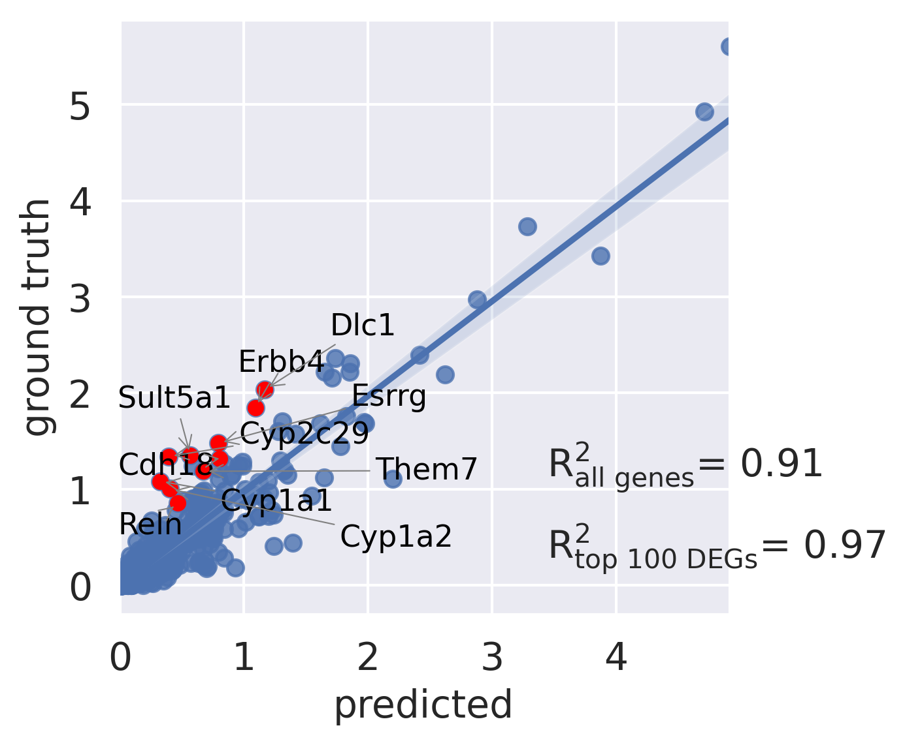
    


    Trying to set attribute `.obs` of view, copying.


    Model: VAE
     Cell: Hepatocytes - portal
     Regression: True 
     Dose: 3.0 
     R2 All: 1.0401036100968821 
     R2 Top 100: 1.0038404243535974


    ... storing 'dose' as categorical


    Dose = 10.0


    
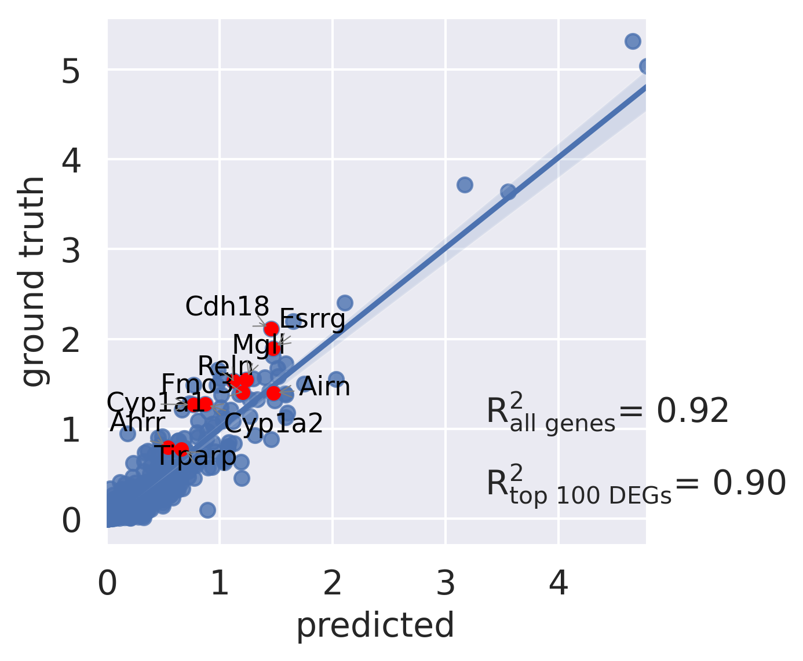
    


    Trying to set attribute `.obs` of view, copying.


    Model: VAE
     Cell: Hepatocytes - portal
     Regression: True 
     Dose: 10.0 
     R2 All: 1.1961050842270327 
     R2 Top 100: 1.1112825896117045


    ... storing 'dose' as categorical


    Dose = 30.0


    

    


    Model: VAE
     Cell: Hepatocytes - portal
     Regression: True 
     Dose: 30.0 
     R2 All: 1.465797262704612 
     R2 Top 100: 1.1896994357394821


Generates a UMAP projection of the latent space representation of the dataset using the VIDR model's embeddings.

```python
latent_X = model.get_latent_representation(adata)
latent_adata = sc.AnnData(X = latent_X, obs = adata.obs.copy())
sc.pp.neighbors(latent_adata)
sc.tl.umap(latent_adata)
```


Assigns metadata to the latent dataset, including training/test splits, dose values, cell types, and combined cell-dose labels.

```python
latent_adata.obs["Training Split"] = ["Test" if ((i == "Hepatocytes - portal") & (j > 0)) else "Train" for (i, j) in zip(latent_adata.obs["celltype"], latent_adata.obs["Dose"])]
latent_adata.obs["Dose"] = [float(i) for i in latent_adata.obs["dose"]]
latent_adata.obs["Cell Type"] = latent_adata.obs["celltype"]
latent_adata.obs["cell_dose"] = [f"{j}_{str(i)}" for (i,j) in zip(latent_adata.obs["Dose"], latent_adata.obs["celltype"])]
```

Calculates centroids in the UMAP space for each unique cell-dose combination, including the control and highest-dose groups.
```python
centroids = {cell:np.average(latent_adata.obsm["X_umap"][latent_adata.obs["cell_dose"] == cell], axis = 0) for cell in np.unique(latent_adata.obs["cell_dose"])}
centroids["0"] = np.average(latent_adata.obsm["X_umap"][latent_adata.obs["dose"] == "0.0"], axis = 0)
centroids["30"] = np.average(latent_adata.obsm["X_umap"][latent_adata.obs["dose"] == "30.0"], axis = 0)
```

## Figure 3A: UMAP Visualization of Dose-Response
This section visualizes the latent space representation of single-cell gene expression across TCDD doses using UMAP. The first plot highlights clustering by cell type, the second illustrates the train-test split for portal hepatocytes, and the third shows dose-response trajectories using arrows to represent changes in gene expression across doses in portal hepatocytes. The arrows are scaled based on the dose to depict the gradual transition in gene expression from control to the highest dose.


```python
sc.pl.umap(latent_adata, color = ["Cell Type"], frameon=True, save ="3A1.svg")
```

    
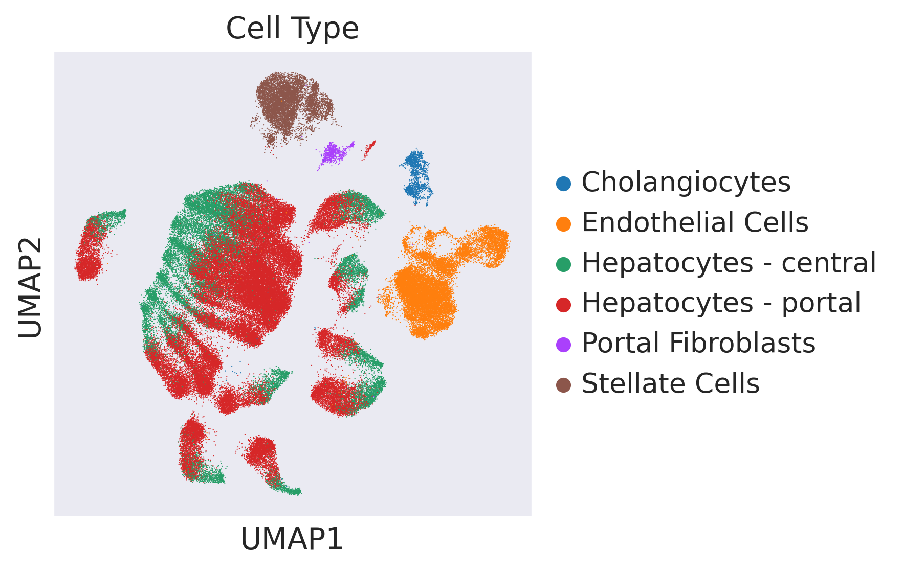
    


```python
sc.pl.umap(latent_adata, color = ["Training Split"], frameon=True,  palette= "Dark2", save = "3A2.svg")
```
    
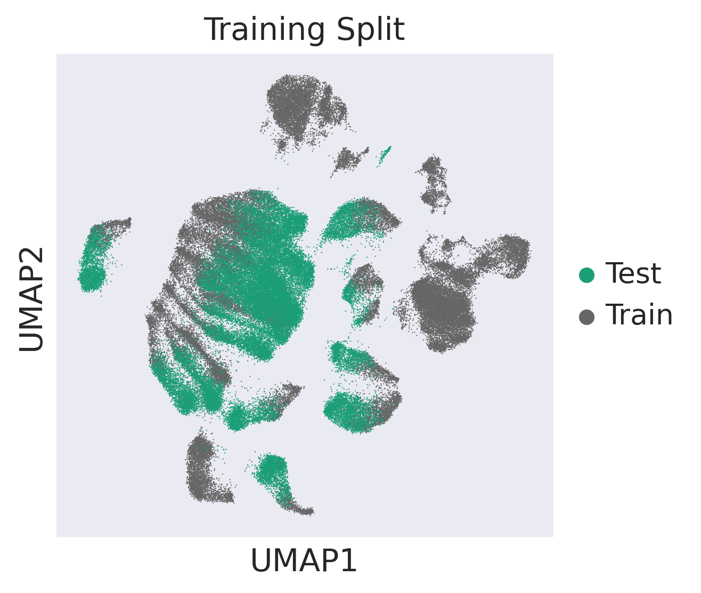
    


```python
from matplotlib import cm
```


```python
umap_delta = centroids["30"]- centroids["0"]
ax =sc.pl.umap(latent_adata, color = ["Dose"], frameon=True, return_fig = True, cmap = "flare")
x = [i/30 for i in doses[::-1][:-1]]
colors = cm.get_cmap(sns.cm.flare)(x)[np.newaxis, :, :3]
for d, c in zip(doses[::-1][:-1], colors[0]):
    plt.arrow(centroids["Hepatocytes - portal_0.0"][0], centroids["Hepatocytes - portal_0.0"][1], umap_delta[0]*(np.log1p(d)/np.log1p(30)), umap_delta[1]*(np.log1p(d)/np.log1p(30)), head_width = 0.7, edgecolor = "black", facecolor = c)
plt.savefig("../figures/3A3.svg", bbox_inches='tight')
plt.show()
```


    
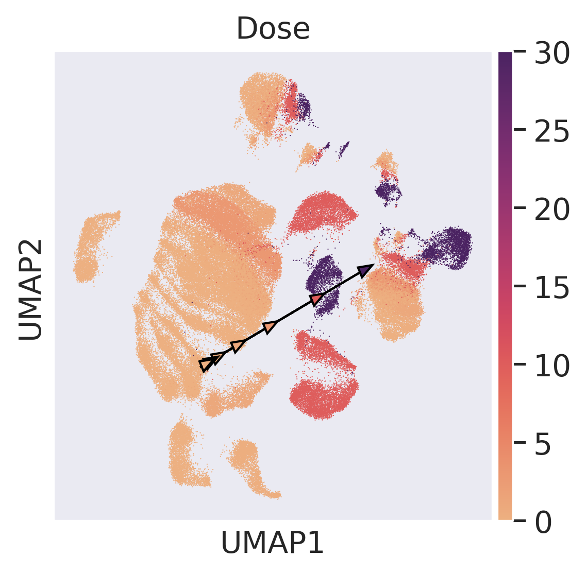
    


```python
# df_list = []
# celltypes = np.unique(adata.obs["celltype"])
# regression = False
# for cell in celltypes:
#     print(cell)
#     train_adata, test_adata = prepare_cont_data(adata, "celltype", "dose", "Dose", cell, 0, normalized=True)

#     model = VIDR(train_adata, linear_decoder = False)
# #     model.train(
# #     max_epochs=100,
# #     batch_size=128,
# #     early_stopping=True,
# #     early_stopping_patience=25)
    
# #     model.save(f"../../data/VAE_Binary_Prediction_Dioxin_5000g_{cell}.pt")
#     model = model.load(f"../../data/VAE_Cont_Prediction_Dioxin_5000g_{cell}.pt/", train_adata)
    
#     model_name = "VAEArith"
        
#     dr_dict, delta = model.predict(
#         ctrl_key='0.0',
#         treat_key='30.0',
#         cell_type_to_predict=cell,
#         regression = regression,
#         continuous = True,
#         doses = doses)
#     for key in dr_dict.keys():
#         dr_dict[key].obs["Dose"] = f'{key} VAEArith'

#     ctrl_adata = adata[((adata.obs['celltype'] == cell) & (adata.obs['Dose'] == 0))]
#     eval_dict1 = {}

#     for d in doses[1:]:
#         stim_adata = adata[((adata.obs['celltype'] == cell) & (adata.obs['Dose'] == d))]
#         eval_dict1[d] = ctrl_adata.concatenate(stim_adata, dr_dict[d])
#         eval_dict1[d].obs["dose"] = [str(i) if type(i) == float else i for i in eval_dict1[d].obs['Dose']]

#     for d in doses[1:]:
#         cell_adata = adata[adata.obs["celltype"] ==cell]
#         sc.tl.rank_genes_groups(cell_adata, groupby="dose", method="wilcoxon")
#         diff_genes = cell_adata.uns["rank_genes_groups"]["names"][str(d)]
    
#         r2_df = calculate_r2_multidose(
#             eval_dict1[d], 
#             cell,
#             model_name, 
#             "dose", 
#             {"x":f'{d} VAEArith', "y":f"{d}"}, 
#             diff_genes=diff_genes[:100], 
#             random_sample_coef = 0.8,
#             n_iter = 500
#         )
#         df_list.append(r2_df)
```


```python
# celltypes = np.unique(adata.obs["celltype"])
# regression = True
# for cell in celltypes:
#     print(cell)
#     train_adata, test_adata = prepare_cont_data(adata, "celltype", "dose", "Dose", cell, 0, normalized=True)

#     model = VIDR(train_adata, linear_decoder = False)
# #     model.train(
# #     max_epochs=100,
# #     batch_size=128,
# #     early_stopping=True,
# #     early_stopping_patience=25)
    
# #     model.save(f"../../data/VAE_Binary_Prediction_Dioxin_5000g_{cell}.pt")
#     model = model.load(f"../../data/VAE_Cont_Prediction_Dioxin_5000g_{cell}.pt/", train_adata)
    
#     model_name = "scVIDR"
        
#     dr_dict, delta, reg = model.predict(
#         ctrl_key='0.0',
#         treat_key='30.0',
#         cell_type_to_predict=cell,
#         regression = regression,
#         continuous = True,
#         doses = doses)
#     for key in dr_dict.keys():
#         dr_dict[key].obs["Dose"] = f'{key} VAEArith'

#     ctrl_adata = adata[((adata.obs['celltype'] == cell) & (adata.obs['Dose'] == 0))]
#     eval_dict1 = {}

#     for d in doses[1:]:
#         stim_adata = adata[((adata.obs['celltype'] == cell) & (adata.obs['Dose'] == d))]
#         eval_dict1[d] = ctrl_adata.concatenate(stim_adata, dr_dict[d])
#         eval_dict1[d].obs["dose"] = [str(i) if type(i) == float else i for i in eval_dict1[d].obs['Dose']]

#     for d in doses[1:]:
#         cell_adata = adata[adata.obs["celltype"] ==cell]
#         sc.tl.rank_genes_groups(cell_adata, groupby="dose", method="wilcoxon")
#         diff_genes = cell_adata.uns["rank_genes_groups"]["names"][str(d)]
    
#         r2_df = calculate_r2_multidose(
#             eval_dict1[d], 
#             cell,
#             model_name, 
#             "dose", 
#             {"x":f'{d} VAEArith', "y":f"{d}"}, 
#             diff_genes=diff_genes[:100], 
#             random_sample_coef = 0.8,
#             n_iter = 500
#         )
#         df_list.append(r2_df)
```


```python
# r2_values_allCells_df = pd.concat(df_list)
```


```python
# r2_values_allCells_df.to_csv("../../data/Continuous_Comparison_r2Values.csv")
```


```python
r2_values_allCells_df = pd.read_csv("../data/Continuous_Comparison_r2Values.csv")
```


```python
r2_values_allCells_df["Dose"] = r2_values_allCells_df["Dose"].astype("str")
```

## Figure 3C: Dose-Response Prediction for Portal Hepatocytes
Bar plots compare the prediction performance of scVIDR and VAEArith across TCDD doses for portal hepatocytes. The first plot evaluates the mean expression of all highly variable genes (HVGs), while the second focuses on the top 100 differentially expressed genes (DEGs). Statistical significance is assessed using the Mann-Whitney U test, with annotations indicating differences between models at each dose.


```python
cell = "Hepatocytes - portal"
df = r2_values_allCells_df.loc[((r2_values_allCells_df["Cell"].values == cell) & 
                                (r2_values_allCells_df["Gene Set"] == "All HVGs"))]
order = [str(i) for i in doses][1:]
hue_order = ['scVIDR', 'VAEArith']
ax = sns.barplot(x = "Dose", y = "R^2",  data = df, hue = "Model", order = order, hue_order = hue_order)
pairs = [
    (("0.01", "scVIDR"),("0.01", "VAEArith")),
    (("0.03", "scVIDR"),("0.03", "VAEArith")),
    (("0.1", "scVIDR"),("0.1", "VAEArith")),
    (("0.3", "scVIDR"),("0.3", "VAEArith")),
    (("1.0", "scVIDR"),("1.0", "VAEArith")),
    (("3.0", "scVIDR"),("3.0", "VAEArith")),
    (("10.0", "scVIDR"),("10.0", "VAEArith")),
    (("30.0", "scVIDR"),("30.0", "VAEArith"))
]
annotator = Annotator(ax, pairs, data=df, x="Dose", y="R^2", hue = "Model", order = order, hue_order=hue_order)
annotator.configure(test='Mann-Whitney-gt', text_format='star', loc='outside')
annotator.apply_and_annotate()
plt.xticks(fontsize = 10)
plt.ylabel(r"$R^2$ All HVGs")
plt.savefig("../figures/3B1.svg")
plt.show()
```

    p-value annotation legend:
          ns: p <= 1.00e+00
           *: 1.00e-02 < p <= 5.00e-02
          **: 1.00e-03 < p <= 1.00e-02
         ***: 1.00e-04 < p <= 1.00e-03
        ****: p <= 1.00e-04
    
    0.03_scVIDR vs. 0.03_VAEArith: Mann-Whitney-Wilcoxon test greater, P_val:1.000e+00 U_stat=9.600e+04
    0.01_scVIDR vs. 0.01_VAEArith: Mann-Whitney-Wilcoxon test greater, P_val:1.000e+00 U_stat=8.816e+04
    0.1_scVIDR vs. 0.1_VAEArith: Mann-Whitney-Wilcoxon test greater, P_val:1.000e+00 U_stat=6.304e+04
    0.3_scVIDR vs. 0.3_VAEArith: Mann-Whitney-Wilcoxon test greater, P_val:1.000e+00 U_stat=1.015e+05
    1.0_scVIDR vs. 1.0_VAEArith: Mann-Whitney-Wilcoxon test greater, P_val:7.095e-83 U_stat=2.129e+05
    3.0_scVIDR vs. 3.0_VAEArith: Mann-Whitney-Wilcoxon test greater, P_val:3.109e-165 U_stat=2.500e+05
    10.0_scVIDR vs. 10.0_VAEArith: Mann-Whitney-Wilcoxon test greater, P_val:2.928e-165 U_stat=2.500e+05
    30.0_scVIDR vs. 30.0_VAEArith: Mann-Whitney-Wilcoxon test greater, P_val:2.928e-165 U_stat=2.500e+05


    
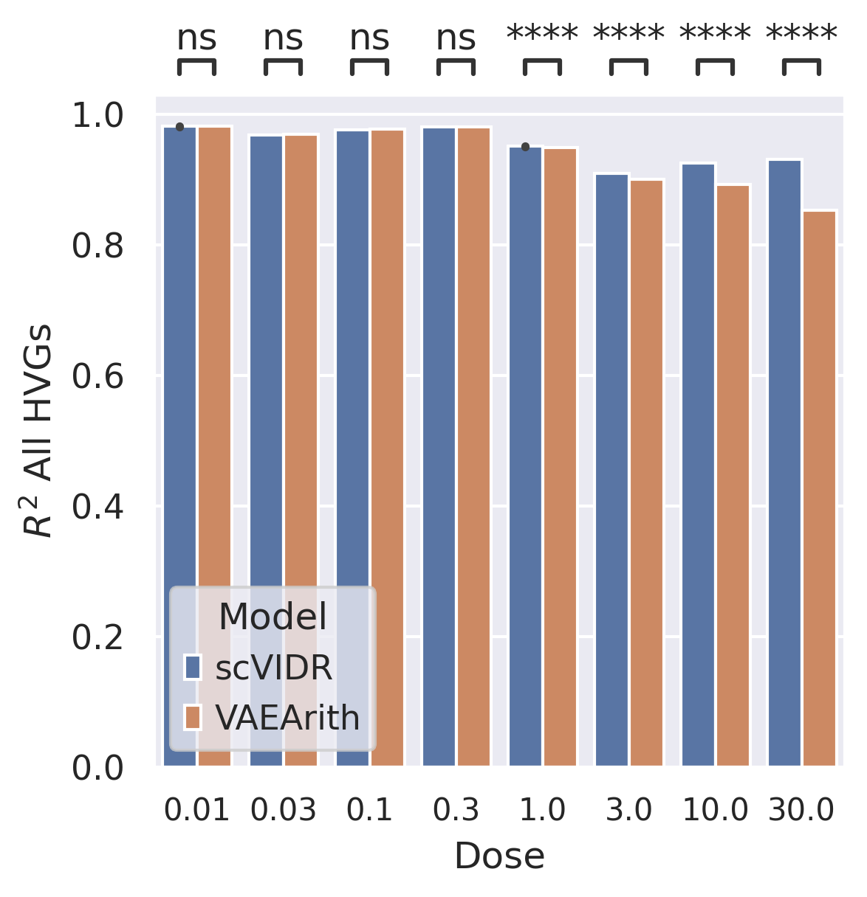
    


```python
cell = "Hepatocytes - portal"
df = r2_values_allCells_df.loc[((r2_values_allCells_df["Cell"].values == cell) & 
                                (r2_values_allCells_df["Gene Set"] == "DEGs"))]
order = [str(i) for i in doses][1:]
hue_order = ['scVIDR', 'VAEArith']
ax = sns.barplot(x = "Dose", y = "R^2",  data = df, hue = "Model", order = order, hue_order = hue_order)
pairs = [
    (("0.01", "scVIDR"),("0.01", "VAEArith")),
    (("0.03", "scVIDR"),("0.03", "VAEArith")),
    (("0.1", "scVIDR"),("0.1", "VAEArith")),
    (("0.3", "scVIDR"),("0.3", "VAEArith")),
    (("1.0", "scVIDR"),("1.0", "VAEArith")),
    (("3.0", "scVIDR"),("3.0", "VAEArith")),
    (("10.0", "scVIDR"),("10.0", "VAEArith")),
    (("30.0", "scVIDR"),("30.0", "VAEArith"))
]
annotator = Annotator(ax, pairs, data=df, x="Dose", y="R^2", hue = "Model", order = order, hue_order=hue_order)
annotator.configure(test='Mann-Whitney-gt', text_format='star', loc='outside')
annotator.apply_and_annotate()
plt.xticks(fontsize = 10)
plt.ylabel(r"$R^2$ Top 100 DEGs")
plt.savefig("../figures/3B2.svg")
plt.show()
```

    p-value annotation legend:
          ns: p <= 1.00e+00
           *: 1.00e-02 < p <= 5.00e-02
          **: 1.00e-03 < p <= 1.00e-02
         ***: 1.00e-04 < p <= 1.00e-03
        ****: p <= 1.00e-04
    
    0.03_scVIDR vs. 0.03_VAEArith: Mann-Whitney-Wilcoxon test greater, P_val:1.000e+00 U_stat=1.053e+05
    0.01_scVIDR vs. 0.01_VAEArith: Mann-Whitney-Wilcoxon test greater, P_val:1.000e+00 U_stat=6.812e+04
    0.1_scVIDR vs. 0.1_VAEArith: Mann-Whitney-Wilcoxon test greater, P_val:1.000e+00 U_stat=6.914e+04
    0.3_scVIDR vs. 0.3_VAEArith: Mann-Whitney-Wilcoxon test greater, P_val:2.868e-02 U_stat=1.337e+05
    1.0_scVIDR vs. 1.0_VAEArith: Mann-Whitney-Wilcoxon test greater, P_val:1.135e-162 U_stat=2.490e+05
    3.0_scVIDR vs. 3.0_VAEArith: Mann-Whitney-Wilcoxon test greater, P_val:2.928e-165 U_stat=2.500e+05
    10.0_scVIDR vs. 10.0_VAEArith: Mann-Whitney-Wilcoxon test greater, P_val:2.928e-165 U_stat=2.500e+05
    30.0_scVIDR vs. 30.0_VAEArith: Mann-Whitney-Wilcoxon test greater, P_val:7.951e-145 U_stat=2.419e+05


    
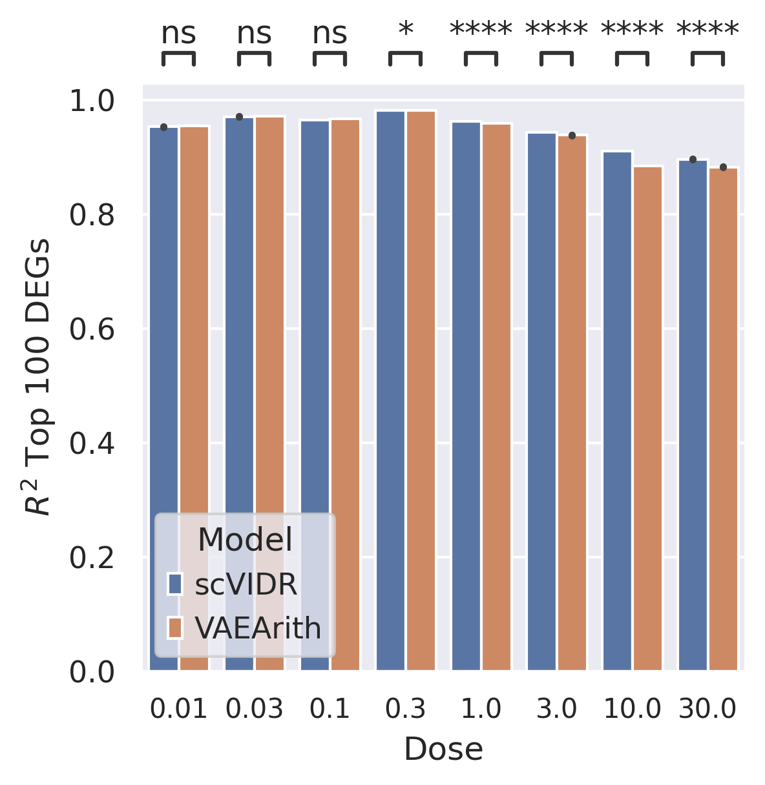
    


## Figure 3D: Comparison of Prediction Accuracy Across All Cell Types
Boxplots display the R<sup>2</sup> scores for scVIDR and VAEArith models in predicting gene expression across TCDD doses for all highly variable genes (HVGs) and the top 100 differentially expressed genes (DEGs). Statistical significance between models is determined using the Mann-Whitney U test, highlighting scVIDR's superior performance at higher doses.


```python
df = r2_values_allCells_df.loc[(r2_values_allCells_df["Gene Set"] == "All HVGs")]
order = [str(i) for i in doses][1:]
hue_order = ['scVIDR', 'VAEArith']
ax = sns.boxplot(x = "Dose", y = "R^2",  data = df, hue = "Model", order = order, hue_order = hue_order)
pairs = [
    (("0.01", "scVIDR"),("0.01", "VAEArith")),
    (("0.03", "scVIDR"),("0.03", "VAEArith")),
    (("0.1", "scVIDR"),("0.1", "VAEArith")),
    (("0.3", "scVIDR"),("0.3", "VAEArith")),
    (("1.0", "scVIDR"),("1.0", "VAEArith")),
    (("3.0", "scVIDR"),("3.0", "VAEArith")),
    (("10.0", "scVIDR"),("10.0", "VAEArith")),
    (("30.0", "scVIDR"),("30.0", "VAEArith"))
]
annotator = Annotator(ax, pairs, data=df, x="Dose", y="R^2", hue = "Model", order = order, hue_order=hue_order)
annotator.configure(test='Mann-Whitney-gt', text_format='star', loc='outside')
annotator.apply_and_annotate()
plt.xticks(fontsize = 10)
plt.ylabel(r"$R^2$ All HVGs")
plt.savefig("../figures/3D1.svg")
plt.show()
```

    p-value annotation legend:
          ns: p <= 1.00e+00
           *: 1.00e-02 < p <= 5.00e-02
          **: 1.00e-03 < p <= 1.00e-02
         ***: 1.00e-04 < p <= 1.00e-03
        ****: p <= 1.00e-04
    
    0.03_scVIDR vs. 0.03_VAEArith: Mann-Whitney-Wilcoxon test greater, P_val:4.369e-01 U_stat=4.511e+06
    0.01_scVIDR vs. 0.01_VAEArith: Mann-Whitney-Wilcoxon test greater, P_val:1.644e-01 U_stat=4.566e+06
    0.1_scVIDR vs. 0.1_VAEArith: Mann-Whitney-Wilcoxon test greater, P_val:3.197e-01 U_stat=4.531e+06
    0.3_scVIDR vs. 0.3_VAEArith: Mann-Whitney-Wilcoxon test greater, P_val:4.598e-01 U_stat=4.507e+06
    1.0_scVIDR vs. 1.0_VAEArith: Mann-Whitney-Wilcoxon test greater, P_val:9.423e-03 U_stat=4.658e+06
    3.0_scVIDR vs. 3.0_VAEArith: Mann-Whitney-Wilcoxon test greater, P_val:8.439e-02 U_stat=4.592e+06
    10.0_scVIDR vs. 10.0_VAEArith: Mann-Whitney-Wilcoxon test greater, P_val:3.547e-213 U_stat=6.589e+06
    30.0_scVIDR vs. 30.0_VAEArith: Mann-Whitney-Wilcoxon test greater, P_val:4.495e-244 U_stat=6.737e+06


    
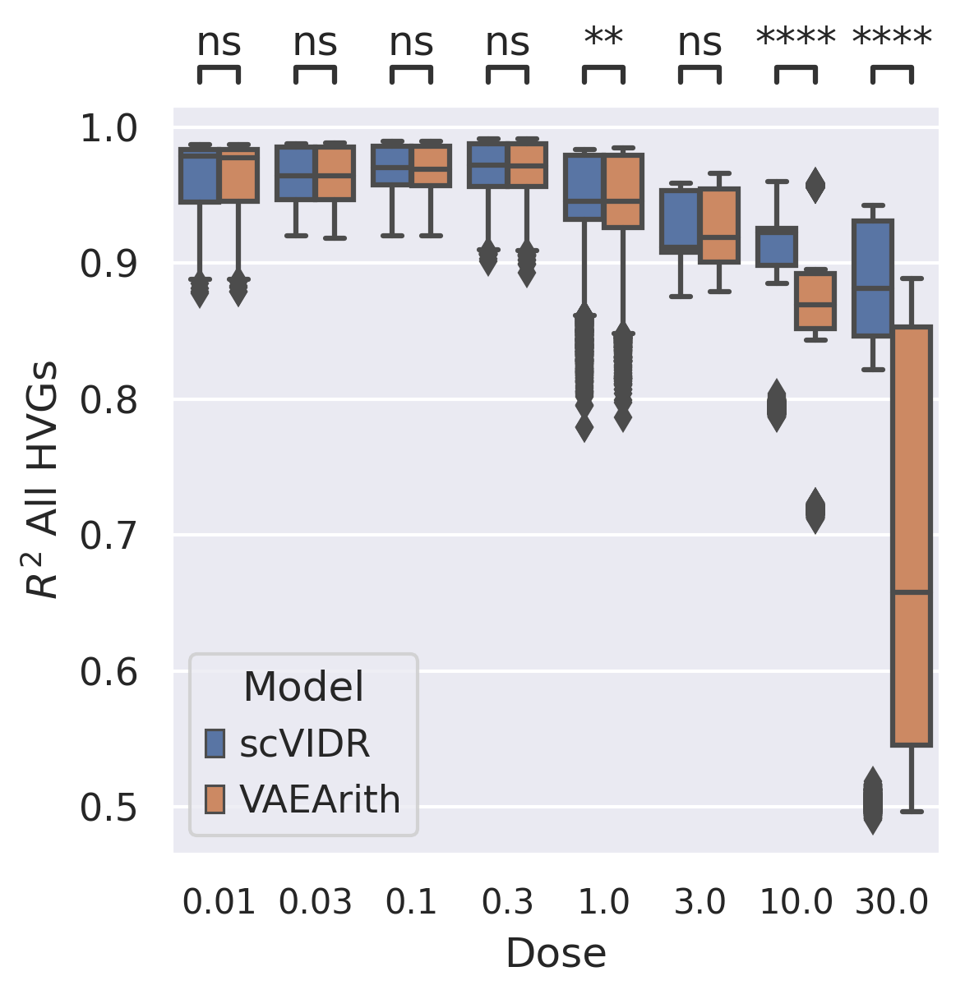
    


```python
df = r2_values_allCells_df.loc[(r2_values_allCells_df["Gene Set"] == "DEGs")]
order = [str(i) for i in doses][1:]
hue_order = ['scVIDR', 'VAEArith']
ax = sns.boxplot(x = "Dose", y = "R^2",  data = df, hue = "Model", order = order, hue_order = hue_order)
pairs = [
    (("0.01", "scVIDR"),("0.01", "VAEArith")),
    (("0.03", "scVIDR"),("0.03", "VAEArith")),
    (("0.1", "scVIDR"),("0.1", "VAEArith")),
    (("0.3", "scVIDR"),("0.3", "VAEArith")),
    (("1.0", "scVIDR"),("1.0", "VAEArith")),
    (("3.0", "scVIDR"),("3.0", "VAEArith")),
    (("10.0", "scVIDR"),("10.0", "VAEArith")),
    (("30.0", "scVIDR"),("30.0", "VAEArith"))
]
annotator = Annotator(ax, pairs, data=df, x="Dose", y="R^2", hue = "Model", order = order, hue_order=hue_order)
annotator.configure(test='Mann-Whitney-gt', text_format='star', loc='outside')
annotator.apply_and_annotate()
plt.xticks(fontsize = 10)
plt.ylabel(r"$R^2$ Top 100 DEGs")
plt.savefig("../figures/3D2.svg")
plt.show()
```

    p-value annotation legend:
          ns: p <= 1.00e+00
           *: 1.00e-02 < p <= 5.00e-02
          **: 1.00e-03 < p <= 1.00e-02
         ***: 1.00e-04 < p <= 1.00e-03
        ****: p <= 1.00e-04
    
    0.03_scVIDR vs. 0.03_VAEArith: Mann-Whitney-Wilcoxon test greater, P_val:4.810e-01 U_stat=4.503e+06
    0.01_scVIDR vs. 0.01_VAEArith: Mann-Whitney-Wilcoxon test greater, P_val:6.014e-03 U_stat=4.668e+06
    0.1_scVIDR vs. 0.1_VAEArith: Mann-Whitney-Wilcoxon test greater, P_val:4.507e-01 U_stat=4.508e+06
    0.3_scVIDR vs. 0.3_VAEArith: Mann-Whitney-Wilcoxon test greater, P_val:4.661e-01 U_stat=4.506e+06
    1.0_scVIDR vs. 1.0_VAEArith: Mann-Whitney-Wilcoxon test greater, P_val:4.817e-05 U_stat=4.762e+06
    3.0_scVIDR vs. 3.0_VAEArith: Mann-Whitney-Wilcoxon test greater, P_val:8.736e-12 U_stat=4.951e+06
    10.0_scVIDR vs. 10.0_VAEArith: Mann-Whitney-Wilcoxon test greater, P_val:1.347e-141 U_stat=6.198e+06
    30.0_scVIDR vs. 30.0_VAEArith: Mann-Whitney-Wilcoxon test greater, P_val:3.526e-127 U_stat=6.108e+06


    
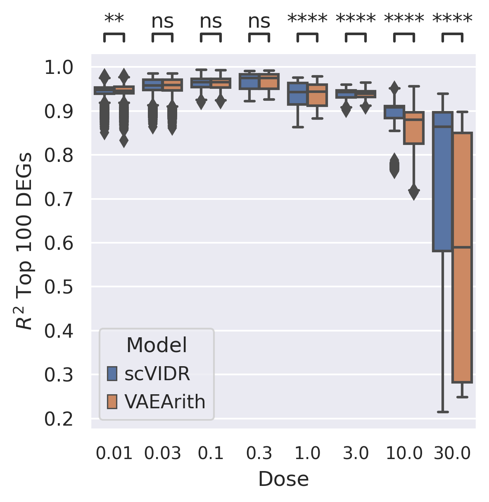
    


## Regression Analysis of Predicted Gene Expression
Evaluates scVIDR's predictions of gene expression across TCDD doses for portal hepatocytes, comparing predicted vs. observed values and calculating R<sup>2</sup> for HVGs and DEGs. Results highlight prediction accuracy at each dose.


```python
doses = [0.0,0.01, 0.03, 0.1, 0.3, 1.0, 3.0, 10.0, 30.0]
cell = "Hepatocytes - portal"
model_name = "VAE"
train_adata, test_adata = prepare_cont_data(adata, "celltype", "dose", "Dose", cell, 0, normalized=True)
model = VIDR(train_adata, linear_decoder = False)
model = model.load(f"../data/VAE_Cont_Prediction_Dioxin_5000g_{cell}.pt", train_adata)
```

```python
#Regression   
regression = True
dr_dict, delta, reg = model.predict(
    ctrl_key='0.0',
    treat_key='30.0',
    cell_type_to_predict=cell,
    regression = regression,
    continuous = True,
    doses = doses)

for key in dr_dict.keys():
    dr_dict[key].obs["Dose"] = f'{key} scVIDR'

ctrl_adata = adata[((adata.obs['celltype'] == cell) & (adata.obs['Dose'] == 0))]
eval_dict1 = {}

for d in doses[1:]:
    stim_adata = adata[((adata.obs['celltype'] == cell) & (adata.obs['Dose'] == d))]
    eval_dict1[d] = ctrl_adata.concatenate(stim_adata, dr_dict[d])
    eval_dict1[d].obs["dose"] = [str(i) if type(i) == float else i for i in eval_dict1[d].obs['Dose']]

for d in doses[1:]:
    cell_adata = adata[adata.obs["celltype"] ==cell]
    sc.tl.rank_genes_groups(cell_adata, groupby="dose", method="wilcoxon")
    diff_genes = cell_adata.uns["rank_genes_groups"]["names"][str(d)]
    print(f"{d}")
    r2_value1 = model.reg_mean_plot(
        eval_dict1[d],
        condition_key = "dose",
        cell_type_key = "celltype",
        axis_keys={"x": f"{d} scVIDR", "y": f"{d}"},
        gene_list=diff_genes[:10],
        top_100_genes = diff_genes[:25],
        labels={"x": "predicted", "y": "ground truth"},
        path_to_save=f"../figures/reg_mean_{cell}_{d}.pdf",
        show=True,
        legend=False)
    r2_value2 = model.reg_mean_plot(
        eval_dict1[d],
        condition_key = "dose",
        cell_type_key = "celltype",
        axis_keys={"x": f"0.0", "y": f"{d}"},
        gene_list=diff_genes[:10],
        top_100_genes = diff_genes[:25],
        labels={"x": "predicted", "y": "ground truth"},
        path_to_save=f"../figures/reg_mean_{cell}_{d}.pdf",
        show=False,
        legend=False)
    print(f"Model: {model_name}\n Cell: {cell}\n Regression: {regression} \n Dose: {d} \n R2 All: {r2_value1[0]/r2_value2[0]} \n R2 Top 100: {r2_value1[1]/r2_value2[1]}")
```


    Dose = 0.01


    
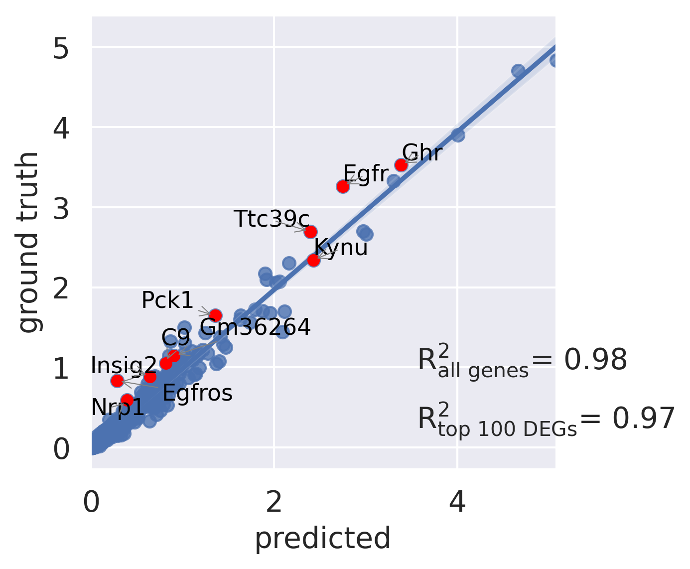
    


    Trying to set attribute `.obs` of view, copying.


    Model: VAE
     Cell: Hepatocytes - portal
     Regression: True 
     Dose: 0.01 
     R2 All: 0.9999457303749192 
     R2 Top 100: 0.997904483025438


    ... storing 'dose' as categorical


    Dose = 0.03


    
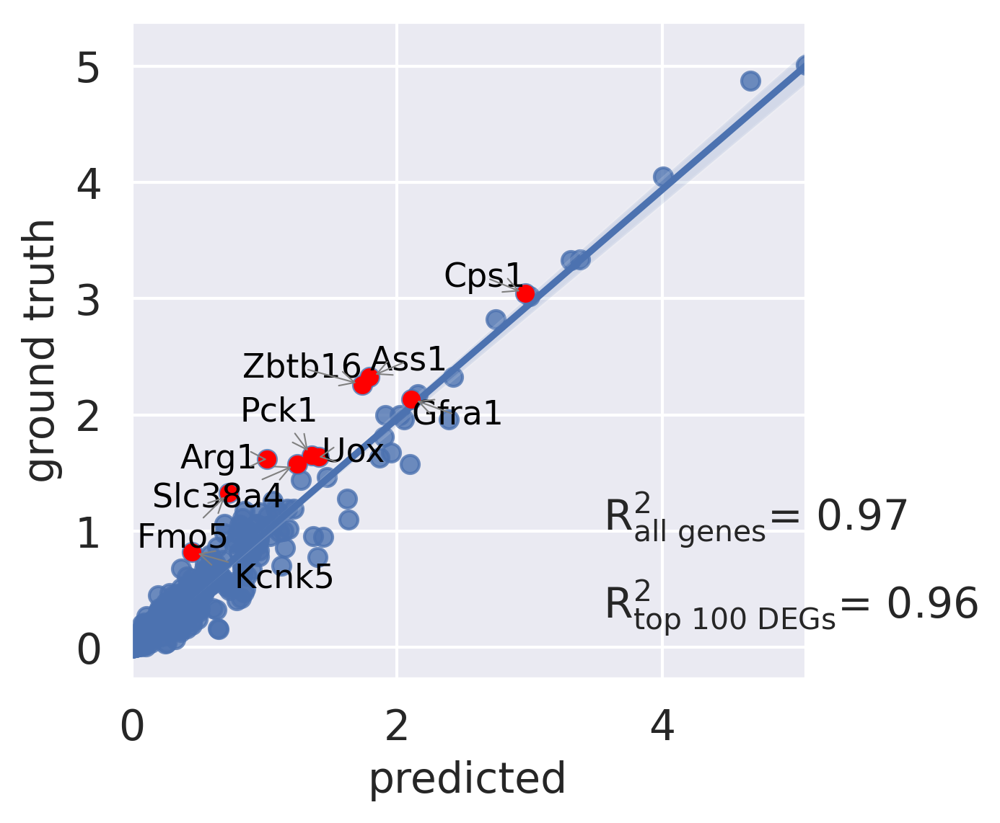
    


    Trying to set attribute `.obs` of view, copying.


    Model: VAE
     Cell: Hepatocytes - portal
     Regression: True 
     Dose: 0.03 
     R2 All: 0.9995470052310267 
     R2 Top 100: 1.003360411585673


    ... storing 'dose' as categorical


    Dose = 0.1


    
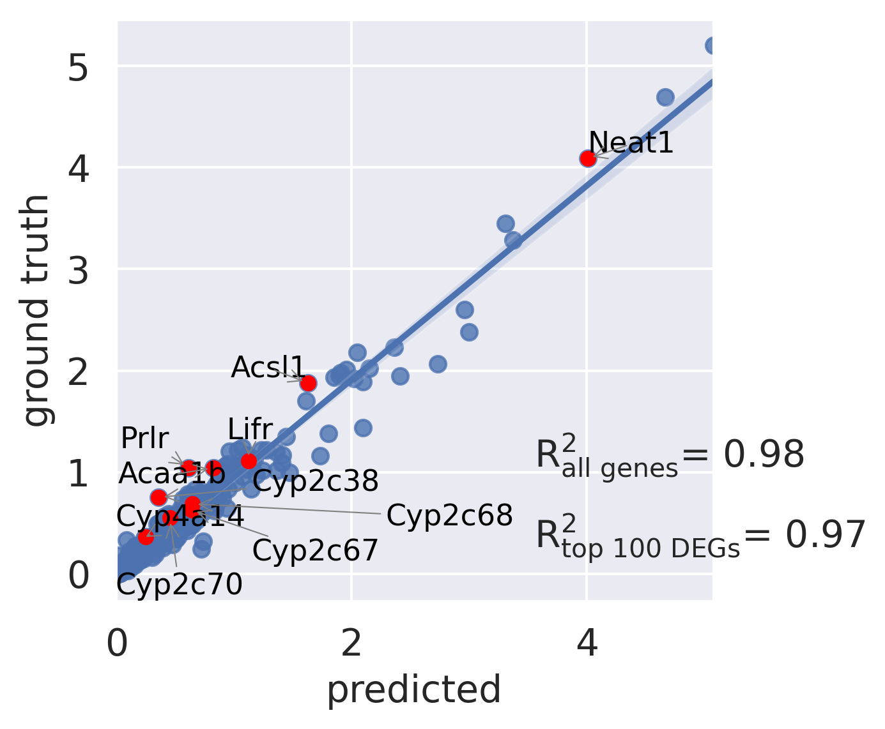
    


    Trying to set attribute `.obs` of view, copying.


    Model: VAE
     Cell: Hepatocytes - portal
     Regression: True 
     Dose: 0.1 
     R2 All: 1.002212196243269 
     R2 Top 100: 1.0052698915631115


    ... storing 'dose' as categorical


    Dose = 0.3


    

    


    Trying to set attribute `.obs` of view, copying.


    Model: VAE
     Cell: Hepatocytes - portal
     Regression: True 
     Dose: 0.3 
     R2 All: 1.0007125907375471 
     R2 Top 100: 1.0004166527429195


    ... storing 'dose' as categorical


    Dose = 1.0


    
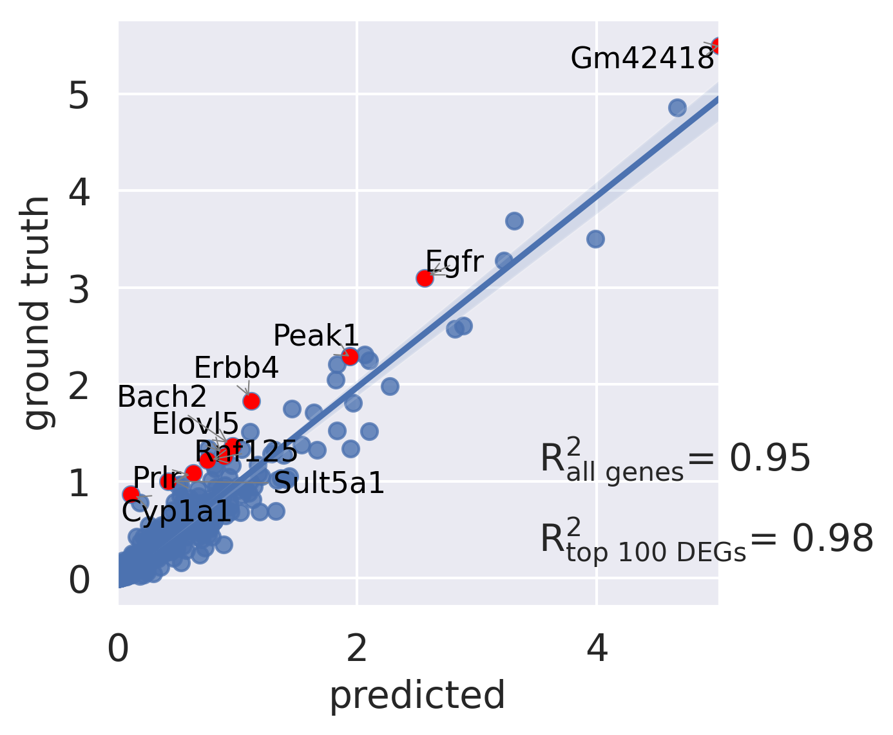
    


    Trying to set attribute `.obs` of view, copying.


    Model: VAE
     Cell: Hepatocytes - portal
     Regression: True 
     Dose: 1.0 
     R2 All: 1.006138743885212 
     R2 Top 100: 1.0167584924988595


    ... storing 'dose' as categorical


    Dose = 3.0


    

    


    Trying to set attribute `.obs` of view, copying.


    Model: VAE
     Cell: Hepatocytes - portal
     Regression: True 
     Dose: 3.0 
     R2 All: 1.0419627325534038 
     R2 Top 100: 1.0038051916609956


    ... storing 'dose' as categorical


    Dose = 10.0


    
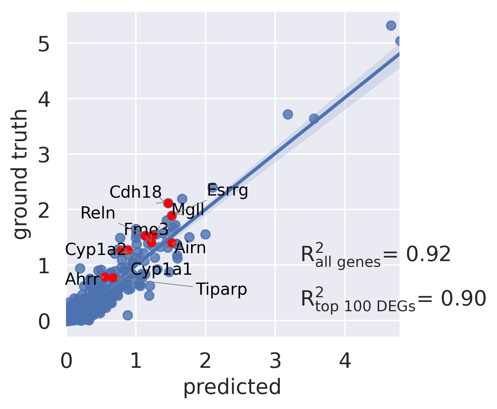
    


    Trying to set attribute `.obs` of view, copying.


    Model: VAE
     Cell: Hepatocytes - portal
     Regression: True 
     Dose: 10.0 
     R2 All: 1.1981812903256035 
     R2 Top 100: 1.1105750475996488


    ... storing 'dose' as categorical


    Dose = 30.0


    
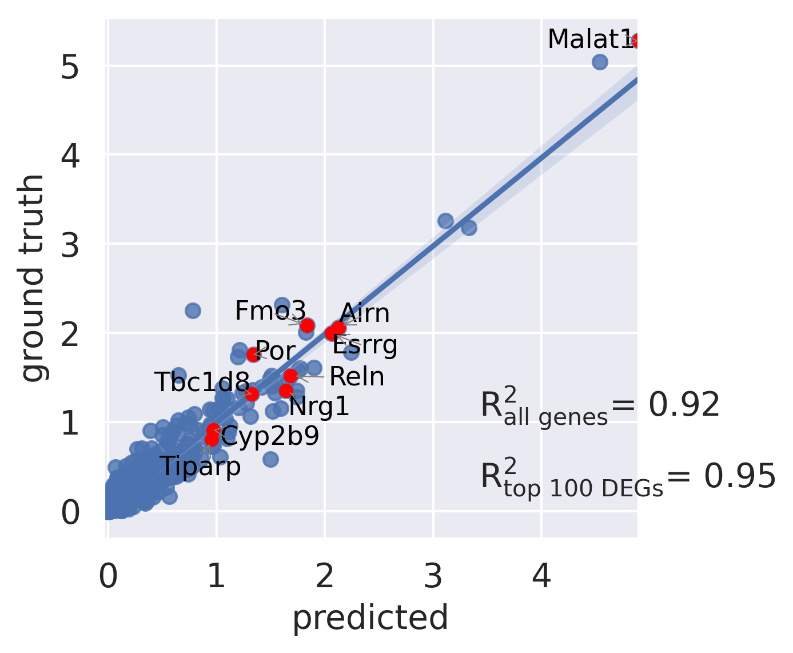
    


    Model: VAE
     Cell: Hepatocytes - portal
     Regression: True 
     Dose: 30.0 
     R2 All: 1.4652627386693178 
     R2 Top 100: 1.188529687020579

## Non-Regression Analysis of Predicted Gene Expression Across Doses

Evaluates the VAEArith model's performance in predicting gene expression without using regression for portal hepatocytes across various TCDD doses. The predictions are compared with observed data, and R<sup>2</sup> metrics for all highly variable genes (HVGs) and the top 100 differentially expressed genes (DEGs) are calculated. Results are saved as regression plots to visualize prediction accuracy.

```python
#Regression   
regression = False
dr_dict, delta = model.predict(
    ctrl_key='0.0',
    treat_key='30.0',
    cell_type_to_predict=cell,
    regression = regression,
    continuous = True,
    doses = doses)

for key in dr_dict.keys():
    dr_dict[key].obs["Dose"] = f'{key} VAEArith'

ctrl_adata = adata[((adata.obs['celltype'] == cell) & (adata.obs['Dose'] == 0))]
eval_dict2 = {}

for d in doses[1:]:
    stim_adata = adata[((adata.obs['celltype'] == cell) & (adata.obs['Dose'] == d))]
    eval_dict2[d] = ctrl_adata.concatenate(stim_adata, dr_dict[d])
    eval_dict2[d].obs["dose"] = [str(i) if type(i) == float else i for i in eval_dict2[d].obs['Dose']]

for d in doses[1:]:
    cell_adata = adata[adata.obs["celltype"] ==cell]
    sc.tl.rank_genes_groups(cell_adata, groupby="dose", method="wilcoxon")
    diff_genes = cell_adata.uns["rank_genes_groups"]["names"][str(d)]
    print(f"{d}")
    r2_value1 = model.reg_mean_plot(
        eval_dict2[d],
        condition_key = "dose",
        cell_type_key = "celltype",
        axis_keys={"x": f"{d} VAEArith", "y": f"{d}"},
        gene_list=diff_genes[:10],
        top_100_genes = diff_genes[:25],
        labels={"x": "predicted", "y": "ground truth"},
        path_to_save=f"../figures/reg_mean_{cell}_{d}.pdf",
        show=True,
        legend=False)
    r2_value2 = model.reg_mean_plot(
        eval_dict2[d],
        condition_key = "dose",
        cell_type_key = "celltype",
        axis_keys={"x": f"0.0", "y": f"{d}"},
        gene_list=diff_genes[:10],
        top_100_genes = diff_genes[:25],
        labels={"x": "predicted", "y": "ground truth"},
        path_to_save=f"../figures/reg_mean_{cell}_{d}.pdf",
        show=False,
        legend=False)
    print(f"Model: {model_name}\n Cell: {cell}\n Regression: {regression} \n Dose: {d} \n R2 All: {r2_value1[0]/r2_value2[0]} \n R2 Top 100: {r2_value1[1]/r2_value2[1]}")
```


    0.01


    

    


    Trying to set attribute `.obs` of view, copying.


    Model: VAE
     Cell: Hepatocytes - portal
     Regression: False 
     Dose: 0.01 
     R2 All: 0.999860680974945 
     R2 Top 100: 0.9998531915824196


    ... storing 'dose' as categorical


    0.03


    
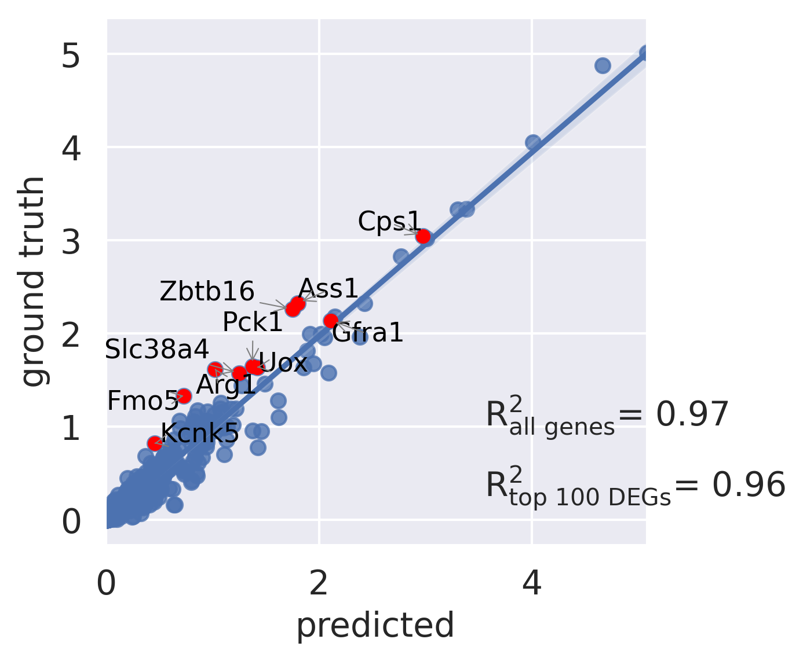
    


    Trying to set attribute `.obs` of view, copying.


    Model: VAE
     Cell: Hepatocytes - portal
     Regression: False 
     Dose: 0.03 
     R2 All: 1.000127275652056 
     R2 Top 100: 1.003498742714365


    ... storing 'dose' as categorical


    0.1


    

    


    Trying to set attribute `.obs` of view, copying.


    Model: VAE
     Cell: Hepatocytes - portal
     Regression: False 
     Dose: 0.1 
     R2 All: 1.0012026534483665 
     R2 Top 100: 1.0030401145406367


    ... storing 'dose' as categorical


    0.3


    
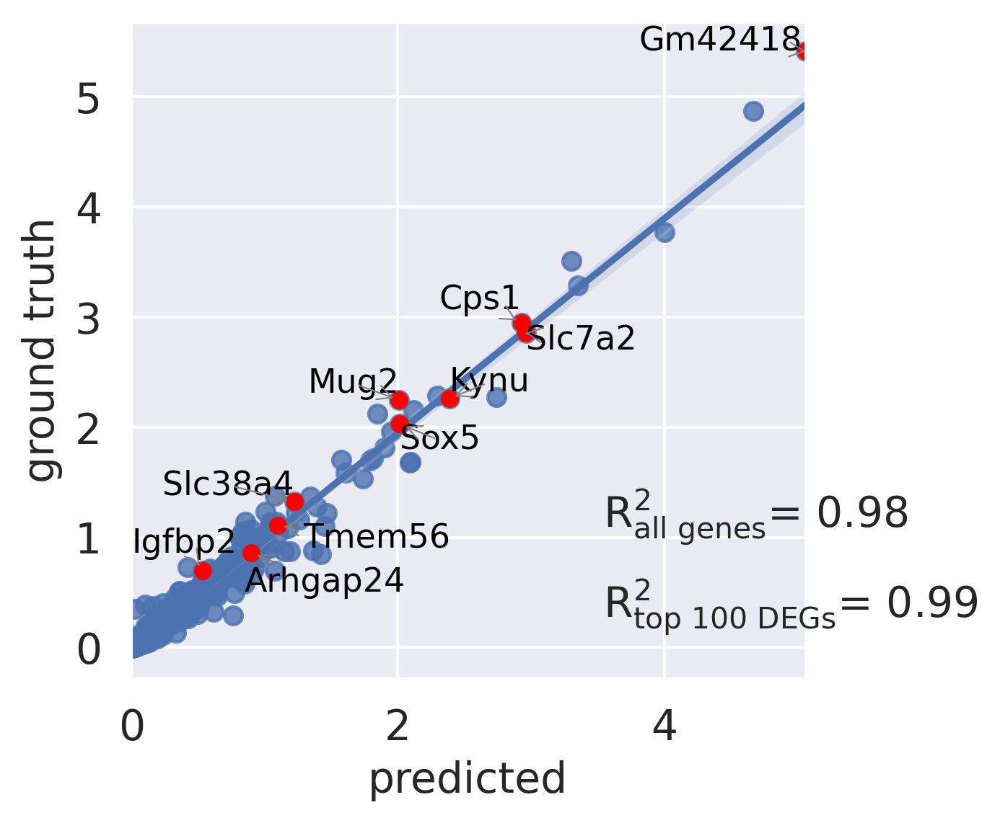
    


    Trying to set attribute `.obs` of view, copying.


    Model: VAE
     Cell: Hepatocytes - portal
     Regression: False 
     Dose: 0.3 
     R2 All: 0.9998907869784612 
     R2 Top 100: 1.0003652504181646


    ... storing 'dose' as categorical


    1.0


    
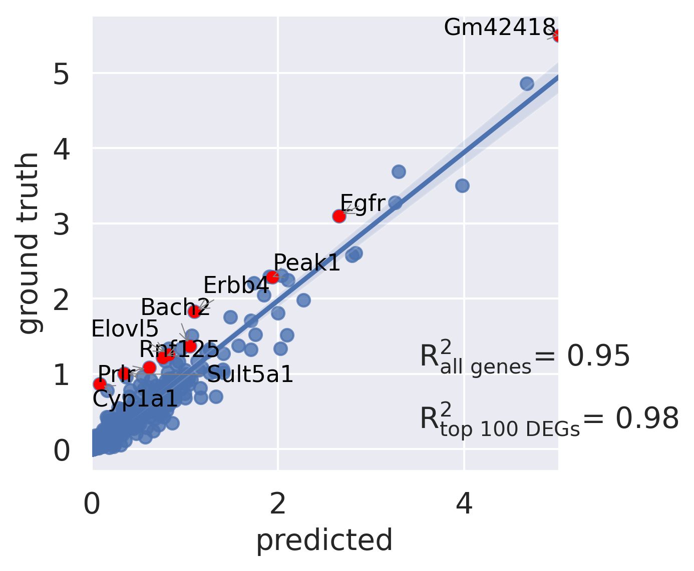
    


    Trying to set attribute `.obs` of view, copying.


    Model: VAE
     Cell: Hepatocytes - portal
     Regression: False 
     Dose: 1.0 
     R2 All: 1.0052199473007544 
     R2 Top 100: 1.013195643706713


    ... storing 'dose' as categorical


    3.0


    
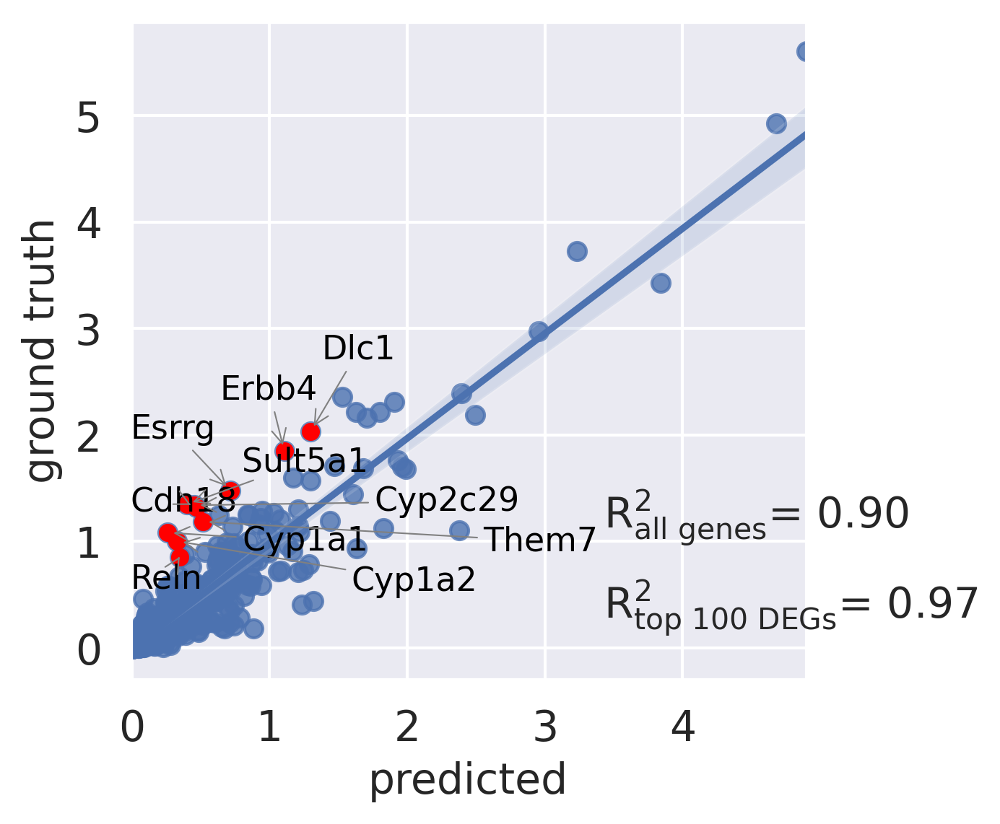
    


    Trying to set attribute `.obs` of view, copying.


    Model: VAE
     Cell: Hepatocytes - portal
     Regression: False 
     Dose: 3.0 
     R2 All: 1.0321257864685958 
     R2 Top 100: 1.0055961384731964


    ... storing 'dose' as categorical


    10.0


    
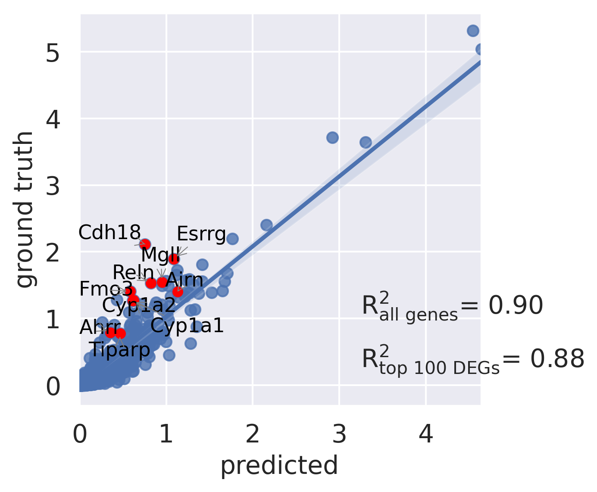
    


    Trying to set attribute `.obs` of view, copying.


    Model: VAE
     Cell: Hepatocytes - portal
     Regression: False 
     Dose: 10.0 
     R2 All: 1.1629921565058632 
     R2 Top 100: 1.0781834668700891


    ... storing 'dose' as categorical


    30.0


    
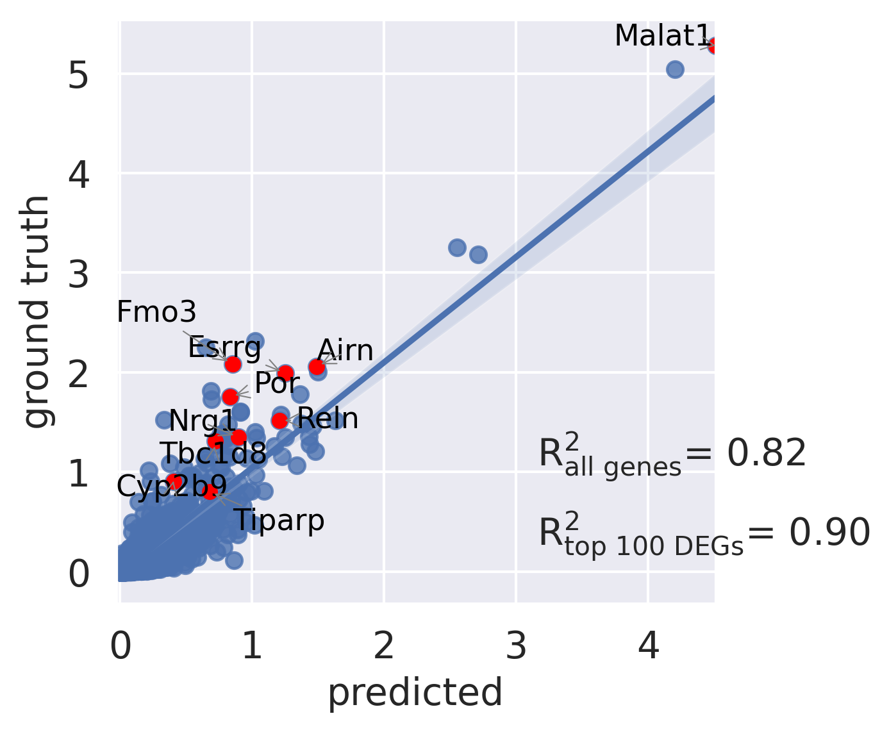
    


    Model: VAE
     Cell: Hepatocytes - portal
     Regression: False 
     Dose: 30.0 
     R2 All: 1.298013701649475 
     R2 Top 100: 1.1335553287004891

## Figure 3B: Dose-Response Prediction for Ahrr Gene
This analysis compares the predicted expression levels of the **Ahrr** gene by scVIDR and VAEArith across various TCDD doses to the real observed values. It calculates Sinkhorn distances to quantify discrepancies between the predicted and actual gene expression distributions. The results include a line plot illustrating Ahrr expression across log doses and a bar plot of Sinkhorn distances, highlighting prediction accuracy for both models.

```python
eval_dict = {d:eval_dict1[d].concatenate(eval_dict2[d][["VAEArith" in i for i in eval_dict2[d].obs["dose"]]]) for d in doses[1:]}
```
```python
eval_adata = eval_dict[0.01].concatenate([eval_dict[d] for d in doses[2:]])
```


```python
response = []
for i in eval_adata.obs.dose:
    if "scVIDR" in i:
        response.append("scVIDR")
    elif "VAEArith" in i:
        response.append("VAEArith")
    else:
        response.append("Real Expression")
eval_adata.obs["Response"] = response
```


```python
df = eval_adata.obs[["Dose", "Response"]]
df["Ahrr"] = eval_adata[:, "Ahrr"].X
df["Dose"] = [float(i.split(" ")[0]) if type(i) == str else i for i in df["Dose"]]
df["Log Dose"] = [np.log1p(i) for i in df["Dose"]]
```


```python
df_dict = {"Model":[], "Log Dose":[], "Sinkhorn Distance":[]}
mmd = geomloss.SamplesLoss("sinkhorn")
log_dose = df["Log Dose"].unique()
for dose in log_dose[1:]:
    df_dose = df[df["Log Dose"] == dose]
    real_ahrr = df_dose[df_dose.Response == "Real Expression"].Ahrr.values
    scVIDR_ahrr = df_dose[df_dose.Response == "scVIDR"].Ahrr.values
    VAEArith_ahrr = df_dose[df_dose.Response == "VAEArith"].Ahrr.values
    real_tensor = torch.Tensor([real_ahrr]).T
    scVIDR_tensor = torch.Tensor([scVIDR_ahrr]).T
    VAEArith_tensor = torch.Tensor([VAEArith_ahrr]).T
    stat_dist = mmd(real_tensor, scVIDR_tensor).numpy().tolist()
    df_dict["Log Dose"].append(f'{dose:.{3}f}')
    df_dict["Model"].append("scVIDR")
    df_dict["Sinkhorn Distance"].append(stat_dist)
    print(f"scVIDR {dose}: {stat_dist}")
    
    stat_dist = mmd(real_tensor, VAEArith_tensor).numpy().tolist()
    df_dict["Log Dose"].append(f'{dose:.{3}f}')
    df_dict["Model"].append("VAEArith")
    df_dict["Sinkhorn Distance"].append(stat_dist)
    print(f"VAEArith {dose}: {stat_dist}")
```

    scVIDR 0.009950330853168083: 7.731077494099736e-05
    VAEArith 0.009950330853168083: 6.842056609457359e-05
    scVIDR 0.0295588022415444: 7.848521636333317e-05
    VAEArith 0.0295588022415444: 6.754948844900355e-05
    scVIDR 0.09531017980432487: 8.383345266338438e-05
    VAEArith 0.09531017980432487: 6.348206079564989e-05
    scVIDR 0.26236426446749106: 0.0006527944933623075
    VAEArith 0.26236426446749106: 0.0006179206538945436
    scVIDR 0.6931471805599453: 0.02270549163222313
    VAEArith 0.6931471805599453: 0.025518372654914856
    scVIDR 1.3862943611198906: 0.07207520306110382
    VAEArith 1.3862943611198906: 0.09400059282779694
    scVIDR 2.3978952727983707: 0.13831457495689392
    VAEArith 2.3978952727983707: 0.20426848530769348
    scVIDR 3.4339872044851463: 0.10823146998882294
    VAEArith 3.4339872044851463: 0.10162720084190369


```python
fig, ax = plt.subplots()
ax2 = ax.twinx()
sns.lineplot(x = "Log Dose", y = "Ahrr", hue = "Response", data = df, err_style="bars", ax = ax)
plt.setp(ax.get_legend().get_texts(), fontsize='10') # for legend text
plt.setp(ax.get_legend().get_title(), fontsize='10') # for legend title
plt.savefig("../figures/3C.svg")
plt.show()
```


    
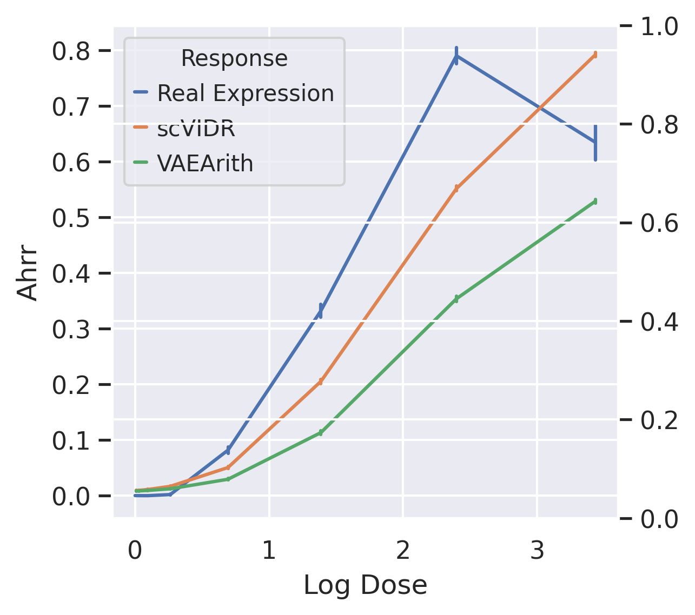
    


```python
from matplotlib import cm
```


```python
cm.tab10.colors[1:]
```


    ((1.0, 0.4980392156862745, 0.054901960784313725),
     (0.17254901960784313, 0.6274509803921569, 0.17254901960784313),
     (0.8392156862745098, 0.15294117647058825, 0.1568627450980392),
     (0.5803921568627451, 0.403921568627451, 0.7411764705882353),
     (0.5490196078431373, 0.33725490196078434, 0.29411764705882354),
     (0.8901960784313725, 0.4666666666666667, 0.7607843137254902),
     (0.4980392156862745, 0.4980392156862745, 0.4980392156862745),
     (0.7372549019607844, 0.7411764705882353, 0.13333333333333333),
     (0.09019607843137255, 0.7450980392156863, 0.8117647058823529))


```python
df_dists = pd.DataFrame(df_dict)
sns.barplot(x = "Log Dose", y = "Sinkhorn Distance", hue = "Model", data = df_dists, palette=cm.tab10.colors[1:])
plt.xticks(rotation = 45)
plt.show()
```


    
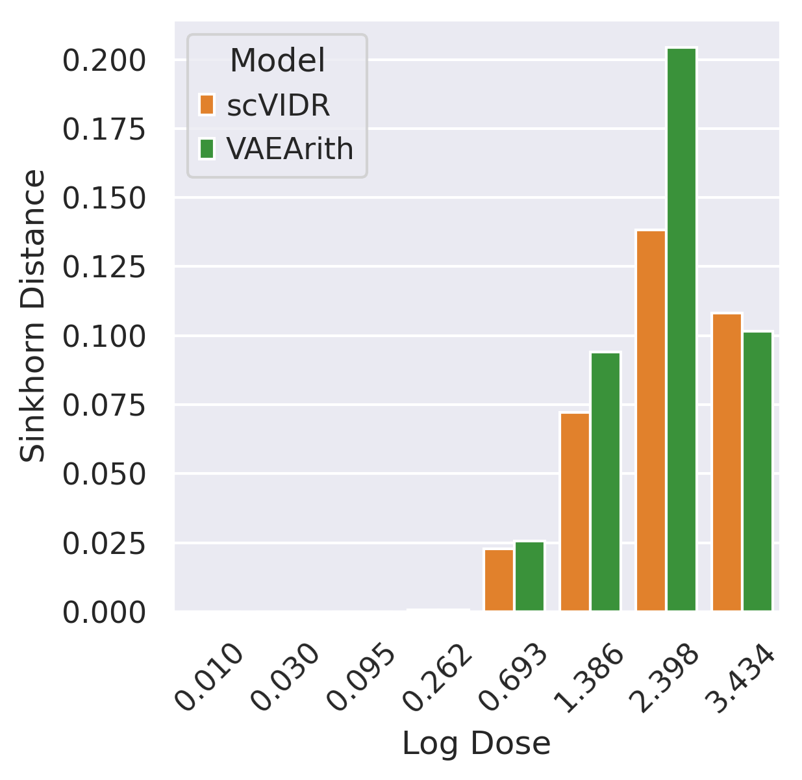
    

