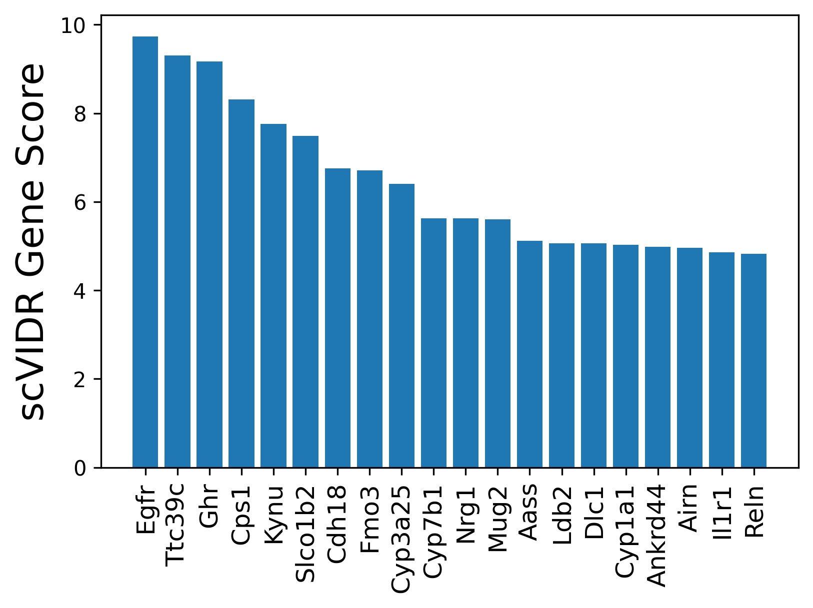
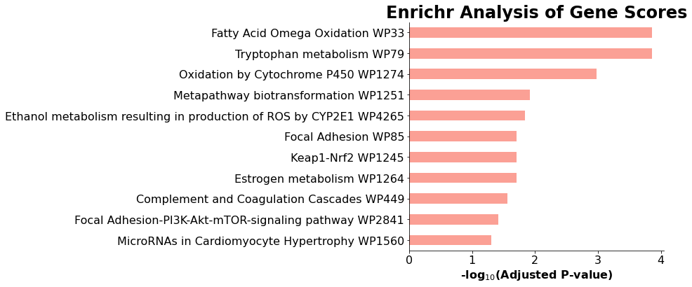
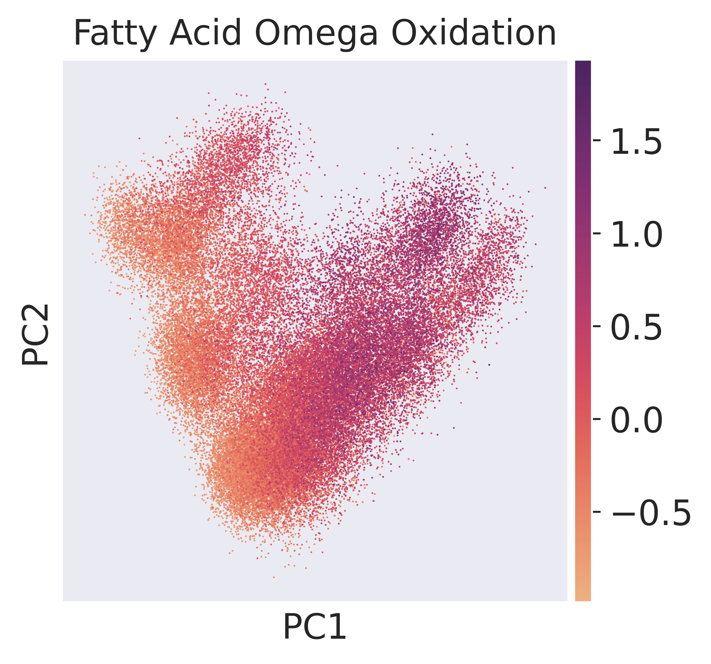
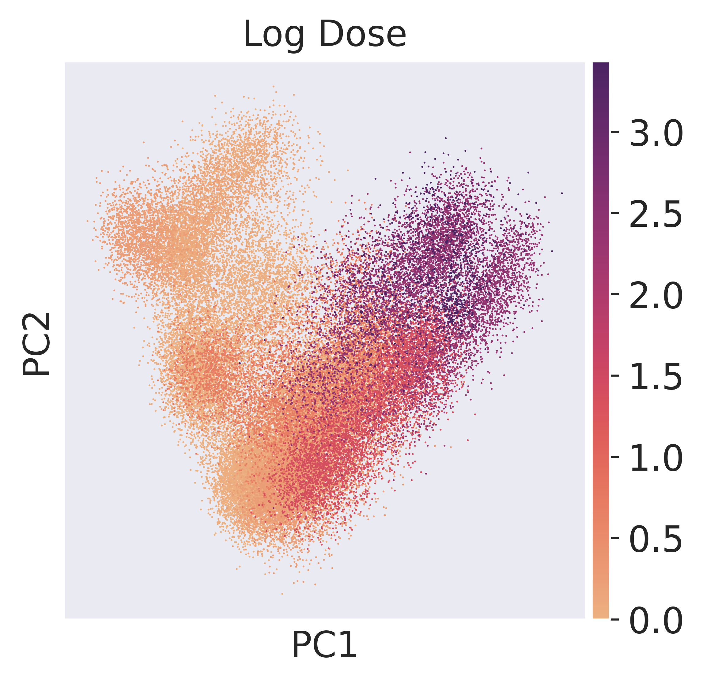
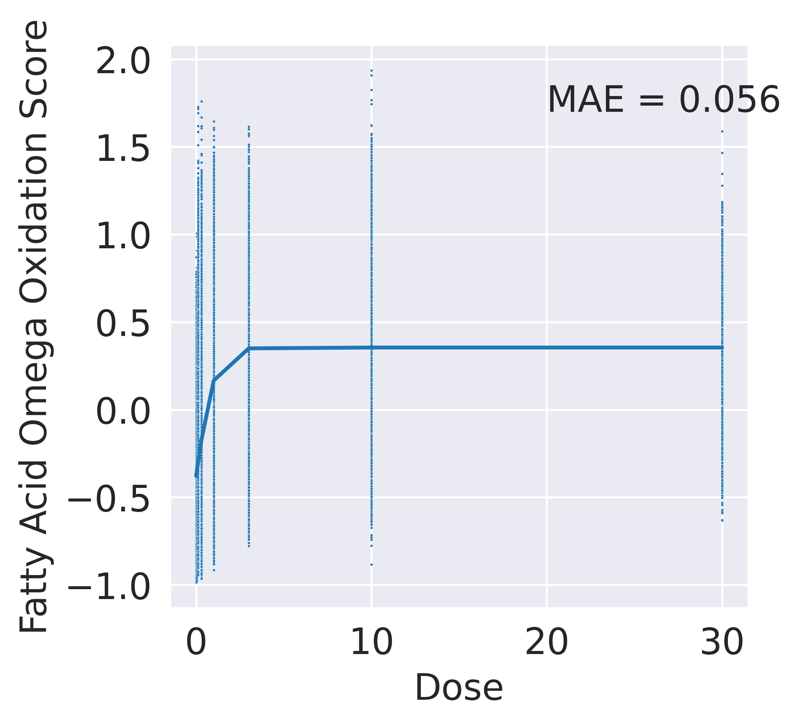

# Interrogation of VAE Using Ridge Regression in Portal Hepatocyte Response Prediction
This analysis utilizes a trained scVIDR model to investigate portal hepatocyte responses to TCDD by calculating gene scores through ridge regression on latent dimensions. Genes with high scores indicate significant transcriptomic changes under increasing doses. Enrichr analysis highlights pathways involved in TCDD-induced hepatotoxicity, including cytochrome P450 and fatty acid oxidation. A sigmoid function models the relationship between pathway scores and doses, showing a strong dose-response relationship.


## Importing Required Libraries and Functions
Imports the necessary libraries and modules for processing single-cell gene expression data, model implementation, statistical analysis, and interpretation. It includes tools for machine learning, visualization, statistical tests, and pathway enrichment analysis to facilitate the analysis of scVIDR models and ridge regression.

```python
import sys
sys.path.insert(1, '../vidr/')
from matplotlib import pyplot as plt

#Import VIDR functions
from vidr import VIDR
from PCAEval import PCAEval
from utils import *

#Import important modules
import scanpy as sc
import pandas as pd
import numpy as np
import torch
import seaborn as sns
from scipy import stats
from scipy import linalg
from scipy import spatial
from anndata import AnnData
from scipy import sparse
from statannotations.Annotator import Annotator

#Interpetation of model
from sklearn.linear_model import ElasticNet, Lars, Ridge, LinearRegression
from sklearn.metrics import mean_absolute_error
import gseapy as gp
```
## Data Loading and Preprocessing
Loads single-cell gene expression data, filters out immune cells to retain specific liver cell types of interest, and preprocesses the dataset. Preprocessing steps include normalizing gene expression, applying a logarithmic transformation, and identifying the top 5,000 highly variable genes for further analysis. Finally, it converts the dose values into categorical strings to facilitate downstream analyses.

```python
doses = [0, 0.01, 0.03, 0.1, 0.3, 1, 3, 10, 30]
adata = sc.read_h5ad("../data/nault2021_multiDose.h5ad")

#Remove Immune Cells
cell_types_of_int = ["Hepatocytes - central", "Hepatocytes - portal", "Cholangiocytes", "Stellate Cells", "Portal Fibroblasts", "Endothelial Cells"]
adata = adata[adata.obs['celltype'].isin(cell_types_of_int)]

#Preporces data

sc.pp.normalize_total(adata)
sc.pp.log1p(adata)
sc.pp.highly_variable_genes(adata, n_top_genes = 5000)
adata = adata[:, adata.var.highly_variable]

#Make dose categorical
adata.obs["dose"] = [str(i) for i in adata.obs["Dose"]]
```

## Training and Loading the VAE Model for Portal Hepatocyte Dose-Response Prediction
Prepares data specific to portal hepatocytes, a cell type of interest, by splitting it into training and test sets. It initializes and optionally trains a Variational Autoencoder (VAE) model to predict gene expression changes in response to TCDD doses. The trained model is then loaded for further analysis.

```python
model_name = "VAE"
celltypes = np.unique(adata.obs["celltype"])
cell = 'Hepatocytes - portal'
train_adata, test_adata = prepare_cont_data(adata, "celltype", "dose", "Dose", cell, 0, normalized=True)
print(f"\n Predicting {cell} Dioxin Dose Response\n")
model = VIDR(train_adata, linear_decoder = False)
# model.train(
# max_epochs=100,
# batch_size=128,
# early_stopping=True,
# early_stopping_patience=25)
# model.save(f"../../data/VAE_Cont_Prediction_Dioxin_5000g_{cell}.pt/", overwrite = True)
model = model.load(f"../data/VAE_Cont_Prediction_Dioxin_5000g_{cell}.pt/", train_adata)
```


## Ridge Regression Analysis on Latent Representations

This series of steps leverages the trained model to predict the dose-response, generate synthetic samples, and apply ridge regression.

Generates dose-response predictions for the specified cell type and doses, with delta capturing the response vector.
```python
regression = True
dr_dict, delta, reg = model.predict(
    ctrl_key="0.0",
    treat_key="30.0",
    cell_type_to_predict=cell,
    regression = regression,
    continuous = False,
    doses = doses)
```


Extracts latent space representations, identifies the range for each dimension, and creates random samples within this range.
```python
latent = model.get_latent_representation()
mins = np.min(latent, axis = 0)
maxes = np.max(latent, axis = 0)
rand_samp = []
for (mn,mx) in zip(mins, maxes):
    rand_samp += [np.random.uniform(mn,mx,  size = (100000))]
rand_samp = np.array(rand_samp).T
```

Simulates gene expression data using the model's generative module from the random samples in latent space.
```python
device = torch.device("cuda:0" if torch.cuda.is_available() else "cpu")
gen_samp = model.module.generative(torch.from_numpy(rand_samp).float())["px"].cpu().detach().numpy()
```

Calculates weights for each sample based on cosine similarity to the delta vector, emphasizing samples aligned with the dose-response.
```python
weights = []
for i in range(rand_samp.shape[0]):
    weights += [1/spatial.distance.cosine(rand_samp[i, :], delta)]
```

Fits a ridge regression model to predict the generative outputs using the latent space samples and their weights.
```python
reg = Ridge()
reg.fit(rand_samp, gen_samp, sample_weight=weights)
```


Generates new random samples within the latent space range for testing the ridge regression model.
```python
test_samp = []
for (mn,mx) in zip(mins, maxes):
    test_samp += [np.random.uniform(mn,mx,  size = (20000))]
test_samp = np.array(test_samp).T
```

Uses the generative module to simulate gene expression data for the test samples.
```python
device = torch.device("cuda:0" if torch.cuda.is_available() else "cpu")
test_gen_samp = model.module.generative(torch.from_numpy(test_samp).float())["px"].cpu().detach().numpy()
```

Evaluates the ridge regression model's performance on the test samples by calculating the R<sup>2</sup> score.
```python
reg.score(test_samp,test_gen_samp)
```


    0.6035409897482676


Calculates normalized gene weights by dividing the regression coefficients by their L2 norms to scale the impact of each gene.
```python
gene_weights = reg.coef_
gene_norms = linalg.norm(reg.coef_, axis = 0)
gene_weights_norm = gene_weights / gene_norms
```
Computes the importance of each feature (gene) by projecting the normalized gene weights onto the delta vector.

```python
feature_importance = np.abs(np.dot(gene_weights_norm, delta[:, np.newaxis])).squeeze()
```

Identifies the top 100 genes contributing to the dose-response, sorted by their calculated feature importance.
```python
train_adata.var_names[np.argsort(feature_importance)[::-1]][:100]
```


    Index(['Egfr', 'Ttc39c', 'Ghr', 'Cps1', 'Kynu', 'Slco1b2', 'Cdh18', 'Fmo3',
           'Cyp3a25', 'Cyp7b1', 'Nrg1', 'Mug2', 'Aass', 'Ldb2', 'Dlc1', 'Cyp1a1',
           'Ankrd44', 'Airn', 'Il1r1', 'Reln', '9030622O22Rik', 'Slc7a2', 'Nfe2l2',
           'Esrrg', 'Meis2', 'Pvt1', '4930578G10Rik', 'Gab2', 'Cyp2c29', 'Pde4d',
           'Cyp2e1', 'Gm20663', 'Mecom', 'Gm2163', 'Fli1', 'Aox3', 'Heg1', 'Cfh',
           'Tiparp', 'Cyp1a2', 'Gfra1', 'Sdk1', 'Pck1', 'Slc16a10', 'Auts2',
           'Camk2d', 'Cyp3a11', 'Robo1', 'Ehd3', 'Plpp1', 'Prkg1', 'Rnf213',
           'Col4a1', 'Acsl1', 'Col4a2', 'Nrp1', 'Uox', 'Slc8a1', 'Apbb2', 'Tmcc3',
           'Prickle1', 'Car3', 'Tcf4', 'Gm26917', 'Rnf125', 'Pitpnc1', 'Samd4',
           'B3galt1', 'Slc38a4', 'Palld', 'Bmp6', 'Mrc1', 'Hao1', 'Maf', 'Jam2',
           'Fam129b', 'Tshz2', 'Jak1', 'Syne1', 'Abcc4', 'Prex2', 'Tead1', 'Hmcn1',
           'Abi1', 'C9', 'Adamts9', 'Fkbp5', 'F8', 'Eng', 'Tmem51', 'Plxna4',
           'Ces3b', 'Dapk2', 'Fndc3b', 'Rftn1', 'Kcnb1', 'Ahrr', 'Maml2', 'Malat1',
           'Selenop'],
          dtype='object')


## Figure 4B: Visualization of Top Gene Scores
Creates a bar plot showing the top 20 genes with the highest scVIDR gene scores, emphasizing their contribution to the dose-response prediction. The genes are displayed in descending order of importance.

```python
plt.figure(dpi = 300)
plt.bar(train_adata.var_names[np.argsort(feature_importance)][-20:][::-1], feature_importance[np.argsort(feature_importance)][-20:][::-1])
plt.xticks(rotation = 90, fontsize = 12)
plt.ylabel(r"scVIDR Gene Score", fontsize = 18)
plt.savefig("../figures/4B.svg", bbox_inches = "tight")
plt.show()
```


    

    

## Figure 4C: Gene Enrichment Analysis and Visualization
Identifies the top 100 genes based on their scores, performs an Enrichr pathway enrichment analysis using the WikiPathways 2019 Mouse database, and visualizes the top 15 enriched pathways with significant adjusted p-values. The bar plot highlights pathways critical to TCDD response.

```python
glist = train_adata.var_names[np.argsort(feature_importance)][-100:][::-1]
glist = glist.tolist()
enr = gp.enrichr(gene_list=glist,
                 gene_sets=["WikiPathways_2019_Mouse"],
                 organism='Mouse', # don't forget to set organism to the one you desired! e.g. Yeast
                 description='test_name',
                 outdir='test/enrichr_kegg',
                 # no_plot=True,
                 cutoff=0.5 # test dataset, use lower value from range(0,1)
                )
```


```python
enr.results.head(15)
```


<div style="overflow-x: auto; width: 100%; max-width: 100vw;">
<style scoped>
    .dataframe tbody tr th:only-of-type {
        vertical-align: middle;
    }

    .dataframe tbody tr th {
        vertical-align: top;
    }

    .dataframe thead th {
        text-align: right;
    }
</style>
<table border="1" class="dataframe">
  <thead>
    <tr style="text-align: right;">
      <th></th>
      <th>Gene_set</th>
      <th>Term</th>
      <th>Overlap</th>
      <th>P-value</th>
      <th>Adjusted P-value</th>
      <th>Old P-value</th>
      <th>Old Adjusted P-value</th>
      <th>Odds Ratio</th>
      <th>Combined Score</th>
      <th>Genes</th>
    </tr>
  </thead>
  <tbody>
    <tr>
      <th>0</th>
      <td>WikiPathways_2019_Mouse</td>
      <td>Tryptophan metabolism WP79</td>
      <td>5/44</td>
      <td>0.000003</td>
      <td>0.000140</td>
      <td>0</td>
      <td>0</td>
      <td>26.802969</td>
      <td>344.396446</td>
      <td>KYNU;CYP1A2;CYP1A1;CYP2E1;CYP7B1</td>
    </tr>
    <tr>
      <th>1</th>
      <td>WikiPathways_2019_Mouse</td>
      <td>Fatty Acid Omega Oxidation WP33</td>
      <td>3/7</td>
      <td>0.000004</td>
      <td>0.000140</td>
      <td>0</td>
      <td>0</td>
      <td>153.835052</td>
      <td>1905.147874</td>
      <td>CYP1A2;CYP1A1;CYP2E1</td>
    </tr>
    <tr>
      <th>2</th>
      <td>WikiPathways_2019_Mouse</td>
      <td>Oxidation by Cytochrome P450 WP1274</td>
      <td>4/40</td>
      <td>0.000047</td>
      <td>0.001046</td>
      <td>0</td>
      <td>0</td>
      <td>22.990741</td>
      <td>229.196526</td>
      <td>CYP1A2;CYP1A1;CYP2E1;CYP7B1</td>
    </tr>
    <tr>
      <th>3</th>
      <td>WikiPathways_2019_Mouse</td>
      <td>Metapathway biotransformation WP1251</td>
      <td>5/141</td>
      <td>0.000714</td>
      <td>0.011957</td>
      <td>0</td>
      <td>0</td>
      <td>7.648607</td>
      <td>55.412606</td>
      <td>CYP1A2;CYP1A1;FMO3;CYP2E1;CYP7B1</td>
    </tr>
    <tr>
      <th>4</th>
      <td>WikiPathways_2019_Mouse</td>
      <td>Ethanol metabolism resulting in production of ...</td>
      <td>2/10</td>
      <td>0.001085</td>
      <td>0.014540</td>
      <td>0</td>
      <td>0</td>
      <td>50.744898</td>
      <td>346.391772</td>
      <td>CYP2E1;NFE2L2</td>
    </tr>
    <tr>
      <th>5</th>
      <td>WikiPathways_2019_Mouse</td>
      <td>Estrogen metabolism WP1264</td>
      <td>2/14</td>
      <td>0.002166</td>
      <td>0.019906</td>
      <td>0</td>
      <td>0</td>
      <td>33.823129</td>
      <td>207.504274</td>
      <td>CYP1A2;CYP1A1</td>
    </tr>
    <tr>
      <th>6</th>
      <td>WikiPathways_2019_Mouse</td>
      <td>Keap1-Nrf2 WP1245</td>
      <td>2/14</td>
      <td>0.002166</td>
      <td>0.019906</td>
      <td>0</td>
      <td>0</td>
      <td>33.823129</td>
      <td>207.504274</td>
      <td>MAF;NFE2L2</td>
    </tr>
    <tr>
      <th>7</th>
      <td>WikiPathways_2019_Mouse</td>
      <td>Focal Adhesion WP85</td>
      <td>5/185</td>
      <td>0.002377</td>
      <td>0.019906</td>
      <td>0</td>
      <td>0</td>
      <td>5.766082</td>
      <td>34.838505</td>
      <td>RELN;COL4A2;COL4A1;SELENOP;EGFR</td>
    </tr>
    <tr>
      <th>8</th>
      <td>WikiPathways_2019_Mouse</td>
      <td>Complement and Coagulation Cascades WP449</td>
      <td>3/62</td>
      <td>0.003704</td>
      <td>0.027578</td>
      <td>0</td>
      <td>0</td>
      <td>10.400664</td>
      <td>58.225148</td>
      <td>F8;CFH;C9</td>
    </tr>
    <tr>
      <th>9</th>
      <td>WikiPathways_2019_Mouse</td>
      <td>Focal Adhesion-PI3K-Akt-mTOR-signaling pathway...</td>
      <td>6/324</td>
      <td>0.005757</td>
      <td>0.038573</td>
      <td>0</td>
      <td>0</td>
      <td>3.930550</td>
      <td>20.271055</td>
      <td>GHR;RELN;COL4A2;COL4A1;EGFR;JAK1</td>
    </tr>
    <tr>
      <th>10</th>
      <td>WikiPathways_2019_Mouse</td>
      <td>MicroRNAs in Cardiomyocyte Hypertrophy WP1560</td>
      <td>3/82</td>
      <td>0.008073</td>
      <td>0.049173</td>
      <td>0</td>
      <td>0</td>
      <td>7.759755</td>
      <td>37.395832</td>
      <td>CAMK2D;NRG1;PRKG1</td>
    </tr>
    <tr>
      <th>11</th>
      <td>WikiPathways_2019_Mouse</td>
      <td>Nuclear receptors in lipid metabolism and toxi...</td>
      <td>2/30</td>
      <td>0.009829</td>
      <td>0.054876</td>
      <td>0</td>
      <td>0</td>
      <td>14.483965</td>
      <td>66.951564</td>
      <td>CYP1A2;CYP2E1</td>
    </tr>
    <tr>
      <th>12</th>
      <td>WikiPathways_2019_Mouse</td>
      <td>EGFR1 Signaling Pathway WP572</td>
      <td>4/178</td>
      <td>0.012269</td>
      <td>0.063234</td>
      <td>0</td>
      <td>0</td>
      <td>4.723659</td>
      <td>20.787206</td>
      <td>ABI1;GAB2;EGFR;JAK1</td>
    </tr>
    <tr>
      <th>13</th>
      <td>WikiPathways_2019_Mouse</td>
      <td>ESC Pluripotency Pathways WP339</td>
      <td>3/118</td>
      <td>0.021399</td>
      <td>0.099196</td>
      <td>0</td>
      <td>0</td>
      <td>5.320932</td>
      <td>20.455914</td>
      <td>SELENOP;EGFR;JAK1</td>
    </tr>
    <tr>
      <th>14</th>
      <td>WikiPathways_2019_Mouse</td>
      <td>ErbB signaling pathway WP1261</td>
      <td>2/46</td>
      <td>0.022208</td>
      <td>0.099196</td>
      <td>0</td>
      <td>0</td>
      <td>9.209647</td>
      <td>35.063898</td>
      <td>NRG1;EGFR</td>
    </tr>
  </tbody>
</table>
</div>


```python
gp.plot.barplot(enr.results,title='Enrichr Analysis of Gene Scores',fs = 8, top_term = 15)
plt.savefig("../figures/4C.svg", bbox_inches = "tight")
```


    

    

## Figure 4D: Gene Enrichment Analysis and Visualization
Calculates pathway scores for portal hepatocytes using the genes identified from the enrichment analysis. The results are visualized through PCA projections, highlighting the pathway score and log dose relationships, and saved as figures for further analysis.

```python
sc.set_figure_params(dpi = 300)
sns.set_style("dark")
```


```python
hep_adata = adata[adata.obs["celltype"] == "Hepatocytes - portal"]
top_gs = enr.results["Genes"][1].split(";")
pathway = " ".join(enr.results["Term"][1].split()[:-1])
top_gs = [i.lower().capitalize() for i in top_gs]
sc.tl.score_genes(hep_adata, top_gs)
hep_adata.obs["Log Dose"] = [np.log1p(d) for d in hep_adata.obs["Dose"]]
# sc.tl.pca(hep_adata)
# sc.pl.pca(hep_adata, color = "score", color_map = "flare", title = "AHR Pathway Score")
# sc.pl.pca(hep_adata, color = "Log Dose", color_map = "flare")
```

```python
sc.tl.pca(hep_adata)
```


```python
hep_adata.obs["Log Score"] = np.log1p(hep_adata.obs["score"].values)
```
Generates a PCA plot of single-cell expression data for portal hepatocytes, colored by fatty acid oxidation pathway scores.

```python
sc.pl.pca(hep_adata, color = "score", color_map = "flare", title = pathway)
plt.savefig("../Figures/Figure3D2.svg")
```


    

    
Creates a PCA plot of portal hepatocytes colored by log-transformed TCDD dose values.
```python
sc.pl.pca(hep_adata, color = "Log Dose", color_map = "flare")
plt.savefig("../Figures/Figure3D1.svg")
```


    

    


## Figure 4E: Logistic Fit of Median Pathway Scores
A logistic curve is fitted to the median pathway scores of fatty acid oxidation across doses, and the Mean Absolute Error (MAE) is calculated to evaluate the fit. The visualization highlights the dose-dependent response in portal hepatocytes.

```python
sns.set_style("darkgrid")
```


```python
def sigmoid(x, L, k, x0, b):
    y = L / (1 + np.exp(-k*(x-x0)))+b
    return (y)
```


```python
from scipy.optimize import curve_fit
```


```python
df = pd.DataFrame({pathway:hep_adata.obs["score"], "Dose":hep_adata.obs["Dose"]})
x = df["Dose"].unique()
y = [df[df["Dose"] == d][pathway].median() for d in x]
```


```python
df["Log Dose"] = np.log1p(df["Dose"])
df["Log Score"] = np.log1p(df[pathway])
ax = sns.scatterplot(x = "Dose", y = pathway, data = df, s = 1)
bounds = ((1., 0., 0.,-5.), (15.,50., 30., 5.))
p0 = [1., 1., 1., 1.]
popt, pcov = curve_fit(sigmoid, x, y, p0, method='trf', maxfev = 10000, bounds = bounds)
r2 = mean_absolute_error(y, sigmoid(x, *popt))
sns.lineplot(x = x, y = sigmoid(x, *popt))
plt.annotate(f"MAE = {r2:.{2}}", (20, 1.7))
plt.ylabel(f"{pathway} Score")
plt.savefig("../Figures/Figure3E.svg", bbox_inches = "tight")
```


    

    
