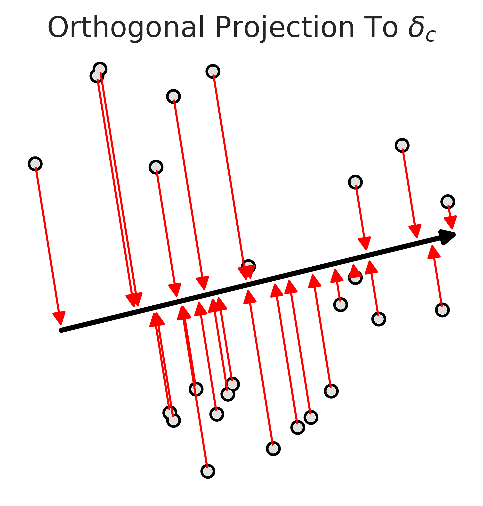
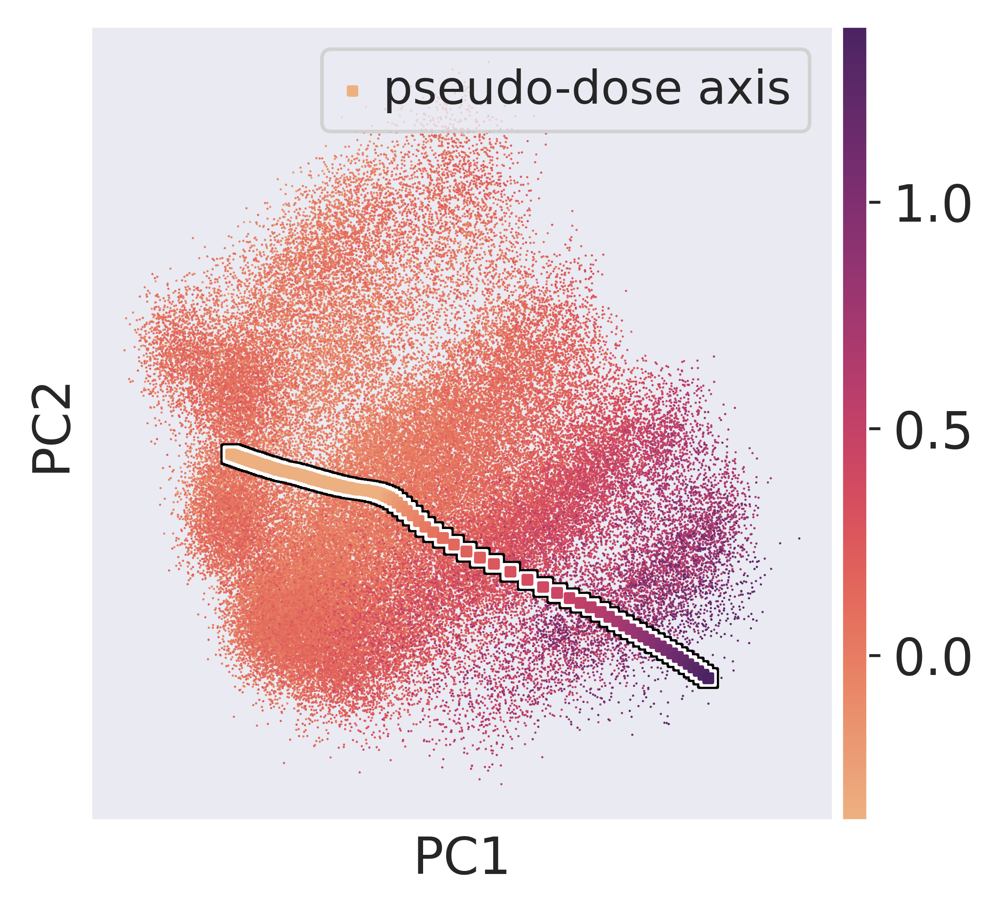
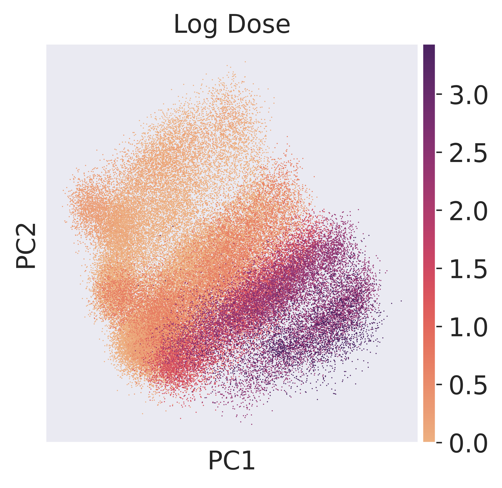
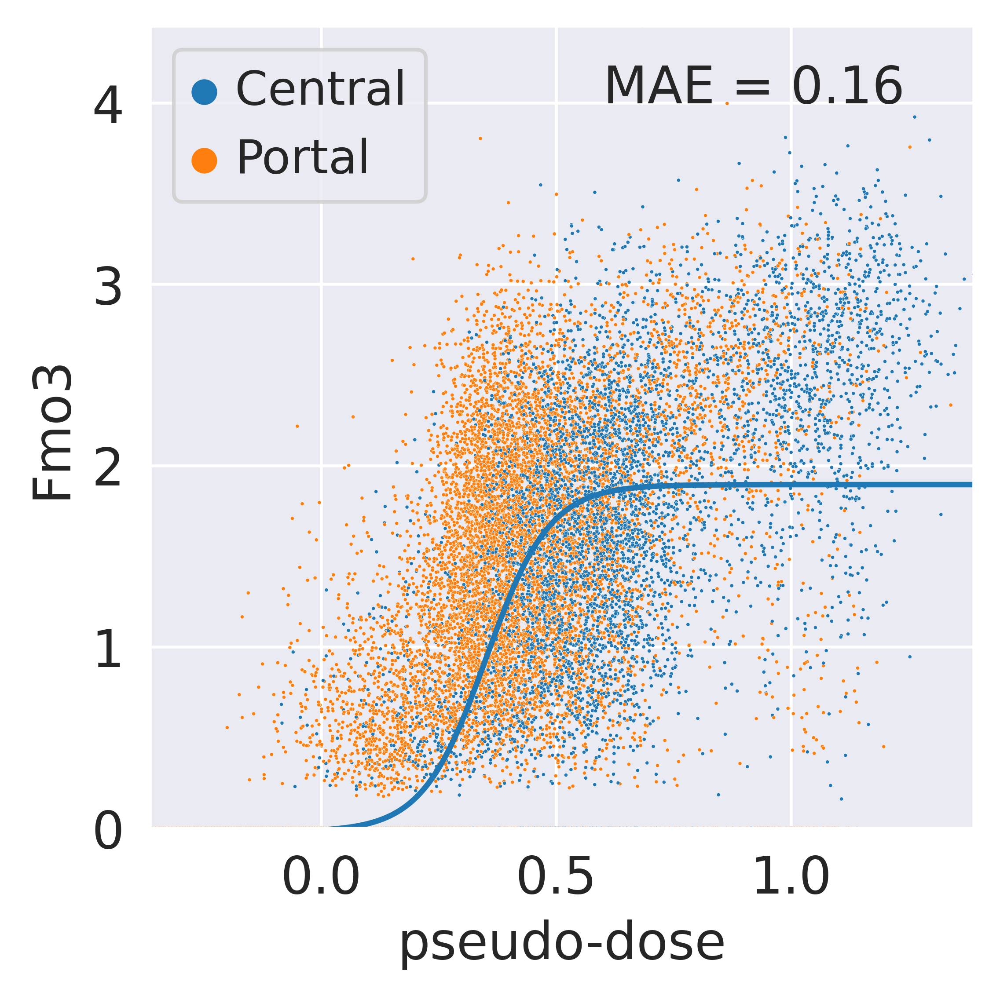
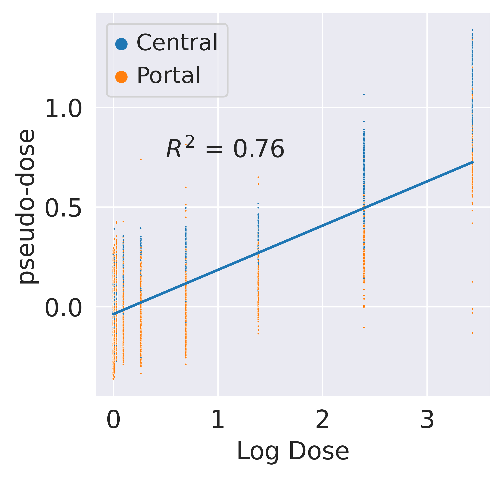
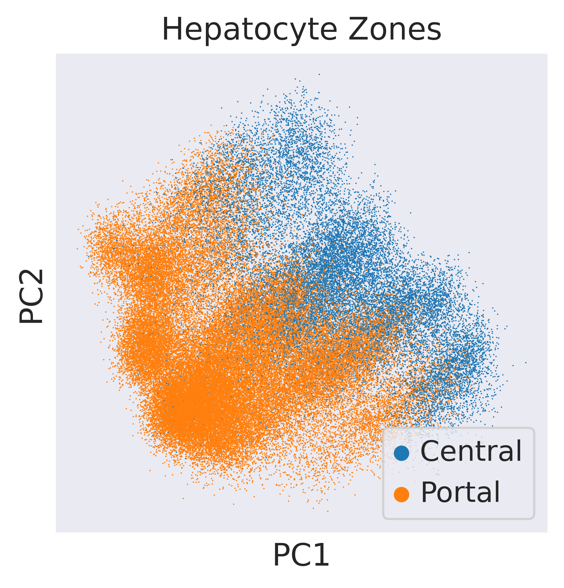
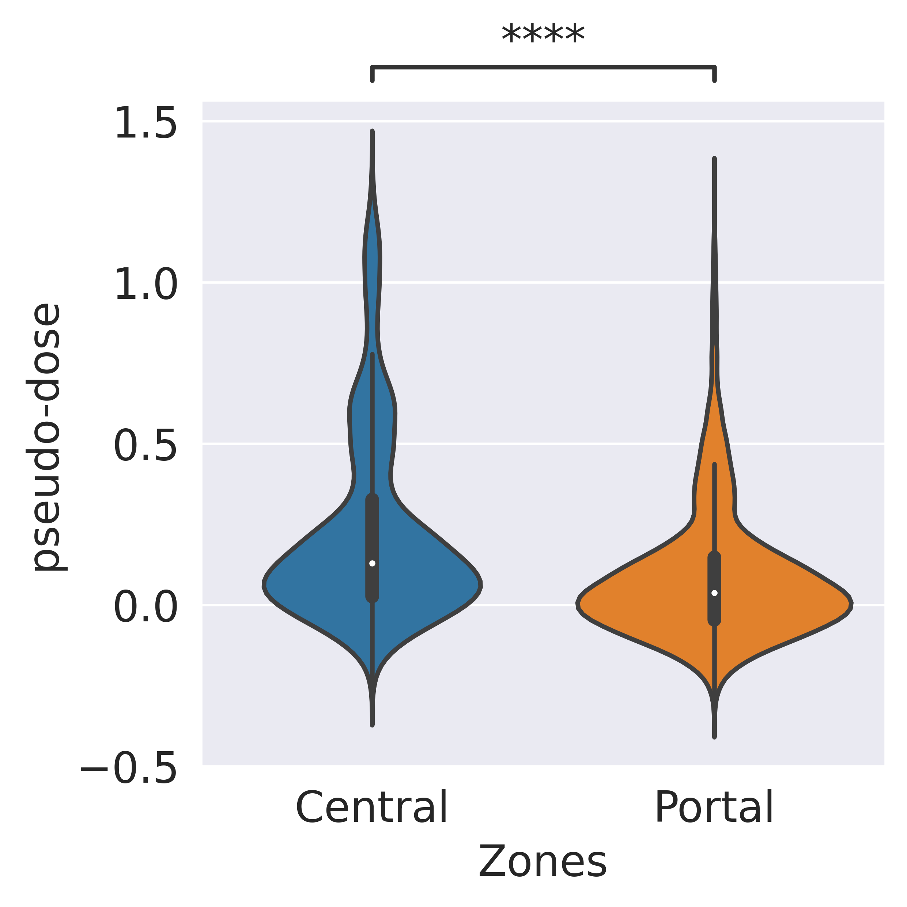

# Pseudo-Dose Analysis of Hepatocytes in TCDD Response

This section explores the assignment of pseudo-dose values to hepatocytes by projecting them onto a pseudo-dose axis derived from the latent space of scVIDR. The analysis investigates the relationship between pseudo-dose and real dose, expression of key genes, and liver zonation. It demonstrates how pseudo-dose values correlate with administered doses and differentiate between central and portal hepatocytes, revealing insights into the metabolic and transcriptomic responses to TCDD exposure.

## Importing Required Libraries
Essential libraries and VIDR functions are imported for single-cell data analysis, statistical computation, and high-quality visualization. 

```python
import sys
sys.path.insert(1, '../vidr/')

#Import VIDR functions
from vidr import VIDR
from PCAEval import PCAEval
from utils import *

#Import important modules
import scanpy as sc
import scgen as scg
import pandas as pd
import numpy as np
import torch
import seaborn as sns
from scipy import stats
from scipy import linalg
from scipy import spatial
from anndata import AnnData
from scipy import sparse
from statannotations.Annotator import Annotator
from matplotlib import pyplot as plt

sc.set_figure_params(dpi = 300, frameon = True)
sns.set_style("dark")
```

## Data Preparation for Pseudo-Dose Analysis
Loads single-cell data, filters for relevant cell types, and processes the data for pseudo-dose analysis. Cell types are categorized into broader groups (e.g., grouping hepatocytes), doses are made categorical, and the data is normalized, log-transformed, and reduced to the top 5000 highly variable genes.

```python
doses = [0, 0.01, 0.03, 0.1, 0.3, 1, 3, 10, 30]
adata = sc.read_h5ad("../data/nault2021_multiDose.h5ad")
cell_types_of_int = ["Hepatocytes - central", "Hepatocytes - portal", "Cholangiocytes", "Stellate Cells", "Portal Fibroblasts", "Endothelial Cells"]
adata = adata[adata.obs['celltype'].isin(cell_types_of_int)]

def is_hepatocyte(x:str):
    if "Hepatocytes" in x:
        return "Hepatocytes"
    else:
        return x

v_isHepatocyte = np.vectorize(is_hepatocyte)

celltypes = adata.obs["celltype"]
adata.obs["celltype2"] = celltypes
adata.obs["celltype"] = v_isHepatocyte(celltypes)

adata.obs["dose"] = [str(i) for i in adata.obs["Dose"]]

sc.pp.normalize_total(adata)
sc.pp.log1p(adata)
sc.pp.highly_variable_genes(adata, n_top_genes=5000)
adata = adata[:, adata.var.highly_variable]
```


## Training VIDR Model for Hepatocyte Dose Response Prediction
This code prepares training data by filtering for hepatocytes and structuring the dataset. It then initializes and trains a VIDR model to predict the dose-response of hepatocytes to dioxin exposure, using 100 epochs and early stopping with a patience of 25.

```python
doses = [0.0,0.01, 0.03, 0.1, 0.3, 1.0, 3.0, 10.0, 30.0]

model_name = "VAE"

cell = "Hepatocytes"

train_adata, test_adata = prepare_data(adata, "celltype", "dose", cell, "30.0", normalized = True)
train_adata = setup_anndata(adata, copy = True, batch_key = "dose", labels_key="celltype")
print(f"\n Predicting {cell} Dioxin Dose Response\n")

model = VIDR(train_adata, linear_decoder = False, nca_loss = False)

model.train(
max_epochs=100,
batch_size=128,
early_stopping=True,
early_stopping_patience=25)
```


Saves the trained VIDR model for hepatocyte dose-response prediction and reloads it for further analysis.
```python
model.save(f"../data/Continuous_Dioxin_VAE_{cell}.pt", overwrite = True)
model = model.load(f"../data/VAE_Cont_Prediction_Dioxin_5000g_{cell}.pt/", train_adata)
```


Creates latent space representations of the training data using the VIDR model, stored in an AnnData object.

```python
latent_data = model.get_latent_representation()
latent_adata = sc.AnnData(X=latent_data , obs=train_adata.obs.copy(),)
```

Calculates nearest neighbors and applies UMAP dimensionality reduction on the latent data for visualization.

```python
sc.pp.neighbors(latent_adata)
sc.tl.umap(latent_adata)
```

   

Plots UMAP projections of the latent space, coloring the data points by celltype, dose, and Dose.

```python
sc.pl.umap(latent_adata, color = ["celltype", "dose", "Dose"])
```


    

    
## Calculating Pseudodose and Preparing PCA Data

Filters the latent data to include only hepatocyte observations.

```python
hep_latent_adata = latent_adata[latent_adata.obs["celltype"] == "Hepatocytes"]
```
Calculates the delta vector by finding the difference between the mean latent representations of treated (30.0) and control (0.0) hepatocytes.

```python
mean_treat = np.average(hep_latent_adata[((hep_latent_adata.obs["celltype"] == "Hepatocytes") & (hep_latent_adata.obs["Dose"] == 30.0))].X, axis = 0)
mean_ctrl = np.average(hep_latent_adata[((hep_latent_adata.obs["celltype"] == "Hepatocytes") & (hep_latent_adata.obs["Dose"] == 0))].X, axis = 0)
delta = mean_treat - mean_ctrl
```


```python
delta
```


    ArrayView([-1.5908594 , -0.7789223 , -1.6158879 , -1.4761918 ,
                7.473415  ,  5.559472  ,  6.484432  ,  0.3703618 ,
                0.02829731, -5.4236245 ,  5.7453275 ,  2.2943373 ,
               -0.93482494, -0.368765  ,  2.5927205 ,  5.6672025 ,
                1.2594086 ,  0.36797523, -2.1124659 ,  1.5700024 ,
               -2.5969675 , -4.3866515 ,  1.2291341 ,  5.048762  ,
                0.46821594, -3.1810694 , -3.713352  ,  0.10406089,
                1.9408138 , -1.2964935 , -5.362129  , -9.050259  ,
               -6.3919587 , -2.5839808 , -0.11159652,  2.0792854 ,
                2.0623562 , -1.2838833 , -0.62048364, -2.535976  ,
                4.378879  , -0.04124534, -3.584529  , -0.20999141,
                1.2496918 ,  8.430087  ,  1.4514724 ,  5.211666  ,
                0.16987807,  2.827426  , -2.9365125 ,  4.2647195 ,
                0.01951849, -0.24185073, -2.3631287 ,  0.25263762,
               -0.99487025, -3.020894  , -3.471105  , -1.5591799 ,
                1.1599275 ,  4.625957  , -0.7811835 , -0.452767  ,
                0.6537703 , -0.4849658 , -0.47182906,  1.1258912 ,
               -1.8161821 , -3.1695158 , -3.2429376 , -3.956285  ,
               -0.62378955, -2.4152884 ,  1.3758457 ,  0.5753751 ,
                0.27406073,  2.6183238 , -3.5305314 ,  0.9863534 ,
                0.450068  , -4.164974  ,  0.764345  ,  1.9108295 ,
               -1.2980747 , -3.2957888 ,  1.0901201 , -0.13923624,
                0.7284215 , -0.08666986, -6.043189  ,  2.0565515 ,
               -0.18138188, -0.11264582,  2.3790174 , -1.2957791 ,
                4.2633057 , -1.8532457 ,  3.4937444 , -1.0702866 ],
              dtype=float32)


Calculates the pseudodose for each hepatocyte by projecting its latent vector onto the delta vector.
```python
pt_values = []
for i in hep_latent_adata.X:
    pt_value = np.dot(i,delta)/np.dot(delta,delta)
    pt_values.append(pt_value)

pseudodose = np.array(pt_values)
```
```python
hep_latent_adata.obs["pseudodose"] = pseudodose
# meta = pd.read_csv("../data/dose-response.metadata.txt", sep = '\t')
# meta.index = np.concatenate([[i+dose_ids[d] for i in meta[meta['Dose']==d].index]  for d in doses])
```


Performs PCA on hepatocyte latent representations, storing the first two components for visualization, and projects the delta vector onto the PCA space to calculate the pseudo-dose axis.

```python
hep_latent_adata.obs["Log Dose"] = np.log1p(hep_latent_adata.obs["Dose"])
```

```python
from sklearn.decomposition import PCA
pca = PCA(n_components = 2, svd_solver = 'arpack')
pca_mod = pca.fit(hep_latent_adata.X)
hep_latent_adata.obsm["X_pca"] = pca_mod.transform(hep_latent_adata.X)
coef = np.linspace(-0.5, 2.5, 1000)
delta_points = np.array([i*delta for i in coef])
delta_pca = pca_mod.transform(delta_points)
```

## Figure 5A: Orthogonal Projection of Hepatocytes onto the Pseudo-Dose Axis
Hepatocytes are projected onto the pseudo-dose axis in PCA space, visualizing their alignment along the treatment effect trajectory (delta_c). Random hepatocytes are shown with projections highlighted by red arrows, and pseudo-doses are added to capture their treatment response.


```python
np.random.seed(15)
rand_samp = hep_latent_adata[np.random.randint(0, hep_latent_adata.shape[0], size = (25))]
ax = sc.pl.pca(rand_samp,  frameon=False, return_fig=True, title = [None], size=75, add_outline = True)

v = pca_mod.transform(delta[np.newaxis, :])[0]
plt.annotate('',xy=(v[0]*0.95, v[1]*0.95),
             xycoords='data',
             xytext=(v[0]*-0.85, v[1]*-0.85),
             textcoords='data',
             arrowprops=dict(arrowstyle= '-|>',
                             color='black',
                             lw=2.5,
                             ),
           )
for x in rand_samp.obsm["X_pca"]:
    orth_proj  = (np.dot(v, x)/np.dot(v, v)) * v
    plt.annotate('',xy=(orth_proj[0], orth_proj[1]),
             xycoords='data',
             xytext=(x[0], x[1]),
             textcoords='data',
             arrowprops=dict(arrowstyle= '-|>',
                             color='red',
                             lw=1,
                             )
           )
plt.title(r"Orthogonal Projection To $\delta_c$")
plt.savefig("../figures/5A.svg")
plt.show()
```


    

    


```python
hep_adata = adata[adata.obs.celltype == "Hepatocytes"]
```


```python
hep_adata.obs["pseudo-dose"] = pseudodose
```


```python
pca = PCA(n_components = 2, svd_solver = 'arpack')
pca_mod = pca.fit(hep_adata.X)
hep_adata.obsm["X_pca"] = pca_mod.transform(hep_adata.X)
coef = np.linspace(min(pseudodose)-2.5, max(pseudodose), 100)
delta_points = np.array([i*delta for i in coef])
proj_delta = model.module.generative(torch.Tensor(delta_points))["px"].cpu().detach().numpy()
delta_pca = pca_mod.transform(proj_delta)
```

## Figure 5B: Pseudo-Dose Visualization in PCA Space
Visualizes hepatocytes in PCA space, colored by their assigned pseudo-dose values. The pseudo-dose axis is overlaid using delta projections, with different doses represented along the axis. Additionally, hepatocyte zones are assigned as "Central" or "Portal" based on their lobular position.

```python
ax = sc.pl.pca(hep_adata, color=['pseudo-dose'], wspace=0.4, frameon=True, return_fig=True, cmap="flare", title = "")
plt.scatter(delta_pca[:, 0], delta_pca[:, 1], s = 25, marker = "s", c = "black")
plt.scatter(delta_pca[:, 0], delta_pca[:, 1], s = 15, marker = "s", c = "white")
plt.scatter(delta_pca[:, 0], delta_pca[:, 1], s = 5, marker = "s", label = "pseudo-dose axis", c = [min(pseudodose) if i < min(pseudodose) else i for i in coef], cmap = "flare")
plt.legend()
plt.savefig("../figures/5B.svg")
plt.show()
```

    /mnt/home/kanaomar/miniconda3/lib/python3.9/site-packages/anndata/_core/anndata.py:1220: FutureWarning: The `inplace` parameter in pandas.Categorical.reorder_categories is deprecated and will be removed in a future version. Reordering categories will always return a new Categorical object.
      c.reorder_categories(natsorted(c.categories), inplace=True)
    ... storing 'Zones' as categorical


    

    


```python
hep_adata.obs["Zones"] = ["Central" if i == "Hepatocytes - central" else "Portal" for i in hep_adata.obs["celltype2"]]
```


```python
hep_adata.obs["Log Dose"] = np.log1p(hep_adata.obs["Dose"])
```


```python
ax = sc.pl.pca(hep_adata, color=['Log Dose'], wspace=0.4, frameon=True, return_fig=True, cmap="flare")
#plt.savefig("../figures/5C.svg")
```


    

    


```python
sns.set_style("darkgrid")
```


```python
def sigmoid(x, L, k, x0, b):
    y = L / (1 + np.exp(-k*(x-x0)))+b
    return (y)
```


```python
from scipy.optimize import curve_fit
from sklearn.metrics import mean_absolute_error
```


```python
top_lin_genes = adata.var_names[np.argsort(pt_r2_scores)[::-1]][:100]
```


```python
top_gene = 'Fmo3'
```


```python
df = pd.DataFrame({"Dose":hep_adata.obs["Dose"].values, "Pseudodose":hep_adata.obs["pseudo-dose"].values,  
                   "Hepatocyte Zones":hep_adata.obs["Zones"].values, top_gene:hep_adata[:, top_gene].X.squeeze()})
x = df["Pseudodose"].values
y = df[top_gene].values
```


```python
bounds = ((1., 0., min(pseudodose),-5.), (15.,50.,max(pseudodose), 5.))
p0 = [1.0, 1.0, 1.0, 1.0]
popt, pcov = curve_fit(sigmoid, x, y, p0, method='trf', 
                       maxfev = 10000, bounds = bounds)
```


```python
popt
```


    array([ 1.9149075 , 14.82530381,  0.3509117 , -0.02009366])


## Figure 5D: Pseudo-Dose vs. Fmo3 Expression
This plot demonstrates the relationship between pseudo-dose values and the expression of the Fmo3 gene. A logistic fit (solid blue line) is applied to show the sigmoidal trend, and the Mean Absolute Error (MAE) is annotated. The data points are color-coded by hepatocyte zones, highlighting central and portal regions.


```python
df = pd.DataFrame({"Dose":hep_adata.obs["Dose"].values, "Pseudodose":hep_adata.obs["pseudo-dose"].values,  
                   "Hepatocyte Zones":hep_adata.obs["Zones"].values, top_gene:hep_adata[:, top_gene].X.squeeze()})
ax = sns.scatterplot(x = "Pseudodose", y = top_gene, hue = "Hepatocyte Zones", data = df, s = 1)
r2 = stats.linregress(x = df["Pseudodose"], y = df[top_gene])
r2 = mean_absolute_error(y, sigmoid(x, *popt))
sns.lineplot(x = x, y = sigmoid(x, *popt))
plt.ylim(min(df[top_gene]), max(df[top_gene]))
plt.xlim(min(df["Pseudodose"]), max(df["Pseudodose"]))
plt.xlabel("pseudo-dose")
plt.annotate(f"MAE = {r2:.{2}}", (0.6, 4))
plt.savefig("../figures/5D.svg")
```


    

    


## Figure 5C: Pseudo-Dose vs. Log Dose
The plot visualizes the relationship between the pseudo-dose values and log-transformed real dose values, highlighting hepatocyte zones (portal and central). A linear regression line with the corresponding R<sup>2</sup >value demonstrates the fit between pseudo-dose and log dose.

```python
df = pd.DataFrame({"Log Dose":hep_adata.obs["Log Dose"].values, "Pseudodose":hep_adata.obs["pseudo-dose"].values,  
                   "Hepatocyte Zones":hep_adata.obs["Zones"].values, top_gene:hep_adata[:, top_gene].X.squeeze()})

x = df["Log Dose"].values
y = df["Pseudodose"].values

ax = sns.scatterplot(x = "Log Dose", y = "Pseudodose", hue = "Hepatocyte Zones", data = df, s = 1)
m, b, r, p, _ = stats.linregress(x =x, y =y)
sns.lineplot(x = x, y = x*m+b)
plt.annotate(f"$R^2$ = {r**2:.{2}}", (0.5, 0.75))
plt.ylabel("pseudo-dose")
plt.savefig("../figures/5C.svg")
```


    

    

## Figure 5E: PCA of Hepatocyte Zones
A PCA plot of hepatocytes is color-coded by their respective zones (portal and central) in the liver lobule, visually distinguishing the distribution of hepatocytes across the latent space.

```python
ax = sc.pl.pca(hep_adata, color = ['Zones'], frameon=True, return_fig=True, title = ["Hepatocyte Zones"])
plt.legend(loc = 'lower right')
plt.show()
```


    

    


# Figure 5F: Pseudo-Dose Distribution Across Hepatocyte Zones
The violin plot illustrates the distribution of pseudo-dose values across central and portal hepatocyte zones. Central hepatocytes show a significantly higher pseudo-dose compared to portal hepatocytes, as confirmed by a Mann-Whitney U test.

```python
df = hep_adata.obs
pairs = [('Central', 'Portal')]
ax  = sns.violinplot(x = "Zones", y = "pseudo-dose", data = df)
annotator = Annotator(ax, pairs, data=df, x="Zones", y="pseudo-dose")
annotator.configure(test='Mann-Whitney-gt', text_format='star', loc='outside')
annotator.apply_and_annotate()
plt.savefig("../figures/5F.svg")
```

    p-value annotation legend:
          ns: p <= 1.00e+00
           *: 1.00e-02 < p <= 5.00e-02
          **: 1.00e-03 < p <= 1.00e-02
         ***: 1.00e-04 < p <= 1.00e-03
        ****: p <= 1.00e-04
    
    Central vs. Portal: Mann-Whitney-Wilcoxon test greater, P_val:0.000e+00 U_stat=7.984e+08


    

    

