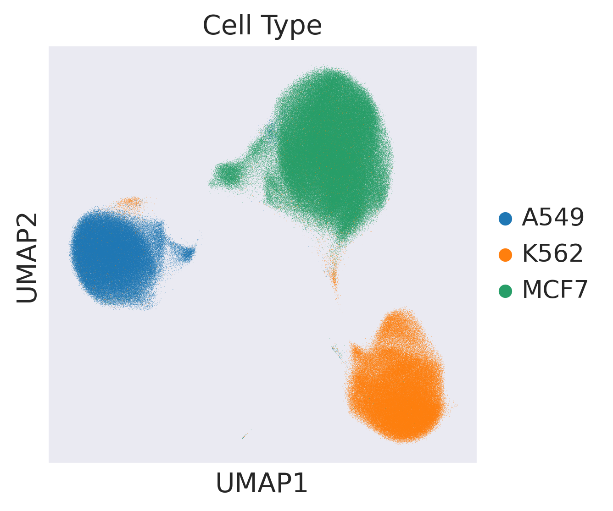
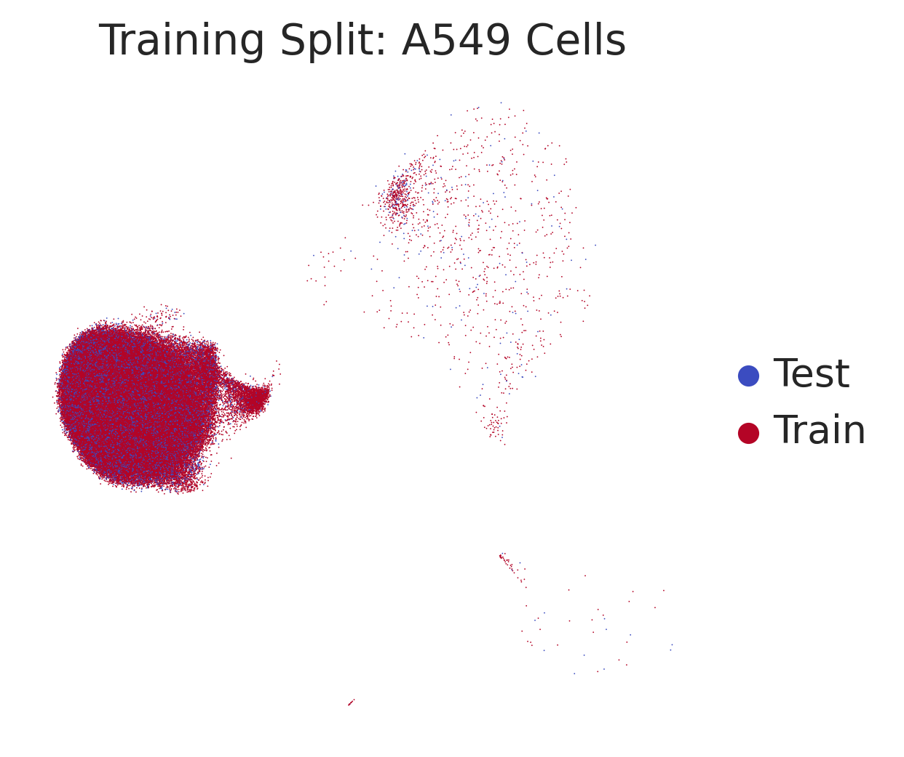
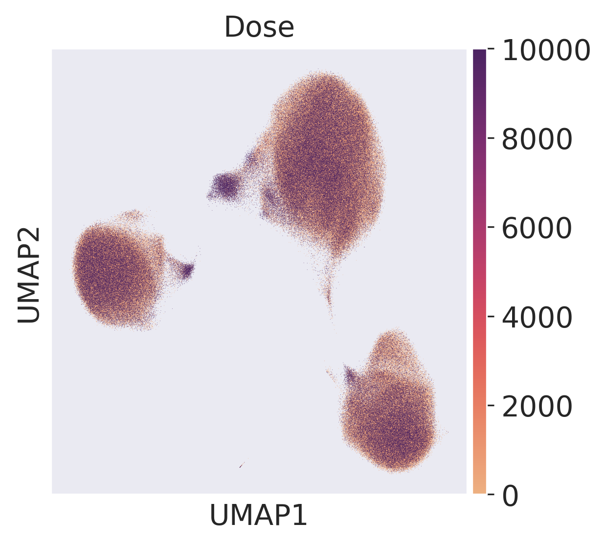
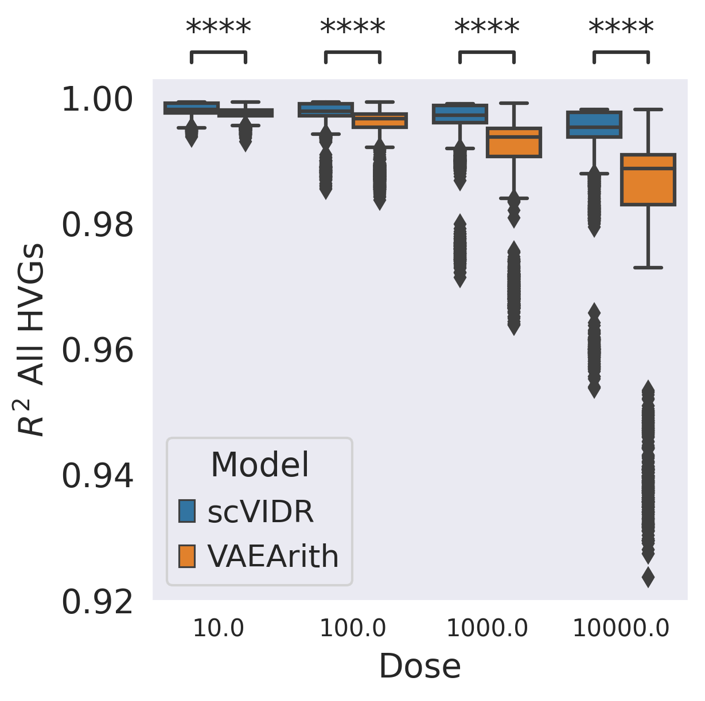
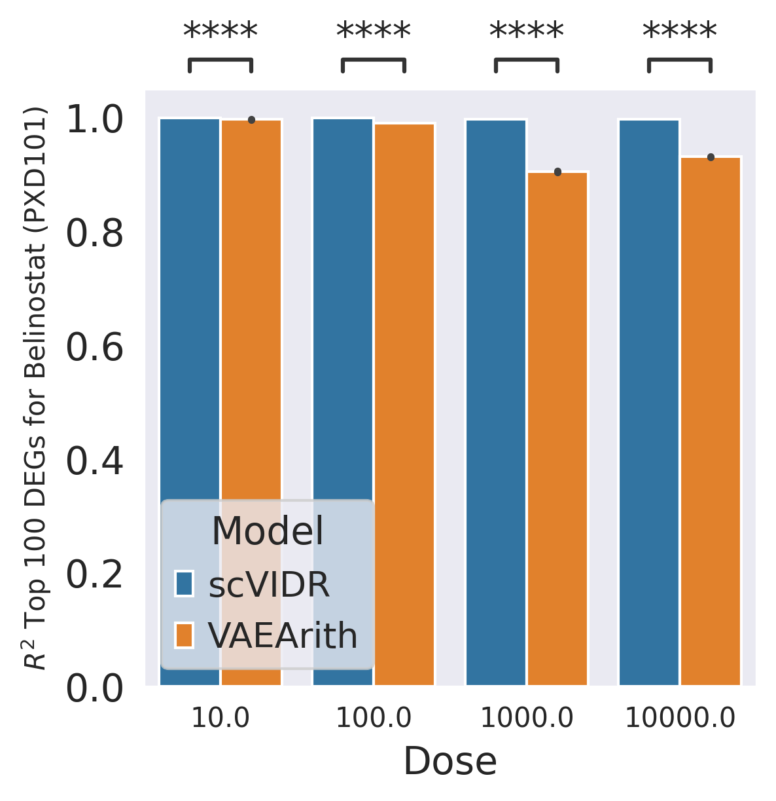
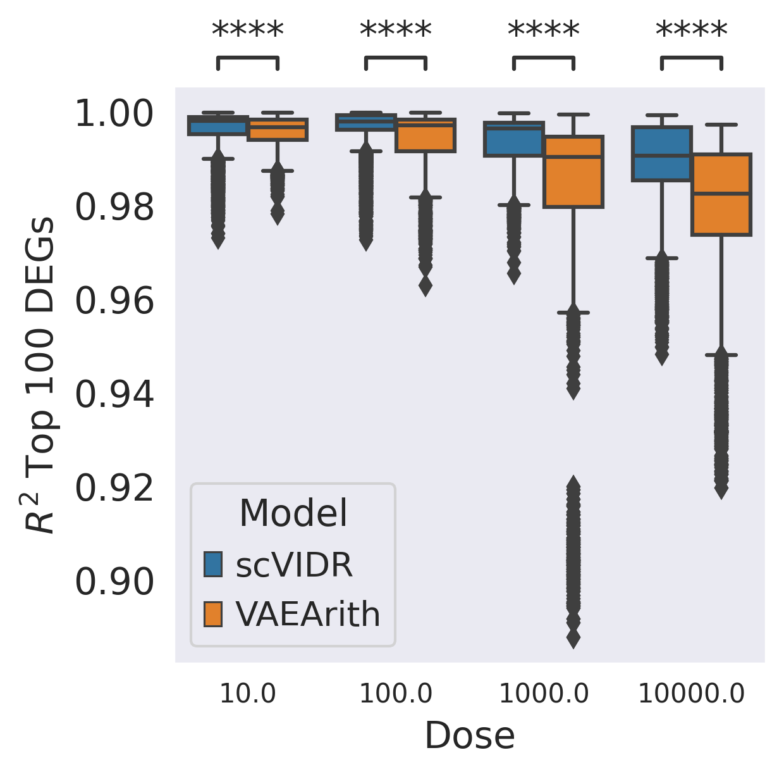
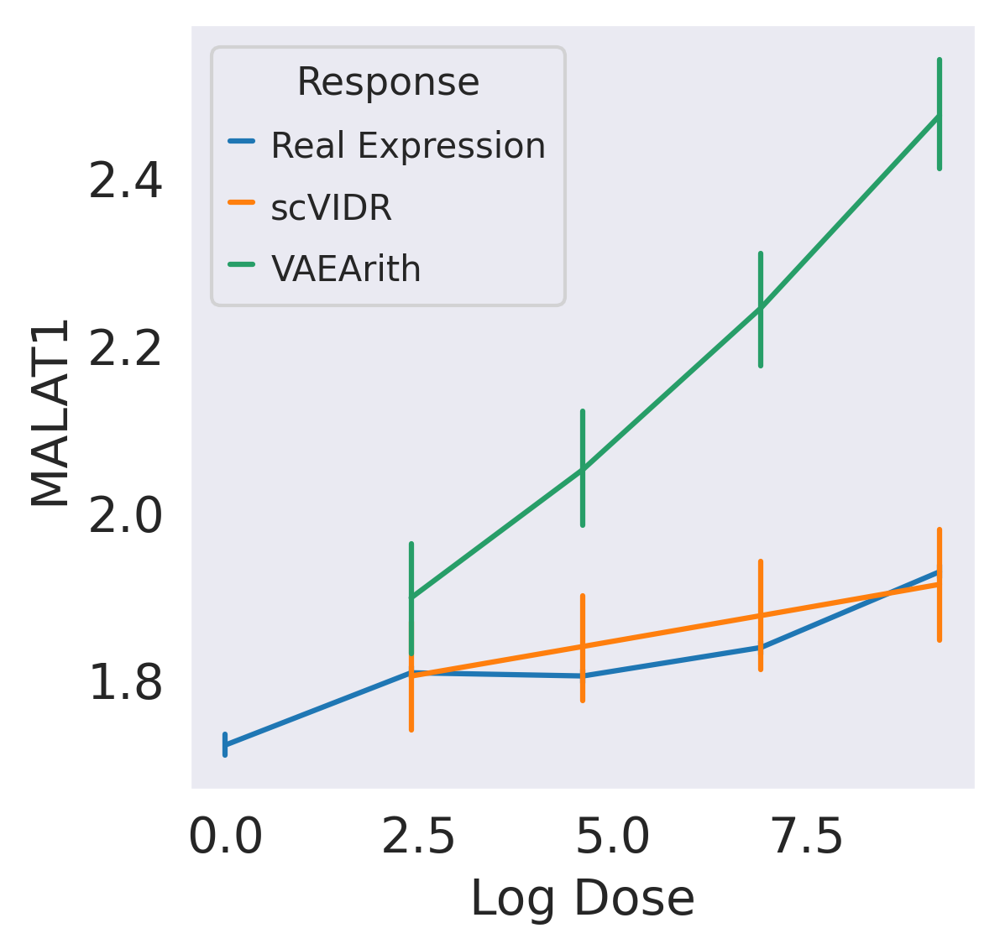
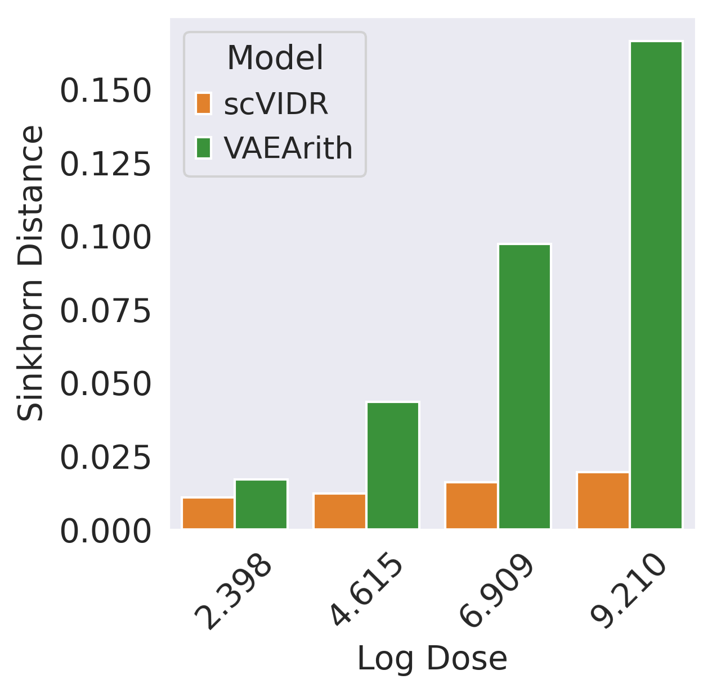

```python
#Create Access to my code
import sys
sys.path.insert(1, '../vidr/')

#Import hte vaedr functions we have created
from vidr import VIDR
from PCAEval import PCAEval
from utils import *

#Import important modules
import scanpy as sc
import scgen as scg
import pandas as pd
import numpy as np
import torch
import seaborn as sns
from scipy import stats
from scipy import linalg
from scipy import spatial
from anndata import AnnData
from scipy import sparse
from statannotations.Annotator import Annotator
from matplotlib import pyplot as plt

import warnings
warnings.filterwarnings("ignore")

sc.set_figure_params(dpi = 150, frameon = True)
sns.set_style("dark")
sc.settings.figdir = "../figures"
```


```python
adata = sc.read_h5ad("../data/srivatsan2020.h5ad")
```


```python
adata.obs["drug_dose"] = [f"{i}_{j}" for (i, j) in zip(adata.obs["product_name"], adata.obs["dose"])]
```


```python
adata = setup_anndata(adata, copy = True, batch_key ="drug_dose", labels_key="cell_type")
```

    INFO     Using batches from adata.obs["drug_dose"]                                           
    INFO     Using labels from adata.obs["cell_type"]                                            
    INFO     Using data from adata.X                                                             
    INFO     Computing library size prior per batch                                              
    INFO     Successfully registered anndata object containing 680685 cells, 5000 vars, 753      
             batches, 3 labels, and 0 proteins. Also registered 0 extra categorical covariates   
             and 0 extra continuous covariates.                                                  
    INFO     Please do not further modify adata until model is trained.                          


```python
# drug_list = adata[~(adata.obs["product_name"] == "Vehicle")].obs["product_name"].unique()
```


```python
# np.savetxt("../../data/sciplex3_drug_list.txt", drug_list, delimiter=" ", fmt="%s")
```


```python
# np.random.seed(42)
```


```python
# ind = np.random.choice(len(drug_list), int(len(drug_list)/5))
```


```python
# test_drug_list = drug_list[ind]
```


```python
# np.savetxt("../../data/sciplex3_test_drug_list.txt", test_drug_list, delimiter=" ", fmt="%s")
```


```python
test_drugs = np.loadtxt("../data/srivatsan2020_testDrugList.txt", dtype = str, delimiter="\t")
```


```python
test_drugs.shape
```


    (37,)


```python
train_adata = adata[~((adata.obs["product_name"].isin(test_drugs)) & (adata.obs["cell_type"] == "A549"))]
```


```python
model = VIDR(train_adata.copy(), linear_decoder = False)
```

    None


```python
# model.train(
# max_epochs=100,
# batch_size=256,
# early_stopping=True,
# early_stopping_patience=25,
# train_size=0.8
# )
```


```python
# model.save(f"../../data/models/Continuous_VAE_sciplex3_80perDrug_24hours_DelA549.pt")
```


```python
model =  model.load("../data/VAE_Cont_Prediction_sciplex3_80perDrug_24hours_Dela549.pt/", train_adata)
```

    Trying to set attribute `.uns` of view, copying.


    INFO     Using data from adata.X                                                             
    INFO     Computing library size prior per batch                                              
    INFO     Registered keys:['X', 'batch_indices', 'local_l_mean', 'local_l_var', 'labels']     
    INFO     Successfully registered anndata object containing 651019 cells, 5000 vars, 753      
             batches, 3 labels, and 0 proteins. Also registered 0 extra categorical covariates   
             and 0 extra continuous covariates.                                                  
    None


```python
latent_X = model.get_latent_representation(adata)
latent_adata = sc.AnnData(X = latent_X, obs = adata.obs.copy())
```


```python
sc.pp.neighbors(latent_adata)
sc.tl.umap(latent_adata)
```

    WARNING: You’re trying to run this on 100 dimensions of `.X`, if you really want this, set `use_rep='X'`.
             Falling back to preprocessing with `sc.pp.pca` and default params.


```python
latent_adata.obs["Training Split"] = ["Test" if ((i == "A549") & (j in test_drugs)) else "Train" for (i, j) in zip(latent_adata.obs["cell_type"], latent_adata.obs["product_name"])]
```


```python
latent_adata.obs["Cell Type"] = latent_adata.obs["cell_type"]
```


```python
latent_adata.obs["cell_dose"] = [f"{j}_{str(i)}" for (i,j) in zip(latent_adata.obs["dose"], latent_adata.obs["cell_type"])]
```


```python
centroids = {cell:np.average(latent_adata.obsm["X_umap"][latent_adata.obs["cell_dose"] == cell], axis = 0) for cell in np.unique(latent_adata.obs["cell_dose"])}
centroids["0"] = np.average(latent_adata.obsm["X_umap"][latent_adata.obs["dose"] == "0.0"], axis = 0)
centroids["30"] = np.average(latent_adata.obsm["X_umap"][latent_adata.obs["dose"] == "30.0"], axis = 0)
```

## Supplemental Figure 4A


```python
ax = sc.pl.umap(latent_adata, color = ["Cell Type"], frameon=True, return_fig=True)
plt.savefig("../figures/S4A1.svg", bbox_inches='tight')
```

    ... storing 'drug_dose' as categorical
    ... storing 'Training Split' as categorical
    ... storing 'cell_dose' as categorical


    

    


```python
ax =sc.pl.umap(latent_adata[latent_adata.obs["cell_type"] == "A549"], color = ["Training Split"], frameon=False, return_fig = True, palette= "coolwarm")
plt.title("Training Split: A549 Cells")

plt.savefig("../figures/S4A2.svg", bbox_inches='tight')
```

    Trying to set attribute `.uns` of view, copying.


    

    


```python
ax =sc.pl.umap(latent_adata, color = ["dose"], frameon=True, return_fig = True, cmap = "flare")
plt.title("Dose")

plt.savefig("../figures/S4A3.svg", bbox_inches='tight')
```


    

    


```python
# def calculate_r2(
#     adata,
#     cell: str,
#     model: str,
#     condition_key: str,
#     axis_keys:dict,
#     diff_genes = None,
#     random_sample_coef = None,
#     n_iter: int = 1,
# ):
#     #Set condition key
    
#     #Densify sparse matrix
#     if sparse.issparse(adata.X):
#         adata.X = adata.X.A
    
#     #Treatment and Prediction
#     treat = adata[adata.obs[condition_key] == axis_keys["y"]] 
#     pred = adata[adata.obs[condition_key] == axis_keys["x"]]
    
#     r2_values_dict = {"R^2":[], "Gene Set":[]}
#     for i in range(n_iter):
        
#         if random_sample_coef is not None:
#             treat_idx = np.random.choice(np.arange(0, treat.shape[0]), int(random_sample_coef*treat.shape[0]))
#             pred_idx = np.random.choice(np.arange(0, pred.shape[0]), int(random_sample_coef*pred.shape[0]))
#             treat_samp = treat[treat_idx, :]
#             pred_samp = pred[pred_idx, :]
        
#         else:
#             treat_samp = treat
#             pred_samp = samp
            
#         if diff_genes is not None:
#             treat_diff = treat_samp[:, diff_genes]
#             pred_diff = pred_samp[:, diff_genes]

#             x_diff = np.average(pred_diff.X, axis=0)
#             y_diff = np.average(treat_diff.X, axis = 0)
#             m, b, r_value_diff, p_value_diff, std_err_diff = stats.linregress(
#                 x_diff, y_diff
#             )
#             r2_values_dict["R^2"].append(r_value_diff ** 2)
#             r2_values_dict["Gene Set"].append("DEGs")
            
    
#         x = np.average(treat_samp.X, axis = 0)
#         y = np.average(pred_samp.X, axis = 0)
#         m, b, r_value, p_value, std_err = stats.linregress(x, y)
#         r2_values_dict["R^2"].append(r_value ** 2)
#         r2_values_dict["Gene Set"].append("All HVGs")
        
#     r2_values_df = pd.DataFrame(r2_values_dict)
#     r2_values_df["Cell"] = cell
#     r2_values_df["Model"] = model
#     r2_values_df["Dose"] = axis_keys["y"]
#     return r2_values_df
```


```python
# df_list = []
# regression = False
# cell = "A549"
# for idx, drug in enumerate(test_drugs):
#     print(idx)
#     print(drug)
#     model = VIDR(train_adata, linear_decoder = False)
# #     model.train(
# #     max_epochs=100,
# #     batch_size=128,
# #     early_stopping=True,
# #     early_stopping_patience=25)
    
# #     model.save(f"../../data/VAE_Binary_Prediction_Dioxin_5000g_{cell}.pt")
#     model = model.load(f"../../data/models/Continuous_VAE_sciplex3_80perDrug_24hours_DelA549.pt/", train_adata)
#     train_adata_drug = adata[adata.obs.product_name == drug]
#     model_name = "VAEArith"
    
#     max_dose = train_adata_drug.obs.dose.max()
#     min_dose = train_adata_drug.obs.dose.min()
#     doses = np.sort(train_adata_drug.obs.dose.unique())
    
#     ctrl_x = train_adata[train_adata.obs["product_name"] == "Vehicle", :]
#     treat_x = train_adata[(train_adata.obs["product_name"] == drug) & (train_adata.obs["dose"] == 10000)]
#     ctrl_x = random_sample(ctrl_x, "cell_type")
#     treat_x = random_sample(treat_x, "cell_type")
#     new_adata = ctrl_x.concatenate(treat_x)
#     new_adata = random_sample(new_adata, "dose", max_or_min = "min", replacement = False)
    
#     if sparse.issparse(new_adata.X):
#             new_adata.X = new_adata.X.A
    
#     ctrl_data = new_adata[(new_adata.obs["cell_type"] == "A549") & (new_adata.obs["product_name"] == "Vehicle")]
#     latent_cd = model.get_latent_representation(ctrl_data)
#     ctrl_x = new_adata[new_adata.obs["dose"] == 0].copy()
#     treat_x = new_adata[new_adata.obs["dose"] == 10000].copy()
    
#     #Compress data to latent space and then calculate the delta
#     latent_ctrl = np.average(model.get_latent_representation(ctrl_x), axis = 0)
#     latent_treat = np.average(model.get_latent_representation(treat_x), axis = 0)
#     delta = latent_treat - latent_ctrl
#     doses = adata.obs.dose.unique()
#     doses.sort()
#     treat_pred_dict = {d:delta*(np.log1p(d)/np.log1p(max(doses))) + latent_cd  for d in doses if d > min(doses)}
#     predicted_cells_dict = {d:model.module.generative(torch.Tensor(treat_pred_dict[d]))["px"].cpu().detach().numpy() for d in doses if d > min(doses)}
#     dr_dict = {d:sc.AnnData(X=predicted_cells_dict[d], obs=ctrl_data.obs.copy(), var=ctrl_data.var.copy(),obsm=ctrl_data.obsm.copy(),) for d in doses if d > min(doses)}
    
#     for key in dr_dict.keys():
#         dr_dict[key].obs["dose"] = f'{key} VAEArith'

#     ctrl_adata = adata[((adata.obs['cell_type'] == cell) & (adata.obs['dose'] == 0))]
#     eval_dict1 = {}

#     for d in doses[1:]:
#         stim_adata = adata[((adata.obs['cell_type'] == cell) & (adata.obs['dose'] == d))]
#         eval_dict1[d] = ctrl_adata.concatenate(stim_adata, dr_dict[d])
#         eval_dict1[d].obs["Dose"] = [str(i) if type(i) == float else i for i in eval_dict1[d].obs['dose']]

#     cell_adata = adata[(adata.obs["cell_type"] ==cell) & (adata.obs["product_name"] ==drug)]
#     cell_adata.obs["Dose"] = [str(i) for i in cell_adata.obs["dose"]]
#     sc.tl.rank_genes_groups(cell_adata, groupby="Dose", method="wilcoxon")
#     print("..Finished Differential Expression")
#     for d in doses[1:]:
#         print(d)
#         diff_genes = cell_adata.uns["rank_genes_groups"]["names"][str(d)]
#         print(eval_dict1[d].obs.Dose.unique())
#         r2_df = calculate_r2(
#             eval_dict1[d], 
#             cell,
#             model_name, 
#             "Dose", 
#             {"x":f'{d} VAEArith', "y":f"{d}"}, 
#             diff_genes=diff_genes[:100], 
#             random_sample_coef = 0.8,
#             n_iter = 100
#         )
#         r2_df.to_csv(f"../../data/Sciplex3_VAEArith_{d}_{drug}.csv")
#     print(f"...Finished {drug}")
```

    0
    TGX-221
    None
    INFO     Using data from adata.X                                                             
    INFO     Computing library size prior per batch                                              
    INFO     Registered keys:['X', 'batch_indices', 'local_l_mean', 'local_l_var', 'labels']     
    INFO     Successfully registered anndata object containing 651019 cells, 5000 vars, 753      
             batches, 3 labels, and 0 proteins. Also registered 0 extra categorical covariates   
             and 0 extra continuous covariates.                                                  
    None


    Observation names are not unique. To make them unique, call `.obs_names_make_unique`.
    Observation names are not unique. To make them unique, call `.obs_names_make_unique`.
    Observation names are not unique. To make them unique, call `.obs_names_make_unique`.
    Observation names are not unique. To make them unique, call `.obs_names_make_unique`.
    Observation names are not unique. To make them unique, call `.obs_names_make_unique`.
    Observation names are not unique. To make them unique, call `.obs_names_make_unique`.
    Observation names are not unique. To make them unique, call `.obs_names_make_unique`.


    INFO     Received view of anndata, making copy.                                              


    Observation names are not unique. To make them unique, call `.obs_names_make_unique`.


    INFO     Input adata not setup with scvi. attempting to transfer anndata setup               
    INFO     Using data from adata.X                                                             
    INFO     Computing library size prior per batch                                              
    INFO     Registered keys:['X', 'batch_indices', 'local_l_mean', 'local_l_var', 'labels']     
    INFO     Successfully registered anndata object containing 298 cells, 5000 vars, 753 batches,
             3 labels, and 0 proteins. Also registered 0 extra categorical covariates and 0 extra
             continuous covariates.                                                              


    Observation names are not unique. To make them unique, call `.obs_names_make_unique`.
    Observation names are not unique. To make them unique, call `.obs_names_make_unique`.


    INFO     Input adata not setup with scvi. attempting to transfer anndata setup               
    INFO     Using data from adata.X                                                             
    INFO     Computing library size prior per batch                                              
    INFO     Registered keys:['X', 'batch_indices', 'local_l_mean', 'local_l_var', 'labels']     
    INFO     Successfully registered anndata object containing 888 cells, 5000 vars, 753 batches,
             3 labels, and 0 proteins. Also registered 0 extra categorical covariates and 0 extra
             continuous covariates.                                                              
    INFO     Input adata not setup with scvi. attempting to transfer anndata setup               
    INFO     Using data from adata.X                                                             
    INFO     Computing library size prior per batch                                              
    INFO     Registered keys:['X', 'batch_indices', 'local_l_mean', 'local_l_var', 'labels']     
    INFO     Successfully registered anndata object containing 888 cells, 5000 vars, 753 batches,
             3 labels, and 0 proteins. Also registered 0 extra categorical covariates and 0 extra
             continuous covariates.                                                              


    Observation names are not unique. To make them unique, call `.obs_names_make_unique`.
    Observation names are not unique. To make them unique, call `.obs_names_make_unique`.
    Observation names are not unique. To make them unique, call `.obs_names_make_unique`.
    Observation names are not unique. To make them unique, call `.obs_names_make_unique`.
    Observation names are not unique. To make them unique, call `.obs_names_make_unique`.
    Observation names are not unique. To make them unique, call `.obs_names_make_unique`.
    Observation names are not unique. To make them unique, call `.obs_names_make_unique`.
    Observation names are not unique. To make them unique, call `.obs_names_make_unique`.
    Observation names are not unique. To make them unique, call `.obs_names_make_unique`.
    Observation names are not unique. To make them unique, call `.obs_names_make_unique`.
    Observation names are not unique. To make them unique, call `.obs_names_make_unique`.
    Observation names are not unique. To make them unique, call `.obs_names_make_unique`.
    Observation names are not unique. To make them unique, call `.obs_names_make_unique`.
    Observation names are not unique. To make them unique, call `.obs_names_make_unique`.
    Observation names are not unique. To make them unique, call `.obs_names_make_unique`.
    Observation names are not unique. To make them unique, call `.obs_names_make_unique`.
    Trying to set attribute `.obs` of view, copying.
    ... storing 'drug_dose' as categorical
    ... storing 'Dose' as categorical


    ..Finished Differential Expression
    10.0
    ['0.0' '10.0' '10.0 VAEArith']
    100.0
    ['0.0' '100.0' '100.0 VAEArith']
    1000.0
    ['0.0' '1000.0' '1000.0 VAEArith']
    10000.0
    ['0.0' '10000.0' '10000.0 VAEArith']
    ...Finished TGX-221
    1
    Crizotinib (PF-02341066)
    None
    INFO     Using data from adata.X                                                             
    INFO     Computing library size prior per batch                                              
    INFO     Registered keys:['X', 'batch_indices', 'local_l_mean', 'local_l_var', 'labels']     
    INFO     Successfully registered anndata object containing 651019 cells, 5000 vars, 753      
             batches, 3 labels, and 0 proteins. Also registered 0 extra categorical covariates   
             and 0 extra continuous covariates.                                                  
    None


    Observation names are not unique. To make them unique, call `.obs_names_make_unique`.
    Observation names are not unique. To make them unique, call `.obs_names_make_unique`.
    Observation names are not unique. To make them unique, call `.obs_names_make_unique`.
    Observation names are not unique. To make them unique, call `.obs_names_make_unique`.
    Observation names are not unique. To make them unique, call `.obs_names_make_unique`.
    Observation names are not unique. To make them unique, call `.obs_names_make_unique`.
    Observation names are not unique. To make them unique, call `.obs_names_make_unique`.


    INFO     Received view of anndata, making copy.                                              


    Observation names are not unique. To make them unique, call `.obs_names_make_unique`.


    INFO     Input adata not setup with scvi. attempting to transfer anndata setup               
    INFO     Using data from adata.X                                                             
    INFO     Computing library size prior per batch                                              
    INFO     Registered keys:['X', 'batch_indices', 'local_l_mean', 'local_l_var', 'labels']     
    INFO     Successfully registered anndata object containing 215 cells, 5000 vars, 753 batches,
             3 labels, and 0 proteins. Also registered 0 extra categorical covariates and 0 extra
             continuous covariates.                                                              


    Observation names are not unique. To make them unique, call `.obs_names_make_unique`.
    Observation names are not unique. To make them unique, call `.obs_names_make_unique`.


    INFO     Input adata not setup with scvi. attempting to transfer anndata setup               
    INFO     Using data from adata.X                                                             
    INFO     Computing library size prior per batch                                              
    INFO     Registered keys:['X', 'batch_indices', 'local_l_mean', 'local_l_var', 'labels']     
    INFO     Successfully registered anndata object containing 620 cells, 5000 vars, 753 batches,
             3 labels, and 0 proteins. Also registered 0 extra categorical covariates and 0 extra
             continuous covariates.                                                              
    INFO     Input adata not setup with scvi. attempting to transfer anndata setup               
    INFO     Using data from adata.X                                                             
    INFO     Computing library size prior per batch                                              
    INFO     Registered keys:['X', 'batch_indices', 'local_l_mean', 'local_l_var', 'labels']     
    INFO     Successfully registered anndata object containing 620 cells, 5000 vars, 753 batches,
             3 labels, and 0 proteins. Also registered 0 extra categorical covariates and 0 extra
             continuous covariates.                                                              


    Observation names are not unique. To make them unique, call `.obs_names_make_unique`.
    Observation names are not unique. To make them unique, call `.obs_names_make_unique`.
    Observation names are not unique. To make them unique, call `.obs_names_make_unique`.
    Observation names are not unique. To make them unique, call `.obs_names_make_unique`.
    Observation names are not unique. To make them unique, call `.obs_names_make_unique`.
    Observation names are not unique. To make them unique, call `.obs_names_make_unique`.
    Observation names are not unique. To make them unique, call `.obs_names_make_unique`.
    Observation names are not unique. To make them unique, call `.obs_names_make_unique`.
    Observation names are not unique. To make them unique, call `.obs_names_make_unique`.
    Observation names are not unique. To make them unique, call `.obs_names_make_unique`.
    Observation names are not unique. To make them unique, call `.obs_names_make_unique`.
    Observation names are not unique. To make them unique, call `.obs_names_make_unique`.
    Observation names are not unique. To make them unique, call `.obs_names_make_unique`.
    Observation names are not unique. To make them unique, call `.obs_names_make_unique`.
    Observation names are not unique. To make them unique, call `.obs_names_make_unique`.
    Observation names are not unique. To make them unique, call `.obs_names_make_unique`.
    Trying to set attribute `.obs` of view, copying.
    ... storing 'drug_dose' as categorical
    ... storing 'Dose' as categorical


    ..Finished Differential Expression
    10.0
    ['0.0' '10.0' '10.0 VAEArith']
    100.0
    ['0.0' '100.0' '100.0 VAEArith']
    1000.0
    ['0.0' '1000.0' '1000.0 VAEArith']
    10000.0
    ['0.0' '10000.0' '10000.0 VAEArith']
    ...Finished Crizotinib (PF-02341066)
    2
    Tranylcypromine (2-PCPA) HCl
    None
    INFO     Using data from adata.X                                                             
    INFO     Computing library size prior per batch                                              
    INFO     Registered keys:['X', 'batch_indices', 'local_l_mean', 'local_l_var', 'labels']     
    INFO     Successfully registered anndata object containing 651019 cells, 5000 vars, 753      
             batches, 3 labels, and 0 proteins. Also registered 0 extra categorical covariates   
             and 0 extra continuous covariates.                                                  
    None


    Observation names are not unique. To make them unique, call `.obs_names_make_unique`.
    Observation names are not unique. To make them unique, call `.obs_names_make_unique`.
    Observation names are not unique. To make them unique, call `.obs_names_make_unique`.
    Observation names are not unique. To make them unique, call `.obs_names_make_unique`.
    Observation names are not unique. To make them unique, call `.obs_names_make_unique`.
    Observation names are not unique. To make them unique, call `.obs_names_make_unique`.
    Observation names are not unique. To make them unique, call `.obs_names_make_unique`.


    INFO     Received view of anndata, making copy.                                              


    Observation names are not unique. To make them unique, call `.obs_names_make_unique`.


    INFO     Input adata not setup with scvi. attempting to transfer anndata setup               
    INFO     Using data from adata.X                                                             
    INFO     Computing library size prior per batch                                              
    INFO     Registered keys:['X', 'batch_indices', 'local_l_mean', 'local_l_var', 'labels']     
    INFO     Successfully registered anndata object containing 382 cells, 5000 vars, 753 batches,
             3 labels, and 0 proteins. Also registered 0 extra categorical covariates and 0 extra
             continuous covariates.                                                              


    Observation names are not unique. To make them unique, call `.obs_names_make_unique`.
    Observation names are not unique. To make them unique, call `.obs_names_make_unique`.


    INFO     Input adata not setup with scvi. attempting to transfer anndata setup               
    INFO     Using data from adata.X                                                             
    INFO     Computing library size prior per batch                                              
    INFO     Registered keys:['X', 'batch_indices', 'local_l_mean', 'local_l_var', 'labels']     
    INFO     Successfully registered anndata object containing 1120 cells, 5000 vars, 753        
             batches, 3 labels, and 0 proteins. Also registered 0 extra categorical covariates   
             and 0 extra continuous covariates.                                                  
    INFO     Input adata not setup with scvi. attempting to transfer anndata setup               
    INFO     Using data from adata.X                                                             
    INFO     Computing library size prior per batch                                              
    INFO     Registered keys:['X', 'batch_indices', 'local_l_mean', 'local_l_var', 'labels']     
    INFO     Successfully registered anndata object containing 1120 cells, 5000 vars, 753        
             batches, 3 labels, and 0 proteins. Also registered 0 extra categorical covariates   
             and 0 extra continuous covariates.                                                  


    Observation names are not unique. To make them unique, call `.obs_names_make_unique`.
    Observation names are not unique. To make them unique, call `.obs_names_make_unique`.
    Observation names are not unique. To make them unique, call `.obs_names_make_unique`.
    Observation names are not unique. To make them unique, call `.obs_names_make_unique`.
    Observation names are not unique. To make them unique, call `.obs_names_make_unique`.
    Observation names are not unique. To make them unique, call `.obs_names_make_unique`.
    Observation names are not unique. To make them unique, call `.obs_names_make_unique`.
    Observation names are not unique. To make them unique, call `.obs_names_make_unique`.
    Observation names are not unique. To make them unique, call `.obs_names_make_unique`.
    Observation names are not unique. To make them unique, call `.obs_names_make_unique`.
    Observation names are not unique. To make them unique, call `.obs_names_make_unique`.
    Observation names are not unique. To make them unique, call `.obs_names_make_unique`.
    Observation names are not unique. To make them unique, call `.obs_names_make_unique`.
    Observation names are not unique. To make them unique, call `.obs_names_make_unique`.
    Observation names are not unique. To make them unique, call `.obs_names_make_unique`.
    Observation names are not unique. To make them unique, call `.obs_names_make_unique`.
    Trying to set attribute `.obs` of view, copying.
    ... storing 'drug_dose' as categorical
    ... storing 'Dose' as categorical


    ..Finished Differential Expression
    10.0
    ['0.0' '10.0' '10.0 VAEArith']
    100.0
    ['0.0' '100.0' '100.0 VAEArith']
    1000.0
    ['0.0' '1000.0' '1000.0 VAEArith']
    10000.0
    ['0.0' '10000.0' '10000.0 VAEArith']
    ...Finished Tranylcypromine (2-PCPA) HCl
    3
    XAV-939
    None
    INFO     Using data from adata.X                                                             
    INFO     Computing library size prior per batch                                              
    INFO     Registered keys:['X', 'batch_indices', 'local_l_mean', 'local_l_var', 'labels']     
    INFO     Successfully registered anndata object containing 651019 cells, 5000 vars, 753      
             batches, 3 labels, and 0 proteins. Also registered 0 extra categorical covariates   
             and 0 extra continuous covariates.                                                  
    None


    Observation names are not unique. To make them unique, call `.obs_names_make_unique`.
    Observation names are not unique. To make them unique, call `.obs_names_make_unique`.
    Observation names are not unique. To make them unique, call `.obs_names_make_unique`.
    Observation names are not unique. To make them unique, call `.obs_names_make_unique`.
    Observation names are not unique. To make them unique, call `.obs_names_make_unique`.
    Observation names are not unique. To make them unique, call `.obs_names_make_unique`.
    Observation names are not unique. To make them unique, call `.obs_names_make_unique`.


    INFO     Received view of anndata, making copy.                                              


    Observation names are not unique. To make them unique, call `.obs_names_make_unique`.


    INFO     Input adata not setup with scvi. attempting to transfer anndata setup               
    INFO     Using data from adata.X                                                             
    INFO     Computing library size prior per batch                                              
    INFO     Registered keys:['X', 'batch_indices', 'local_l_mean', 'local_l_var', 'labels']     
    INFO     Successfully registered anndata object containing 254 cells, 5000 vars, 753 batches,
             3 labels, and 0 proteins. Also registered 0 extra categorical covariates and 0 extra
             continuous covariates.                                                              


    Observation names are not unique. To make them unique, call `.obs_names_make_unique`.
    Observation names are not unique. To make them unique, call `.obs_names_make_unique`.


    INFO     Input adata not setup with scvi. attempting to transfer anndata setup               
    INFO     Using data from adata.X                                                             
    INFO     Computing library size prior per batch                                              
    INFO     Registered keys:['X', 'batch_indices', 'local_l_mean', 'local_l_var', 'labels']     
    INFO     Successfully registered anndata object containing 792 cells, 5000 vars, 753 batches,
             3 labels, and 0 proteins. Also registered 0 extra categorical covariates and 0 extra
             continuous covariates.                                                              
    INFO     Input adata not setup with scvi. attempting to transfer anndata setup               
    INFO     Using data from adata.X                                                             
    INFO     Computing library size prior per batch                                              
    INFO     Registered keys:['X', 'batch_indices', 'local_l_mean', 'local_l_var', 'labels']     
    INFO     Successfully registered anndata object containing 792 cells, 5000 vars, 753 batches,
             3 labels, and 0 proteins. Also registered 0 extra categorical covariates and 0 extra
             continuous covariates.                                                              


    Observation names are not unique. To make them unique, call `.obs_names_make_unique`.
    Observation names are not unique. To make them unique, call `.obs_names_make_unique`.
    Observation names are not unique. To make them unique, call `.obs_names_make_unique`.
    Observation names are not unique. To make them unique, call `.obs_names_make_unique`.
    Observation names are not unique. To make them unique, call `.obs_names_make_unique`.
    Observation names are not unique. To make them unique, call `.obs_names_make_unique`.
    Observation names are not unique. To make them unique, call `.obs_names_make_unique`.
    Observation names are not unique. To make them unique, call `.obs_names_make_unique`.
    Observation names are not unique. To make them unique, call `.obs_names_make_unique`.
    Observation names are not unique. To make them unique, call `.obs_names_make_unique`.
    Observation names are not unique. To make them unique, call `.obs_names_make_unique`.
    Observation names are not unique. To make them unique, call `.obs_names_make_unique`.
    Observation names are not unique. To make them unique, call `.obs_names_make_unique`.
    Observation names are not unique. To make them unique, call `.obs_names_make_unique`.
    Observation names are not unique. To make them unique, call `.obs_names_make_unique`.
    Observation names are not unique. To make them unique, call `.obs_names_make_unique`.
    Trying to set attribute `.obs` of view, copying.
    ... storing 'drug_dose' as categorical
    ... storing 'Dose' as categorical


    ..Finished Differential Expression
    10.0
    ['0.0' '10.0' '10.0 VAEArith']
    100.0
    ['0.0' '100.0' '100.0 VAEArith']
    1000.0
    ['0.0' '1000.0' '1000.0 VAEArith']
    10000.0
    ['0.0' '10000.0' '10000.0 VAEArith']
    ...Finished XAV-939
    4
    Decitabine
    None
    INFO     Using data from adata.X                                                             
    INFO     Computing library size prior per batch                                              
    INFO     Registered keys:['X', 'batch_indices', 'local_l_mean', 'local_l_var', 'labels']     
    INFO     Successfully registered anndata object containing 651019 cells, 5000 vars, 753      
             batches, 3 labels, and 0 proteins. Also registered 0 extra categorical covariates   
             and 0 extra continuous covariates.                                                  
    None


    Observation names are not unique. To make them unique, call `.obs_names_make_unique`.
    Observation names are not unique. To make them unique, call `.obs_names_make_unique`.
    Observation names are not unique. To make them unique, call `.obs_names_make_unique`.
    Observation names are not unique. To make them unique, call `.obs_names_make_unique`.
    Observation names are not unique. To make them unique, call `.obs_names_make_unique`.
    Observation names are not unique. To make them unique, call `.obs_names_make_unique`.
    Observation names are not unique. To make them unique, call `.obs_names_make_unique`.


    INFO     Received view of anndata, making copy.                                              


    Observation names are not unique. To make them unique, call `.obs_names_make_unique`.


    INFO     Input adata not setup with scvi. attempting to transfer anndata setup               
    INFO     Using data from adata.X                                                             
    INFO     Computing library size prior per batch                                              
    INFO     Registered keys:['X', 'batch_indices', 'local_l_mean', 'local_l_var', 'labels']     
    INFO     Successfully registered anndata object containing 294 cells, 5000 vars, 753 batches,
             3 labels, and 0 proteins. Also registered 0 extra categorical covariates and 0 extra
             continuous covariates.                                                              


    Observation names are not unique. To make them unique, call `.obs_names_make_unique`.
    Observation names are not unique. To make them unique, call `.obs_names_make_unique`.


    INFO     Input adata not setup with scvi. attempting to transfer anndata setup               
    INFO     Using data from adata.X                                                             
    INFO     Computing library size prior per batch                                              
    INFO     Registered keys:['X', 'batch_indices', 'local_l_mean', 'local_l_var', 'labels']     
    INFO     Successfully registered anndata object containing 908 cells, 5000 vars, 753 batches,
             3 labels, and 0 proteins. Also registered 0 extra categorical covariates and 0 extra
             continuous covariates.                                                              
    INFO     Input adata not setup with scvi. attempting to transfer anndata setup               
    INFO     Using data from adata.X                                                             
    INFO     Computing library size prior per batch                                              
    INFO     Registered keys:['X', 'batch_indices', 'local_l_mean', 'local_l_var', 'labels']     
    INFO     Successfully registered anndata object containing 908 cells, 5000 vars, 753 batches,
             3 labels, and 0 proteins. Also registered 0 extra categorical covariates and 0 extra
             continuous covariates.                                                              


    Observation names are not unique. To make them unique, call `.obs_names_make_unique`.
    Observation names are not unique. To make them unique, call `.obs_names_make_unique`.
    Observation names are not unique. To make them unique, call `.obs_names_make_unique`.
    Observation names are not unique. To make them unique, call `.obs_names_make_unique`.
    Observation names are not unique. To make them unique, call `.obs_names_make_unique`.
    Observation names are not unique. To make them unique, call `.obs_names_make_unique`.
    Observation names are not unique. To make them unique, call `.obs_names_make_unique`.
    Observation names are not unique. To make them unique, call `.obs_names_make_unique`.
    Observation names are not unique. To make them unique, call `.obs_names_make_unique`.
    Observation names are not unique. To make them unique, call `.obs_names_make_unique`.
    Observation names are not unique. To make them unique, call `.obs_names_make_unique`.
    Observation names are not unique. To make them unique, call `.obs_names_make_unique`.
    Observation names are not unique. To make them unique, call `.obs_names_make_unique`.
    Observation names are not unique. To make them unique, call `.obs_names_make_unique`.
    Observation names are not unique. To make them unique, call `.obs_names_make_unique`.
    Observation names are not unique. To make them unique, call `.obs_names_make_unique`.
    Trying to set attribute `.obs` of view, copying.
    ... storing 'drug_dose' as categorical
    ... storing 'Dose' as categorical


    ..Finished Differential Expression
    10.0
    ['0.0' '10.0' '10.0 VAEArith']
    100.0
    ['0.0' '100.0' '100.0 VAEArith']
    1000.0
    ['0.0' '1000.0' '1000.0 VAEArith']
    10000.0
    ['0.0' '10000.0' '10000.0 VAEArith']
    ...Finished Decitabine
    5
    Pirarubicin
    None
    INFO     Using data from adata.X                                                             
    INFO     Computing library size prior per batch                                              
    INFO     Registered keys:['X', 'batch_indices', 'local_l_mean', 'local_l_var', 'labels']     
    INFO     Successfully registered anndata object containing 651019 cells, 5000 vars, 753      
             batches, 3 labels, and 0 proteins. Also registered 0 extra categorical covariates   
             and 0 extra continuous covariates.                                                  
    None


    Observation names are not unique. To make them unique, call `.obs_names_make_unique`.
    Observation names are not unique. To make them unique, call `.obs_names_make_unique`.
    Observation names are not unique. To make them unique, call `.obs_names_make_unique`.
    Observation names are not unique. To make them unique, call `.obs_names_make_unique`.
    Observation names are not unique. To make them unique, call `.obs_names_make_unique`.
    Observation names are not unique. To make them unique, call `.obs_names_make_unique`.
    Observation names are not unique. To make them unique, call `.obs_names_make_unique`.


    INFO     Received view of anndata, making copy.                                              


    Observation names are not unique. To make them unique, call `.obs_names_make_unique`.


    INFO     Input adata not setup with scvi. attempting to transfer anndata setup               
    INFO     Using data from adata.X                                                             
    INFO     Computing library size prior per batch                                              
    INFO     Registered keys:['X', 'batch_indices', 'local_l_mean', 'local_l_var', 'labels']     
    INFO     Successfully registered anndata object containing 148 cells, 5000 vars, 753 batches,
             3 labels, and 0 proteins. Also registered 0 extra categorical covariates and 0 extra
             continuous covariates.                                                              


    Observation names are not unique. To make them unique, call `.obs_names_make_unique`.
    Observation names are not unique. To make them unique, call `.obs_names_make_unique`.


    INFO     Input adata not setup with scvi. attempting to transfer anndata setup               
    INFO     Using data from adata.X                                                             
    INFO     Computing library size prior per batch                                              
    INFO     Registered keys:['X', 'batch_indices', 'local_l_mean', 'local_l_var', 'labels']     
    INFO     Successfully registered anndata object containing 466 cells, 5000 vars, 753 batches,
             3 labels, and 0 proteins. Also registered 0 extra categorical covariates and 0 extra
             continuous covariates.                                                              
    INFO     Input adata not setup with scvi. attempting to transfer anndata setup               
    INFO     Using data from adata.X                                                             
    INFO     Computing library size prior per batch                                              
    INFO     Registered keys:['X', 'batch_indices', 'local_l_mean', 'local_l_var', 'labels']     
    INFO     Successfully registered anndata object containing 466 cells, 5000 vars, 753 batches,
             3 labels, and 0 proteins. Also registered 0 extra categorical covariates and 0 extra
             continuous covariates.                                                              


    Observation names are not unique. To make them unique, call `.obs_names_make_unique`.
    Observation names are not unique. To make them unique, call `.obs_names_make_unique`.
    Observation names are not unique. To make them unique, call `.obs_names_make_unique`.
    Observation names are not unique. To make them unique, call `.obs_names_make_unique`.
    Observation names are not unique. To make them unique, call `.obs_names_make_unique`.
    Observation names are not unique. To make them unique, call `.obs_names_make_unique`.
    Observation names are not unique. To make them unique, call `.obs_names_make_unique`.
    Observation names are not unique. To make them unique, call `.obs_names_make_unique`.
    Observation names are not unique. To make them unique, call `.obs_names_make_unique`.
    Observation names are not unique. To make them unique, call `.obs_names_make_unique`.
    Observation names are not unique. To make them unique, call `.obs_names_make_unique`.
    Observation names are not unique. To make them unique, call `.obs_names_make_unique`.
    Observation names are not unique. To make them unique, call `.obs_names_make_unique`.
    Observation names are not unique. To make them unique, call `.obs_names_make_unique`.
    Observation names are not unique. To make them unique, call `.obs_names_make_unique`.
    Observation names are not unique. To make them unique, call `.obs_names_make_unique`.
    Trying to set attribute `.obs` of view, copying.
    ... storing 'drug_dose' as categorical
    ... storing 'Dose' as categorical


    ..Finished Differential Expression
    10.0
    ['0.0' '10.0' '10.0 VAEArith']
    100.0
    ['0.0' '100.0' '100.0 VAEArith']
    1000.0
    ['0.0' '1000.0' '1000.0 VAEArith']
    10000.0
    ['0.0' '10000.0' '10000.0 VAEArith']
    ...Finished Pirarubicin
    6
    Temsirolimus (CCI-779, NSC 683864)
    None
    INFO     Using data from adata.X                                                             
    INFO     Computing library size prior per batch                                              
    INFO     Registered keys:['X', 'batch_indices', 'local_l_mean', 'local_l_var', 'labels']     
    INFO     Successfully registered anndata object containing 651019 cells, 5000 vars, 753      
             batches, 3 labels, and 0 proteins. Also registered 0 extra categorical covariates   
             and 0 extra continuous covariates.                                                  
    None


    Observation names are not unique. To make them unique, call `.obs_names_make_unique`.
    Observation names are not unique. To make them unique, call `.obs_names_make_unique`.
    Observation names are not unique. To make them unique, call `.obs_names_make_unique`.
    Observation names are not unique. To make them unique, call `.obs_names_make_unique`.
    Observation names are not unique. To make them unique, call `.obs_names_make_unique`.
    Observation names are not unique. To make them unique, call `.obs_names_make_unique`.
    Observation names are not unique. To make them unique, call `.obs_names_make_unique`.


    INFO     Received view of anndata, making copy.                                              


    Observation names are not unique. To make them unique, call `.obs_names_make_unique`.


    INFO     Input adata not setup with scvi. attempting to transfer anndata setup               
    INFO     Using data from adata.X                                                             
    INFO     Computing library size prior per batch                                              
    INFO     Registered keys:['X', 'batch_indices', 'local_l_mean', 'local_l_var', 'labels']     
    INFO     Successfully registered anndata object containing 251 cells, 5000 vars, 753 batches,
             3 labels, and 0 proteins. Also registered 0 extra categorical covariates and 0 extra
             continuous covariates.                                                              


    Observation names are not unique. To make them unique, call `.obs_names_make_unique`.
    Observation names are not unique. To make them unique, call `.obs_names_make_unique`.


    INFO     Input adata not setup with scvi. attempting to transfer anndata setup               
    INFO     Using data from adata.X                                                             
    INFO     Computing library size prior per batch                                              
    INFO     Registered keys:['X', 'batch_indices', 'local_l_mean', 'local_l_var', 'labels']     
    INFO     Successfully registered anndata object containing 764 cells, 5000 vars, 753 batches,
             3 labels, and 0 proteins. Also registered 0 extra categorical covariates and 0 extra
             continuous covariates.                                                              
    INFO     Input adata not setup with scvi. attempting to transfer anndata setup               
    INFO     Using data from adata.X                                                             
    INFO     Computing library size prior per batch                                              
    INFO     Registered keys:['X', 'batch_indices', 'local_l_mean', 'local_l_var', 'labels']     
    INFO     Successfully registered anndata object containing 764 cells, 5000 vars, 753 batches,
             3 labels, and 0 proteins. Also registered 0 extra categorical covariates and 0 extra
             continuous covariates.                                                              


    Observation names are not unique. To make them unique, call `.obs_names_make_unique`.
    Observation names are not unique. To make them unique, call `.obs_names_make_unique`.
    Observation names are not unique. To make them unique, call `.obs_names_make_unique`.
    Observation names are not unique. To make them unique, call `.obs_names_make_unique`.
    Observation names are not unique. To make them unique, call `.obs_names_make_unique`.
    Observation names are not unique. To make them unique, call `.obs_names_make_unique`.
    Observation names are not unique. To make them unique, call `.obs_names_make_unique`.
    Observation names are not unique. To make them unique, call `.obs_names_make_unique`.
    Observation names are not unique. To make them unique, call `.obs_names_make_unique`.
    Observation names are not unique. To make them unique, call `.obs_names_make_unique`.
    Observation names are not unique. To make them unique, call `.obs_names_make_unique`.
    Observation names are not unique. To make them unique, call `.obs_names_make_unique`.
    Observation names are not unique. To make them unique, call `.obs_names_make_unique`.
    Observation names are not unique. To make them unique, call `.obs_names_make_unique`.
    Observation names are not unique. To make them unique, call `.obs_names_make_unique`.
    Observation names are not unique. To make them unique, call `.obs_names_make_unique`.
    Trying to set attribute `.obs` of view, copying.
    ... storing 'drug_dose' as categorical
    ... storing 'Dose' as categorical


    ..Finished Differential Expression
    10.0
    ['0.0' '10.0' '10.0 VAEArith']
    100.0
    ['0.0' '100.0' '100.0 VAEArith']
    1000.0
    ['0.0' '1000.0' '1000.0 VAEArith']
    10000.0
    ['0.0' '10000.0' '10000.0 VAEArith']
    ...Finished Temsirolimus (CCI-779, NSC 683864)
    7
    SB431542
    None
    INFO     Using data from adata.X                                                             
    INFO     Computing library size prior per batch                                              
    INFO     Registered keys:['X', 'batch_indices', 'local_l_mean', 'local_l_var', 'labels']     
    INFO     Successfully registered anndata object containing 651019 cells, 5000 vars, 753      
             batches, 3 labels, and 0 proteins. Also registered 0 extra categorical covariates   
             and 0 extra continuous covariates.                                                  
    None


    Observation names are not unique. To make them unique, call `.obs_names_make_unique`.
    Observation names are not unique. To make them unique, call `.obs_names_make_unique`.
    Observation names are not unique. To make them unique, call `.obs_names_make_unique`.
    Observation names are not unique. To make them unique, call `.obs_names_make_unique`.
    Observation names are not unique. To make them unique, call `.obs_names_make_unique`.
    Observation names are not unique. To make them unique, call `.obs_names_make_unique`.
    Observation names are not unique. To make them unique, call `.obs_names_make_unique`.


    INFO     Received view of anndata, making copy.                                              


    Observation names are not unique. To make them unique, call `.obs_names_make_unique`.


    INFO     Input adata not setup with scvi. attempting to transfer anndata setup               
    INFO     Using data from adata.X                                                             
    INFO     Computing library size prior per batch                                              
    INFO     Registered keys:['X', 'batch_indices', 'local_l_mean', 'local_l_var', 'labels']     
    INFO     Successfully registered anndata object containing 300 cells, 5000 vars, 753 batches,
             3 labels, and 0 proteins. Also registered 0 extra categorical covariates and 0 extra
             continuous covariates.                                                              


    Observation names are not unique. To make them unique, call `.obs_names_make_unique`.
    Observation names are not unique. To make them unique, call `.obs_names_make_unique`.


    INFO     Input adata not setup with scvi. attempting to transfer anndata setup               
    INFO     Using data from adata.X                                                             
    INFO     Computing library size prior per batch                                              
    INFO     Registered keys:['X', 'batch_indices', 'local_l_mean', 'local_l_var', 'labels']     
    INFO     Successfully registered anndata object containing 902 cells, 5000 vars, 753 batches,
             3 labels, and 0 proteins. Also registered 0 extra categorical covariates and 0 extra
             continuous covariates.                                                              
    INFO     Input adata not setup with scvi. attempting to transfer anndata setup               
    INFO     Using data from adata.X                                                             
    INFO     Computing library size prior per batch                                              
    INFO     Registered keys:['X', 'batch_indices', 'local_l_mean', 'local_l_var', 'labels']     
    INFO     Successfully registered anndata object containing 902 cells, 5000 vars, 753 batches,
             3 labels, and 0 proteins. Also registered 0 extra categorical covariates and 0 extra
             continuous covariates.                                                              


    Observation names are not unique. To make them unique, call `.obs_names_make_unique`.
    Observation names are not unique. To make them unique, call `.obs_names_make_unique`.
    Observation names are not unique. To make them unique, call `.obs_names_make_unique`.
    Observation names are not unique. To make them unique, call `.obs_names_make_unique`.
    Observation names are not unique. To make them unique, call `.obs_names_make_unique`.
    Observation names are not unique. To make them unique, call `.obs_names_make_unique`.
    Observation names are not unique. To make them unique, call `.obs_names_make_unique`.
    Observation names are not unique. To make them unique, call `.obs_names_make_unique`.
    Observation names are not unique. To make them unique, call `.obs_names_make_unique`.
    Observation names are not unique. To make them unique, call `.obs_names_make_unique`.
    Observation names are not unique. To make them unique, call `.obs_names_make_unique`.
    Observation names are not unique. To make them unique, call `.obs_names_make_unique`.
    Observation names are not unique. To make them unique, call `.obs_names_make_unique`.
    Observation names are not unique. To make them unique, call `.obs_names_make_unique`.
    Observation names are not unique. To make them unique, call `.obs_names_make_unique`.
    Observation names are not unique. To make them unique, call `.obs_names_make_unique`.
    Trying to set attribute `.obs` of view, copying.
    ... storing 'drug_dose' as categorical
    ... storing 'Dose' as categorical


    ..Finished Differential Expression
    10.0
    ['0.0' '10.0' '10.0 VAEArith']
    100.0
    ['0.0' '100.0' '100.0 VAEArith']
    1000.0
    ['0.0' '1000.0' '1000.0 VAEArith']
    10000.0
    ['0.0' '10000.0' '10000.0 VAEArith']
    ...Finished SB431542
    8
    Carmofur
    None
    INFO     Using data from adata.X                                                             
    INFO     Computing library size prior per batch                                              
    INFO     Registered keys:['X', 'batch_indices', 'local_l_mean', 'local_l_var', 'labels']     
    INFO     Successfully registered anndata object containing 651019 cells, 5000 vars, 753      
             batches, 3 labels, and 0 proteins. Also registered 0 extra categorical covariates   
             and 0 extra continuous covariates.                                                  
    None


    Observation names are not unique. To make them unique, call `.obs_names_make_unique`.
    Observation names are not unique. To make them unique, call `.obs_names_make_unique`.
    Observation names are not unique. To make them unique, call `.obs_names_make_unique`.
    Observation names are not unique. To make them unique, call `.obs_names_make_unique`.
    Observation names are not unique. To make them unique, call `.obs_names_make_unique`.
    Observation names are not unique. To make them unique, call `.obs_names_make_unique`.
    Observation names are not unique. To make them unique, call `.obs_names_make_unique`.


    INFO     Received view of anndata, making copy.                                              


    Observation names are not unique. To make them unique, call `.obs_names_make_unique`.


    INFO     Input adata not setup with scvi. attempting to transfer anndata setup               
    INFO     Using data from adata.X                                                             
    INFO     Computing library size prior per batch                                              
    INFO     Registered keys:['X', 'batch_indices', 'local_l_mean', 'local_l_var', 'labels']     
    INFO     Successfully registered anndata object containing 291 cells, 5000 vars, 753 batches,
             3 labels, and 0 proteins. Also registered 0 extra categorical covariates and 0 extra
             continuous covariates.                                                              


    Observation names are not unique. To make them unique, call `.obs_names_make_unique`.
    Observation names are not unique. To make them unique, call `.obs_names_make_unique`.


    INFO     Input adata not setup with scvi. attempting to transfer anndata setup               
    INFO     Using data from adata.X                                                             
    INFO     Computing library size prior per batch                                              
    INFO     Registered keys:['X', 'batch_indices', 'local_l_mean', 'local_l_var', 'labels']     
    INFO     Successfully registered anndata object containing 854 cells, 5000 vars, 753 batches,
             3 labels, and 0 proteins. Also registered 0 extra categorical covariates and 0 extra
             continuous covariates.                                                              
    INFO     Input adata not setup with scvi. attempting to transfer anndata setup               
    INFO     Using data from adata.X                                                             
    INFO     Computing library size prior per batch                                              
    INFO     Registered keys:['X', 'batch_indices', 'local_l_mean', 'local_l_var', 'labels']     
    INFO     Successfully registered anndata object containing 854 cells, 5000 vars, 753 batches,
             3 labels, and 0 proteins. Also registered 0 extra categorical covariates and 0 extra
             continuous covariates.                                                              


    Observation names are not unique. To make them unique, call `.obs_names_make_unique`.
    Observation names are not unique. To make them unique, call `.obs_names_make_unique`.
    Observation names are not unique. To make them unique, call `.obs_names_make_unique`.
    Observation names are not unique. To make them unique, call `.obs_names_make_unique`.
    Observation names are not unique. To make them unique, call `.obs_names_make_unique`.
    Observation names are not unique. To make them unique, call `.obs_names_make_unique`.
    Observation names are not unique. To make them unique, call `.obs_names_make_unique`.
    Observation names are not unique. To make them unique, call `.obs_names_make_unique`.
    Observation names are not unique. To make them unique, call `.obs_names_make_unique`.
    Observation names are not unique. To make them unique, call `.obs_names_make_unique`.
    Observation names are not unique. To make them unique, call `.obs_names_make_unique`.
    Observation names are not unique. To make them unique, call `.obs_names_make_unique`.
    Observation names are not unique. To make them unique, call `.obs_names_make_unique`.
    Observation names are not unique. To make them unique, call `.obs_names_make_unique`.
    Observation names are not unique. To make them unique, call `.obs_names_make_unique`.
    Observation names are not unique. To make them unique, call `.obs_names_make_unique`.
    Trying to set attribute `.obs` of view, copying.
    ... storing 'drug_dose' as categorical
    ... storing 'Dose' as categorical


    ..Finished Differential Expression
    10.0
    ['0.0' '10.0' '10.0 VAEArith']
    100.0
    ['0.0' '100.0' '100.0 VAEArith']
    1000.0
    ['0.0' '1000.0' '1000.0 VAEArith']
    10000.0
    ['0.0' '10000.0' '10000.0 VAEArith']
    ...Finished Carmofur
    9
    Belinostat (PXD101)
    None
    INFO     Using data from adata.X                                                             
    INFO     Computing library size prior per batch                                              
    INFO     Registered keys:['X', 'batch_indices', 'local_l_mean', 'local_l_var', 'labels']     
    INFO     Successfully registered anndata object containing 651019 cells, 5000 vars, 753      
             batches, 3 labels, and 0 proteins. Also registered 0 extra categorical covariates   
             and 0 extra continuous covariates.                                                  
    None


    Observation names are not unique. To make them unique, call `.obs_names_make_unique`.
    Observation names are not unique. To make them unique, call `.obs_names_make_unique`.
    Observation names are not unique. To make them unique, call `.obs_names_make_unique`.
    Observation names are not unique. To make them unique, call `.obs_names_make_unique`.
    Observation names are not unique. To make them unique, call `.obs_names_make_unique`.
    Observation names are not unique. To make them unique, call `.obs_names_make_unique`.
    Observation names are not unique. To make them unique, call `.obs_names_make_unique`.


    INFO     Received view of anndata, making copy.                                              


    Observation names are not unique. To make them unique, call `.obs_names_make_unique`.


    INFO     Input adata not setup with scvi. attempting to transfer anndata setup               
    INFO     Using data from adata.X                                                             
    INFO     Computing library size prior per batch                                              
    INFO     Registered keys:['X', 'batch_indices', 'local_l_mean', 'local_l_var', 'labels']     
    INFO     Successfully registered anndata object containing 338 cells, 5000 vars, 753 batches,
             3 labels, and 0 proteins. Also registered 0 extra categorical covariates and 0 extra
             continuous covariates.                                                              


    Observation names are not unique. To make them unique, call `.obs_names_make_unique`.
    Observation names are not unique. To make them unique, call `.obs_names_make_unique`.


    INFO     Input adata not setup with scvi. attempting to transfer anndata setup               
    INFO     Using data from adata.X                                                             
    INFO     Computing library size prior per batch                                              
    INFO     Registered keys:['X', 'batch_indices', 'local_l_mean', 'local_l_var', 'labels']     
    INFO     Successfully registered anndata object containing 1020 cells, 5000 vars, 753        
             batches, 3 labels, and 0 proteins. Also registered 0 extra categorical covariates   
             and 0 extra continuous covariates.                                                  
    INFO     Input adata not setup with scvi. attempting to transfer anndata setup               
    INFO     Using data from adata.X                                                             
    INFO     Computing library size prior per batch                                              
    INFO     Registered keys:['X', 'batch_indices', 'local_l_mean', 'local_l_var', 'labels']     
    INFO     Successfully registered anndata object containing 1020 cells, 5000 vars, 753        
             batches, 3 labels, and 0 proteins. Also registered 0 extra categorical covariates   
             and 0 extra continuous covariates.                                                  


    Observation names are not unique. To make them unique, call `.obs_names_make_unique`.
    Observation names are not unique. To make them unique, call `.obs_names_make_unique`.
    Observation names are not unique. To make them unique, call `.obs_names_make_unique`.
    Observation names are not unique. To make them unique, call `.obs_names_make_unique`.
    Observation names are not unique. To make them unique, call `.obs_names_make_unique`.
    Observation names are not unique. To make them unique, call `.obs_names_make_unique`.
    Observation names are not unique. To make them unique, call `.obs_names_make_unique`.
    Observation names are not unique. To make them unique, call `.obs_names_make_unique`.
    Observation names are not unique. To make them unique, call `.obs_names_make_unique`.
    Observation names are not unique. To make them unique, call `.obs_names_make_unique`.
    Observation names are not unique. To make them unique, call `.obs_names_make_unique`.
    Observation names are not unique. To make them unique, call `.obs_names_make_unique`.
    Observation names are not unique. To make them unique, call `.obs_names_make_unique`.
    Observation names are not unique. To make them unique, call `.obs_names_make_unique`.
    Observation names are not unique. To make them unique, call `.obs_names_make_unique`.
    Observation names are not unique. To make them unique, call `.obs_names_make_unique`.
    Trying to set attribute `.obs` of view, copying.
    ... storing 'drug_dose' as categorical
    ... storing 'Dose' as categorical


    ..Finished Differential Expression
    10.0
    ['0.0' '10.0' '10.0 VAEArith']
    100.0
    ['0.0' '100.0' '100.0 VAEArith']
    1000.0
    ['0.0' '1000.0' '1000.0 VAEArith']
    10000.0
    ['0.0' '10000.0' '10000.0 VAEArith']
    ...Finished Belinostat (PXD101)
    10
    Anacardic Acid
    None
    INFO     Using data from adata.X                                                             
    INFO     Computing library size prior per batch                                              
    INFO     Registered keys:['X', 'batch_indices', 'local_l_mean', 'local_l_var', 'labels']     
    INFO     Successfully registered anndata object containing 651019 cells, 5000 vars, 753      
             batches, 3 labels, and 0 proteins. Also registered 0 extra categorical covariates   
             and 0 extra continuous covariates.                                                  
    None


    Observation names are not unique. To make them unique, call `.obs_names_make_unique`.
    Observation names are not unique. To make them unique, call `.obs_names_make_unique`.
    Observation names are not unique. To make them unique, call `.obs_names_make_unique`.
    Observation names are not unique. To make them unique, call `.obs_names_make_unique`.
    Observation names are not unique. To make them unique, call `.obs_names_make_unique`.
    Observation names are not unique. To make them unique, call `.obs_names_make_unique`.
    Observation names are not unique. To make them unique, call `.obs_names_make_unique`.


    INFO     Received view of anndata, making copy.                                              


    Observation names are not unique. To make them unique, call `.obs_names_make_unique`.


    INFO     Input adata not setup with scvi. attempting to transfer anndata setup               
    INFO     Using data from adata.X                                                             
    INFO     Computing library size prior per batch                                              
    INFO     Registered keys:['X', 'batch_indices', 'local_l_mean', 'local_l_var', 'labels']     
    INFO     Successfully registered anndata object containing 303 cells, 5000 vars, 753 batches,
             3 labels, and 0 proteins. Also registered 0 extra categorical covariates and 0 extra
             continuous covariates.                                                              


    Observation names are not unique. To make them unique, call `.obs_names_make_unique`.
    Observation names are not unique. To make them unique, call `.obs_names_make_unique`.


    INFO     Input adata not setup with scvi. attempting to transfer anndata setup               
    INFO     Using data from adata.X                                                             
    INFO     Computing library size prior per batch                                              
    INFO     Registered keys:['X', 'batch_indices', 'local_l_mean', 'local_l_var', 'labels']     
    INFO     Successfully registered anndata object containing 974 cells, 5000 vars, 753 batches,
             3 labels, and 0 proteins. Also registered 0 extra categorical covariates and 0 extra
             continuous covariates.                                                              
    INFO     Input adata not setup with scvi. attempting to transfer anndata setup               
    INFO     Using data from adata.X                                                             
    INFO     Computing library size prior per batch                                              
    INFO     Registered keys:['X', 'batch_indices', 'local_l_mean', 'local_l_var', 'labels']     
    INFO     Successfully registered anndata object containing 974 cells, 5000 vars, 753 batches,
             3 labels, and 0 proteins. Also registered 0 extra categorical covariates and 0 extra
             continuous covariates.                                                              


    Observation names are not unique. To make them unique, call `.obs_names_make_unique`.
    Observation names are not unique. To make them unique, call `.obs_names_make_unique`.
    Observation names are not unique. To make them unique, call `.obs_names_make_unique`.
    Observation names are not unique. To make them unique, call `.obs_names_make_unique`.
    Observation names are not unique. To make them unique, call `.obs_names_make_unique`.
    Observation names are not unique. To make them unique, call `.obs_names_make_unique`.
    Observation names are not unique. To make them unique, call `.obs_names_make_unique`.
    Observation names are not unique. To make them unique, call `.obs_names_make_unique`.
    Observation names are not unique. To make them unique, call `.obs_names_make_unique`.
    Observation names are not unique. To make them unique, call `.obs_names_make_unique`.
    Observation names are not unique. To make them unique, call `.obs_names_make_unique`.
    Observation names are not unique. To make them unique, call `.obs_names_make_unique`.
    Observation names are not unique. To make them unique, call `.obs_names_make_unique`.
    Observation names are not unique. To make them unique, call `.obs_names_make_unique`.
    Observation names are not unique. To make them unique, call `.obs_names_make_unique`.
    Observation names are not unique. To make them unique, call `.obs_names_make_unique`.
    Trying to set attribute `.obs` of view, copying.
    ... storing 'drug_dose' as categorical
    ... storing 'Dose' as categorical


    ..Finished Differential Expression
    10.0
    ['0.0' '10.0' '10.0 VAEArith']
    100.0
    ['0.0' '100.0' '100.0 VAEArith']
    1000.0
    ['0.0' '1000.0' '1000.0 VAEArith']
    10000.0
    ['0.0' '10000.0' '10000.0 VAEArith']
    ...Finished Anacardic Acid
    11
    AMG-900
    None
    INFO     Using data from adata.X                                                             
    INFO     Computing library size prior per batch                                              
    INFO     Registered keys:['X', 'batch_indices', 'local_l_mean', 'local_l_var', 'labels']     
    INFO     Successfully registered anndata object containing 651019 cells, 5000 vars, 753      
             batches, 3 labels, and 0 proteins. Also registered 0 extra categorical covariates   
             and 0 extra continuous covariates.                                                  
    None


    Observation names are not unique. To make them unique, call `.obs_names_make_unique`.
    Observation names are not unique. To make them unique, call `.obs_names_make_unique`.
    Observation names are not unique. To make them unique, call `.obs_names_make_unique`.
    Observation names are not unique. To make them unique, call `.obs_names_make_unique`.
    Observation names are not unique. To make them unique, call `.obs_names_make_unique`.
    Observation names are not unique. To make them unique, call `.obs_names_make_unique`.
    Observation names are not unique. To make them unique, call `.obs_names_make_unique`.


    INFO     Received view of anndata, making copy.                                              


    Observation names are not unique. To make them unique, call `.obs_names_make_unique`.


    INFO     Input adata not setup with scvi. attempting to transfer anndata setup               
    INFO     Using data from adata.X                                                             
    INFO     Computing library size prior per batch                                              
    INFO     Registered keys:['X', 'batch_indices', 'local_l_mean', 'local_l_var', 'labels']     
    INFO     Successfully registered anndata object containing 254 cells, 5000 vars, 753 batches,
             3 labels, and 0 proteins. Also registered 0 extra categorical covariates and 0 extra
             continuous covariates.                                                              


    Observation names are not unique. To make them unique, call `.obs_names_make_unique`.
    Observation names are not unique. To make them unique, call `.obs_names_make_unique`.


    INFO     Input adata not setup with scvi. attempting to transfer anndata setup               
    INFO     Using data from adata.X                                                             
    INFO     Computing library size prior per batch                                              
    INFO     Registered keys:['X', 'batch_indices', 'local_l_mean', 'local_l_var', 'labels']     
    INFO     Successfully registered anndata object containing 824 cells, 5000 vars, 753 batches,
             3 labels, and 0 proteins. Also registered 0 extra categorical covariates and 0 extra
             continuous covariates.                                                              
    INFO     Input adata not setup with scvi. attempting to transfer anndata setup               
    INFO     Using data from adata.X                                                             
    INFO     Computing library size prior per batch                                              
    INFO     Registered keys:['X', 'batch_indices', 'local_l_mean', 'local_l_var', 'labels']     
    INFO     Successfully registered anndata object containing 824 cells, 5000 vars, 753 batches,
             3 labels, and 0 proteins. Also registered 0 extra categorical covariates and 0 extra
             continuous covariates.                                                              


    Observation names are not unique. To make them unique, call `.obs_names_make_unique`.
    Observation names are not unique. To make them unique, call `.obs_names_make_unique`.
    Observation names are not unique. To make them unique, call `.obs_names_make_unique`.
    Observation names are not unique. To make them unique, call `.obs_names_make_unique`.
    Observation names are not unique. To make them unique, call `.obs_names_make_unique`.
    Observation names are not unique. To make them unique, call `.obs_names_make_unique`.
    Observation names are not unique. To make them unique, call `.obs_names_make_unique`.
    Observation names are not unique. To make them unique, call `.obs_names_make_unique`.
    Observation names are not unique. To make them unique, call `.obs_names_make_unique`.
    Observation names are not unique. To make them unique, call `.obs_names_make_unique`.
    Observation names are not unique. To make them unique, call `.obs_names_make_unique`.
    Observation names are not unique. To make them unique, call `.obs_names_make_unique`.
    Observation names are not unique. To make them unique, call `.obs_names_make_unique`.
    Observation names are not unique. To make them unique, call `.obs_names_make_unique`.
    Observation names are not unique. To make them unique, call `.obs_names_make_unique`.
    Observation names are not unique. To make them unique, call `.obs_names_make_unique`.
    Trying to set attribute `.obs` of view, copying.
    ... storing 'drug_dose' as categorical
    ... storing 'Dose' as categorical


    ..Finished Differential Expression
    10.0
    ['0.0' '10.0' '10.0 VAEArith']
    100.0
    ['0.0' '100.0' '100.0 VAEArith']
    1000.0
    ['0.0' '1000.0' '1000.0 VAEArith']
    10000.0
    ['0.0' '10000.0' '10000.0 VAEArith']
    ...Finished AMG-900
    12
    Iniparib (BSI-201)
    None
    INFO     Using data from adata.X                                                             
    INFO     Computing library size prior per batch                                              
    INFO     Registered keys:['X', 'batch_indices', 'local_l_mean', 'local_l_var', 'labels']     
    INFO     Successfully registered anndata object containing 651019 cells, 5000 vars, 753      
             batches, 3 labels, and 0 proteins. Also registered 0 extra categorical covariates   
             and 0 extra continuous covariates.                                                  
    None


    Observation names are not unique. To make them unique, call `.obs_names_make_unique`.
    Observation names are not unique. To make them unique, call `.obs_names_make_unique`.
    Observation names are not unique. To make them unique, call `.obs_names_make_unique`.
    Observation names are not unique. To make them unique, call `.obs_names_make_unique`.
    Observation names are not unique. To make them unique, call `.obs_names_make_unique`.
    Observation names are not unique. To make them unique, call `.obs_names_make_unique`.
    Observation names are not unique. To make them unique, call `.obs_names_make_unique`.


    INFO     Received view of anndata, making copy.                                              


    Observation names are not unique. To make them unique, call `.obs_names_make_unique`.


    INFO     Input adata not setup with scvi. attempting to transfer anndata setup               
    INFO     Using data from adata.X                                                             
    INFO     Computing library size prior per batch                                              
    INFO     Registered keys:['X', 'batch_indices', 'local_l_mean', 'local_l_var', 'labels']     
    INFO     Successfully registered anndata object containing 330 cells, 5000 vars, 753 batches,
             3 labels, and 0 proteins. Also registered 0 extra categorical covariates and 0 extra
             continuous covariates.                                                              


    Observation names are not unique. To make them unique, call `.obs_names_make_unique`.
    Observation names are not unique. To make them unique, call `.obs_names_make_unique`.


    INFO     Input adata not setup with scvi. attempting to transfer anndata setup               
    INFO     Using data from adata.X                                                             
    INFO     Computing library size prior per batch                                              
    INFO     Registered keys:['X', 'batch_indices', 'local_l_mean', 'local_l_var', 'labels']     
    INFO     Successfully registered anndata object containing 1012 cells, 5000 vars, 753        
             batches, 3 labels, and 0 proteins. Also registered 0 extra categorical covariates   
             and 0 extra continuous covariates.                                                  
    INFO     Input adata not setup with scvi. attempting to transfer anndata setup               
    INFO     Using data from adata.X                                                             
    INFO     Computing library size prior per batch                                              
    INFO     Registered keys:['X', 'batch_indices', 'local_l_mean', 'local_l_var', 'labels']     
    INFO     Successfully registered anndata object containing 1012 cells, 5000 vars, 753        
             batches, 3 labels, and 0 proteins. Also registered 0 extra categorical covariates   
             and 0 extra continuous covariates.                                                  


    Observation names are not unique. To make them unique, call `.obs_names_make_unique`.
    Observation names are not unique. To make them unique, call `.obs_names_make_unique`.
    Observation names are not unique. To make them unique, call `.obs_names_make_unique`.
    Observation names are not unique. To make them unique, call `.obs_names_make_unique`.
    Observation names are not unique. To make them unique, call `.obs_names_make_unique`.
    Observation names are not unique. To make them unique, call `.obs_names_make_unique`.
    Observation names are not unique. To make them unique, call `.obs_names_make_unique`.
    Observation names are not unique. To make them unique, call `.obs_names_make_unique`.
    Observation names are not unique. To make them unique, call `.obs_names_make_unique`.
    Observation names are not unique. To make them unique, call `.obs_names_make_unique`.
    Observation names are not unique. To make them unique, call `.obs_names_make_unique`.
    Observation names are not unique. To make them unique, call `.obs_names_make_unique`.
    Observation names are not unique. To make them unique, call `.obs_names_make_unique`.
    Observation names are not unique. To make them unique, call `.obs_names_make_unique`.
    Observation names are not unique. To make them unique, call `.obs_names_make_unique`.
    Observation names are not unique. To make them unique, call `.obs_names_make_unique`.
    Trying to set attribute `.obs` of view, copying.
    ... storing 'drug_dose' as categorical
    ... storing 'Dose' as categorical


    ..Finished Differential Expression
    10.0
    ['0.0' '10.0' '10.0 VAEArith']
    100.0
    ['0.0' '100.0' '100.0 VAEArith']
    1000.0
    ['0.0' '1000.0' '1000.0 VAEArith']
    10000.0
    ['0.0' '10000.0' '10000.0 VAEArith']
    ...Finished Iniparib (BSI-201)
    13
    Raltitrexed
    None
    INFO     Using data from adata.X                                                             
    INFO     Computing library size prior per batch                                              
    INFO     Registered keys:['X', 'batch_indices', 'local_l_mean', 'local_l_var', 'labels']     
    INFO     Successfully registered anndata object containing 651019 cells, 5000 vars, 753      
             batches, 3 labels, and 0 proteins. Also registered 0 extra categorical covariates   
             and 0 extra continuous covariates.                                                  
    None


    Observation names are not unique. To make them unique, call `.obs_names_make_unique`.
    Observation names are not unique. To make them unique, call `.obs_names_make_unique`.
    Observation names are not unique. To make them unique, call `.obs_names_make_unique`.
    Observation names are not unique. To make them unique, call `.obs_names_make_unique`.
    Observation names are not unique. To make them unique, call `.obs_names_make_unique`.
    Observation names are not unique. To make them unique, call `.obs_names_make_unique`.
    Observation names are not unique. To make them unique, call `.obs_names_make_unique`.


    INFO     Received view of anndata, making copy.                                              


    Observation names are not unique. To make them unique, call `.obs_names_make_unique`.


    INFO     Input adata not setup with scvi. attempting to transfer anndata setup               
    INFO     Using data from adata.X                                                             
    INFO     Computing library size prior per batch                                              
    INFO     Registered keys:['X', 'batch_indices', 'local_l_mean', 'local_l_var', 'labels']     
    INFO     Successfully registered anndata object containing 251 cells, 5000 vars, 753 batches,
             3 labels, and 0 proteins. Also registered 0 extra categorical covariates and 0 extra
             continuous covariates.                                                              


    Observation names are not unique. To make them unique, call `.obs_names_make_unique`.
    Observation names are not unique. To make them unique, call `.obs_names_make_unique`.


    INFO     Input adata not setup with scvi. attempting to transfer anndata setup               
    INFO     Using data from adata.X                                                             
    INFO     Computing library size prior per batch                                              
    INFO     Registered keys:['X', 'batch_indices', 'local_l_mean', 'local_l_var', 'labels']     
    INFO     Successfully registered anndata object containing 734 cells, 5000 vars, 753 batches,
             3 labels, and 0 proteins. Also registered 0 extra categorical covariates and 0 extra
             continuous covariates.                                                              
    INFO     Input adata not setup with scvi. attempting to transfer anndata setup               
    INFO     Using data from adata.X                                                             
    INFO     Computing library size prior per batch                                              
    INFO     Registered keys:['X', 'batch_indices', 'local_l_mean', 'local_l_var', 'labels']     
    INFO     Successfully registered anndata object containing 734 cells, 5000 vars, 753 batches,
             3 labels, and 0 proteins. Also registered 0 extra categorical covariates and 0 extra
             continuous covariates.                                                              


    Observation names are not unique. To make them unique, call `.obs_names_make_unique`.
    Observation names are not unique. To make them unique, call `.obs_names_make_unique`.
    Observation names are not unique. To make them unique, call `.obs_names_make_unique`.
    Observation names are not unique. To make them unique, call `.obs_names_make_unique`.
    Observation names are not unique. To make them unique, call `.obs_names_make_unique`.
    Observation names are not unique. To make them unique, call `.obs_names_make_unique`.
    Observation names are not unique. To make them unique, call `.obs_names_make_unique`.
    Observation names are not unique. To make them unique, call `.obs_names_make_unique`.
    Observation names are not unique. To make them unique, call `.obs_names_make_unique`.
    Observation names are not unique. To make them unique, call `.obs_names_make_unique`.
    Observation names are not unique. To make them unique, call `.obs_names_make_unique`.
    Observation names are not unique. To make them unique, call `.obs_names_make_unique`.
    Observation names are not unique. To make them unique, call `.obs_names_make_unique`.
    Observation names are not unique. To make them unique, call `.obs_names_make_unique`.
    Observation names are not unique. To make them unique, call `.obs_names_make_unique`.
    Observation names are not unique. To make them unique, call `.obs_names_make_unique`.
    Trying to set attribute `.obs` of view, copying.
    ... storing 'drug_dose' as categorical
    ... storing 'Dose' as categorical


    ..Finished Differential Expression
    10.0
    ['0.0' '10.0' '10.0 VAEArith']
    100.0
    ['0.0' '100.0' '100.0 VAEArith']
    1000.0
    ['0.0' '1000.0' '1000.0 VAEArith']
    10000.0
    ['0.0' '10000.0' '10000.0 VAEArith']
    ...Finished Raltitrexed
    14
    Ivosidenib (AG-120)
    None
    INFO     Using data from adata.X                                                             
    INFO     Computing library size prior per batch                                              
    INFO     Registered keys:['X', 'batch_indices', 'local_l_mean', 'local_l_var', 'labels']     
    INFO     Successfully registered anndata object containing 651019 cells, 5000 vars, 753      
             batches, 3 labels, and 0 proteins. Also registered 0 extra categorical covariates   
             and 0 extra continuous covariates.                                                  
    None


    Observation names are not unique. To make them unique, call `.obs_names_make_unique`.
    Observation names are not unique. To make them unique, call `.obs_names_make_unique`.
    Observation names are not unique. To make them unique, call `.obs_names_make_unique`.
    Observation names are not unique. To make them unique, call `.obs_names_make_unique`.
    Observation names are not unique. To make them unique, call `.obs_names_make_unique`.
    Observation names are not unique. To make them unique, call `.obs_names_make_unique`.
    Observation names are not unique. To make them unique, call `.obs_names_make_unique`.


    INFO     Received view of anndata, making copy.                                              


    Observation names are not unique. To make them unique, call `.obs_names_make_unique`.


    INFO     Input adata not setup with scvi. attempting to transfer anndata setup               
    INFO     Using data from adata.X                                                             
    INFO     Computing library size prior per batch                                              
    INFO     Registered keys:['X', 'batch_indices', 'local_l_mean', 'local_l_var', 'labels']     
    INFO     Successfully registered anndata object containing 239 cells, 5000 vars, 753 batches,
             3 labels, and 0 proteins. Also registered 0 extra categorical covariates and 0 extra
             continuous covariates.                                                              


    Observation names are not unique. To make them unique, call `.obs_names_make_unique`.
    Observation names are not unique. To make them unique, call `.obs_names_make_unique`.


    INFO     Input adata not setup with scvi. attempting to transfer anndata setup               
    INFO     Using data from adata.X                                                             
    INFO     Computing library size prior per batch                                              
    INFO     Registered keys:['X', 'batch_indices', 'local_l_mean', 'local_l_var', 'labels']     
    INFO     Successfully registered anndata object containing 712 cells, 5000 vars, 753 batches,
             3 labels, and 0 proteins. Also registered 0 extra categorical covariates and 0 extra
             continuous covariates.                                                              
    INFO     Input adata not setup with scvi. attempting to transfer anndata setup               
    INFO     Using data from adata.X                                                             
    INFO     Computing library size prior per batch                                              
    INFO     Registered keys:['X', 'batch_indices', 'local_l_mean', 'local_l_var', 'labels']     
    INFO     Successfully registered anndata object containing 712 cells, 5000 vars, 753 batches,
             3 labels, and 0 proteins. Also registered 0 extra categorical covariates and 0 extra
             continuous covariates.                                                              


    Observation names are not unique. To make them unique, call `.obs_names_make_unique`.
    Observation names are not unique. To make them unique, call `.obs_names_make_unique`.
    Observation names are not unique. To make them unique, call `.obs_names_make_unique`.
    Observation names are not unique. To make them unique, call `.obs_names_make_unique`.
    Observation names are not unique. To make them unique, call `.obs_names_make_unique`.
    Observation names are not unique. To make them unique, call `.obs_names_make_unique`.
    Observation names are not unique. To make them unique, call `.obs_names_make_unique`.
    Observation names are not unique. To make them unique, call `.obs_names_make_unique`.
    Observation names are not unique. To make them unique, call `.obs_names_make_unique`.
    Observation names are not unique. To make them unique, call `.obs_names_make_unique`.
    Observation names are not unique. To make them unique, call `.obs_names_make_unique`.
    Observation names are not unique. To make them unique, call `.obs_names_make_unique`.
    Observation names are not unique. To make them unique, call `.obs_names_make_unique`.
    Observation names are not unique. To make them unique, call `.obs_names_make_unique`.
    Observation names are not unique. To make them unique, call `.obs_names_make_unique`.
    Observation names are not unique. To make them unique, call `.obs_names_make_unique`.
    Trying to set attribute `.obs` of view, copying.
    ... storing 'drug_dose' as categorical
    ... storing 'Dose' as categorical


    ..Finished Differential Expression
    10.0
    ['0.0' '10.0' '10.0 VAEArith']
    100.0
    ['0.0' '100.0' '100.0 VAEArith']
    1000.0
    ['0.0' '1000.0' '1000.0 VAEArith']
    10000.0
    ['0.0' '10000.0' '10000.0 VAEArith']
    ...Finished Ivosidenib (AG-120)
    15
    Nintedanib (BIBF 1120)
    None
    INFO     Using data from adata.X                                                             
    INFO     Computing library size prior per batch                                              
    INFO     Registered keys:['X', 'batch_indices', 'local_l_mean', 'local_l_var', 'labels']     
    INFO     Successfully registered anndata object containing 651019 cells, 5000 vars, 753      
             batches, 3 labels, and 0 proteins. Also registered 0 extra categorical covariates   
             and 0 extra continuous covariates.                                                  
    None


    Observation names are not unique. To make them unique, call `.obs_names_make_unique`.
    Observation names are not unique. To make them unique, call `.obs_names_make_unique`.
    Observation names are not unique. To make them unique, call `.obs_names_make_unique`.
    Observation names are not unique. To make them unique, call `.obs_names_make_unique`.
    Observation names are not unique. To make them unique, call `.obs_names_make_unique`.
    Observation names are not unique. To make them unique, call `.obs_names_make_unique`.
    Observation names are not unique. To make them unique, call `.obs_names_make_unique`.


    INFO     Received view of anndata, making copy.                                              


    Observation names are not unique. To make them unique, call `.obs_names_make_unique`.


    INFO     Input adata not setup with scvi. attempting to transfer anndata setup               
    INFO     Using data from adata.X                                                             
    INFO     Computing library size prior per batch                                              
    INFO     Registered keys:['X', 'batch_indices', 'local_l_mean', 'local_l_var', 'labels']     
    INFO     Successfully registered anndata object containing 131 cells, 5000 vars, 753 batches,
             3 labels, and 0 proteins. Also registered 0 extra categorical covariates and 0 extra
             continuous covariates.                                                              


    Observation names are not unique. To make them unique, call `.obs_names_make_unique`.
    Observation names are not unique. To make them unique, call `.obs_names_make_unique`.


    INFO     Input adata not setup with scvi. attempting to transfer anndata setup               
    INFO     Using data from adata.X                                                             
    INFO     Computing library size prior per batch                                              
    INFO     Registered keys:['X', 'batch_indices', 'local_l_mean', 'local_l_var', 'labels']     
    INFO     Successfully registered anndata object containing 434 cells, 5000 vars, 753 batches,
             3 labels, and 0 proteins. Also registered 0 extra categorical covariates and 0 extra
             continuous covariates.                                                              
    INFO     Input adata not setup with scvi. attempting to transfer anndata setup               
    INFO     Using data from adata.X                                                             
    INFO     Computing library size prior per batch                                              
    INFO     Registered keys:['X', 'batch_indices', 'local_l_mean', 'local_l_var', 'labels']     
    INFO     Successfully registered anndata object containing 434 cells, 5000 vars, 753 batches,
             3 labels, and 0 proteins. Also registered 0 extra categorical covariates and 0 extra
             continuous covariates.                                                              


    Observation names are not unique. To make them unique, call `.obs_names_make_unique`.
    Observation names are not unique. To make them unique, call `.obs_names_make_unique`.
    Observation names are not unique. To make them unique, call `.obs_names_make_unique`.
    Observation names are not unique. To make them unique, call `.obs_names_make_unique`.
    Observation names are not unique. To make them unique, call `.obs_names_make_unique`.
    Observation names are not unique. To make them unique, call `.obs_names_make_unique`.
    Observation names are not unique. To make them unique, call `.obs_names_make_unique`.
    Observation names are not unique. To make them unique, call `.obs_names_make_unique`.
    Observation names are not unique. To make them unique, call `.obs_names_make_unique`.
    Observation names are not unique. To make them unique, call `.obs_names_make_unique`.
    Observation names are not unique. To make them unique, call `.obs_names_make_unique`.
    Observation names are not unique. To make them unique, call `.obs_names_make_unique`.
    Observation names are not unique. To make them unique, call `.obs_names_make_unique`.
    Observation names are not unique. To make them unique, call `.obs_names_make_unique`.
    Observation names are not unique. To make them unique, call `.obs_names_make_unique`.
    Observation names are not unique. To make them unique, call `.obs_names_make_unique`.
    Trying to set attribute `.obs` of view, copying.
    ... storing 'drug_dose' as categorical
    ... storing 'Dose' as categorical


    ..Finished Differential Expression
    10.0
    ['0.0' '10.0' '10.0 VAEArith']
    100.0
    ['0.0' '100.0' '100.0 VAEArith']
    1000.0
    ['0.0' '1000.0' '1000.0 VAEArith']
    10000.0
    ['0.0' '10000.0' '10000.0 VAEArith']
    ...Finished Nintedanib (BIBF 1120)
    16
    Nilotinib (AMN-107)
    None
    INFO     Using data from adata.X                                                             
    INFO     Computing library size prior per batch                                              
    INFO     Registered keys:['X', 'batch_indices', 'local_l_mean', 'local_l_var', 'labels']     
    INFO     Successfully registered anndata object containing 651019 cells, 5000 vars, 753      
             batches, 3 labels, and 0 proteins. Also registered 0 extra categorical covariates   
             and 0 extra continuous covariates.                                                  
    None


    Observation names are not unique. To make them unique, call `.obs_names_make_unique`.
    Observation names are not unique. To make them unique, call `.obs_names_make_unique`.
    Observation names are not unique. To make them unique, call `.obs_names_make_unique`.
    Observation names are not unique. To make them unique, call `.obs_names_make_unique`.
    Observation names are not unique. To make them unique, call `.obs_names_make_unique`.
    Observation names are not unique. To make them unique, call `.obs_names_make_unique`.
    Observation names are not unique. To make them unique, call `.obs_names_make_unique`.


    INFO     Received view of anndata, making copy.                                              


    Observation names are not unique. To make them unique, call `.obs_names_make_unique`.


    INFO     Input adata not setup with scvi. attempting to transfer anndata setup               
    INFO     Using data from adata.X                                                             
    INFO     Computing library size prior per batch                                              
    INFO     Registered keys:['X', 'batch_indices', 'local_l_mean', 'local_l_var', 'labels']     
    INFO     Successfully registered anndata object containing 319 cells, 5000 vars, 753 batches,
             3 labels, and 0 proteins. Also registered 0 extra categorical covariates and 0 extra
             continuous covariates.                                                              


    Observation names are not unique. To make them unique, call `.obs_names_make_unique`.
    Observation names are not unique. To make them unique, call `.obs_names_make_unique`.


    INFO     Input adata not setup with scvi. attempting to transfer anndata setup               
    INFO     Using data from adata.X                                                             
    INFO     Computing library size prior per batch                                              
    INFO     Registered keys:['X', 'batch_indices', 'local_l_mean', 'local_l_var', 'labels']     
    INFO     Successfully registered anndata object containing 888 cells, 5000 vars, 753 batches,
             3 labels, and 0 proteins. Also registered 0 extra categorical covariates and 0 extra
             continuous covariates.                                                              
    INFO     Input adata not setup with scvi. attempting to transfer anndata setup               
    INFO     Using data from adata.X                                                             
    INFO     Computing library size prior per batch                                              
    INFO     Registered keys:['X', 'batch_indices', 'local_l_mean', 'local_l_var', 'labels']     
    INFO     Successfully registered anndata object containing 888 cells, 5000 vars, 753 batches,
             3 labels, and 0 proteins. Also registered 0 extra categorical covariates and 0 extra
             continuous covariates.                                                              


    Observation names are not unique. To make them unique, call `.obs_names_make_unique`.
    Observation names are not unique. To make them unique, call `.obs_names_make_unique`.
    Observation names are not unique. To make them unique, call `.obs_names_make_unique`.
    Observation names are not unique. To make them unique, call `.obs_names_make_unique`.
    Observation names are not unique. To make them unique, call `.obs_names_make_unique`.
    Observation names are not unique. To make them unique, call `.obs_names_make_unique`.
    Observation names are not unique. To make them unique, call `.obs_names_make_unique`.
    Observation names are not unique. To make them unique, call `.obs_names_make_unique`.
    Observation names are not unique. To make them unique, call `.obs_names_make_unique`.
    Observation names are not unique. To make them unique, call `.obs_names_make_unique`.
    Observation names are not unique. To make them unique, call `.obs_names_make_unique`.
    Observation names are not unique. To make them unique, call `.obs_names_make_unique`.
    Observation names are not unique. To make them unique, call `.obs_names_make_unique`.
    Observation names are not unique. To make them unique, call `.obs_names_make_unique`.
    Observation names are not unique. To make them unique, call `.obs_names_make_unique`.
    Observation names are not unique. To make them unique, call `.obs_names_make_unique`.
    Trying to set attribute `.obs` of view, copying.
    ... storing 'drug_dose' as categorical
    ... storing 'Dose' as categorical


    ..Finished Differential Expression
    10.0
    ['0.0' '10.0' '10.0 VAEArith']
    100.0
    ['0.0' '100.0' '100.0 VAEArith']
    1000.0
    ['0.0' '1000.0' '1000.0 VAEArith']
    10000.0
    ['0.0' '10000.0' '10000.0 VAEArith']
    ...Finished Nilotinib (AMN-107)
    17
    Alendronate sodium trihydrate
    None
    INFO     Using data from adata.X                                                             
    INFO     Computing library size prior per batch                                              
    INFO     Registered keys:['X', 'batch_indices', 'local_l_mean', 'local_l_var', 'labels']     
    INFO     Successfully registered anndata object containing 651019 cells, 5000 vars, 753      
             batches, 3 labels, and 0 proteins. Also registered 0 extra categorical covariates   
             and 0 extra continuous covariates.                                                  
    None


    Observation names are not unique. To make them unique, call `.obs_names_make_unique`.
    Observation names are not unique. To make them unique, call `.obs_names_make_unique`.
    Observation names are not unique. To make them unique, call `.obs_names_make_unique`.
    Observation names are not unique. To make them unique, call `.obs_names_make_unique`.
    Observation names are not unique. To make them unique, call `.obs_names_make_unique`.
    Observation names are not unique. To make them unique, call `.obs_names_make_unique`.
    Observation names are not unique. To make them unique, call `.obs_names_make_unique`.


    INFO     Received view of anndata, making copy.                                              


    Observation names are not unique. To make them unique, call `.obs_names_make_unique`.


    INFO     Input adata not setup with scvi. attempting to transfer anndata setup               
    INFO     Using data from adata.X                                                             
    INFO     Computing library size prior per batch                                              
    INFO     Registered keys:['X', 'batch_indices', 'local_l_mean', 'local_l_var', 'labels']     
    INFO     Successfully registered anndata object containing 211 cells, 5000 vars, 753 batches,
             3 labels, and 0 proteins. Also registered 0 extra categorical covariates and 0 extra
             continuous covariates.                                                              


    Observation names are not unique. To make them unique, call `.obs_names_make_unique`.
    Observation names are not unique. To make them unique, call `.obs_names_make_unique`.


    INFO     Input adata not setup with scvi. attempting to transfer anndata setup               
    INFO     Using data from adata.X                                                             
    INFO     Computing library size prior per batch                                              
    INFO     Registered keys:['X', 'batch_indices', 'local_l_mean', 'local_l_var', 'labels']     
    INFO     Successfully registered anndata object containing 646 cells, 5000 vars, 753 batches,
             3 labels, and 0 proteins. Also registered 0 extra categorical covariates and 0 extra
             continuous covariates.                                                              
    INFO     Input adata not setup with scvi. attempting to transfer anndata setup               
    INFO     Using data from adata.X                                                             
    INFO     Computing library size prior per batch                                              
    INFO     Registered keys:['X', 'batch_indices', 'local_l_mean', 'local_l_var', 'labels']     
    INFO     Successfully registered anndata object containing 646 cells, 5000 vars, 753 batches,
             3 labels, and 0 proteins. Also registered 0 extra categorical covariates and 0 extra
             continuous covariates.                                                              


    Observation names are not unique. To make them unique, call `.obs_names_make_unique`.
    Observation names are not unique. To make them unique, call `.obs_names_make_unique`.
    Observation names are not unique. To make them unique, call `.obs_names_make_unique`.
    Observation names are not unique. To make them unique, call `.obs_names_make_unique`.
    Observation names are not unique. To make them unique, call `.obs_names_make_unique`.
    Observation names are not unique. To make them unique, call `.obs_names_make_unique`.
    Observation names are not unique. To make them unique, call `.obs_names_make_unique`.
    Observation names are not unique. To make them unique, call `.obs_names_make_unique`.
    Observation names are not unique. To make them unique, call `.obs_names_make_unique`.
    Observation names are not unique. To make them unique, call `.obs_names_make_unique`.
    Observation names are not unique. To make them unique, call `.obs_names_make_unique`.
    Observation names are not unique. To make them unique, call `.obs_names_make_unique`.
    Observation names are not unique. To make them unique, call `.obs_names_make_unique`.
    Observation names are not unique. To make them unique, call `.obs_names_make_unique`.
    Observation names are not unique. To make them unique, call `.obs_names_make_unique`.
    Observation names are not unique. To make them unique, call `.obs_names_make_unique`.
    Trying to set attribute `.obs` of view, copying.
    ... storing 'drug_dose' as categorical
    ... storing 'Dose' as categorical


    ..Finished Differential Expression
    10.0
    ['0.0' '10.0' '10.0 VAEArith']
    100.0
    ['0.0' '100.0' '100.0 VAEArith']
    1000.0
    ['0.0' '1000.0' '1000.0 VAEArith']
    10000.0
    ['0.0' '10000.0' '10000.0 VAEArith']
    ...Finished Alendronate sodium trihydrate
    18
    PD173074
    None
    INFO     Using data from adata.X                                                             
    INFO     Computing library size prior per batch                                              
    INFO     Registered keys:['X', 'batch_indices', 'local_l_mean', 'local_l_var', 'labels']     
    INFO     Successfully registered anndata object containing 651019 cells, 5000 vars, 753      
             batches, 3 labels, and 0 proteins. Also registered 0 extra categorical covariates   
             and 0 extra continuous covariates.                                                  
    None


    Observation names are not unique. To make them unique, call `.obs_names_make_unique`.
    Observation names are not unique. To make them unique, call `.obs_names_make_unique`.
    Observation names are not unique. To make them unique, call `.obs_names_make_unique`.
    Observation names are not unique. To make them unique, call `.obs_names_make_unique`.
    Observation names are not unique. To make them unique, call `.obs_names_make_unique`.
    Observation names are not unique. To make them unique, call `.obs_names_make_unique`.
    Observation names are not unique. To make them unique, call `.obs_names_make_unique`.


    INFO     Received view of anndata, making copy.                                              


    Observation names are not unique. To make them unique, call `.obs_names_make_unique`.


    INFO     Input adata not setup with scvi. attempting to transfer anndata setup               
    INFO     Using data from adata.X                                                             
    INFO     Computing library size prior per batch                                              
    INFO     Registered keys:['X', 'batch_indices', 'local_l_mean', 'local_l_var', 'labels']     
    INFO     Successfully registered anndata object containing 263 cells, 5000 vars, 753 batches,
             3 labels, and 0 proteins. Also registered 0 extra categorical covariates and 0 extra
             continuous covariates.                                                              


    Observation names are not unique. To make them unique, call `.obs_names_make_unique`.
    Observation names are not unique. To make them unique, call `.obs_names_make_unique`.


    INFO     Input adata not setup with scvi. attempting to transfer anndata setup               
    INFO     Using data from adata.X                                                             
    INFO     Computing library size prior per batch                                              
    INFO     Registered keys:['X', 'batch_indices', 'local_l_mean', 'local_l_var', 'labels']     
    INFO     Successfully registered anndata object containing 742 cells, 5000 vars, 753 batches,
             3 labels, and 0 proteins. Also registered 0 extra categorical covariates and 0 extra
             continuous covariates.                                                              
    INFO     Input adata not setup with scvi. attempting to transfer anndata setup               
    INFO     Using data from adata.X                                                             
    INFO     Computing library size prior per batch                                              
    INFO     Registered keys:['X', 'batch_indices', 'local_l_mean', 'local_l_var', 'labels']     
    INFO     Successfully registered anndata object containing 742 cells, 5000 vars, 753 batches,
             3 labels, and 0 proteins. Also registered 0 extra categorical covariates and 0 extra
             continuous covariates.                                                              


    Observation names are not unique. To make them unique, call `.obs_names_make_unique`.
    Observation names are not unique. To make them unique, call `.obs_names_make_unique`.
    Observation names are not unique. To make them unique, call `.obs_names_make_unique`.
    Observation names are not unique. To make them unique, call `.obs_names_make_unique`.
    Observation names are not unique. To make them unique, call `.obs_names_make_unique`.
    Observation names are not unique. To make them unique, call `.obs_names_make_unique`.
    Observation names are not unique. To make them unique, call `.obs_names_make_unique`.
    Observation names are not unique. To make them unique, call `.obs_names_make_unique`.
    Observation names are not unique. To make them unique, call `.obs_names_make_unique`.
    Observation names are not unique. To make them unique, call `.obs_names_make_unique`.
    Observation names are not unique. To make them unique, call `.obs_names_make_unique`.
    Observation names are not unique. To make them unique, call `.obs_names_make_unique`.
    Observation names are not unique. To make them unique, call `.obs_names_make_unique`.
    Observation names are not unique. To make them unique, call `.obs_names_make_unique`.
    Observation names are not unique. To make them unique, call `.obs_names_make_unique`.
    Observation names are not unique. To make them unique, call `.obs_names_make_unique`.
    Trying to set attribute `.obs` of view, copying.
    ... storing 'drug_dose' as categorical
    ... storing 'Dose' as categorical


    ..Finished Differential Expression
    10.0
    ['0.0' '10.0' '10.0 VAEArith']
    100.0
    ['0.0' '100.0' '100.0 VAEArith']
    1000.0
    ['0.0' '1000.0' '1000.0 VAEArith']
    10000.0
    ['0.0' '10000.0' '10000.0 VAEArith']
    ...Finished PD173074
    19
    Barasertib (AZD1152-HQPA)
    None
    INFO     Using data from adata.X                                                             
    INFO     Computing library size prior per batch                                              
    INFO     Registered keys:['X', 'batch_indices', 'local_l_mean', 'local_l_var', 'labels']     
    INFO     Successfully registered anndata object containing 651019 cells, 5000 vars, 753      
             batches, 3 labels, and 0 proteins. Also registered 0 extra categorical covariates   
             and 0 extra continuous covariates.                                                  
    None


    Observation names are not unique. To make them unique, call `.obs_names_make_unique`.
    Observation names are not unique. To make them unique, call `.obs_names_make_unique`.
    Observation names are not unique. To make them unique, call `.obs_names_make_unique`.
    Observation names are not unique. To make them unique, call `.obs_names_make_unique`.
    Observation names are not unique. To make them unique, call `.obs_names_make_unique`.
    Observation names are not unique. To make them unique, call `.obs_names_make_unique`.
    Observation names are not unique. To make them unique, call `.obs_names_make_unique`.


    INFO     Received view of anndata, making copy.                                              


    Observation names are not unique. To make them unique, call `.obs_names_make_unique`.


    INFO     Input adata not setup with scvi. attempting to transfer anndata setup               
    INFO     Using data from adata.X                                                             
    INFO     Computing library size prior per batch                                              
    INFO     Registered keys:['X', 'batch_indices', 'local_l_mean', 'local_l_var', 'labels']     
    INFO     Successfully registered anndata object containing 264 cells, 5000 vars, 753 batches,
             3 labels, and 0 proteins. Also registered 0 extra categorical covariates and 0 extra
             continuous covariates.                                                              


    Observation names are not unique. To make them unique, call `.obs_names_make_unique`.
    Observation names are not unique. To make them unique, call `.obs_names_make_unique`.


    INFO     Input adata not setup with scvi. attempting to transfer anndata setup               
    INFO     Using data from adata.X                                                             
    INFO     Computing library size prior per batch                                              
    INFO     Registered keys:['X', 'batch_indices', 'local_l_mean', 'local_l_var', 'labels']     
    INFO     Successfully registered anndata object containing 804 cells, 5000 vars, 753 batches,
             3 labels, and 0 proteins. Also registered 0 extra categorical covariates and 0 extra
             continuous covariates.                                                              
    INFO     Input adata not setup with scvi. attempting to transfer anndata setup               
    INFO     Using data from adata.X                                                             
    INFO     Computing library size prior per batch                                              
    INFO     Registered keys:['X', 'batch_indices', 'local_l_mean', 'local_l_var', 'labels']     
    INFO     Successfully registered anndata object containing 804 cells, 5000 vars, 753 batches,
             3 labels, and 0 proteins. Also registered 0 extra categorical covariates and 0 extra
             continuous covariates.                                                              


    Observation names are not unique. To make them unique, call `.obs_names_make_unique`.
    Observation names are not unique. To make them unique, call `.obs_names_make_unique`.
    Observation names are not unique. To make them unique, call `.obs_names_make_unique`.
    Observation names are not unique. To make them unique, call `.obs_names_make_unique`.
    Observation names are not unique. To make them unique, call `.obs_names_make_unique`.
    Observation names are not unique. To make them unique, call `.obs_names_make_unique`.
    Observation names are not unique. To make them unique, call `.obs_names_make_unique`.
    Observation names are not unique. To make them unique, call `.obs_names_make_unique`.
    Observation names are not unique. To make them unique, call `.obs_names_make_unique`.
    Observation names are not unique. To make them unique, call `.obs_names_make_unique`.
    Observation names are not unique. To make them unique, call `.obs_names_make_unique`.
    Observation names are not unique. To make them unique, call `.obs_names_make_unique`.
    Observation names are not unique. To make them unique, call `.obs_names_make_unique`.
    Observation names are not unique. To make them unique, call `.obs_names_make_unique`.
    Observation names are not unique. To make them unique, call `.obs_names_make_unique`.
    Observation names are not unique. To make them unique, call `.obs_names_make_unique`.
    Trying to set attribute `.obs` of view, copying.
    ... storing 'drug_dose' as categorical
    ... storing 'Dose' as categorical


    ..Finished Differential Expression
    10.0
    ['0.0' '10.0' '10.0 VAEArith']
    100.0
    ['0.0' '100.0' '100.0 VAEArith']
    1000.0
    ['0.0' '1000.0' '1000.0 VAEArith']
    10000.0
    ['0.0' '10000.0' '10000.0 VAEArith']
    ...Finished Barasertib (AZD1152-HQPA)
    20
    Zileuton
    None
    INFO     Using data from adata.X                                                             
    INFO     Computing library size prior per batch                                              
    INFO     Registered keys:['X', 'batch_indices', 'local_l_mean', 'local_l_var', 'labels']     
    INFO     Successfully registered anndata object containing 651019 cells, 5000 vars, 753      
             batches, 3 labels, and 0 proteins. Also registered 0 extra categorical covariates   
             and 0 extra continuous covariates.                                                  
    None


    Observation names are not unique. To make them unique, call `.obs_names_make_unique`.
    Observation names are not unique. To make them unique, call `.obs_names_make_unique`.
    Observation names are not unique. To make them unique, call `.obs_names_make_unique`.
    Observation names are not unique. To make them unique, call `.obs_names_make_unique`.
    Observation names are not unique. To make them unique, call `.obs_names_make_unique`.
    Observation names are not unique. To make them unique, call `.obs_names_make_unique`.
    Observation names are not unique. To make them unique, call `.obs_names_make_unique`.


    INFO     Received view of anndata, making copy.                                              


    Observation names are not unique. To make them unique, call `.obs_names_make_unique`.


    INFO     Input adata not setup with scvi. attempting to transfer anndata setup               
    INFO     Using data from adata.X                                                             
    INFO     Computing library size prior per batch                                              
    INFO     Registered keys:['X', 'batch_indices', 'local_l_mean', 'local_l_var', 'labels']     
    INFO     Successfully registered anndata object containing 303 cells, 5000 vars, 753 batches,
             3 labels, and 0 proteins. Also registered 0 extra categorical covariates and 0 extra
             continuous covariates.                                                              


    Observation names are not unique. To make them unique, call `.obs_names_make_unique`.
    Observation names are not unique. To make them unique, call `.obs_names_make_unique`.


    INFO     Input adata not setup with scvi. attempting to transfer anndata setup               
    INFO     Using data from adata.X                                                             
    INFO     Computing library size prior per batch                                              
    INFO     Registered keys:['X', 'batch_indices', 'local_l_mean', 'local_l_var', 'labels']     
    INFO     Successfully registered anndata object containing 960 cells, 5000 vars, 753 batches,
             3 labels, and 0 proteins. Also registered 0 extra categorical covariates and 0 extra
             continuous covariates.                                                              
    INFO     Input adata not setup with scvi. attempting to transfer anndata setup               
    INFO     Using data from adata.X                                                             
    INFO     Computing library size prior per batch                                              
    INFO     Registered keys:['X', 'batch_indices', 'local_l_mean', 'local_l_var', 'labels']     
    INFO     Successfully registered anndata object containing 960 cells, 5000 vars, 753 batches,
             3 labels, and 0 proteins. Also registered 0 extra categorical covariates and 0 extra
             continuous covariates.                                                              


    Observation names are not unique. To make them unique, call `.obs_names_make_unique`.
    Observation names are not unique. To make them unique, call `.obs_names_make_unique`.
    Observation names are not unique. To make them unique, call `.obs_names_make_unique`.
    Observation names are not unique. To make them unique, call `.obs_names_make_unique`.
    Observation names are not unique. To make them unique, call `.obs_names_make_unique`.
    Observation names are not unique. To make them unique, call `.obs_names_make_unique`.
    Observation names are not unique. To make them unique, call `.obs_names_make_unique`.
    Observation names are not unique. To make them unique, call `.obs_names_make_unique`.
    Observation names are not unique. To make them unique, call `.obs_names_make_unique`.
    Observation names are not unique. To make them unique, call `.obs_names_make_unique`.
    Observation names are not unique. To make them unique, call `.obs_names_make_unique`.
    Observation names are not unique. To make them unique, call `.obs_names_make_unique`.
    Observation names are not unique. To make them unique, call `.obs_names_make_unique`.
    Observation names are not unique. To make them unique, call `.obs_names_make_unique`.
    Observation names are not unique. To make them unique, call `.obs_names_make_unique`.
    Observation names are not unique. To make them unique, call `.obs_names_make_unique`.
    Trying to set attribute `.obs` of view, copying.
    ... storing 'drug_dose' as categorical
    ... storing 'Dose' as categorical


    ..Finished Differential Expression
    10.0
    ['0.0' '10.0' '10.0 VAEArith']
    100.0
    ['0.0' '100.0' '100.0 VAEArith']
    1000.0
    ['0.0' '1000.0' '1000.0 VAEArith']
    10000.0
    ['0.0' '10000.0' '10000.0 VAEArith']
    ...Finished Zileuton
    21
    SL-327
    None
    INFO     Using data from adata.X                                                             
    INFO     Computing library size prior per batch                                              
    INFO     Registered keys:['X', 'batch_indices', 'local_l_mean', 'local_l_var', 'labels']     
    INFO     Successfully registered anndata object containing 651019 cells, 5000 vars, 753      
             batches, 3 labels, and 0 proteins. Also registered 0 extra categorical covariates   
             and 0 extra continuous covariates.                                                  
    None


    Observation names are not unique. To make them unique, call `.obs_names_make_unique`.
    Observation names are not unique. To make them unique, call `.obs_names_make_unique`.
    Observation names are not unique. To make them unique, call `.obs_names_make_unique`.
    Observation names are not unique. To make them unique, call `.obs_names_make_unique`.
    Observation names are not unique. To make them unique, call `.obs_names_make_unique`.
    Observation names are not unique. To make them unique, call `.obs_names_make_unique`.
    Observation names are not unique. To make them unique, call `.obs_names_make_unique`.


    INFO     Received view of anndata, making copy.                                              


    Observation names are not unique. To make them unique, call `.obs_names_make_unique`.


    INFO     Input adata not setup with scvi. attempting to transfer anndata setup               
    INFO     Using data from adata.X                                                             
    INFO     Computing library size prior per batch                                              
    INFO     Registered keys:['X', 'batch_indices', 'local_l_mean', 'local_l_var', 'labels']     
    INFO     Successfully registered anndata object containing 234 cells, 5000 vars, 753 batches,
             3 labels, and 0 proteins. Also registered 0 extra categorical covariates and 0 extra
             continuous covariates.                                                              


    Observation names are not unique. To make them unique, call `.obs_names_make_unique`.
    Observation names are not unique. To make them unique, call `.obs_names_make_unique`.


    INFO     Input adata not setup with scvi. attempting to transfer anndata setup               
    INFO     Using data from adata.X                                                             
    INFO     Computing library size prior per batch                                              
    INFO     Registered keys:['X', 'batch_indices', 'local_l_mean', 'local_l_var', 'labels']     
    INFO     Successfully registered anndata object containing 738 cells, 5000 vars, 753 batches,
             3 labels, and 0 proteins. Also registered 0 extra categorical covariates and 0 extra
             continuous covariates.                                                              
    INFO     Input adata not setup with scvi. attempting to transfer anndata setup               
    INFO     Using data from adata.X                                                             
    INFO     Computing library size prior per batch                                              
    INFO     Registered keys:['X', 'batch_indices', 'local_l_mean', 'local_l_var', 'labels']     
    INFO     Successfully registered anndata object containing 738 cells, 5000 vars, 753 batches,
             3 labels, and 0 proteins. Also registered 0 extra categorical covariates and 0 extra
             continuous covariates.                                                              


    Observation names are not unique. To make them unique, call `.obs_names_make_unique`.
    Observation names are not unique. To make them unique, call `.obs_names_make_unique`.
    Observation names are not unique. To make them unique, call `.obs_names_make_unique`.
    Observation names are not unique. To make them unique, call `.obs_names_make_unique`.
    Observation names are not unique. To make them unique, call `.obs_names_make_unique`.
    Observation names are not unique. To make them unique, call `.obs_names_make_unique`.
    Observation names are not unique. To make them unique, call `.obs_names_make_unique`.
    Observation names are not unique. To make them unique, call `.obs_names_make_unique`.
    Observation names are not unique. To make them unique, call `.obs_names_make_unique`.
    Observation names are not unique. To make them unique, call `.obs_names_make_unique`.
    Observation names are not unique. To make them unique, call `.obs_names_make_unique`.
    Observation names are not unique. To make them unique, call `.obs_names_make_unique`.
    Observation names are not unique. To make them unique, call `.obs_names_make_unique`.
    Observation names are not unique. To make them unique, call `.obs_names_make_unique`.
    Observation names are not unique. To make them unique, call `.obs_names_make_unique`.
    Observation names are not unique. To make them unique, call `.obs_names_make_unique`.
    Trying to set attribute `.obs` of view, copying.
    ... storing 'drug_dose' as categorical
    ... storing 'Dose' as categorical


    ..Finished Differential Expression
    10.0
    ['0.0' '10.0' '10.0 VAEArith']
    100.0
    ['0.0' '100.0' '100.0 VAEArith']
    1000.0
    ['0.0' '1000.0' '1000.0 VAEArith']
    10000.0
    ['0.0' '10000.0' '10000.0 VAEArith']
    ...Finished SL-327
    22
    UNC0379
    None
    INFO     Using data from adata.X                                                             
    INFO     Computing library size prior per batch                                              
    INFO     Registered keys:['X', 'batch_indices', 'local_l_mean', 'local_l_var', 'labels']     
    INFO     Successfully registered anndata object containing 651019 cells, 5000 vars, 753      
             batches, 3 labels, and 0 proteins. Also registered 0 extra categorical covariates   
             and 0 extra continuous covariates.                                                  
    None


    Observation names are not unique. To make them unique, call `.obs_names_make_unique`.
    Observation names are not unique. To make them unique, call `.obs_names_make_unique`.
    Observation names are not unique. To make them unique, call `.obs_names_make_unique`.
    Observation names are not unique. To make them unique, call `.obs_names_make_unique`.
    Observation names are not unique. To make them unique, call `.obs_names_make_unique`.
    Observation names are not unique. To make them unique, call `.obs_names_make_unique`.
    Observation names are not unique. To make them unique, call `.obs_names_make_unique`.


    INFO     Received view of anndata, making copy.                                              


    Observation names are not unique. To make them unique, call `.obs_names_make_unique`.


    INFO     Input adata not setup with scvi. attempting to transfer anndata setup               
    INFO     Using data from adata.X                                                             
    INFO     Computing library size prior per batch                                              
    INFO     Registered keys:['X', 'batch_indices', 'local_l_mean', 'local_l_var', 'labels']     
    INFO     Successfully registered anndata object containing 192 cells, 5000 vars, 753 batches,
             3 labels, and 0 proteins. Also registered 0 extra categorical covariates and 0 extra
             continuous covariates.                                                              


    Observation names are not unique. To make them unique, call `.obs_names_make_unique`.
    Observation names are not unique. To make them unique, call `.obs_names_make_unique`.


    INFO     Input adata not setup with scvi. attempting to transfer anndata setup               
    INFO     Using data from adata.X                                                             
    INFO     Computing library size prior per batch                                              
    INFO     Registered keys:['X', 'batch_indices', 'local_l_mean', 'local_l_var', 'labels']     
    INFO     Successfully registered anndata object containing 576 cells, 5000 vars, 753 batches,
             3 labels, and 0 proteins. Also registered 0 extra categorical covariates and 0 extra
             continuous covariates.                                                              
    INFO     Input adata not setup with scvi. attempting to transfer anndata setup               
    INFO     Using data from adata.X                                                             
    INFO     Computing library size prior per batch                                              
    INFO     Registered keys:['X', 'batch_indices', 'local_l_mean', 'local_l_var', 'labels']     
    INFO     Successfully registered anndata object containing 576 cells, 5000 vars, 753 batches,
             3 labels, and 0 proteins. Also registered 0 extra categorical covariates and 0 extra
             continuous covariates.                                                              


    Observation names are not unique. To make them unique, call `.obs_names_make_unique`.
    Observation names are not unique. To make them unique, call `.obs_names_make_unique`.
    Observation names are not unique. To make them unique, call `.obs_names_make_unique`.
    Observation names are not unique. To make them unique, call `.obs_names_make_unique`.
    Observation names are not unique. To make them unique, call `.obs_names_make_unique`.
    Observation names are not unique. To make them unique, call `.obs_names_make_unique`.
    Observation names are not unique. To make them unique, call `.obs_names_make_unique`.
    Observation names are not unique. To make them unique, call `.obs_names_make_unique`.
    Observation names are not unique. To make them unique, call `.obs_names_make_unique`.
    Observation names are not unique. To make them unique, call `.obs_names_make_unique`.
    Observation names are not unique. To make them unique, call `.obs_names_make_unique`.
    Observation names are not unique. To make them unique, call `.obs_names_make_unique`.
    Observation names are not unique. To make them unique, call `.obs_names_make_unique`.
    Observation names are not unique. To make them unique, call `.obs_names_make_unique`.
    Observation names are not unique. To make them unique, call `.obs_names_make_unique`.
    Observation names are not unique. To make them unique, call `.obs_names_make_unique`.
    Trying to set attribute `.obs` of view, copying.
    ... storing 'drug_dose' as categorical
    ... storing 'Dose' as categorical


    ..Finished Differential Expression
    10.0
    ['0.0' '10.0' '10.0 VAEArith']
    100.0
    ['0.0' '100.0' '100.0 VAEArith']
    1000.0
    ['0.0' '1000.0' '1000.0 VAEArith']
    10000.0
    ['0.0' '10000.0' '10000.0 VAEArith']
    ...Finished UNC0379
    23
    Tacedinaline (CI994)
    None
    INFO     Using data from adata.X                                                             
    INFO     Computing library size prior per batch                                              
    INFO     Registered keys:['X', 'batch_indices', 'local_l_mean', 'local_l_var', 'labels']     
    INFO     Successfully registered anndata object containing 651019 cells, 5000 vars, 753      
             batches, 3 labels, and 0 proteins. Also registered 0 extra categorical covariates   
             and 0 extra continuous covariates.                                                  
    None


    Observation names are not unique. To make them unique, call `.obs_names_make_unique`.
    Observation names are not unique. To make them unique, call `.obs_names_make_unique`.
    Observation names are not unique. To make them unique, call `.obs_names_make_unique`.
    Observation names are not unique. To make them unique, call `.obs_names_make_unique`.
    Observation names are not unique. To make them unique, call `.obs_names_make_unique`.
    Observation names are not unique. To make them unique, call `.obs_names_make_unique`.
    Observation names are not unique. To make them unique, call `.obs_names_make_unique`.


    INFO     Received view of anndata, making copy.                                              


    Observation names are not unique. To make them unique, call `.obs_names_make_unique`.


    INFO     Input adata not setup with scvi. attempting to transfer anndata setup               
    INFO     Using data from adata.X                                                             
    INFO     Computing library size prior per batch                                              
    INFO     Registered keys:['X', 'batch_indices', 'local_l_mean', 'local_l_var', 'labels']     
    INFO     Successfully registered anndata object containing 380 cells, 5000 vars, 753 batches,
             3 labels, and 0 proteins. Also registered 0 extra categorical covariates and 0 extra
             continuous covariates.                                                              


    Observation names are not unique. To make them unique, call `.obs_names_make_unique`.
    Observation names are not unique. To make them unique, call `.obs_names_make_unique`.


    INFO     Input adata not setup with scvi. attempting to transfer anndata setup               
    INFO     Using data from adata.X                                                             
    INFO     Computing library size prior per batch                                              
    INFO     Registered keys:['X', 'batch_indices', 'local_l_mean', 'local_l_var', 'labels']     
    INFO     Successfully registered anndata object containing 1082 cells, 5000 vars, 753        
             batches, 3 labels, and 0 proteins. Also registered 0 extra categorical covariates   
             and 0 extra continuous covariates.                                                  
    INFO     Input adata not setup with scvi. attempting to transfer anndata setup               
    INFO     Using data from adata.X                                                             
    INFO     Computing library size prior per batch                                              
    INFO     Registered keys:['X', 'batch_indices', 'local_l_mean', 'local_l_var', 'labels']     
    INFO     Successfully registered anndata object containing 1082 cells, 5000 vars, 753        
             batches, 3 labels, and 0 proteins. Also registered 0 extra categorical covariates   
             and 0 extra continuous covariates.                                                  


    Observation names are not unique. To make them unique, call `.obs_names_make_unique`.
    Observation names are not unique. To make them unique, call `.obs_names_make_unique`.
    Observation names are not unique. To make them unique, call `.obs_names_make_unique`.
    Observation names are not unique. To make them unique, call `.obs_names_make_unique`.
    Observation names are not unique. To make them unique, call `.obs_names_make_unique`.
    Observation names are not unique. To make them unique, call `.obs_names_make_unique`.
    Observation names are not unique. To make them unique, call `.obs_names_make_unique`.
    Observation names are not unique. To make them unique, call `.obs_names_make_unique`.
    Observation names are not unique. To make them unique, call `.obs_names_make_unique`.
    Observation names are not unique. To make them unique, call `.obs_names_make_unique`.
    Observation names are not unique. To make them unique, call `.obs_names_make_unique`.
    Observation names are not unique. To make them unique, call `.obs_names_make_unique`.
    Observation names are not unique. To make them unique, call `.obs_names_make_unique`.
    Observation names are not unique. To make them unique, call `.obs_names_make_unique`.
    Observation names are not unique. To make them unique, call `.obs_names_make_unique`.
    Observation names are not unique. To make them unique, call `.obs_names_make_unique`.
    Trying to set attribute `.obs` of view, copying.
    ... storing 'drug_dose' as categorical
    ... storing 'Dose' as categorical


    ..Finished Differential Expression
    10.0
    ['0.0' '10.0' '10.0 VAEArith']
    100.0
    ['0.0' '100.0' '100.0 VAEArith']
    1000.0
    ['0.0' '1000.0' '1000.0 VAEArith']
    10000.0
    ['0.0' '10000.0' '10000.0 VAEArith']
    ...Finished Tacedinaline (CI994)
    24
    Glesatinib?(MGCD265)
    None
    INFO     Using data from adata.X                                                             
    INFO     Computing library size prior per batch                                              
    INFO     Registered keys:['X', 'batch_indices', 'local_l_mean', 'local_l_var', 'labels']     
    INFO     Successfully registered anndata object containing 651019 cells, 5000 vars, 753      
             batches, 3 labels, and 0 proteins. Also registered 0 extra categorical covariates   
             and 0 extra continuous covariates.                                                  
    None


    Observation names are not unique. To make them unique, call `.obs_names_make_unique`.
    Observation names are not unique. To make them unique, call `.obs_names_make_unique`.
    Observation names are not unique. To make them unique, call `.obs_names_make_unique`.
    Observation names are not unique. To make them unique, call `.obs_names_make_unique`.
    Observation names are not unique. To make them unique, call `.obs_names_make_unique`.
    Observation names are not unique. To make them unique, call `.obs_names_make_unique`.
    Observation names are not unique. To make them unique, call `.obs_names_make_unique`.


    INFO     Received view of anndata, making copy.                                              


    Observation names are not unique. To make them unique, call `.obs_names_make_unique`.


    INFO     Input adata not setup with scvi. attempting to transfer anndata setup               
    INFO     Using data from adata.X                                                             
    INFO     Computing library size prior per batch                                              
    INFO     Registered keys:['X', 'batch_indices', 'local_l_mean', 'local_l_var', 'labels']     
    INFO     Successfully registered anndata object containing 219 cells, 5000 vars, 753 batches,
             3 labels, and 0 proteins. Also registered 0 extra categorical covariates and 0 extra
             continuous covariates.                                                              


    Observation names are not unique. To make them unique, call `.obs_names_make_unique`.
    Observation names are not unique. To make them unique, call `.obs_names_make_unique`.


    INFO     Input adata not setup with scvi. attempting to transfer anndata setup               
    INFO     Using data from adata.X                                                             
    INFO     Computing library size prior per batch                                              
    INFO     Registered keys:['X', 'batch_indices', 'local_l_mean', 'local_l_var', 'labels']     
    INFO     Successfully registered anndata object containing 606 cells, 5000 vars, 753 batches,
             3 labels, and 0 proteins. Also registered 0 extra categorical covariates and 0 extra
             continuous covariates.                                                              
    INFO     Input adata not setup with scvi. attempting to transfer anndata setup               
    INFO     Using data from adata.X                                                             
    INFO     Computing library size prior per batch                                              
    INFO     Registered keys:['X', 'batch_indices', 'local_l_mean', 'local_l_var', 'labels']     
    INFO     Successfully registered anndata object containing 606 cells, 5000 vars, 753 batches,
             3 labels, and 0 proteins. Also registered 0 extra categorical covariates and 0 extra
             continuous covariates.                                                              


    Observation names are not unique. To make them unique, call `.obs_names_make_unique`.
    Observation names are not unique. To make them unique, call `.obs_names_make_unique`.
    Observation names are not unique. To make them unique, call `.obs_names_make_unique`.
    Observation names are not unique. To make them unique, call `.obs_names_make_unique`.
    Observation names are not unique. To make them unique, call `.obs_names_make_unique`.
    Observation names are not unique. To make them unique, call `.obs_names_make_unique`.
    Observation names are not unique. To make them unique, call `.obs_names_make_unique`.
    Observation names are not unique. To make them unique, call `.obs_names_make_unique`.
    Observation names are not unique. To make them unique, call `.obs_names_make_unique`.
    Observation names are not unique. To make them unique, call `.obs_names_make_unique`.
    Observation names are not unique. To make them unique, call `.obs_names_make_unique`.
    Observation names are not unique. To make them unique, call `.obs_names_make_unique`.
    Observation names are not unique. To make them unique, call `.obs_names_make_unique`.
    Observation names are not unique. To make them unique, call `.obs_names_make_unique`.
    Observation names are not unique. To make them unique, call `.obs_names_make_unique`.
    Observation names are not unique. To make them unique, call `.obs_names_make_unique`.
    Trying to set attribute `.obs` of view, copying.
    ... storing 'drug_dose' as categorical
    ... storing 'Dose' as categorical


    ..Finished Differential Expression
    10.0
    ['0.0' '10.0' '10.0 VAEArith']
    100.0
    ['0.0' '100.0' '100.0 VAEArith']
    1000.0
    ['0.0' '1000.0' '1000.0 VAEArith']
    10000.0
    ['0.0' '10000.0' '10000.0 VAEArith']
    ...Finished Glesatinib?(MGCD265)
    25
    Ofloxacin
    None
    INFO     Using data from adata.X                                                             
    INFO     Computing library size prior per batch                                              
    INFO     Registered keys:['X', 'batch_indices', 'local_l_mean', 'local_l_var', 'labels']     
    INFO     Successfully registered anndata object containing 651019 cells, 5000 vars, 753      
             batches, 3 labels, and 0 proteins. Also registered 0 extra categorical covariates   
             and 0 extra continuous covariates.                                                  
    None


    Observation names are not unique. To make them unique, call `.obs_names_make_unique`.
    Observation names are not unique. To make them unique, call `.obs_names_make_unique`.
    Observation names are not unique. To make them unique, call `.obs_names_make_unique`.
    Observation names are not unique. To make them unique, call `.obs_names_make_unique`.
    Observation names are not unique. To make them unique, call `.obs_names_make_unique`.
    Observation names are not unique. To make them unique, call `.obs_names_make_unique`.
    Observation names are not unique. To make them unique, call `.obs_names_make_unique`.


    INFO     Received view of anndata, making copy.                                              


    Observation names are not unique. To make them unique, call `.obs_names_make_unique`.


    INFO     Input adata not setup with scvi. attempting to transfer anndata setup               
    INFO     Using data from adata.X                                                             
    INFO     Computing library size prior per batch                                              
    INFO     Registered keys:['X', 'batch_indices', 'local_l_mean', 'local_l_var', 'labels']     
    INFO     Successfully registered anndata object containing 393 cells, 5000 vars, 753 batches,
             3 labels, and 0 proteins. Also registered 0 extra categorical covariates and 0 extra
             continuous covariates.                                                              


    Observation names are not unique. To make them unique, call `.obs_names_make_unique`.
    Observation names are not unique. To make them unique, call `.obs_names_make_unique`.


    INFO     Input adata not setup with scvi. attempting to transfer anndata setup               
    INFO     Using data from adata.X                                                             
    INFO     Computing library size prior per batch                                              
    INFO     Registered keys:['X', 'batch_indices', 'local_l_mean', 'local_l_var', 'labels']     
    INFO     Successfully registered anndata object containing 1134 cells, 5000 vars, 753        
             batches, 3 labels, and 0 proteins. Also registered 0 extra categorical covariates   
             and 0 extra continuous covariates.                                                  
    INFO     Input adata not setup with scvi. attempting to transfer anndata setup               
    INFO     Using data from adata.X                                                             
    INFO     Computing library size prior per batch                                              
    INFO     Registered keys:['X', 'batch_indices', 'local_l_mean', 'local_l_var', 'labels']     
    INFO     Successfully registered anndata object containing 1134 cells, 5000 vars, 753        
             batches, 3 labels, and 0 proteins. Also registered 0 extra categorical covariates   
             and 0 extra continuous covariates.                                                  


    Observation names are not unique. To make them unique, call `.obs_names_make_unique`.
    Observation names are not unique. To make them unique, call `.obs_names_make_unique`.
    Observation names are not unique. To make them unique, call `.obs_names_make_unique`.
    Observation names are not unique. To make them unique, call `.obs_names_make_unique`.
    Observation names are not unique. To make them unique, call `.obs_names_make_unique`.
    Observation names are not unique. To make them unique, call `.obs_names_make_unique`.
    Observation names are not unique. To make them unique, call `.obs_names_make_unique`.
    Observation names are not unique. To make them unique, call `.obs_names_make_unique`.
    Observation names are not unique. To make them unique, call `.obs_names_make_unique`.
    Observation names are not unique. To make them unique, call `.obs_names_make_unique`.
    Observation names are not unique. To make them unique, call `.obs_names_make_unique`.
    Observation names are not unique. To make them unique, call `.obs_names_make_unique`.
    Observation names are not unique. To make them unique, call `.obs_names_make_unique`.
    Observation names are not unique. To make them unique, call `.obs_names_make_unique`.
    Observation names are not unique. To make them unique, call `.obs_names_make_unique`.
    Observation names are not unique. To make them unique, call `.obs_names_make_unique`.
    Trying to set attribute `.obs` of view, copying.
    ... storing 'drug_dose' as categorical
    ... storing 'Dose' as categorical


    ..Finished Differential Expression
    10.0
    ['0.0' '10.0' '10.0 VAEArith']
    100.0
    ['0.0' '100.0' '100.0 VAEArith']
    1000.0
    ['0.0' '1000.0' '1000.0 VAEArith']
    10000.0
    ['0.0' '10000.0' '10000.0 VAEArith']
    ...Finished Ofloxacin
    26
    Streptozotocin (STZ)
    None
    INFO     Using data from adata.X                                                             
    INFO     Computing library size prior per batch                                              
    INFO     Registered keys:['X', 'batch_indices', 'local_l_mean', 'local_l_var', 'labels']     
    INFO     Successfully registered anndata object containing 651019 cells, 5000 vars, 753      
             batches, 3 labels, and 0 proteins. Also registered 0 extra categorical covariates   
             and 0 extra continuous covariates.                                                  
    None


    Observation names are not unique. To make them unique, call `.obs_names_make_unique`.
    Observation names are not unique. To make them unique, call `.obs_names_make_unique`.
    Observation names are not unique. To make them unique, call `.obs_names_make_unique`.
    Observation names are not unique. To make them unique, call `.obs_names_make_unique`.
    Observation names are not unique. To make them unique, call `.obs_names_make_unique`.
    Observation names are not unique. To make them unique, call `.obs_names_make_unique`.
    Observation names are not unique. To make them unique, call `.obs_names_make_unique`.


    INFO     Received view of anndata, making copy.                                              


    Observation names are not unique. To make them unique, call `.obs_names_make_unique`.


    INFO     Input adata not setup with scvi. attempting to transfer anndata setup               
    INFO     Using data from adata.X                                                             
    INFO     Computing library size prior per batch                                              
    INFO     Registered keys:['X', 'batch_indices', 'local_l_mean', 'local_l_var', 'labels']     
    INFO     Successfully registered anndata object containing 351 cells, 5000 vars, 753 batches,
             3 labels, and 0 proteins. Also registered 0 extra categorical covariates and 0 extra
             continuous covariates.                                                              


    Observation names are not unique. To make them unique, call `.obs_names_make_unique`.
    Observation names are not unique. To make them unique, call `.obs_names_make_unique`.


    INFO     Input adata not setup with scvi. attempting to transfer anndata setup               
    INFO     Using data from adata.X                                                             
    INFO     Computing library size prior per batch                                              
    INFO     Registered keys:['X', 'batch_indices', 'local_l_mean', 'local_l_var', 'labels']     
    INFO     Successfully registered anndata object containing 1016 cells, 5000 vars, 753        
             batches, 3 labels, and 0 proteins. Also registered 0 extra categorical covariates   
             and 0 extra continuous covariates.                                                  
    INFO     Input adata not setup with scvi. attempting to transfer anndata setup               
    INFO     Using data from adata.X                                                             
    INFO     Computing library size prior per batch                                              
    INFO     Registered keys:['X', 'batch_indices', 'local_l_mean', 'local_l_var', 'labels']     
    INFO     Successfully registered anndata object containing 1016 cells, 5000 vars, 753        
             batches, 3 labels, and 0 proteins. Also registered 0 extra categorical covariates   
             and 0 extra continuous covariates.                                                  


    Observation names are not unique. To make them unique, call `.obs_names_make_unique`.
    Observation names are not unique. To make them unique, call `.obs_names_make_unique`.
    Observation names are not unique. To make them unique, call `.obs_names_make_unique`.
    Observation names are not unique. To make them unique, call `.obs_names_make_unique`.
    Observation names are not unique. To make them unique, call `.obs_names_make_unique`.
    Observation names are not unique. To make them unique, call `.obs_names_make_unique`.
    Observation names are not unique. To make them unique, call `.obs_names_make_unique`.
    Observation names are not unique. To make them unique, call `.obs_names_make_unique`.
    Observation names are not unique. To make them unique, call `.obs_names_make_unique`.
    Observation names are not unique. To make them unique, call `.obs_names_make_unique`.
    Observation names are not unique. To make them unique, call `.obs_names_make_unique`.
    Observation names are not unique. To make them unique, call `.obs_names_make_unique`.
    Observation names are not unique. To make them unique, call `.obs_names_make_unique`.
    Observation names are not unique. To make them unique, call `.obs_names_make_unique`.
    Observation names are not unique. To make them unique, call `.obs_names_make_unique`.
    Observation names are not unique. To make them unique, call `.obs_names_make_unique`.
    Trying to set attribute `.obs` of view, copying.
    ... storing 'drug_dose' as categorical
    ... storing 'Dose' as categorical


    ..Finished Differential Expression
    10.0
    ['0.0' '10.0' '10.0 VAEArith']
    100.0
    ['0.0' '100.0' '100.0 VAEArith']
    1000.0
    ['0.0' '1000.0' '1000.0 VAEArith']
    10000.0
    ['0.0' '10000.0' '10000.0 VAEArith']
    ...Finished Streptozotocin (STZ)
    27
    Resminostat
    None
    INFO     Using data from adata.X                                                             
    INFO     Computing library size prior per batch                                              
    INFO     Registered keys:['X', 'batch_indices', 'local_l_mean', 'local_l_var', 'labels']     
    INFO     Successfully registered anndata object containing 651019 cells, 5000 vars, 753      
             batches, 3 labels, and 0 proteins. Also registered 0 extra categorical covariates   
             and 0 extra continuous covariates.                                                  
    None


    Observation names are not unique. To make them unique, call `.obs_names_make_unique`.
    Observation names are not unique. To make them unique, call `.obs_names_make_unique`.
    Observation names are not unique. To make them unique, call `.obs_names_make_unique`.
    Observation names are not unique. To make them unique, call `.obs_names_make_unique`.
    Observation names are not unique. To make them unique, call `.obs_names_make_unique`.
    Observation names are not unique. To make them unique, call `.obs_names_make_unique`.
    Observation names are not unique. To make them unique, call `.obs_names_make_unique`.


    INFO     Received view of anndata, making copy.                                              


    Observation names are not unique. To make them unique, call `.obs_names_make_unique`.


    INFO     Input adata not setup with scvi. attempting to transfer anndata setup               
    INFO     Using data from adata.X                                                             
    INFO     Computing library size prior per batch                                              
    INFO     Registered keys:['X', 'batch_indices', 'local_l_mean', 'local_l_var', 'labels']     
    INFO     Successfully registered anndata object containing 295 cells, 5000 vars, 753 batches,
             3 labels, and 0 proteins. Also registered 0 extra categorical covariates and 0 extra
             continuous covariates.                                                              


    Observation names are not unique. To make them unique, call `.obs_names_make_unique`.
    Observation names are not unique. To make them unique, call `.obs_names_make_unique`.


    INFO     Input adata not setup with scvi. attempting to transfer anndata setup               
    INFO     Using data from adata.X                                                             
    INFO     Computing library size prior per batch                                              
    INFO     Registered keys:['X', 'batch_indices', 'local_l_mean', 'local_l_var', 'labels']     
    INFO     Successfully registered anndata object containing 900 cells, 5000 vars, 753 batches,
             3 labels, and 0 proteins. Also registered 0 extra categorical covariates and 0 extra
             continuous covariates.                                                              
    INFO     Input adata not setup with scvi. attempting to transfer anndata setup               
    INFO     Using data from adata.X                                                             
    INFO     Computing library size prior per batch                                              
    INFO     Registered keys:['X', 'batch_indices', 'local_l_mean', 'local_l_var', 'labels']     
    INFO     Successfully registered anndata object containing 900 cells, 5000 vars, 753 batches,
             3 labels, and 0 proteins. Also registered 0 extra categorical covariates and 0 extra
             continuous covariates.                                                              


    Observation names are not unique. To make them unique, call `.obs_names_make_unique`.
    Observation names are not unique. To make them unique, call `.obs_names_make_unique`.
    Observation names are not unique. To make them unique, call `.obs_names_make_unique`.
    Observation names are not unique. To make them unique, call `.obs_names_make_unique`.
    Observation names are not unique. To make them unique, call `.obs_names_make_unique`.
    Observation names are not unique. To make them unique, call `.obs_names_make_unique`.
    Observation names are not unique. To make them unique, call `.obs_names_make_unique`.
    Observation names are not unique. To make them unique, call `.obs_names_make_unique`.
    Observation names are not unique. To make them unique, call `.obs_names_make_unique`.
    Observation names are not unique. To make them unique, call `.obs_names_make_unique`.
    Observation names are not unique. To make them unique, call `.obs_names_make_unique`.
    Observation names are not unique. To make them unique, call `.obs_names_make_unique`.
    Observation names are not unique. To make them unique, call `.obs_names_make_unique`.
    Observation names are not unique. To make them unique, call `.obs_names_make_unique`.
    Observation names are not unique. To make them unique, call `.obs_names_make_unique`.
    Observation names are not unique. To make them unique, call `.obs_names_make_unique`.
    Trying to set attribute `.obs` of view, copying.
    ... storing 'drug_dose' as categorical
    ... storing 'Dose' as categorical


    ..Finished Differential Expression
    10.0
    ['0.0' '10.0' '10.0 VAEArith']
    100.0
    ['0.0' '100.0' '100.0 VAEArith']
    1000.0
    ['0.0' '1000.0' '1000.0 VAEArith']
    10000.0
    ['0.0' '10000.0' '10000.0 VAEArith']
    ...Finished Resminostat
    28
    Resveratrol
    None
    INFO     Using data from adata.X                                                             
    INFO     Computing library size prior per batch                                              
    INFO     Registered keys:['X', 'batch_indices', 'local_l_mean', 'local_l_var', 'labels']     
    INFO     Successfully registered anndata object containing 651019 cells, 5000 vars, 753      
             batches, 3 labels, and 0 proteins. Also registered 0 extra categorical covariates   
             and 0 extra continuous covariates.                                                  
    None


    Observation names are not unique. To make them unique, call `.obs_names_make_unique`.
    Observation names are not unique. To make them unique, call `.obs_names_make_unique`.
    Observation names are not unique. To make them unique, call `.obs_names_make_unique`.
    Observation names are not unique. To make them unique, call `.obs_names_make_unique`.
    Observation names are not unique. To make them unique, call `.obs_names_make_unique`.
    Observation names are not unique. To make them unique, call `.obs_names_make_unique`.
    Observation names are not unique. To make them unique, call `.obs_names_make_unique`.


    INFO     Received view of anndata, making copy.                                              


    Observation names are not unique. To make them unique, call `.obs_names_make_unique`.


    INFO     Input adata not setup with scvi. attempting to transfer anndata setup               
    INFO     Using data from adata.X                                                             
    INFO     Computing library size prior per batch                                              
    INFO     Registered keys:['X', 'batch_indices', 'local_l_mean', 'local_l_var', 'labels']     
    INFO     Successfully registered anndata object containing 387 cells, 5000 vars, 753 batches,
             3 labels, and 0 proteins. Also registered 0 extra categorical covariates and 0 extra
             continuous covariates.                                                              


    Observation names are not unique. To make them unique, call `.obs_names_make_unique`.
    Observation names are not unique. To make them unique, call `.obs_names_make_unique`.


    INFO     Input adata not setup with scvi. attempting to transfer anndata setup               
    INFO     Using data from adata.X                                                             
    INFO     Computing library size prior per batch                                              
    INFO     Registered keys:['X', 'batch_indices', 'local_l_mean', 'local_l_var', 'labels']     
    INFO     Successfully registered anndata object containing 1066 cells, 5000 vars, 753        
             batches, 3 labels, and 0 proteins. Also registered 0 extra categorical covariates   
             and 0 extra continuous covariates.                                                  
    INFO     Input adata not setup with scvi. attempting to transfer anndata setup               
    INFO     Using data from adata.X                                                             
    INFO     Computing library size prior per batch                                              
    INFO     Registered keys:['X', 'batch_indices', 'local_l_mean', 'local_l_var', 'labels']     
    INFO     Successfully registered anndata object containing 1066 cells, 5000 vars, 753        
             batches, 3 labels, and 0 proteins. Also registered 0 extra categorical covariates   
             and 0 extra continuous covariates.                                                  


    Observation names are not unique. To make them unique, call `.obs_names_make_unique`.
    Observation names are not unique. To make them unique, call `.obs_names_make_unique`.
    Observation names are not unique. To make them unique, call `.obs_names_make_unique`.
    Observation names are not unique. To make them unique, call `.obs_names_make_unique`.
    Observation names are not unique. To make them unique, call `.obs_names_make_unique`.
    Observation names are not unique. To make them unique, call `.obs_names_make_unique`.
    Observation names are not unique. To make them unique, call `.obs_names_make_unique`.
    Observation names are not unique. To make them unique, call `.obs_names_make_unique`.
    Observation names are not unique. To make them unique, call `.obs_names_make_unique`.
    Observation names are not unique. To make them unique, call `.obs_names_make_unique`.
    Observation names are not unique. To make them unique, call `.obs_names_make_unique`.
    Observation names are not unique. To make them unique, call `.obs_names_make_unique`.
    Observation names are not unique. To make them unique, call `.obs_names_make_unique`.
    Observation names are not unique. To make them unique, call `.obs_names_make_unique`.
    Observation names are not unique. To make them unique, call `.obs_names_make_unique`.
    Observation names are not unique. To make them unique, call `.obs_names_make_unique`.
    Trying to set attribute `.obs` of view, copying.
    ... storing 'drug_dose' as categorical
    ... storing 'Dose' as categorical


    ..Finished Differential Expression
    10.0
    ['0.0' '10.0' '10.0 VAEArith']
    100.0
    ['0.0' '100.0' '100.0 VAEArith']
    1000.0
    ['0.0' '1000.0' '1000.0 VAEArith']
    10000.0
    ['0.0' '10000.0' '10000.0 VAEArith']
    ...Finished Resveratrol
    29
    Belinostat (PXD101)
    None
    INFO     Using data from adata.X                                                             
    INFO     Computing library size prior per batch                                              
    INFO     Registered keys:['X', 'batch_indices', 'local_l_mean', 'local_l_var', 'labels']     
    INFO     Successfully registered anndata object containing 651019 cells, 5000 vars, 753      
             batches, 3 labels, and 0 proteins. Also registered 0 extra categorical covariates   
             and 0 extra continuous covariates.                                                  
    None


    Observation names are not unique. To make them unique, call `.obs_names_make_unique`.
    Observation names are not unique. To make them unique, call `.obs_names_make_unique`.
    Observation names are not unique. To make them unique, call `.obs_names_make_unique`.
    Observation names are not unique. To make them unique, call `.obs_names_make_unique`.
    Observation names are not unique. To make them unique, call `.obs_names_make_unique`.
    Observation names are not unique. To make them unique, call `.obs_names_make_unique`.
    Observation names are not unique. To make them unique, call `.obs_names_make_unique`.


    INFO     Received view of anndata, making copy.                                              


    Observation names are not unique. To make them unique, call `.obs_names_make_unique`.


    INFO     Input adata not setup with scvi. attempting to transfer anndata setup               
    INFO     Using data from adata.X                                                             
    INFO     Computing library size prior per batch                                              
    INFO     Registered keys:['X', 'batch_indices', 'local_l_mean', 'local_l_var', 'labels']     
    INFO     Successfully registered anndata object containing 338 cells, 5000 vars, 753 batches,
             3 labels, and 0 proteins. Also registered 0 extra categorical covariates and 0 extra
             continuous covariates.                                                              


    Observation names are not unique. To make them unique, call `.obs_names_make_unique`.
    Observation names are not unique. To make them unique, call `.obs_names_make_unique`.


    INFO     Input adata not setup with scvi. attempting to transfer anndata setup               
    INFO     Using data from adata.X                                                             
    INFO     Computing library size prior per batch                                              
    INFO     Registered keys:['X', 'batch_indices', 'local_l_mean', 'local_l_var', 'labels']     
    INFO     Successfully registered anndata object containing 1020 cells, 5000 vars, 753        
             batches, 3 labels, and 0 proteins. Also registered 0 extra categorical covariates   
             and 0 extra continuous covariates.                                                  
    INFO     Input adata not setup with scvi. attempting to transfer anndata setup               
    INFO     Using data from adata.X                                                             
    INFO     Computing library size prior per batch                                              
    INFO     Registered keys:['X', 'batch_indices', 'local_l_mean', 'local_l_var', 'labels']     
    INFO     Successfully registered anndata object containing 1020 cells, 5000 vars, 753        
             batches, 3 labels, and 0 proteins. Also registered 0 extra categorical covariates   
             and 0 extra continuous covariates.                                                  


    Observation names are not unique. To make them unique, call `.obs_names_make_unique`.
    Observation names are not unique. To make them unique, call `.obs_names_make_unique`.
    Observation names are not unique. To make them unique, call `.obs_names_make_unique`.
    Observation names are not unique. To make them unique, call `.obs_names_make_unique`.
    Observation names are not unique. To make them unique, call `.obs_names_make_unique`.
    Observation names are not unique. To make them unique, call `.obs_names_make_unique`.
    Observation names are not unique. To make them unique, call `.obs_names_make_unique`.
    Observation names are not unique. To make them unique, call `.obs_names_make_unique`.
    Observation names are not unique. To make them unique, call `.obs_names_make_unique`.
    Observation names are not unique. To make them unique, call `.obs_names_make_unique`.
    Observation names are not unique. To make them unique, call `.obs_names_make_unique`.
    Observation names are not unique. To make them unique, call `.obs_names_make_unique`.
    Observation names are not unique. To make them unique, call `.obs_names_make_unique`.
    Observation names are not unique. To make them unique, call `.obs_names_make_unique`.
    Observation names are not unique. To make them unique, call `.obs_names_make_unique`.
    Observation names are not unique. To make them unique, call `.obs_names_make_unique`.
    Trying to set attribute `.obs` of view, copying.
    ... storing 'drug_dose' as categorical
    ... storing 'Dose' as categorical


    ..Finished Differential Expression
    10.0
    ['0.0' '10.0' '10.0 VAEArith']
    100.0
    ['0.0' '100.0' '100.0 VAEArith']
    1000.0
    ['0.0' '1000.0' '1000.0 VAEArith']
    10000.0
    ['0.0' '10000.0' '10000.0 VAEArith']
    ...Finished Belinostat (PXD101)
    30
    AG-490 (Tyrphostin B42)
    None
    INFO     Using data from adata.X                                                             
    INFO     Computing library size prior per batch                                              
    INFO     Registered keys:['X', 'batch_indices', 'local_l_mean', 'local_l_var', 'labels']     
    INFO     Successfully registered anndata object containing 651019 cells, 5000 vars, 753      
             batches, 3 labels, and 0 proteins. Also registered 0 extra categorical covariates   
             and 0 extra continuous covariates.                                                  
    None


    Observation names are not unique. To make them unique, call `.obs_names_make_unique`.
    Observation names are not unique. To make them unique, call `.obs_names_make_unique`.
    Observation names are not unique. To make them unique, call `.obs_names_make_unique`.
    Observation names are not unique. To make them unique, call `.obs_names_make_unique`.
    Observation names are not unique. To make them unique, call `.obs_names_make_unique`.
    Observation names are not unique. To make them unique, call `.obs_names_make_unique`.
    Observation names are not unique. To make them unique, call `.obs_names_make_unique`.


    INFO     Received view of anndata, making copy.                                              


    Observation names are not unique. To make them unique, call `.obs_names_make_unique`.


    INFO     Input adata not setup with scvi. attempting to transfer anndata setup               
    INFO     Using data from adata.X                                                             
    INFO     Computing library size prior per batch                                              
    INFO     Registered keys:['X', 'batch_indices', 'local_l_mean', 'local_l_var', 'labels']     
    INFO     Successfully registered anndata object containing 341 cells, 5000 vars, 753 batches,
             3 labels, and 0 proteins. Also registered 0 extra categorical covariates and 0 extra
             continuous covariates.                                                              


    Observation names are not unique. To make them unique, call `.obs_names_make_unique`.
    Observation names are not unique. To make them unique, call `.obs_names_make_unique`.


    INFO     Input adata not setup with scvi. attempting to transfer anndata setup               
    INFO     Using data from adata.X                                                             
    INFO     Computing library size prior per batch                                              
    INFO     Registered keys:['X', 'batch_indices', 'local_l_mean', 'local_l_var', 'labels']     
    INFO     Successfully registered anndata object containing 1024 cells, 5000 vars, 753        
             batches, 3 labels, and 0 proteins. Also registered 0 extra categorical covariates   
             and 0 extra continuous covariates.                                                  
    INFO     Input adata not setup with scvi. attempting to transfer anndata setup               
    INFO     Using data from adata.X                                                             
    INFO     Computing library size prior per batch                                              
    INFO     Registered keys:['X', 'batch_indices', 'local_l_mean', 'local_l_var', 'labels']     
    INFO     Successfully registered anndata object containing 1024 cells, 5000 vars, 753        
             batches, 3 labels, and 0 proteins. Also registered 0 extra categorical covariates   
             and 0 extra continuous covariates.                                                  


    Observation names are not unique. To make them unique, call `.obs_names_make_unique`.
    Observation names are not unique. To make them unique, call `.obs_names_make_unique`.
    Observation names are not unique. To make them unique, call `.obs_names_make_unique`.
    Observation names are not unique. To make them unique, call `.obs_names_make_unique`.
    Observation names are not unique. To make them unique, call `.obs_names_make_unique`.
    Observation names are not unique. To make them unique, call `.obs_names_make_unique`.
    Observation names are not unique. To make them unique, call `.obs_names_make_unique`.
    Observation names are not unique. To make them unique, call `.obs_names_make_unique`.
    Observation names are not unique. To make them unique, call `.obs_names_make_unique`.
    Observation names are not unique. To make them unique, call `.obs_names_make_unique`.
    Observation names are not unique. To make them unique, call `.obs_names_make_unique`.
    Observation names are not unique. To make them unique, call `.obs_names_make_unique`.
    Observation names are not unique. To make them unique, call `.obs_names_make_unique`.
    Observation names are not unique. To make them unique, call `.obs_names_make_unique`.
    Observation names are not unique. To make them unique, call `.obs_names_make_unique`.
    Observation names are not unique. To make them unique, call `.obs_names_make_unique`.
    Trying to set attribute `.obs` of view, copying.
    ... storing 'drug_dose' as categorical
    ... storing 'Dose' as categorical


    ..Finished Differential Expression
    10.0
    ['0.0' '10.0' '10.0 VAEArith']
    100.0
    ['0.0' '100.0' '100.0 VAEArith']
    1000.0
    ['0.0' '1000.0' '1000.0 VAEArith']
    10000.0
    ['0.0' '10000.0' '10000.0 VAEArith']
    ...Finished AG-490 (Tyrphostin B42)
    31
    UNC1999
    None
    INFO     Using data from adata.X                                                             
    INFO     Computing library size prior per batch                                              
    INFO     Registered keys:['X', 'batch_indices', 'local_l_mean', 'local_l_var', 'labels']     
    INFO     Successfully registered anndata object containing 651019 cells, 5000 vars, 753      
             batches, 3 labels, and 0 proteins. Also registered 0 extra categorical covariates   
             and 0 extra continuous covariates.                                                  
    None


    Observation names are not unique. To make them unique, call `.obs_names_make_unique`.
    Observation names are not unique. To make them unique, call `.obs_names_make_unique`.
    Observation names are not unique. To make them unique, call `.obs_names_make_unique`.
    Observation names are not unique. To make them unique, call `.obs_names_make_unique`.
    Observation names are not unique. To make them unique, call `.obs_names_make_unique`.
    Observation names are not unique. To make them unique, call `.obs_names_make_unique`.
    Observation names are not unique. To make them unique, call `.obs_names_make_unique`.


    INFO     Received view of anndata, making copy.                                              


    Observation names are not unique. To make them unique, call `.obs_names_make_unique`.


    INFO     Input adata not setup with scvi. attempting to transfer anndata setup               
    INFO     Using data from adata.X                                                             
    INFO     Computing library size prior per batch                                              
    INFO     Registered keys:['X', 'batch_indices', 'local_l_mean', 'local_l_var', 'labels']     
    INFO     Successfully registered anndata object containing 340 cells, 5000 vars, 753 batches,
             3 labels, and 0 proteins. Also registered 0 extra categorical covariates and 0 extra
             continuous covariates.                                                              


    Observation names are not unique. To make them unique, call `.obs_names_make_unique`.
    Observation names are not unique. To make them unique, call `.obs_names_make_unique`.


    INFO     Input adata not setup with scvi. attempting to transfer anndata setup               
    INFO     Using data from adata.X                                                             
    INFO     Computing library size prior per batch                                              
    INFO     Registered keys:['X', 'batch_indices', 'local_l_mean', 'local_l_var', 'labels']     
    INFO     Successfully registered anndata object containing 1076 cells, 5000 vars, 753        
             batches, 3 labels, and 0 proteins. Also registered 0 extra categorical covariates   
             and 0 extra continuous covariates.                                                  
    INFO     Input adata not setup with scvi. attempting to transfer anndata setup               
    INFO     Using data from adata.X                                                             
    INFO     Computing library size prior per batch                                              
    INFO     Registered keys:['X', 'batch_indices', 'local_l_mean', 'local_l_var', 'labels']     
    INFO     Successfully registered anndata object containing 1076 cells, 5000 vars, 753        
             batches, 3 labels, and 0 proteins. Also registered 0 extra categorical covariates   
             and 0 extra continuous covariates.                                                  


    Observation names are not unique. To make them unique, call `.obs_names_make_unique`.
    Observation names are not unique. To make them unique, call `.obs_names_make_unique`.
    Observation names are not unique. To make them unique, call `.obs_names_make_unique`.
    Observation names are not unique. To make them unique, call `.obs_names_make_unique`.
    Observation names are not unique. To make them unique, call `.obs_names_make_unique`.
    Observation names are not unique. To make them unique, call `.obs_names_make_unique`.
    Observation names are not unique. To make them unique, call `.obs_names_make_unique`.
    Observation names are not unique. To make them unique, call `.obs_names_make_unique`.
    Observation names are not unique. To make them unique, call `.obs_names_make_unique`.
    Observation names are not unique. To make them unique, call `.obs_names_make_unique`.
    Observation names are not unique. To make them unique, call `.obs_names_make_unique`.
    Observation names are not unique. To make them unique, call `.obs_names_make_unique`.
    Observation names are not unique. To make them unique, call `.obs_names_make_unique`.
    Observation names are not unique. To make them unique, call `.obs_names_make_unique`.
    Observation names are not unique. To make them unique, call `.obs_names_make_unique`.
    Observation names are not unique. To make them unique, call `.obs_names_make_unique`.
    Trying to set attribute `.obs` of view, copying.
    ... storing 'drug_dose' as categorical
    ... storing 'Dose' as categorical


    ..Finished Differential Expression
    10.0
    ['0.0' '10.0' '10.0 VAEArith']
    100.0
    ['0.0' '100.0' '100.0 VAEArith']
    1000.0
    ['0.0' '1000.0' '1000.0 VAEArith']
    10000.0
    ['0.0' '10000.0' '10000.0 VAEArith']
    ...Finished UNC1999
    32
    Trametinib (GSK1120212)
    None
    INFO     Using data from adata.X                                                             
    INFO     Computing library size prior per batch                                              
    INFO     Registered keys:['X', 'batch_indices', 'local_l_mean', 'local_l_var', 'labels']     
    INFO     Successfully registered anndata object containing 651019 cells, 5000 vars, 753      
             batches, 3 labels, and 0 proteins. Also registered 0 extra categorical covariates   
             and 0 extra continuous covariates.                                                  
    None


    Observation names are not unique. To make them unique, call `.obs_names_make_unique`.
    Observation names are not unique. To make them unique, call `.obs_names_make_unique`.
    Observation names are not unique. To make them unique, call `.obs_names_make_unique`.
    Observation names are not unique. To make them unique, call `.obs_names_make_unique`.
    Observation names are not unique. To make them unique, call `.obs_names_make_unique`.
    Observation names are not unique. To make them unique, call `.obs_names_make_unique`.
    Observation names are not unique. To make them unique, call `.obs_names_make_unique`.


    INFO     Received view of anndata, making copy.                                              


    Observation names are not unique. To make them unique, call `.obs_names_make_unique`.


    INFO     Input adata not setup with scvi. attempting to transfer anndata setup               
    INFO     Using data from adata.X                                                             
    INFO     Computing library size prior per batch                                              
    INFO     Registered keys:['X', 'batch_indices', 'local_l_mean', 'local_l_var', 'labels']     
    INFO     Successfully registered anndata object containing 262 cells, 5000 vars, 753 batches,
             3 labels, and 0 proteins. Also registered 0 extra categorical covariates and 0 extra
             continuous covariates.                                                              


    Observation names are not unique. To make them unique, call `.obs_names_make_unique`.
    Observation names are not unique. To make them unique, call `.obs_names_make_unique`.


    INFO     Input adata not setup with scvi. attempting to transfer anndata setup               
    INFO     Using data from adata.X                                                             
    INFO     Computing library size prior per batch                                              
    INFO     Registered keys:['X', 'batch_indices', 'local_l_mean', 'local_l_var', 'labels']     
    INFO     Successfully registered anndata object containing 808 cells, 5000 vars, 753 batches,
             3 labels, and 0 proteins. Also registered 0 extra categorical covariates and 0 extra
             continuous covariates.                                                              
    INFO     Input adata not setup with scvi. attempting to transfer anndata setup               
    INFO     Using data from adata.X                                                             
    INFO     Computing library size prior per batch                                              
    INFO     Registered keys:['X', 'batch_indices', 'local_l_mean', 'local_l_var', 'labels']     
    INFO     Successfully registered anndata object containing 808 cells, 5000 vars, 753 batches,
             3 labels, and 0 proteins. Also registered 0 extra categorical covariates and 0 extra
             continuous covariates.                                                              


    Observation names are not unique. To make them unique, call `.obs_names_make_unique`.
    Observation names are not unique. To make them unique, call `.obs_names_make_unique`.
    Observation names are not unique. To make them unique, call `.obs_names_make_unique`.
    Observation names are not unique. To make them unique, call `.obs_names_make_unique`.
    Observation names are not unique. To make them unique, call `.obs_names_make_unique`.
    Observation names are not unique. To make them unique, call `.obs_names_make_unique`.
    Observation names are not unique. To make them unique, call `.obs_names_make_unique`.
    Observation names are not unique. To make them unique, call `.obs_names_make_unique`.
    Observation names are not unique. To make them unique, call `.obs_names_make_unique`.
    Observation names are not unique. To make them unique, call `.obs_names_make_unique`.
    Observation names are not unique. To make them unique, call `.obs_names_make_unique`.
    Observation names are not unique. To make them unique, call `.obs_names_make_unique`.
    Observation names are not unique. To make them unique, call `.obs_names_make_unique`.
    Observation names are not unique. To make them unique, call `.obs_names_make_unique`.
    Observation names are not unique. To make them unique, call `.obs_names_make_unique`.
    Observation names are not unique. To make them unique, call `.obs_names_make_unique`.
    Trying to set attribute `.obs` of view, copying.
    ... storing 'drug_dose' as categorical
    ... storing 'Dose' as categorical


    ..Finished Differential Expression
    10.0
    ['0.0' '10.0' '10.0 VAEArith']
    100.0
    ['0.0' '100.0' '100.0 VAEArith']
    1000.0
    ['0.0' '1000.0' '1000.0 VAEArith']
    10000.0
    ['0.0' '10000.0' '10000.0 VAEArith']
    ...Finished Trametinib (GSK1120212)
    33
    ENMD-2076
    None
    INFO     Using data from adata.X                                                             
    INFO     Computing library size prior per batch                                              
    INFO     Registered keys:['X', 'batch_indices', 'local_l_mean', 'local_l_var', 'labels']     
    INFO     Successfully registered anndata object containing 651019 cells, 5000 vars, 753      
             batches, 3 labels, and 0 proteins. Also registered 0 extra categorical covariates   
             and 0 extra continuous covariates.                                                  
    None


    Observation names are not unique. To make them unique, call `.obs_names_make_unique`.
    Observation names are not unique. To make them unique, call `.obs_names_make_unique`.
    Observation names are not unique. To make them unique, call `.obs_names_make_unique`.
    Observation names are not unique. To make them unique, call `.obs_names_make_unique`.
    Observation names are not unique. To make them unique, call `.obs_names_make_unique`.
    Observation names are not unique. To make them unique, call `.obs_names_make_unique`.
    Observation names are not unique. To make them unique, call `.obs_names_make_unique`.


    INFO     Received view of anndata, making copy.                                              


    Observation names are not unique. To make them unique, call `.obs_names_make_unique`.


    INFO     Input adata not setup with scvi. attempting to transfer anndata setup               
    INFO     Using data from adata.X                                                             
    INFO     Computing library size prior per batch                                              
    INFO     Registered keys:['X', 'batch_indices', 'local_l_mean', 'local_l_var', 'labels']     
    INFO     Successfully registered anndata object containing 177 cells, 5000 vars, 753 batches,
             3 labels, and 0 proteins. Also registered 0 extra categorical covariates and 0 extra
             continuous covariates.                                                              


    Observation names are not unique. To make them unique, call `.obs_names_make_unique`.
    Observation names are not unique. To make them unique, call `.obs_names_make_unique`.


    INFO     Input adata not setup with scvi. attempting to transfer anndata setup               
    INFO     Using data from adata.X                                                             
    INFO     Computing library size prior per batch                                              
    INFO     Registered keys:['X', 'batch_indices', 'local_l_mean', 'local_l_var', 'labels']     
    INFO     Successfully registered anndata object containing 540 cells, 5000 vars, 753 batches,
             3 labels, and 0 proteins. Also registered 0 extra categorical covariates and 0 extra
             continuous covariates.                                                              
    INFO     Input adata not setup with scvi. attempting to transfer anndata setup               
    INFO     Using data from adata.X                                                             
    INFO     Computing library size prior per batch                                              
    INFO     Registered keys:['X', 'batch_indices', 'local_l_mean', 'local_l_var', 'labels']     
    INFO     Successfully registered anndata object containing 540 cells, 5000 vars, 753 batches,
             3 labels, and 0 proteins. Also registered 0 extra categorical covariates and 0 extra
             continuous covariates.                                                              


    Observation names are not unique. To make them unique, call `.obs_names_make_unique`.
    Observation names are not unique. To make them unique, call `.obs_names_make_unique`.
    Observation names are not unique. To make them unique, call `.obs_names_make_unique`.
    Observation names are not unique. To make them unique, call `.obs_names_make_unique`.
    Observation names are not unique. To make them unique, call `.obs_names_make_unique`.
    Observation names are not unique. To make them unique, call `.obs_names_make_unique`.
    Observation names are not unique. To make them unique, call `.obs_names_make_unique`.
    Observation names are not unique. To make them unique, call `.obs_names_make_unique`.
    Observation names are not unique. To make them unique, call `.obs_names_make_unique`.
    Observation names are not unique. To make them unique, call `.obs_names_make_unique`.
    Observation names are not unique. To make them unique, call `.obs_names_make_unique`.
    Observation names are not unique. To make them unique, call `.obs_names_make_unique`.
    Observation names are not unique. To make them unique, call `.obs_names_make_unique`.
    Observation names are not unique. To make them unique, call `.obs_names_make_unique`.
    Observation names are not unique. To make them unique, call `.obs_names_make_unique`.
    Observation names are not unique. To make them unique, call `.obs_names_make_unique`.
    Trying to set attribute `.obs` of view, copying.
    ... storing 'drug_dose' as categorical
    ... storing 'Dose' as categorical


    ..Finished Differential Expression
    10.0
    ['0.0' '10.0' '10.0 VAEArith']
    100.0
    ['0.0' '100.0' '100.0 VAEArith']
    1000.0
    ['0.0' '1000.0' '1000.0 VAEArith']
    10000.0
    ['0.0' '10000.0' '10000.0 VAEArith']
    ...Finished ENMD-2076
    34
    Busulfan 
    None
    INFO     Using data from adata.X                                                             
    INFO     Computing library size prior per batch                                              
    INFO     Registered keys:['X', 'batch_indices', 'local_l_mean', 'local_l_var', 'labels']     
    INFO     Successfully registered anndata object containing 651019 cells, 5000 vars, 753      
             batches, 3 labels, and 0 proteins. Also registered 0 extra categorical covariates   
             and 0 extra continuous covariates.                                                  
    None


    Observation names are not unique. To make them unique, call `.obs_names_make_unique`.
    Observation names are not unique. To make them unique, call `.obs_names_make_unique`.
    Observation names are not unique. To make them unique, call `.obs_names_make_unique`.
    Observation names are not unique. To make them unique, call `.obs_names_make_unique`.
    Observation names are not unique. To make them unique, call `.obs_names_make_unique`.
    Observation names are not unique. To make them unique, call `.obs_names_make_unique`.
    Observation names are not unique. To make them unique, call `.obs_names_make_unique`.


    INFO     Received view of anndata, making copy.                                              


    Observation names are not unique. To make them unique, call `.obs_names_make_unique`.


    INFO     Input adata not setup with scvi. attempting to transfer anndata setup               
    INFO     Using data from adata.X                                                             
    INFO     Computing library size prior per batch                                              
    INFO     Registered keys:['X', 'batch_indices', 'local_l_mean', 'local_l_var', 'labels']     
    INFO     Successfully registered anndata object containing 332 cells, 5000 vars, 753 batches,
             3 labels, and 0 proteins. Also registered 0 extra categorical covariates and 0 extra
             continuous covariates.                                                              


    Observation names are not unique. To make them unique, call `.obs_names_make_unique`.
    Observation names are not unique. To make them unique, call `.obs_names_make_unique`.


    INFO     Input adata not setup with scvi. attempting to transfer anndata setup               
    INFO     Using data from adata.X                                                             
    INFO     Computing library size prior per batch                                              
    INFO     Registered keys:['X', 'batch_indices', 'local_l_mean', 'local_l_var', 'labels']     
    INFO     Successfully registered anndata object containing 986 cells, 5000 vars, 753 batches,
             3 labels, and 0 proteins. Also registered 0 extra categorical covariates and 0 extra
             continuous covariates.                                                              
    INFO     Input adata not setup with scvi. attempting to transfer anndata setup               
    INFO     Using data from adata.X                                                             
    INFO     Computing library size prior per batch                                              
    INFO     Registered keys:['X', 'batch_indices', 'local_l_mean', 'local_l_var', 'labels']     
    INFO     Successfully registered anndata object containing 986 cells, 5000 vars, 753 batches,
             3 labels, and 0 proteins. Also registered 0 extra categorical covariates and 0 extra
             continuous covariates.                                                              


    Observation names are not unique. To make them unique, call `.obs_names_make_unique`.
    Observation names are not unique. To make them unique, call `.obs_names_make_unique`.
    Observation names are not unique. To make them unique, call `.obs_names_make_unique`.
    Observation names are not unique. To make them unique, call `.obs_names_make_unique`.
    Observation names are not unique. To make them unique, call `.obs_names_make_unique`.
    Observation names are not unique. To make them unique, call `.obs_names_make_unique`.
    Observation names are not unique. To make them unique, call `.obs_names_make_unique`.
    Observation names are not unique. To make them unique, call `.obs_names_make_unique`.
    Observation names are not unique. To make them unique, call `.obs_names_make_unique`.
    Observation names are not unique. To make them unique, call `.obs_names_make_unique`.
    Observation names are not unique. To make them unique, call `.obs_names_make_unique`.
    Observation names are not unique. To make them unique, call `.obs_names_make_unique`.
    Observation names are not unique. To make them unique, call `.obs_names_make_unique`.
    Observation names are not unique. To make them unique, call `.obs_names_make_unique`.
    Observation names are not unique. To make them unique, call `.obs_names_make_unique`.
    Observation names are not unique. To make them unique, call `.obs_names_make_unique`.
    Trying to set attribute `.obs` of view, copying.
    ... storing 'drug_dose' as categorical
    ... storing 'Dose' as categorical


    ..Finished Differential Expression
    10.0
    ['0.0' '10.0' '10.0 VAEArith']
    100.0
    ['0.0' '100.0' '100.0 VAEArith']
    1000.0
    ['0.0' '1000.0' '1000.0 VAEArith']
    10000.0
    ['0.0' '10000.0' '10000.0 VAEArith']
    ...Finished Busulfan 
    35
    Trametinib (GSK1120212)
    None
    INFO     Using data from adata.X                                                             
    INFO     Computing library size prior per batch                                              
    INFO     Registered keys:['X', 'batch_indices', 'local_l_mean', 'local_l_var', 'labels']     
    INFO     Successfully registered anndata object containing 651019 cells, 5000 vars, 753      
             batches, 3 labels, and 0 proteins. Also registered 0 extra categorical covariates   
             and 0 extra continuous covariates.                                                  
    None


    Observation names are not unique. To make them unique, call `.obs_names_make_unique`.
    Observation names are not unique. To make them unique, call `.obs_names_make_unique`.
    Observation names are not unique. To make them unique, call `.obs_names_make_unique`.
    Observation names are not unique. To make them unique, call `.obs_names_make_unique`.
    Observation names are not unique. To make them unique, call `.obs_names_make_unique`.
    Observation names are not unique. To make them unique, call `.obs_names_make_unique`.
    Observation names are not unique. To make them unique, call `.obs_names_make_unique`.


    INFO     Received view of anndata, making copy.                                              


    Observation names are not unique. To make them unique, call `.obs_names_make_unique`.


    INFO     Input adata not setup with scvi. attempting to transfer anndata setup               
    INFO     Using data from adata.X                                                             
    INFO     Computing library size prior per batch                                              
    INFO     Registered keys:['X', 'batch_indices', 'local_l_mean', 'local_l_var', 'labels']     
    INFO     Successfully registered anndata object containing 270 cells, 5000 vars, 753 batches,
             3 labels, and 0 proteins. Also registered 0 extra categorical covariates and 0 extra
             continuous covariates.                                                              


    Observation names are not unique. To make them unique, call `.obs_names_make_unique`.
    Observation names are not unique. To make them unique, call `.obs_names_make_unique`.


    INFO     Input adata not setup with scvi. attempting to transfer anndata setup               
    INFO     Using data from adata.X                                                             
    INFO     Computing library size prior per batch                                              
    INFO     Registered keys:['X', 'batch_indices', 'local_l_mean', 'local_l_var', 'labels']     
    INFO     Successfully registered anndata object containing 808 cells, 5000 vars, 753 batches,
             3 labels, and 0 proteins. Also registered 0 extra categorical covariates and 0 extra
             continuous covariates.                                                              
    INFO     Input adata not setup with scvi. attempting to transfer anndata setup               
    INFO     Using data from adata.X                                                             
    INFO     Computing library size prior per batch                                              
    INFO     Registered keys:['X', 'batch_indices', 'local_l_mean', 'local_l_var', 'labels']     
    INFO     Successfully registered anndata object containing 808 cells, 5000 vars, 753 batches,
             3 labels, and 0 proteins. Also registered 0 extra categorical covariates and 0 extra
             continuous covariates.                                                              


    Observation names are not unique. To make them unique, call `.obs_names_make_unique`.
    Observation names are not unique. To make them unique, call `.obs_names_make_unique`.
    Observation names are not unique. To make them unique, call `.obs_names_make_unique`.
    Observation names are not unique. To make them unique, call `.obs_names_make_unique`.
    Observation names are not unique. To make them unique, call `.obs_names_make_unique`.
    Observation names are not unique. To make them unique, call `.obs_names_make_unique`.
    Observation names are not unique. To make them unique, call `.obs_names_make_unique`.
    Observation names are not unique. To make them unique, call `.obs_names_make_unique`.
    Observation names are not unique. To make them unique, call `.obs_names_make_unique`.
    Observation names are not unique. To make them unique, call `.obs_names_make_unique`.
    Observation names are not unique. To make them unique, call `.obs_names_make_unique`.
    Observation names are not unique. To make them unique, call `.obs_names_make_unique`.
    Observation names are not unique. To make them unique, call `.obs_names_make_unique`.
    Observation names are not unique. To make them unique, call `.obs_names_make_unique`.
    Observation names are not unique. To make them unique, call `.obs_names_make_unique`.
    Observation names are not unique. To make them unique, call `.obs_names_make_unique`.
    Trying to set attribute `.obs` of view, copying.
    ... storing 'drug_dose' as categorical
    ... storing 'Dose' as categorical


    ..Finished Differential Expression
    10.0
    ['0.0' '10.0' '10.0 VAEArith']
    100.0
    ['0.0' '100.0' '100.0 VAEArith']
    1000.0
    ['0.0' '1000.0' '1000.0 VAEArith']
    10000.0
    ['0.0' '10000.0' '10000.0 VAEArith']
    ...Finished Trametinib (GSK1120212)
    36
    TMP195
    None
    INFO     Using data from adata.X                                                             
    INFO     Computing library size prior per batch                                              
    INFO     Registered keys:['X', 'batch_indices', 'local_l_mean', 'local_l_var', 'labels']     
    INFO     Successfully registered anndata object containing 651019 cells, 5000 vars, 753      
             batches, 3 labels, and 0 proteins. Also registered 0 extra categorical covariates   
             and 0 extra continuous covariates.                                                  
    None


    Observation names are not unique. To make them unique, call `.obs_names_make_unique`.
    Observation names are not unique. To make them unique, call `.obs_names_make_unique`.
    Observation names are not unique. To make them unique, call `.obs_names_make_unique`.
    Observation names are not unique. To make them unique, call `.obs_names_make_unique`.
    Observation names are not unique. To make them unique, call `.obs_names_make_unique`.
    Observation names are not unique. To make them unique, call `.obs_names_make_unique`.
    Observation names are not unique. To make them unique, call `.obs_names_make_unique`.


    INFO     Received view of anndata, making copy.                                              


    Observation names are not unique. To make them unique, call `.obs_names_make_unique`.


    INFO     Input adata not setup with scvi. attempting to transfer anndata setup               
    INFO     Using data from adata.X                                                             
    INFO     Computing library size prior per batch                                              
    INFO     Registered keys:['X', 'batch_indices', 'local_l_mean', 'local_l_var', 'labels']     
    INFO     Successfully registered anndata object containing 310 cells, 5000 vars, 753 batches,
             3 labels, and 0 proteins. Also registered 0 extra categorical covariates and 0 extra
             continuous covariates.                                                              


    Observation names are not unique. To make them unique, call `.obs_names_make_unique`.
    Observation names are not unique. To make them unique, call `.obs_names_make_unique`.


    INFO     Input adata not setup with scvi. attempting to transfer anndata setup               
    INFO     Using data from adata.X                                                             
    INFO     Computing library size prior per batch                                              
    INFO     Registered keys:['X', 'batch_indices', 'local_l_mean', 'local_l_var', 'labels']     
    INFO     Successfully registered anndata object containing 936 cells, 5000 vars, 753 batches,
             3 labels, and 0 proteins. Also registered 0 extra categorical covariates and 0 extra
             continuous covariates.                                                              
    INFO     Input adata not setup with scvi. attempting to transfer anndata setup               
    INFO     Using data from adata.X                                                             
    INFO     Computing library size prior per batch                                              
    INFO     Registered keys:['X', 'batch_indices', 'local_l_mean', 'local_l_var', 'labels']     
    INFO     Successfully registered anndata object containing 936 cells, 5000 vars, 753 batches,
             3 labels, and 0 proteins. Also registered 0 extra categorical covariates and 0 extra
             continuous covariates.                                                              


    Observation names are not unique. To make them unique, call `.obs_names_make_unique`.
    Observation names are not unique. To make them unique, call `.obs_names_make_unique`.
    Observation names are not unique. To make them unique, call `.obs_names_make_unique`.
    Observation names are not unique. To make them unique, call `.obs_names_make_unique`.
    Observation names are not unique. To make them unique, call `.obs_names_make_unique`.
    Observation names are not unique. To make them unique, call `.obs_names_make_unique`.
    Observation names are not unique. To make them unique, call `.obs_names_make_unique`.
    Observation names are not unique. To make them unique, call `.obs_names_make_unique`.
    Observation names are not unique. To make them unique, call `.obs_names_make_unique`.
    Observation names are not unique. To make them unique, call `.obs_names_make_unique`.
    Observation names are not unique. To make them unique, call `.obs_names_make_unique`.
    Observation names are not unique. To make them unique, call `.obs_names_make_unique`.
    Observation names are not unique. To make them unique, call `.obs_names_make_unique`.
    Observation names are not unique. To make them unique, call `.obs_names_make_unique`.
    Observation names are not unique. To make them unique, call `.obs_names_make_unique`.
    Observation names are not unique. To make them unique, call `.obs_names_make_unique`.
    Trying to set attribute `.obs` of view, copying.
    ... storing 'drug_dose' as categorical
    ... storing 'Dose' as categorical


    ..Finished Differential Expression
    10.0
    ['0.0' '10.0' '10.0 VAEArith']
    100.0
    ['0.0' '100.0' '100.0 VAEArith']
    1000.0
    ['0.0' '1000.0' '1000.0 VAEArith']
    10000.0
    ['0.0' '10000.0' '10000.0 VAEArith']
    ...Finished TMP195


```python
# regression = True
# cell = "A549"
# for idx, drug in list(enumerate(test_drugs))[31:]:
#     print(drug, idx)
#     model = VIDR(train_adata.copy(), linear_decoder = False)
# #     model.train(
# #     max_epochs=100,
# #     batch_size=128,
# #     early_stopping=True,
# #     early_stopping_patience=25)
    
# #     model.save(f"../../data/VAE_Binary_Prediction_Dioxin_5000g_{cell}.pt")
#     model = model.load(f"../../data/models/Continuous_VAE_sciplex3_80perDrug_24hours_DelA549.pt/", train_adata)
#     train_adata_drug = adata[adata.obs.product_name == drug]
#     model_name = "scVIDR"
    
#     max_dose = train_adata_drug.obs.dose.max()
#     min_dose = train_adata_drug.obs.dose.min()
#     doses = np.sort(train_adata_drug.obs.dose.unique())
    
#     ctrl_x = train_adata[train_adata.obs["product_name"] == "Vehicle", :]
#     treat_x = train_adata[(train_adata.obs["product_name"] == drug) & (train_adata.obs["dose"] == max_dose)]
#     ctrl_x = random_sample(ctrl_x, "cell_type")
#     treat_x = random_sample(treat_x, "cell_type")
#     new_adata = ctrl_x.concatenate(treat_x)
#     new_adata = random_sample(new_adata, "dose", max_or_min = "min", replacement = False)
#     if sparse.issparse(new_adata.X):
#             new_adata.X = new_adata.X.A
#     ctrl_data = new_adata[(new_adata.obs["cell_type"] == "A549") & (new_adata.obs["product_name"] == "Vehicle")]
#     latent_cd = model.get_latent_representation(ctrl_data)
#     #Regression on latent space
#     latent_X =  model.get_latent_representation(new_adata)
#     latent_adata = sc.AnnData(X=latent_X, obs = new_adata.obs.copy())
#     #Get deltas and control centroids for each cell tpye in the training dataset
#     deltas = []
#     latent_centroids = []
#     cell_types = np.unique(latent_adata.obs["cell_type"])
#     for cell_type in cell_types:
#         if cell_type != "A549":
#             latent_ctrl = latent_adata[(latent_adata.obs["cell_type"] == cell_type) & (latent_adata.obs["dose"] == 0)]
#             latent_treat = latent_adata[(latent_adata.obs["cell_type"] == cell_type) & (latent_adata.obs["dose"] == 10000)]
#             ctrl_centroid = np.average(latent_ctrl.X, axis = 0)
#             treat_centroid = np.average(latent_treat.X, axis = 0)
#             delta = np.average(latent_treat.X, axis = 0) - np.average(latent_ctrl.X, axis = 0)
#             deltas.append(delta)
#             latent_centroids.append(ctrl_centroid)
#     lr = LinearRegression()
#     reg = lr.fit(latent_centroids, deltas)
#     delta = reg.predict([np.average(latent_cd, axis = 0)])[0]
#     doses = adata.obs.dose.unique()
#     doses.sort()
#     treat_pred_dict = {d:delta*(np.log1p(d)/np.log1p(max(doses))) + latent_cd  for d in doses if d > min(doses)}
#     predicted_cells_dict = {d:model.module.generative(torch.Tensor(treat_pred_dict[d]))["px"].cpu().detach().numpy() for d in doses if d > min(doses)}
#     dr_dict = {d:sc.AnnData(X=predicted_cells_dict[d], obs=ctrl_data.obs.copy(), var=ctrl_data.var.copy(),obsm=ctrl_data.obsm.copy(),) for d in doses if d > min(doses)}
#     for key in dr_dict.keys():
#         dr_dict[key].obs["dose"] = f'{key} scVIDR'

#     ctrl_adata = adata[((adata.obs['cell_type'] == cell) & (adata.obs['dose'] == 0))]
#     eval_dict1 = {}

#     for d in doses[1:]:
#         stim_adata = adata[((adata.obs['cell_type'] == cell) & (adata.obs['dose'] == d))]
#         eval_dict1[d] = ctrl_adata.concatenate(stim_adata, dr_dict[d])
#         eval_dict1[d].obs["Dose"] = [str(i) if type(i) == float else i for i in eval_dict1[d].obs['dose']]

#     cell_adata = adata[(adata.obs["cell_type"] ==cell) & (adata.obs["product_name"] ==drug)]
#     cell_adata.obs["Dose"] = [str(i) for i in cell_adata.obs["dose"]]
#     sc.tl.rank_genes_groups(cell_adata, groupby="Dose", method="wilcoxon")
#     print("..Finished Differential Expression")
#     for d in doses[1:]:
#         print(d)
#         diff_genes = cell_adata.uns["rank_genes_groups"]["names"][str(d)]
#         print(eval_dict1[d].obs.Dose.unique())
#         r2_df = calculate_r2(
#             eval_dict1[d], 
#             cell,
#             model_name, 
#             "Dose", 
#             {"x":f'{d} scVIDR', "y":f"{d}"}, 
#             diff_genes=diff_genes[:100], 
#             random_sample_coef = 0.8,
#             n_iter = 100
#         )
#         r2_df.to_csv(f"../../data/Sciplex3_scVIDR_{d}_{drug}.csv")
#     print(f"...Finished {drug}")
```

    UNC1999 31
    None
    INFO     Using data from adata.X                                                             
    INFO     Computing library size prior per batch                                              
    INFO     Registered keys:['X', 'batch_indices', 'local_l_mean', 'local_l_var', 'labels']     
    INFO     Successfully registered anndata object containing 651019 cells, 5000 vars, 753      
             batches, 3 labels, and 0 proteins. Also registered 0 extra categorical covariates   
             and 0 extra continuous covariates.                                                  
    None


    Observation names are not unique. To make them unique, call `.obs_names_make_unique`.
    Observation names are not unique. To make them unique, call `.obs_names_make_unique`.
    Observation names are not unique. To make them unique, call `.obs_names_make_unique`.
    Observation names are not unique. To make them unique, call `.obs_names_make_unique`.
    Observation names are not unique. To make them unique, call `.obs_names_make_unique`.
    Observation names are not unique. To make them unique, call `.obs_names_make_unique`.
    Observation names are not unique. To make them unique, call `.obs_names_make_unique`.


    INFO     Received view of anndata, making copy.                                              


    Observation names are not unique. To make them unique, call `.obs_names_make_unique`.


    INFO     Input adata not setup with scvi. attempting to transfer anndata setup               
    INFO     Using data from adata.X                                                             
    INFO     Computing library size prior per batch                                              
    INFO     Registered keys:['X', 'batch_indices', 'local_l_mean', 'local_l_var', 'labels']     
    INFO     Successfully registered anndata object containing 381 cells, 5000 vars, 753 batches,
             3 labels, and 0 proteins. Also registered 0 extra categorical covariates and 0 extra
             continuous covariates.                                                              
    INFO     Input adata not setup with scvi. attempting to transfer anndata setup               
    INFO     Using data from adata.X                                                             
    INFO     Computing library size prior per batch                                              
    INFO     Registered keys:['X', 'batch_indices', 'local_l_mean', 'local_l_var', 'labels']     
    INFO     Successfully registered anndata object containing 2152 cells, 5000 vars, 753        
             batches, 3 labels, and 0 proteins. Also registered 0 extra categorical covariates   
             and 0 extra continuous covariates.                                                  


    Observation names are not unique. To make them unique, call `.obs_names_make_unique`.
    Observation names are not unique. To make them unique, call `.obs_names_make_unique`.
    Observation names are not unique. To make them unique, call `.obs_names_make_unique`.
    Observation names are not unique. To make them unique, call `.obs_names_make_unique`.
    Observation names are not unique. To make them unique, call `.obs_names_make_unique`.
    Observation names are not unique. To make them unique, call `.obs_names_make_unique`.
    Observation names are not unique. To make them unique, call `.obs_names_make_unique`.
    Observation names are not unique. To make them unique, call `.obs_names_make_unique`.
    Observation names are not unique. To make them unique, call `.obs_names_make_unique`.
    Observation names are not unique. To make them unique, call `.obs_names_make_unique`.
    Observation names are not unique. To make them unique, call `.obs_names_make_unique`.
    Observation names are not unique. To make them unique, call `.obs_names_make_unique`.
    Observation names are not unique. To make them unique, call `.obs_names_make_unique`.
    Observation names are not unique. To make them unique, call `.obs_names_make_unique`.
    Observation names are not unique. To make them unique, call `.obs_names_make_unique`.
    Observation names are not unique. To make them unique, call `.obs_names_make_unique`.
    Observation names are not unique. To make them unique, call `.obs_names_make_unique`.
    Trying to set attribute `.obs` of view, copying.
    ... storing 'drug_dose' as categorical
    ... storing 'Dose' as categorical


    ..Finished Differential Expression
    10.0
    ['0.0' '10.0' '10.0 scVIDR']
    100.0
    ['0.0' '100.0' '100.0 scVIDR']
    1000.0
    ['0.0' '1000.0' '1000.0 scVIDR']
    10000.0
    ['0.0' '10000.0' '10000.0 scVIDR']
    ...Finished {drug}
    Trametinib (GSK1120212) 32
    None
    INFO     Using data from adata.X                                                             
    INFO     Computing library size prior per batch                                              
    INFO     Registered keys:['X', 'batch_indices', 'local_l_mean', 'local_l_var', 'labels']     
    INFO     Successfully registered anndata object containing 651019 cells, 5000 vars, 753      
             batches, 3 labels, and 0 proteins. Also registered 0 extra categorical covariates   
             and 0 extra continuous covariates.                                                  
    None


    Observation names are not unique. To make them unique, call `.obs_names_make_unique`.
    Observation names are not unique. To make them unique, call `.obs_names_make_unique`.
    Observation names are not unique. To make them unique, call `.obs_names_make_unique`.
    Observation names are not unique. To make them unique, call `.obs_names_make_unique`.
    Observation names are not unique. To make them unique, call `.obs_names_make_unique`.
    Observation names are not unique. To make them unique, call `.obs_names_make_unique`.
    Observation names are not unique. To make them unique, call `.obs_names_make_unique`.


    INFO     Received view of anndata, making copy.                                              


    Observation names are not unique. To make them unique, call `.obs_names_make_unique`.


    INFO     Input adata not setup with scvi. attempting to transfer anndata setup               
    INFO     Using data from adata.X                                                             
    INFO     Computing library size prior per batch                                              
    INFO     Registered keys:['X', 'batch_indices', 'local_l_mean', 'local_l_var', 'labels']     
    INFO     Successfully registered anndata object containing 263 cells, 5000 vars, 753 batches,
             3 labels, and 0 proteins. Also registered 0 extra categorical covariates and 0 extra
             continuous covariates.                                                              
    INFO     Input adata not setup with scvi. attempting to transfer anndata setup               
    INFO     Using data from adata.X                                                             
    INFO     Computing library size prior per batch                                              
    INFO     Registered keys:['X', 'batch_indices', 'local_l_mean', 'local_l_var', 'labels']     
    INFO     Successfully registered anndata object containing 1616 cells, 5000 vars, 753        
             batches, 3 labels, and 0 proteins. Also registered 0 extra categorical covariates   
             and 0 extra continuous covariates.                                                  


    Observation names are not unique. To make them unique, call `.obs_names_make_unique`.
    Observation names are not unique. To make them unique, call `.obs_names_make_unique`.
    Observation names are not unique. To make them unique, call `.obs_names_make_unique`.
    Observation names are not unique. To make them unique, call `.obs_names_make_unique`.
    Observation names are not unique. To make them unique, call `.obs_names_make_unique`.
    Observation names are not unique. To make them unique, call `.obs_names_make_unique`.
    Observation names are not unique. To make them unique, call `.obs_names_make_unique`.
    Observation names are not unique. To make them unique, call `.obs_names_make_unique`.
    Observation names are not unique. To make them unique, call `.obs_names_make_unique`.
    Observation names are not unique. To make them unique, call `.obs_names_make_unique`.
    Observation names are not unique. To make them unique, call `.obs_names_make_unique`.
    Observation names are not unique. To make them unique, call `.obs_names_make_unique`.
    Observation names are not unique. To make them unique, call `.obs_names_make_unique`.
    Observation names are not unique. To make them unique, call `.obs_names_make_unique`.
    Observation names are not unique. To make them unique, call `.obs_names_make_unique`.
    Observation names are not unique. To make them unique, call `.obs_names_make_unique`.
    Observation names are not unique. To make them unique, call `.obs_names_make_unique`.
    Trying to set attribute `.obs` of view, copying.
    ... storing 'drug_dose' as categorical
    ... storing 'Dose' as categorical


    ..Finished Differential Expression
    10.0
    ['0.0' '10.0' '10.0 scVIDR']
    100.0
    ['0.0' '100.0' '100.0 scVIDR']
    1000.0
    ['0.0' '1000.0' '1000.0 scVIDR']
    10000.0
    ['0.0' '10000.0' '10000.0 scVIDR']
    ...Finished {drug}
    ENMD-2076 33
    None
    INFO     Using data from adata.X                                                             
    INFO     Computing library size prior per batch                                              
    INFO     Registered keys:['X', 'batch_indices', 'local_l_mean', 'local_l_var', 'labels']     
    INFO     Successfully registered anndata object containing 651019 cells, 5000 vars, 753      
             batches, 3 labels, and 0 proteins. Also registered 0 extra categorical covariates   
             and 0 extra continuous covariates.                                                  
    None


    Observation names are not unique. To make them unique, call `.obs_names_make_unique`.
    Observation names are not unique. To make them unique, call `.obs_names_make_unique`.
    Observation names are not unique. To make them unique, call `.obs_names_make_unique`.
    Observation names are not unique. To make them unique, call `.obs_names_make_unique`.
    Observation names are not unique. To make them unique, call `.obs_names_make_unique`.
    Observation names are not unique. To make them unique, call `.obs_names_make_unique`.
    Observation names are not unique. To make them unique, call `.obs_names_make_unique`.


    INFO     Received view of anndata, making copy.                                              


    Observation names are not unique. To make them unique, call `.obs_names_make_unique`.


    INFO     Input adata not setup with scvi. attempting to transfer anndata setup               
    INFO     Using data from adata.X                                                             
    INFO     Computing library size prior per batch                                              
    INFO     Registered keys:['X', 'batch_indices', 'local_l_mean', 'local_l_var', 'labels']     
    INFO     Successfully registered anndata object containing 190 cells, 5000 vars, 753 batches,
             3 labels, and 0 proteins. Also registered 0 extra categorical covariates and 0 extra
             continuous covariates.                                                              
    INFO     Input adata not setup with scvi. attempting to transfer anndata setup               
    INFO     Using data from adata.X                                                             
    INFO     Computing library size prior per batch                                              
    INFO     Registered keys:['X', 'batch_indices', 'local_l_mean', 'local_l_var', 'labels']     
    INFO     Successfully registered anndata object containing 1080 cells, 5000 vars, 753        
             batches, 3 labels, and 0 proteins. Also registered 0 extra categorical covariates   
             and 0 extra continuous covariates.                                                  


    Observation names are not unique. To make them unique, call `.obs_names_make_unique`.
    Observation names are not unique. To make them unique, call `.obs_names_make_unique`.
    Observation names are not unique. To make them unique, call `.obs_names_make_unique`.
    Observation names are not unique. To make them unique, call `.obs_names_make_unique`.
    Observation names are not unique. To make them unique, call `.obs_names_make_unique`.
    Observation names are not unique. To make them unique, call `.obs_names_make_unique`.
    Observation names are not unique. To make them unique, call `.obs_names_make_unique`.
    Observation names are not unique. To make them unique, call `.obs_names_make_unique`.
    Observation names are not unique. To make them unique, call `.obs_names_make_unique`.
    Observation names are not unique. To make them unique, call `.obs_names_make_unique`.
    Observation names are not unique. To make them unique, call `.obs_names_make_unique`.
    Observation names are not unique. To make them unique, call `.obs_names_make_unique`.
    Observation names are not unique. To make them unique, call `.obs_names_make_unique`.
    Observation names are not unique. To make them unique, call `.obs_names_make_unique`.
    Observation names are not unique. To make them unique, call `.obs_names_make_unique`.
    Observation names are not unique. To make them unique, call `.obs_names_make_unique`.
    Observation names are not unique. To make them unique, call `.obs_names_make_unique`.
    Trying to set attribute `.obs` of view, copying.
    ... storing 'drug_dose' as categorical
    ... storing 'Dose' as categorical


    ..Finished Differential Expression
    10.0
    ['0.0' '10.0' '10.0 scVIDR']
    100.0
    ['0.0' '100.0' '100.0 scVIDR']
    1000.0
    ['0.0' '1000.0' '1000.0 scVIDR']
    10000.0
    ['0.0' '10000.0' '10000.0 scVIDR']
    ...Finished {drug}
    Busulfan  34
    None
    INFO     Using data from adata.X                                                             
    INFO     Computing library size prior per batch                                              
    INFO     Registered keys:['X', 'batch_indices', 'local_l_mean', 'local_l_var', 'labels']     
    INFO     Successfully registered anndata object containing 651019 cells, 5000 vars, 753      
             batches, 3 labels, and 0 proteins. Also registered 0 extra categorical covariates   
             and 0 extra continuous covariates.                                                  
    None


    Observation names are not unique. To make them unique, call `.obs_names_make_unique`.
    Observation names are not unique. To make them unique, call `.obs_names_make_unique`.
    Observation names are not unique. To make them unique, call `.obs_names_make_unique`.
    Observation names are not unique. To make them unique, call `.obs_names_make_unique`.
    Observation names are not unique. To make them unique, call `.obs_names_make_unique`.
    Observation names are not unique. To make them unique, call `.obs_names_make_unique`.
    Observation names are not unique. To make them unique, call `.obs_names_make_unique`.


    INFO     Received view of anndata, making copy.                                              


    Observation names are not unique. To make them unique, call `.obs_names_make_unique`.


    INFO     Input adata not setup with scvi. attempting to transfer anndata setup               
    INFO     Using data from adata.X                                                             
    INFO     Computing library size prior per batch                                              
    INFO     Registered keys:['X', 'batch_indices', 'local_l_mean', 'local_l_var', 'labels']     
    INFO     Successfully registered anndata object containing 306 cells, 5000 vars, 753 batches,
             3 labels, and 0 proteins. Also registered 0 extra categorical covariates and 0 extra
             continuous covariates.                                                              
    INFO     Input adata not setup with scvi. attempting to transfer anndata setup               
    INFO     Using data from adata.X                                                             
    INFO     Computing library size prior per batch                                              
    INFO     Registered keys:['X', 'batch_indices', 'local_l_mean', 'local_l_var', 'labels']     
    INFO     Successfully registered anndata object containing 1972 cells, 5000 vars, 753        
             batches, 3 labels, and 0 proteins. Also registered 0 extra categorical covariates   
             and 0 extra continuous covariates.                                                  


    Observation names are not unique. To make them unique, call `.obs_names_make_unique`.
    Observation names are not unique. To make them unique, call `.obs_names_make_unique`.
    Observation names are not unique. To make them unique, call `.obs_names_make_unique`.
    Observation names are not unique. To make them unique, call `.obs_names_make_unique`.
    Observation names are not unique. To make them unique, call `.obs_names_make_unique`.
    Observation names are not unique. To make them unique, call `.obs_names_make_unique`.
    Observation names are not unique. To make them unique, call `.obs_names_make_unique`.
    Observation names are not unique. To make them unique, call `.obs_names_make_unique`.
    Observation names are not unique. To make them unique, call `.obs_names_make_unique`.
    Observation names are not unique. To make them unique, call `.obs_names_make_unique`.
    Observation names are not unique. To make them unique, call `.obs_names_make_unique`.
    Observation names are not unique. To make them unique, call `.obs_names_make_unique`.
    Observation names are not unique. To make them unique, call `.obs_names_make_unique`.
    Observation names are not unique. To make them unique, call `.obs_names_make_unique`.
    Observation names are not unique. To make them unique, call `.obs_names_make_unique`.
    Observation names are not unique. To make them unique, call `.obs_names_make_unique`.
    Observation names are not unique. To make them unique, call `.obs_names_make_unique`.
    Trying to set attribute `.obs` of view, copying.
    ... storing 'drug_dose' as categorical
    ... storing 'Dose' as categorical


    ..Finished Differential Expression
    10.0
    ['0.0' '10.0' '10.0 scVIDR']
    100.0
    ['0.0' '100.0' '100.0 scVIDR']
    1000.0
    ['0.0' '1000.0' '1000.0 scVIDR']
    10000.0
    ['0.0' '10000.0' '10000.0 scVIDR']
    ...Finished {drug}
    Trametinib (GSK1120212) 35
    None
    INFO     Using data from adata.X                                                             
    INFO     Computing library size prior per batch                                              
    INFO     Registered keys:['X', 'batch_indices', 'local_l_mean', 'local_l_var', 'labels']     
    INFO     Successfully registered anndata object containing 651019 cells, 5000 vars, 753      
             batches, 3 labels, and 0 proteins. Also registered 0 extra categorical covariates   
             and 0 extra continuous covariates.                                                  
    None


    Observation names are not unique. To make them unique, call `.obs_names_make_unique`.
    Observation names are not unique. To make them unique, call `.obs_names_make_unique`.
    Observation names are not unique. To make them unique, call `.obs_names_make_unique`.
    Observation names are not unique. To make them unique, call `.obs_names_make_unique`.
    Observation names are not unique. To make them unique, call `.obs_names_make_unique`.
    Observation names are not unique. To make them unique, call `.obs_names_make_unique`.
    Observation names are not unique. To make them unique, call `.obs_names_make_unique`.


    INFO     Received view of anndata, making copy.                                              


    Observation names are not unique. To make them unique, call `.obs_names_make_unique`.


    INFO     Input adata not setup with scvi. attempting to transfer anndata setup               
    INFO     Using data from adata.X                                                             
    INFO     Computing library size prior per batch                                              
    INFO     Registered keys:['X', 'batch_indices', 'local_l_mean', 'local_l_var', 'labels']     
    INFO     Successfully registered anndata object containing 273 cells, 5000 vars, 753 batches,
             3 labels, and 0 proteins. Also registered 0 extra categorical covariates and 0 extra
             continuous covariates.                                                              
    INFO     Input adata not setup with scvi. attempting to transfer anndata setup               
    INFO     Using data from adata.X                                                             
    INFO     Computing library size prior per batch                                              
    INFO     Registered keys:['X', 'batch_indices', 'local_l_mean', 'local_l_var', 'labels']     
    INFO     Successfully registered anndata object containing 1616 cells, 5000 vars, 753        
             batches, 3 labels, and 0 proteins. Also registered 0 extra categorical covariates   
             and 0 extra continuous covariates.                                                  


    Observation names are not unique. To make them unique, call `.obs_names_make_unique`.
    Observation names are not unique. To make them unique, call `.obs_names_make_unique`.
    Observation names are not unique. To make them unique, call `.obs_names_make_unique`.
    Observation names are not unique. To make them unique, call `.obs_names_make_unique`.
    Observation names are not unique. To make them unique, call `.obs_names_make_unique`.
    Observation names are not unique. To make them unique, call `.obs_names_make_unique`.
    Observation names are not unique. To make them unique, call `.obs_names_make_unique`.
    Observation names are not unique. To make them unique, call `.obs_names_make_unique`.
    Observation names are not unique. To make them unique, call `.obs_names_make_unique`.
    Observation names are not unique. To make them unique, call `.obs_names_make_unique`.
    Observation names are not unique. To make them unique, call `.obs_names_make_unique`.
    Observation names are not unique. To make them unique, call `.obs_names_make_unique`.
    Observation names are not unique. To make them unique, call `.obs_names_make_unique`.
    Observation names are not unique. To make them unique, call `.obs_names_make_unique`.
    Observation names are not unique. To make them unique, call `.obs_names_make_unique`.
    Observation names are not unique. To make them unique, call `.obs_names_make_unique`.
    Observation names are not unique. To make them unique, call `.obs_names_make_unique`.
    Trying to set attribute `.obs` of view, copying.
    ... storing 'drug_dose' as categorical
    ... storing 'Dose' as categorical


    ..Finished Differential Expression
    10.0
    ['0.0' '10.0' '10.0 scVIDR']
    100.0
    ['0.0' '100.0' '100.0 scVIDR']
    1000.0
    ['0.0' '1000.0' '1000.0 scVIDR']
    10000.0
    ['0.0' '10000.0' '10000.0 scVIDR']
    ...Finished {drug}
    TMP195 36
    None
    INFO     Using data from adata.X                                                             
    INFO     Computing library size prior per batch                                              
    INFO     Registered keys:['X', 'batch_indices', 'local_l_mean', 'local_l_var', 'labels']     
    INFO     Successfully registered anndata object containing 651019 cells, 5000 vars, 753      
             batches, 3 labels, and 0 proteins. Also registered 0 extra categorical covariates   
             and 0 extra continuous covariates.                                                  
    None


    Observation names are not unique. To make them unique, call `.obs_names_make_unique`.
    Observation names are not unique. To make them unique, call `.obs_names_make_unique`.
    Observation names are not unique. To make them unique, call `.obs_names_make_unique`.
    Observation names are not unique. To make them unique, call `.obs_names_make_unique`.
    Observation names are not unique. To make them unique, call `.obs_names_make_unique`.
    Observation names are not unique. To make them unique, call `.obs_names_make_unique`.
    Observation names are not unique. To make them unique, call `.obs_names_make_unique`.


    INFO     Received view of anndata, making copy.                                              


    Observation names are not unique. To make them unique, call `.obs_names_make_unique`.


    INFO     Input adata not setup with scvi. attempting to transfer anndata setup               
    INFO     Using data from adata.X                                                             
    INFO     Computing library size prior per batch                                              
    INFO     Registered keys:['X', 'batch_indices', 'local_l_mean', 'local_l_var', 'labels']     
    INFO     Successfully registered anndata object containing 336 cells, 5000 vars, 753 batches,
             3 labels, and 0 proteins. Also registered 0 extra categorical covariates and 0 extra
             continuous covariates.                                                              
    INFO     Input adata not setup with scvi. attempting to transfer anndata setup               
    INFO     Using data from adata.X                                                             
    INFO     Computing library size prior per batch                                              
    INFO     Registered keys:['X', 'batch_indices', 'local_l_mean', 'local_l_var', 'labels']     
    INFO     Successfully registered anndata object containing 1872 cells, 5000 vars, 753        
             batches, 3 labels, and 0 proteins. Also registered 0 extra categorical covariates   
             and 0 extra continuous covariates.                                                  


    Observation names are not unique. To make them unique, call `.obs_names_make_unique`.
    Observation names are not unique. To make them unique, call `.obs_names_make_unique`.
    Observation names are not unique. To make them unique, call `.obs_names_make_unique`.
    Observation names are not unique. To make them unique, call `.obs_names_make_unique`.
    Observation names are not unique. To make them unique, call `.obs_names_make_unique`.
    Observation names are not unique. To make them unique, call `.obs_names_make_unique`.
    Observation names are not unique. To make them unique, call `.obs_names_make_unique`.
    Observation names are not unique. To make them unique, call `.obs_names_make_unique`.
    Observation names are not unique. To make them unique, call `.obs_names_make_unique`.
    Observation names are not unique. To make them unique, call `.obs_names_make_unique`.
    Observation names are not unique. To make them unique, call `.obs_names_make_unique`.
    Observation names are not unique. To make them unique, call `.obs_names_make_unique`.
    Observation names are not unique. To make them unique, call `.obs_names_make_unique`.
    Observation names are not unique. To make them unique, call `.obs_names_make_unique`.
    Observation names are not unique. To make them unique, call `.obs_names_make_unique`.
    Observation names are not unique. To make them unique, call `.obs_names_make_unique`.
    Observation names are not unique. To make them unique, call `.obs_names_make_unique`.
    Trying to set attribute `.obs` of view, copying.
    ... storing 'drug_dose' as categorical
    ... storing 'Dose' as categorical


    ..Finished Differential Expression
    10.0
    ['0.0' '10.0' '10.0 scVIDR']
    100.0
    ['0.0' '100.0' '100.0 scVIDR']
    1000.0
    ['0.0' '1000.0' '1000.0 scVIDR']
    10000.0
    ['0.0' '10000.0' '10000.0 scVIDR']
    ...Finished {drug}


```python
df_list = []
doses = [0.0, 10.0, 100.0, 1000.0, 10000.0]
for idx, drug in enumerate(test_drugs):
    for d in doses[1:]:
        df = pd.read_csv(f"../data/Sciplex3_VAEArith_{d}_{drug}.csv")
        df["drug"] = drug
        df_list.append(df)
for idx, drug in enumerate(test_drugs):
    for d in doses[1:]:
        df = pd.read_csv(f"../data/Sciplex3_scVIDR_{d}_{drug}.csv")
        df["drug"] = drug
        df_list.append(df)
```


```python
df_full = pd.concat(df_list)
```


```python
df_full["Dose"] = df_full["Dose"].astype(str)
```


```python
pathway_dict = {drug:pathway for drug, pathway in zip(adata.obs["product_name"], adata.obs["pathway"])}
```


```python
df_full["pathway"] = df_full["drug"].apply(pathway_dict.get)
```


```python
df_hvg = df_full[df_full["Gene Set"] == "All HVGs"]
```


```python
pathways = sorted(df_hvg.pathway.unique())
```


```python
Counter(df_hvg.pathway)
```


    Counter({'PI3K/Akt/mTOR': 1600,
             'Protein Tyrosine Kinase': 3200,
             'Epigenetics': 8800,
             'Stem Cells &  Wnt': 800,
             'DNA Damage': 5600,
             'TGF-beta/Smad': 800,
             'Cell Cycle': 1600,
             'Metabolism': 1600,
             'Angiogenesis': 2400,
             'Others': 800,
             'MAPK': 2400})


## Supplemental Figure 4D1


```python
order = [str(i) for i in doses][1:]
hue_order = ['scVIDR', 'VAEArith']
ax = sns.boxplot(x = "Dose", y = "R^2",  data = df_hvg, hue = "Model", order = order, hue_order = hue_order)
pairs = [
    (("10.0", "scVIDR"),("10.0", "VAEArith")),
    (("100.0", "scVIDR"),("100.0", "VAEArith")),
    (("1000.0", "scVIDR"),("1000.0", "VAEArith")),
    (("10000.0", "scVIDR"),("10000.0", "VAEArith")),
]
annotator = Annotator(ax, pairs, data=df_hvg, x="Dose", y="R^2", hue = "Model", order = order, hue_order=hue_order)
annotator.configure(test='Mann-Whitney-gt', text_format='star', loc='outside')
annotator.apply_and_annotate()
plt.xticks(fontsize = 10)
plt.ylabel(r"$R^2$ All HVGs")
plt.savefig("../figures/SF4D1.svg")
plt.show()
```

    p-value annotation legend:
          ns: p <= 1.00e+00
           *: 1.00e-02 < p <= 5.00e-02
          **: 1.00e-03 < p <= 1.00e-02
         ***: 1.00e-04 < p <= 1.00e-03
        ****: p <= 1.00e-04
    
    100.0_scVIDR vs. 100.0_VAEArith: Mann-Whitney-Wilcoxon test greater, P_val:0.000e+00 U_stat=1.058e+07
    10.0_scVIDR vs. 10.0_VAEArith: Mann-Whitney-Wilcoxon test greater, P_val:2.404e-165 U_stat=9.361e+06
    1000.0_scVIDR vs. 1000.0_VAEArith: Mann-Whitney-Wilcoxon test greater, P_val:0.000e+00 U_stat=1.176e+07
    10000.0_scVIDR vs. 10000.0_VAEArith: Mann-Whitney-Wilcoxon test greater, P_val:0.000e+00 U_stat=1.206e+07


    

    


```python
df_deg = df_full[df_full["Gene Set"] == "DEGs"]
```

# Supplemental Figure 4C


```python
drug = "Belinostat (PXD101)"
df = df_deg[df_deg.drug == drug]
order = [str(i) for i in doses][1:]
hue_order = ["scVIDR", "VAEArith"]
ax = sns.barplot(x = "Dose", y = "R^2",  data = df, hue = "Model", order = order, hue_order = hue_order)
pairs = [
    (("10.0", "scVIDR"),("10.0", "VAEArith")),
    (("100.0", "scVIDR"),("100.0", "VAEArith")),
    (("1000.0", "scVIDR"),("1000.0", "VAEArith")),
    (("10000.0", "scVIDR"),("10000.0", "VAEArith")),
]
annotator = Annotator(ax, pairs, data=df, x="Dose", y="R^2", hue = "Model", order = order, hue_order=hue_order)
annotator.configure(test='Mann-Whitney-gt', text_format='star', loc='outside')
annotator.apply_and_annotate()
plt.xticks(fontsize = 10)
plt.ylabel(f"$R^2$ Top 100 DEGs for {drug}", fontsize = 10)
plt.savefig(f'../figures/SF4C_{drug.replace("/", "_")}.svg')
plt.show()
```

    p-value annotation legend:
          ns: p <= 1.00e+00
           *: 1.00e-02 < p <= 5.00e-02
          **: 1.00e-03 < p <= 1.00e-02
         ***: 1.00e-04 < p <= 1.00e-03
        ****: p <= 1.00e-04
    
    100.0_scVIDR vs. 100.0_VAEArith: Mann-Whitney-Wilcoxon test greater, P_val:2.409e-67 U_stat=4.000e+04
    10.0_scVIDR vs. 10.0_VAEArith: Mann-Whitney-Wilcoxon test greater, P_val:2.409e-67 U_stat=4.000e+04
    1000.0_scVIDR vs. 1000.0_VAEArith: Mann-Whitney-Wilcoxon test greater, P_val:2.409e-67 U_stat=4.000e+04
    10000.0_scVIDR vs. 10000.0_VAEArith: Mann-Whitney-Wilcoxon test greater, P_val:2.409e-67 U_stat=4.000e+04


    

    


# Supplementary Figure 4D2


```python
order = [str(i) for i in doses][1:]
hue_order = ['scVIDR', 'VAEArith']
ax = sns.boxplot(x = "Dose", y = "R^2",  data = df_deg, hue = "Model", order = order, hue_order = hue_order)
pairs = [
    (("10.0", "scVIDR"),("10.0", "VAEArith")),
    (("100.0", "scVIDR"),("100.0", "VAEArith")),
    (("1000.0", "scVIDR"),("1000.0", "VAEArith")),
    (("10000.0", "scVIDR"),("10000.0", "VAEArith")),
]
annotator = Annotator(ax, pairs, data=df_deg, x="Dose", y="R^2", hue = "Model", order = order, hue_order=hue_order)
annotator.configure(test='Mann-Whitney-gt', text_format='star', loc='outside')
annotator.apply_and_annotate()
plt.xticks(fontsize = 10)
plt.ylabel(r"$R^2$ Top 100 DEGs")
plt.savefig("../figures/SF4D2.svg")
plt.show()
```

    p-value annotation legend:
          ns: p <= 1.00e+00
           *: 1.00e-02 < p <= 5.00e-02
          **: 1.00e-03 < p <= 1.00e-02
         ***: 1.00e-04 < p <= 1.00e-03
        ****: p <= 1.00e-04
    
    100.0_scVIDR vs. 100.0_VAEArith: Mann-Whitney-Wilcoxon test greater, P_val:1.435e-90 U_stat=8.696e+06
    10.0_scVIDR vs. 10.0_VAEArith: Mann-Whitney-Wilcoxon test greater, P_val:4.757e-51 U_stat=8.222e+06
    1000.0_scVIDR vs. 1000.0_VAEArith: Mann-Whitney-Wilcoxon test greater, P_val:1.602e-245 U_stat=9.918e+06
    10000.0_scVIDR vs. 10000.0_VAEArith: Mann-Whitney-Wilcoxon test greater, P_val:9.229e-265 U_stat=1.004e+07


    

    


```python
df_list = []
regression = True
cell = "A549"
drug = "Belinostat (PXD101)"
model = VIDR(train_adata, linear_decoder = False)
#     model.train(
#     max_epochs=100,
#     batch_size=128,
#     early_stopping=True,
#     early_stopping_patience=25)

#     model.save(f"../../data/VAE_Binary_Prediction_Dioxin_5000g_{cell}.pt")
model = model.load(f"../data/models/Continuous_VAE_sciplex3_80perDrug_24hours_DelA549.pt/", train_adata)
train_adata_drug = adata[adata.obs.product_name == drug]
model_name = "scVIDR"

max_dose = train_adata_drug.obs.dose.max()
min_dose = train_adata_drug.obs.dose.min()
doses = np.sort(train_adata_drug.obs.dose.unique())

ctrl_x = train_adata[train_adata.obs["product_name"] == "Vehicle", :]
treat_x = train_adata[(train_adata.obs["product_name"] == drug) & (train_adata.obs["dose"] == 10000)]
ctrl_x = random_sample(ctrl_x, "cell_type")
treat_x = random_sample(treat_x, "cell_type")
new_adata = ctrl_x.concatenate(treat_x)
new_adata = random_sample(new_adata, "dose", max_or_min = "min", replacement = False)

if sparse.issparse(new_adata.X):
        new_adata.X = new_adata.X.A

ctrl_data = new_adata[(new_adata.obs["cell_type"] == "A549") & (new_adata.obs["product_name"] == "Vehicle")]
latent_cd = model.get_latent_representation(ctrl_data)
ctrl_x = new_adata[new_adata.obs["dose"] == 0].copy()
treat_x = new_adata[new_adata.obs["dose"] == 10000].copy()

#Get deltas and control centroids for each cell tpye in the training dataset
deltas = []
latent_centroids = []
cell_types = np.unique(latent_adata.obs["cell_type"])
for cell_type in cell_types:
    if cell_type != "A549":
        latent_ctrl = latent_adata[(latent_adata.obs["cell_type"] == cell_type) & (latent_adata.obs["dose"] == 0)]
        latent_treat = latent_adata[(latent_adata.obs["cell_type"] == cell_type) & (latent_adata.obs["dose"] == 10000)]
        ctrl_centroid = np.average(latent_ctrl.X, axis = 0)
        treat_centroid = np.average(latent_treat.X, axis = 0)
        delta = np.average(latent_treat.X, axis = 0) - np.average(latent_ctrl.X, axis = 0)
        deltas.append(delta)
        latent_centroids.append(ctrl_centroid)
lr = LinearRegression()
reg = lr.fit(latent_centroids, deltas)
delta = reg.predict([np.average(latent_cd, axis = 0)])[0]
doses = adata.obs.dose.unique()
doses.sort()
treat_pred_dict = {d:delta*(np.log1p(d)/np.log1p(max(doses))) + latent_cd  for d in doses if d > min(doses)}
predicted_cells_dict = {d:model.module.generative(torch.Tensor(treat_pred_dict[d]))["px"].cpu().detach().numpy() for d in doses if d > min(doses)}
dr_dict = {d:sc.AnnData(X=predicted_cells_dict[d], obs=ctrl_data.obs.copy(), var=ctrl_data.var.copy(),obsm=ctrl_data.obsm.copy(),) for d in doses if d > min(doses)}
for key in dr_dict.keys():
    dr_dict[key].obs["dose"] = f'{key} scVIDR'

ctrl_adata = adata[((adata.obs['cell_type'] == cell) & (adata.obs['dose'] == 0))]
eval_dict1 = {}

for d in doses[1:]:
    stim_adata = adata[((adata.obs['cell_type'] == cell) & (adata.obs['dose'] == d))]
    eval_dict1[d] = ctrl_adata.concatenate(stim_adata, dr_dict[d])
    eval_dict1[d].obs["Dose"] = [str(i) if type(i) == float else i for i in eval_dict1[d].obs['dose']]

cell_adata = adata[(adata.obs["cell_type"] ==cell) & (adata.obs["product_name"] ==drug)]
cell_adata.obs["Dose"] = [str(i) for i in cell_adata.obs["dose"]]
```

    None


    ---------------------------------------------------------------------------

    OSError                                   Traceback (most recent call last)

    /tmp/local/64407813/ipykernel_13651/2266383417.py in <cell line: 13>()
         11 
         12 #     model.save(f"../../data/VAE_Binary_Prediction_Dioxin_5000g_{cell}.pt")
    ---> 13 model = model.load(f"../data/models/Continuous_VAE_sciplex3_80perDrug_24hours_DelA549.pt/", train_adata)
         14 train_adata_drug = adata[adata.obs.product_name == drug]
         15 model_name = "scVIDR"


    ~/miniconda3/lib/python3.9/site-packages/scvi/model/base/_base_model.py in load(cls, dir_path, adata, use_gpu)
        329             model_state_dict,
        330             new_adata,
    --> 331         ) = _load_saved_files(dir_path, load_adata, map_location=device)
        332         adata = new_adata if new_adata is not None else adata
        333 


    ~/miniconda3/lib/python3.9/site-packages/scvi/model/base/_utils.py in _load_saved_files(dir_path, load_adata, map_location)
         35         adata = None
         36 
    ---> 37     var_names = np.genfromtxt(varnames_path, delimiter=",", dtype=str)
         38 
         39     with open(setup_dict_path, "rb") as handle:


    ~/miniconda3/lib/python3.9/site-packages/numpy/lib/npyio.py in genfromtxt(fname, dtype, comments, delimiter, skip_header, skip_footer, converters, missing_values, filling_values, usecols, names, excludelist, deletechars, replace_space, autostrip, case_sensitive, defaultfmt, unpack, usemask, loose, invalid_raise, max_rows, encoding, like)
       1791             fname = os_fspath(fname)
       1792         if isinstance(fname, str):
    -> 1793             fid = np.lib._datasource.open(fname, 'rt', encoding=encoding)
       1794             fid_ctx = contextlib.closing(fid)
       1795         else:


    ~/miniconda3/lib/python3.9/site-packages/numpy/lib/_datasource.py in open(path, mode, destpath, encoding, newline)
        191 
        192     ds = DataSource(destpath)
    --> 193     return ds.open(path, mode, encoding=encoding, newline=newline)
        194 
        195 


    ~/miniconda3/lib/python3.9/site-packages/numpy/lib/_datasource.py in open(self, path, mode, encoding, newline)
        531                                       encoding=encoding, newline=newline)
        532         else:
    --> 533             raise IOError("%s not found." % path)
        534 
        535 


    OSError: ../data/models/Continuous_VAE_sciplex3_80perDrug_24hours_DelA549.pt/var_names.csv not found.


```python
df_list = []
regression = False
cell = "A549"
drug = "Belinostat (PXD101)"
model = VIDR(train_adata, linear_decoder = False)
#     model.train(
#     max_epochs=100,
#     batch_size=128,
#     early_stopping=True,
#     early_stopping_patience=25)

#     model.save(f"../../data/VAE_Binary_Prediction_Dioxin_5000g_{cell}.pt")
model = model.load(f"../data/models/Continuous_VAE_sciplex3_80perDrug_24hours_DelA549.pt/", train_adata)
train_adata_drug = adata[adata.obs.product_name == drug]
model_name = "VAEArith"

max_dose = train_adata_drug.obs.dose.max()
min_dose = train_adata_drug.obs.dose.min()
doses = np.sort(train_adata_drug.obs.dose.unique())

ctrl_x = train_adata[train_adata.obs["product_name"] == "Vehicle", :]
treat_x = train_adata[(train_adata.obs["product_name"] == drug) & (train_adata.obs["dose"] == 10000)]
ctrl_x = random_sample(ctrl_x, "cell_type")
treat_x = random_sample(treat_x, "cell_type")
new_adata = ctrl_x.concatenate(treat_x)
new_adata = random_sample(new_adata, "dose", max_or_min = "min", replacement = False)

if sparse.issparse(new_adata.X):
        new_adata.X = new_adata.X.A

ctrl_data = new_adata[(new_adata.obs["cell_type"] == "A549") & (new_adata.obs["product_name"] == "Vehicle")]
latent_cd = model.get_latent_representation(ctrl_data)
ctrl_x = new_adata[new_adata.obs["dose"] == 0].copy()
treat_x = new_adata[new_adata.obs["dose"] == 10000].copy()

#Compress data to latent space and then calculate the delta
latent_ctrl = np.average(model.get_latent_representation(ctrl_x), axis = 0)
latent_treat = np.average(model.get_latent_representation(treat_x), axis = 0)
delta = latent_treat - latent_ctrl
doses = adata.obs.dose.unique()
doses.sort()
```

    None


    ---------------------------------------------------------------------------

    OSError                                   Traceback (most recent call last)

    /tmp/local/64407813/ipykernel_13651/4273628666.py in <cell line: 13>()
         11 
         12 #     model.save(f"../../data/VAE_Binary_Prediction_Dioxin_5000g_{cell}.pt")
    ---> 13 model = model.load(f"../data/models/Continuous_VAE_sciplex3_80perDrug_24hours_DelA549.pt/", train_adata)
         14 train_adata_drug = adata[adata.obs.product_name == drug]
         15 model_name = "VAEArith"


    ~/miniconda3/lib/python3.9/site-packages/scvi/model/base/_base_model.py in load(cls, dir_path, adata, use_gpu)
        329             model_state_dict,
        330             new_adata,
    --> 331         ) = _load_saved_files(dir_path, load_adata, map_location=device)
        332         adata = new_adata if new_adata is not None else adata
        333 


    ~/miniconda3/lib/python3.9/site-packages/scvi/model/base/_utils.py in _load_saved_files(dir_path, load_adata, map_location)
         35         adata = None
         36 
    ---> 37     var_names = np.genfromtxt(varnames_path, delimiter=",", dtype=str)
         38 
         39     with open(setup_dict_path, "rb") as handle:


    ~/miniconda3/lib/python3.9/site-packages/numpy/lib/npyio.py in genfromtxt(fname, dtype, comments, delimiter, skip_header, skip_footer, converters, missing_values, filling_values, usecols, names, excludelist, deletechars, replace_space, autostrip, case_sensitive, defaultfmt, unpack, usemask, loose, invalid_raise, max_rows, encoding, like)
       1791             fname = os_fspath(fname)
       1792         if isinstance(fname, str):
    -> 1793             fid = np.lib._datasource.open(fname, 'rt', encoding=encoding)
       1794             fid_ctx = contextlib.closing(fid)
       1795         else:


    ~/miniconda3/lib/python3.9/site-packages/numpy/lib/_datasource.py in open(path, mode, destpath, encoding, newline)
        191 
        192     ds = DataSource(destpath)
    --> 193     return ds.open(path, mode, encoding=encoding, newline=newline)
        194 
        195 


    ~/miniconda3/lib/python3.9/site-packages/numpy/lib/_datasource.py in open(self, path, mode, encoding, newline)
        531                                       encoding=encoding, newline=newline)
        532         else:
    --> 533             raise IOError("%s not found." % path)
        534 
        535 


    OSError: ../data/models/Continuous_VAE_sciplex3_80perDrug_24hours_DelA549.pt/var_names.csv not found.


```python
treat_pred_dict = {d:delta*(np.log1p(d)/np.log1p(max(doses))) + latent_cd  for d in doses if d > min(doses)}
predicted_cells_dict = {d:model.module.generative(torch.Tensor(treat_pred_dict[d]))["px"].cpu().detach().numpy() for d in doses if d > min(doses)}
dr_dict = {d:sc.AnnData(X=predicted_cells_dict[d], obs=ctrl_data.obs.copy(), var=ctrl_data.var.copy(),obsm=ctrl_data.obsm.copy(),) for d in doses if d > min(doses)}

for key in dr_dict.keys():
    dr_dict[key].obs["dose"] = f'{key} VAEArith'

ctrl_adata = adata[((adata.obs['cell_type'] == cell) & (adata.obs['dose'] == 0))]
eval_dict2 = {}

for d in doses[1:]:
    stim_adata = adata[((adata.obs['cell_type'] == cell) & (adata.obs['dose'] == d))]
    eval_dict2[d] = ctrl_adata.concatenate(stim_adata, dr_dict[d])
    eval_dict2[d].obs["Dose"] = [str(i) if type(i) == float else i for i in eval_dict2[d].obs['dose']]

cell_adata = adata[(adata.obs["cell_type"] ==cell) & (adata.obs["product_name"] ==drug)]
cell_adata.obs["Dose"] = [str(i) for i in cell_adata.obs["dose"]]
```

    Observation names are not unique. To make them unique, call `.obs_names_make_unique`.
    Observation names are not unique. To make them unique, call `.obs_names_make_unique`.
    Observation names are not unique. To make them unique, call `.obs_names_make_unique`.
    Observation names are not unique. To make them unique, call `.obs_names_make_unique`.
    Observation names are not unique. To make them unique, call `.obs_names_make_unique`.
    Observation names are not unique. To make them unique, call `.obs_names_make_unique`.
    Observation names are not unique. To make them unique, call `.obs_names_make_unique`.
    Observation names are not unique. To make them unique, call `.obs_names_make_unique`.
    Observation names are not unique. To make them unique, call `.obs_names_make_unique`.
    Observation names are not unique. To make them unique, call `.obs_names_make_unique`.
    Observation names are not unique. To make them unique, call `.obs_names_make_unique`.
    Observation names are not unique. To make them unique, call `.obs_names_make_unique`.
    Observation names are not unique. To make them unique, call `.obs_names_make_unique`.
    Observation names are not unique. To make them unique, call `.obs_names_make_unique`.
    Observation names are not unique. To make them unique, call `.obs_names_make_unique`.
    Observation names are not unique. To make them unique, call `.obs_names_make_unique`.
    Trying to set attribute `.obs` of view, copying.


```python
eval_dict = {d:eval_dict1[d].concatenate(eval_dict2[d][["VAEArith" in i for i in eval_dict2[d].obs["Dose"]]]) for d in doses[1:]}
```

    Observation names are not unique. To make them unique, call `.obs_names_make_unique`.
    Observation names are not unique. To make them unique, call `.obs_names_make_unique`.
    Observation names are not unique. To make them unique, call `.obs_names_make_unique`.
    Observation names are not unique. To make them unique, call `.obs_names_make_unique`.
    Observation names are not unique. To make them unique, call `.obs_names_make_unique`.
    Observation names are not unique. To make them unique, call `.obs_names_make_unique`.
    Observation names are not unique. To make them unique, call `.obs_names_make_unique`.
    Observation names are not unique. To make them unique, call `.obs_names_make_unique`.
    Observation names are not unique. To make them unique, call `.obs_names_make_unique`.
    Observation names are not unique. To make them unique, call `.obs_names_make_unique`.
    Observation names are not unique. To make them unique, call `.obs_names_make_unique`.
    Observation names are not unique. To make them unique, call `.obs_names_make_unique`.
    Observation names are not unique. To make them unique, call `.obs_names_make_unique`.
    Observation names are not unique. To make them unique, call `.obs_names_make_unique`.
    Observation names are not unique. To make them unique, call `.obs_names_make_unique`.
    Observation names are not unique. To make them unique, call `.obs_names_make_unique`.


```python
eval_adata = eval_dict[10].concatenate([eval_dict[d] for d in doses[2:]])
```

    Observation names are not unique. To make them unique, call `.obs_names_make_unique`.
    Observation names are not unique. To make them unique, call `.obs_names_make_unique`.
    Observation names are not unique. To make them unique, call `.obs_names_make_unique`.
    Observation names are not unique. To make them unique, call `.obs_names_make_unique`.
    Observation names are not unique. To make them unique, call `.obs_names_make_unique`.
    Observation names are not unique. To make them unique, call `.obs_names_make_unique`.


```python
bool_array = ((adata.obs["cell_type"] ==cell) & (adata.obs["product_name"] ==drug)) | ((adata.obs["cell_type"] ==cell) & (adata.obs["product_name"] =="Vehicle"))
cell_adata = adata[bool_array]
cell_adata = cell_adata[(cell_adata.obs.dose == 0) |  (cell_adata.obs.dose == 10000)]
cell_adata.obs["Dose"] = [str(i) for i in cell_adata.obs["dose"]]
```

    Trying to set attribute `.obs` of view, copying.


```python
response = []
for i in eval_adata.obs.Dose:
    if "scVIDR" in i:
        response.append("scVIDR")
    elif "VAEArith" in i:
        response.append("VAEArith")
    else:
        response.append("Real Expression")
eval_adata.obs["Response"] = response
```


```python
gene = "MALAT1"
df = eval_adata.obs[["Dose", "Response"]]
eval_adata.var.index = eval_adata.var["gene_short_name"]
df[gene] = eval_adata[:, gene].X.A.squeeze()
df["Dose"] = [float(i.split(" ")[0]) if type(i) == str else i for i in df["Dose"]]
df["Log Dose"] = [np.log1p(i) for i in df["Dose"]]
```


```python
ax = sns.lineplot(x = "Log Dose", y = gene, hue = "Response", data = df, err_style="bars")
plt.setp(ax.get_legend().get_texts(), fontsize='10') # for legend text
plt.setp(ax.get_legend().get_title(), fontsize='11') # for legend title
plt.savefig("../Figures/SF4C.svg")
plt.show()
```


    

    


```python
#For calculating statistical distance
import geomloss
import pykeops
import pykeops
pykeops.clean_pykeops()          # just in case old build files are still present
pykeops.test_numpy_bindings()    # perform the compilation
```

    [KeOps] /mnt/home/kanaomar/.cache/keops2.0/build_CUDA_VISIBLE_DEVICES_0_1_2_3 has been cleaned.
    [KeOps] Compiling cuda jit compiler engine ... OK
    [pyKeOps] Compiling nvrtc binder for python ... OK
    [KeOps] Generating code for formula Sum_Reduction((Var(0,3,0)-Var(1,3,1))|(Var(0,3,0)-Var(1,3,1)),1) ... OK
    pyKeOps with numpy bindings is working!


```python
df_dict = {"Model":[], "Log Dose":[], "Sinkhorn Distance":[]}
mmd = geomloss.SamplesLoss("sinkhorn")
log_dose = df["Log Dose"].unique()
for dose in log_dose[1:]:
    df_dose = df[df["Log Dose"] == dose]
    real_ahrr = df_dose[df_dose.Response == "Real Expression"][gene].values
    scVIDR_ahrr = df_dose[df_dose.Response == "scVIDR"][gene].values
    VAEArith_ahrr = df_dose[df_dose.Response == "VAEArith"][gene].values
    real_tensor = torch.Tensor([real_ahrr]).T
    scVIDR_tensor = torch.Tensor([scVIDR_ahrr]).T
    VAEArith_tensor = torch.Tensor([VAEArith_ahrr]).T
    stat_dist = mmd(real_tensor, scVIDR_tensor).numpy().tolist()
    df_dict["Log Dose"].append(f'{dose:.{3}f}')
    df_dict["Model"].append("scVIDR")
    df_dict["Sinkhorn Distance"].append(stat_dist)
    print(f"scVIDR {dose}: {stat_dist}")
    
    stat_dist = mmd(real_tensor, VAEArith_tensor).numpy().tolist()
    df_dict["Log Dose"].append(f'{dose:.{3}f}')
    df_dict["Model"].append("VAEArith")
    df_dict["Sinkhorn Distance"].append(stat_dist)
    print(f"VAEArith {dose}: {stat_dist}")
```

    scVIDR 2.3978952727983707: 0.010838132351636887
    VAEArith 2.3978952727983707: 0.017037928104400635
    scVIDR 4.61512051684126: 0.01228361390531063
    VAEArith 4.61512051684126: 0.043471559882164
    scVIDR 6.90875477931522: 0.01594771258533001
    VAEArith 6.90875477931522: 0.09712056070566177
    scVIDR 9.210440366976517: 0.019401179626584053
    VAEArith 9.210440366976517: 0.16627751290798187


```python
from matplotlib import cm
```


```python
df_dists = pd.DataFrame(df_dict)
sns.barplot(x = "Log Dose", y = "Sinkhorn Distance", hue = "Model", data = df_dists, palette=cm.tab10.colors[1:])
plt.xticks(rotation = 45)
plt.show()
```


    

    


```python

```
