```python
#Create Access to my code
import sys
sys.path.insert(1, '../vidr/')

#Import hte vaedr functions we have created
from vidr import VIDR
from PCAEval import PCAEval
from utils import *

#Import important modules
import scanpy as sc
import pandas as pd
import numpy as np
import torch
import seaborn as sns
from scipy import stats
from scipy import linalg
from scipy import spatial
from anndata import AnnData
from scipy import sparse
from statannotations.Annotator import Annotator
from matplotlib import pyplot as plt
from sklearn.ensemble import RandomForestRegressor

#For calculating statistical distance
import geomloss
import pykeops
import pykeops
pykeops.clean_pykeops()          # just in case old build files are still present
pykeops.test_numpy_bindings()    # perform the compilation

import warnings
warnings.filterwarnings("ignore")

sc.set_figure_params(dpi = 150, frameon = True)
sns.set_style("dark")
sc.settings.figdir = "../figures"
```

    [KeOps] /mnt/home/kanaomar/.cache/keops2.1.1/build_CUDA_VISIBLE_DEVICES_0_1_2_3 has been cleaned.
    [KeOps] Compiling cuda jit compiler engine ... OK
    [pyKeOps] Compiling nvrtc binder for python ... OK
    [KeOps] Generating code for formula Sum_Reduction((Var(0,3,0)-Var(1,3,1))|(Var(0,3,0)-Var(1,3,1)),1) ... OK
    pyKeOps with numpy bindings is working!


```python
adata = sc.read_h5ad("../data/train_species.h5ad")
```


```python
adata
```


    AnnData object with n_obs × n_vars = 62114 × 6619
        obs: 'condition', 'species', 'individual', 'batch', 'louvain', 'n_counts'
        var: 'gene_ids-0-0-0-0', 'gene_ids-1-0-0-0', 'gene_ids-2-0-0-0', 'gene_ids-0-1-0-0', 'gene_ids-1-1-0-0', 'gene_ids-2-1-0-0', 'gene_ids-0-0-1-0', 'gene_ids-1-0-1-0', 'gene_ids-2-0-1-0', 'gene_ids-0-1-1-0', 'gene_ids-1-1-1-0', 'gene_ids-2-1-1-0', 'gene_ids-3-1-1-0', 'gene_ids-0-0-0-1', 'gene_ids-1-0-0-1', 'gene_ids-2-0-0-1', 'gene_ids-0-1-0-1', 'gene_ids-1-1-0-1', 'gene_ids-2-1-0-1', 'gene_ids-0-0-1-1', 'gene_ids-1-0-1-1', 'gene_ids-2-0-1-1', 'gene_ids-0-1-1-1', 'gene_ids-1-1-1-1', 'gene_ids-2-1-1-1'
        uns: 'condition_colors', 'neighbors', 'species_colors'
        obsm: 'X_pca', 'X_umap'
        obsp: 'distances', 'connectivities'


```python
adata.obs.species
```


    index
    AAACCTGTCGGTCTAA-1-0-0-0-0    rabbit
    AAACCTGTCTGTCCGT-1-0-0-0-0    rabbit
    AAACGGGAGCCGATTT-1-0-0-0-0    rabbit
    AAACGGGAGGCGCTCT-1-0-0-0-0    rabbit
    AAACGGGCACAACGCC-1-0-0-0-0    rabbit
                                   ...  
    TTTGGTTGTGGGTATG-1-2-1-1-1     mouse
    TTTGTCAAGCCCTAAT-1-2-1-1-1     mouse
    TTTGTCAAGCTAAACA-1-2-1-1-1     mouse
    TTTGTCACAGTTTACG-1-2-1-1-1     mouse
    TTTGTCATCCGTTGTC-1-2-1-1-1     mouse
    Name: species, Length: 62114, dtype: category
    Categories (4, object): ['mouse', 'pig', 'rabbit', 'rat']


```python
# #Training model
# for cell in ["rat", "rabbit", "pig"]:
#     train_adata, test_adata = prepare_data(adata, "species", "condition", cell, "LPS6", normalized = True)
#     vae = VIDR(train_adata, linear_decoder = False)

#     vae.train(
#     max_epochs=100,
#     batch_size=128,
#     early_stopping=True,
#     early_stopping_patience=25)
#     vae.save(f"../../data/VAE_Species_Prediction_LPS_7000g_{cell}.pt", overwrite = True)
```


```python
cell = "rat"
train_adata, test_adata = prepare_data(adata, "species", "condition", cell, "LPS6", normalized = True)
vae = VIDR(train_adata, linear_decoder = False)
vae = vae.load(f"../../data/VAE_Species_Prediction_LPS_7000g_{cell}.pt/", train_adata)
```

    INFO     Using batches from adata.obs["condition"]                                                                 
    INFO     Using labels from adata.obs["species"]                                                                    
    INFO     Using data from adata.X                                                                                   
    INFO     Computing library size prior per batch                                                                    
    INFO     Successfully registered anndata object containing 52691 cells, 6619 vars, 2 batches, 4 labels, and 0      
             proteins. Also registered 0 extra categorical covariates and 0 extra continuous covariates.               
    INFO     Please do not further modify adata until model is trained.                                                
    None
    INFO     Using data from adata.X                                                                                   
    INFO     Computing library size prior per batch                                                                    
    INFO     Registered keys:['X', 'batch_indices', 'local_l_mean', 'local_l_var', 'labels']                           
    INFO     Successfully registered anndata object containing 52691 cells, 6619 vars, 2 batches, 4 labels, and 0      
             proteins. Also registered 0 extra categorical covariates and 0 extra continuous covariates.               
    None


```python
jaccard_similarity = lambda x, y: len(set(x) & set(y))/len(set(x) | set(y)) 
```


```python
C = adata.obs.species.unique().shape[0]
jaccard_mat = np.zeros([C,C])
all_cts = adata.obs.species.unique()

for idx, cell_i in enumerate(all_cts):
    CD4T = adata[adata.obs["species"] ==cell_i]
    sc.tl.rank_genes_groups(CD4T, groupby="condition", method="wilcoxon")
    diff_genes_i = CD4T.uns["rank_genes_groups"]["names"]["LPS6"][:100]
    for jdx, cell_j in enumerate(all_cts):
        print(cell_i, cell_j)
        CD4T = adata[adata.obs["species"] ==cell_j]
        sc.tl.rank_genes_groups(CD4T, groupby="condition", method="wilcoxon")
        diff_genes_j = CD4T.uns["rank_genes_groups"]["names"]["LPS6"][:100]
        
        sim = jaccard_similarity(diff_genes_i, diff_genes_j)
        jaccard_mat[idx, jdx] = sim
```

    rabbit rabbit
    rabbit pig
    rabbit rat
    rabbit mouse
    pig rabbit
    pig pig
    pig rat
    pig mouse
    rat rabbit
    rat pig
    rat rat
    rat mouse
    mouse rabbit
    mouse pig
    mouse rat
    mouse mouse


```python
sns.clustermap(data = jaccard_mat, xticklabels = all_cts, yticklabels = all_cts, vmin = 0)
```


    <seaborn.matrix.ClusterGrid at 0x2ba51e866400>


    
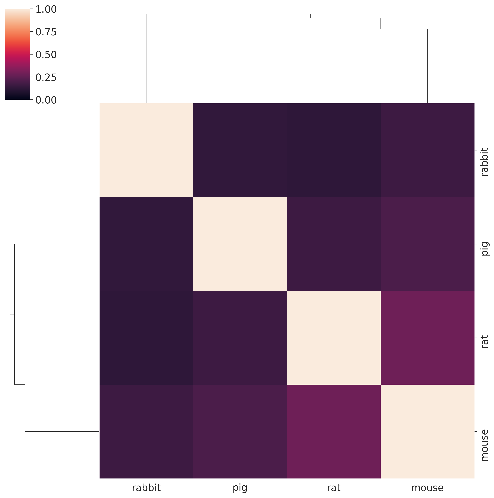
    


```python
jaccard_list = []

for idx, cell_i in enumerate(all_cts):
    CD4T = adata[adata.obs["species"] ==cell_i]
    sc.tl.rank_genes_groups(CD4T, groupby="condition", method="wilcoxon")
    diff_genes_i = CD4T.uns["rank_genes_groups"]["names"]["LPS6"][:100]
    for jdx, cell_j in enumerate(all_cts):
        print(cell_i, cell_j)
        CD4T = adata[adata.obs["species"] ==cell_j]
        sc.tl.rank_genes_groups(CD4T, groupby="condition", method="wilcoxon")
        diff_genes_j = CD4T.uns["rank_genes_groups"]["names"]["LPS6"][:100]
        
        sim = jaccard_similarity(diff_genes_i, diff_genes_j)
        jaccard_list.append([cell_i, cell_j, sim])
        
```

    rabbit rabbit
    rabbit pig
    rabbit rat
    rabbit mouse
    pig rabbit
    pig pig
    pig rat
    pig mouse
    rat rabbit
    rat pig
    rat rat
    rat mouse
    mouse rabbit
    mouse pig
    mouse rat
    mouse mouse


```python
jaccard_df_narrow = pd.DataFrame(jaccard_list, columns = ["Cell Type", "Cell B", "Jaccard Similarity"])
```


```python
filt_df = jaccard_df_narrow[jaccard_df_narrow["Jaccard Similarity"] != 1]
```


```python
sns.barplot(x = "Cell Type", y = "Jaccard Similarity", data = filt_df)
plt.xticks(rotation = 90)
plt.xlabel("Species")
```


    Text(0.5, 0, 'Species')


    
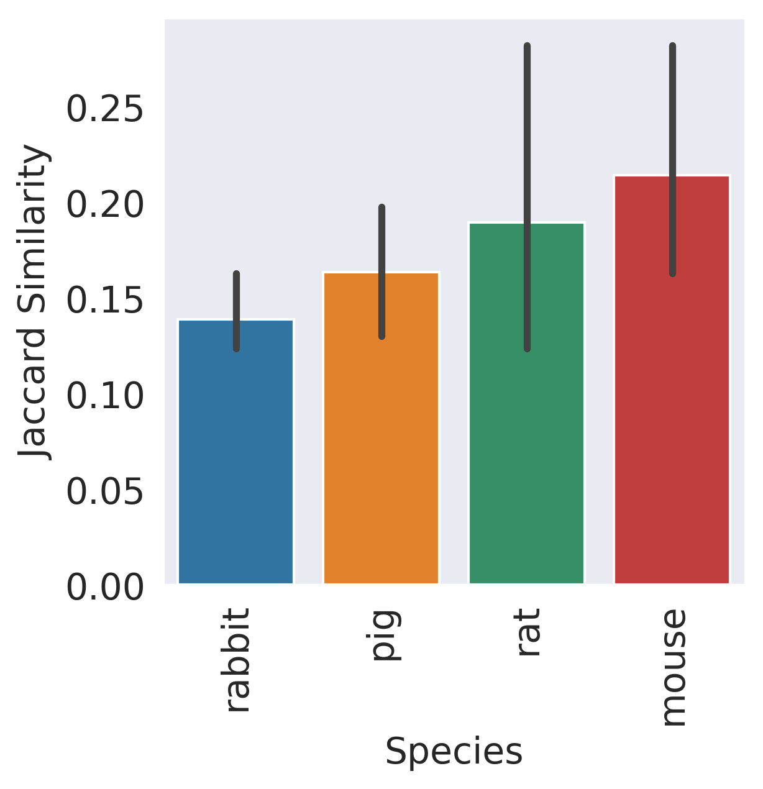
    


```python

```


```python
#UMAP Projection of latent space
latent_X = vae.get_latent_representation(adata)
latent_adata = sc.AnnData(X=latent_X, obs=adata.obs.copy())
```

    INFO     Input adata not setup with scvi. attempting to transfer anndata setup                                     
    INFO     Using data from adata.X                                                                                   
    INFO     Computing library size prior per batch                                                                    
    INFO     Registered keys:['X', 'batch_indices', 'local_l_mean', 'local_l_var', 'labels']                           
    INFO     Successfully registered anndata object containing 62114 cells, 6619 vars, 2 batches, 4 labels, and 0      
             proteins. Also registered 0 extra categorical covariates and 0 extra continuous covariates.               


```python
sc.pp.neighbors(latent_adata)
sc.tl.umap(latent_adata)
```

    WARNING: You’re trying to run this on 100 dimensions of `.X`, if you really want this, set `use_rep='X'`.
             Falling back to preprocessing with `sc.pp.pca` and default params.


```python
latent_adata.obs["Training Split"] =  ["Test" if ((i == "rat") & (j == "LPS6")) else "Train" for i, j in zip(latent_adata.obs["species"], latent_adata.obs["condition"])]
```


```python
ax = sc.pl.umap(
    latent_adata,
    color = ["species"],
    wspace = 0.45,
    title = "Species"
)
```


    
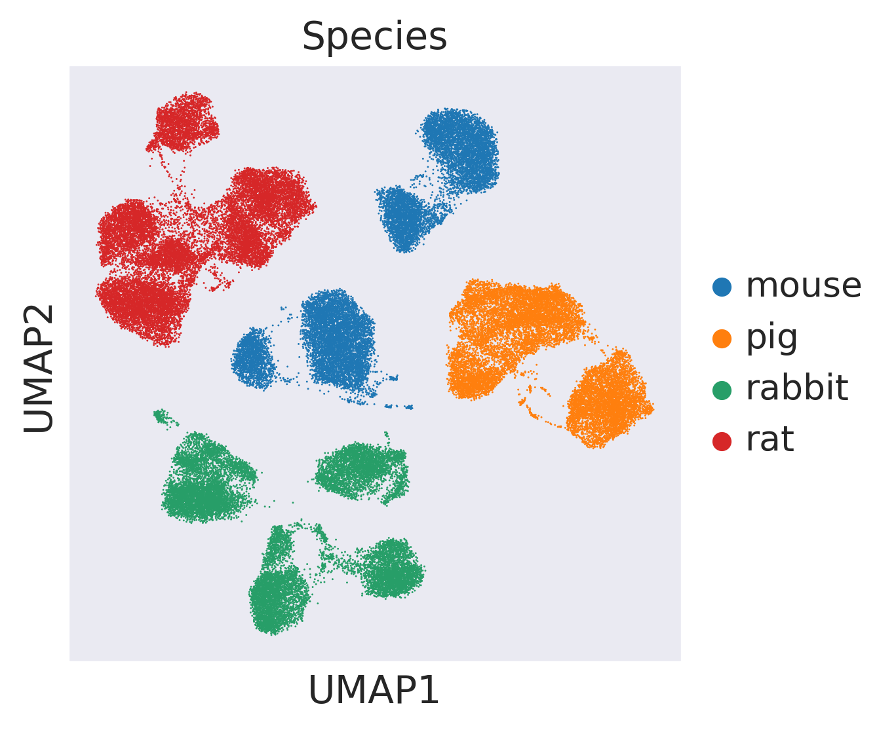
    


```python
ax = sc.pl.umap(
    latent_adata,
    color = ["condition"],
    wspace = 0.45,
    title = "Condition"
)
```


    
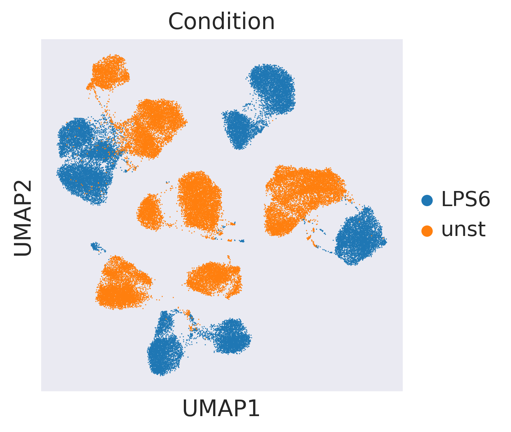
    


```python
ax = sc.pl.umap(
    latent_adata,
    color = ["Training Split"],
    palette = "Dark2",
    wspace = 0.45
)
```


    
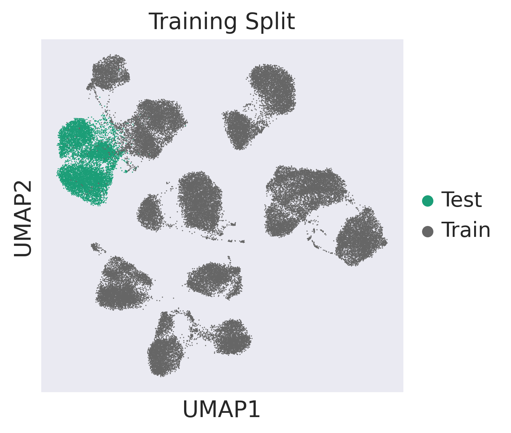
    


```python
ctrl_key = "unst"
treat_key = "LPS6"
cell_type_to_predict = "rat"
```


```python
cell_type_key = vae.scvi_setup_dict_["categorical_mappings"]["_scvi_labels"][
    "original_key"
]
treatment_key = vae.scvi_setup_dict_["categorical_mappings"]["_scvi_batch"][
    "original_key"
]
```


```python
vae.adata.obs["species_condition"] = adata.obs.species.astype(str) + adata.obs.condition.astype(str)
```


```python
adata_bal = random_sample(vae.adata, "species_condition", "min")
adata_bal_ctrl = adata_bal[(adata_bal.obs[cell_type_key] == cell_type_to_predict) & (adata_bal.obs[treatment_key] == ctrl_key)]
latent_bal =  vae.get_latent_representation(adata_bal)
latent_bal_adata = sc.AnnData(X=latent_bal, obs = adata_bal.obs.copy())
latent_cd = latent_bal_adata[(latent_bal_adata.obs[cell_type_key] == cell_type_to_predict) & (latent_bal_adata.obs[treatment_key] == ctrl_key)].X
```


```python
#Get deltas and control centroids for each cell tpye in the training dataset
deltas = []
latent_centroids = []
cell_types = np.unique(latent_adata.obs[cell_type_key])
for cell_i in cell_types:
    if cell_i != cell_type_to_predict:
        latent_ctrl = latent_bal_adata[(latent_bal_adata.obs[cell_type_key] == cell_i) & (latent_bal_adata.obs[treatment_key] == ctrl_key)].X
        latent_treat = latent_bal_adata[(latent_bal_adata.obs[cell_type_key] == cell_i) & (latent_bal_adata.obs[treatment_key] == treat_key)].X
        deltas_i = np.average(latent_treat, axis = 0) - np.average(latent_ctrl, axis = 0)
        deltas.append(deltas_i)
        latent_centroids.append(np.average(latent_ctrl, axis = 0))
lr = LinearRegression()
reg = lr.fit(latent_centroids, deltas)
scvidr_delta = reg.predict([np.average(latent_cd, axis = 0)])[0]
```

### scVIDR Rat Results


```python
treat_pred = scvidr_delta + latent_cd
predicted_cells = vae.module.generative(torch.Tensor(treat_pred))["px"].cpu().detach().numpy()
pred = sc.AnnData(X=predicted_cells , obs=adata_bal_ctrl.obs.copy(), var=adata_bal_ctrl.var.copy(),obsm=adata_bal_ctrl.obsm.copy(),)
pred.obs["condition"] = 'pred'
ctrl_adata = adata[((adata.obs['species'] == cell) & (adata.obs["condition"] == "unst"))]
treat_adata = adata[((adata.obs['species'] == cell) & (adata.obs["condition"] == "LPS6"))]
eval_adata2 = ctrl_adata.concatenate(treat_adata, pred)
treatments = []
for i in eval_adata2.obs["condition"]:
    if i == 'unst':
        treatments.append("Control")
    elif i == "LPS6":
        treatments.append("LPS6")
    else:
        treatments.append("scVIDR")
eval_adata2.obs["Treatment"] = treatments
sc.tl.pca(eval_adata2)
sc.pl.pca(eval_adata2, color = "Treatment", frameon = True, title = "", save = "SF8B1.svg")
CD4T = adata[adata.obs["species"] ==cell]
sc.tl.rank_genes_groups(CD4T, groupby="condition", method="wilcoxon")
diff_genes = CD4T.uns["rank_genes_groups"]["names"]["LPS6"]
r2_value = vae.reg_mean_plot(
eval_adata2,
axis_keys={"x": "pred", "y": "LPS6"},
gene_list=diff_genes[:10],
top_100_genes = diff_genes[:100],
labels={"x": "Predicted Expression", "y": "Real Expression"},
path_to_save="../figures/SF8C1.svg",
show=True,
legend=False, title = "scVIDR")
```

    WARNING: saving figure to file ../figures/pcaSF8B1.svg


    
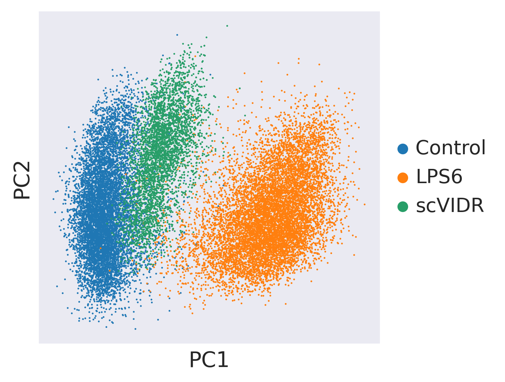
    


    
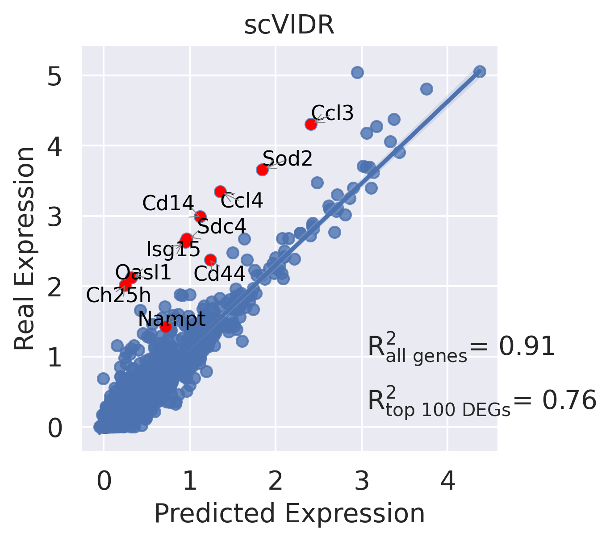
    


### scGen Cross Species Results


```python
latent_mouse_cd = latent_bal_adata[(latent_bal_adata.obs[cell_type_key] == "mouse") & (latent_bal_adata.obs[treatment_key] == ctrl_key)].X
latent_mouse_trt = latent_bal_adata[(latent_bal_adata.obs[cell_type_key] == "mouse") & (latent_bal_adata.obs[treatment_key] == treat_key)].X

scgen_treat_delta = np.average(latent_mouse_trt,axis=0) - np.average(latent_mouse_cd,axis=0)
scgen_species_delta = np.average(latent_cd,axis=0) - np.average(latent_mouse_cd,axis=0)
```


```python
treat_pred = 0.5*(scgen_species_delta + latent_mouse_trt + scgen_treat_delta + latent_cd)
predicted_cells = vae.module.generative(torch.Tensor(treat_pred))["px"].cpu().detach().numpy()
pred = sc.AnnData(X=predicted_cells , obs=adata_bal_ctrl.obs.copy(), var=adata_bal_ctrl.var.copy(),obsm=adata_bal_ctrl.obsm.copy(),)
pred.obs["condition"] = 'pred'
ctrl_adata = adata[((adata.obs['species'] == cell) & (adata.obs["condition"] == "unst"))]
treat_adata = adata[((adata.obs['species'] == cell) & (adata.obs["condition"] == "LPS6"))]
eval_adata2 = ctrl_adata.concatenate(treat_adata, pred)
treatments = []
for i in eval_adata2.obs["condition"]:
    if i == 'unst':
        treatments.append("Control")
    elif i == "LPS6":
        treatments.append("LPS6")
    else:
        treatments.append("scGen")
eval_adata2.obs["Treatment"] = treatments
sc.tl.pca(eval_adata2)
sc.pl.pca(eval_adata2, color = "Treatment", frameon = True, title = "", save = "SF8B2.svg")
CD4T = adata[adata.obs["species"] ==cell]
sc.tl.rank_genes_groups(CD4T, groupby="condition", method="wilcoxon")
diff_genes = CD4T.uns["rank_genes_groups"]["names"]["LPS6"]
r2_value = vae.reg_mean_plot(
eval_adata2,
axis_keys={"x": "pred", "y": "LPS6"},
gene_list=diff_genes[:10],
top_100_genes = diff_genes[:100],
labels={"x": "Predicted Expression", "y": "Real Expression"},
path_to_save="../figures/SF8C2.svg",
show=True,
legend=False, title = "scGen")
```

    WARNING: saving figure to file ../figures/pcaSF8B2.svg


    
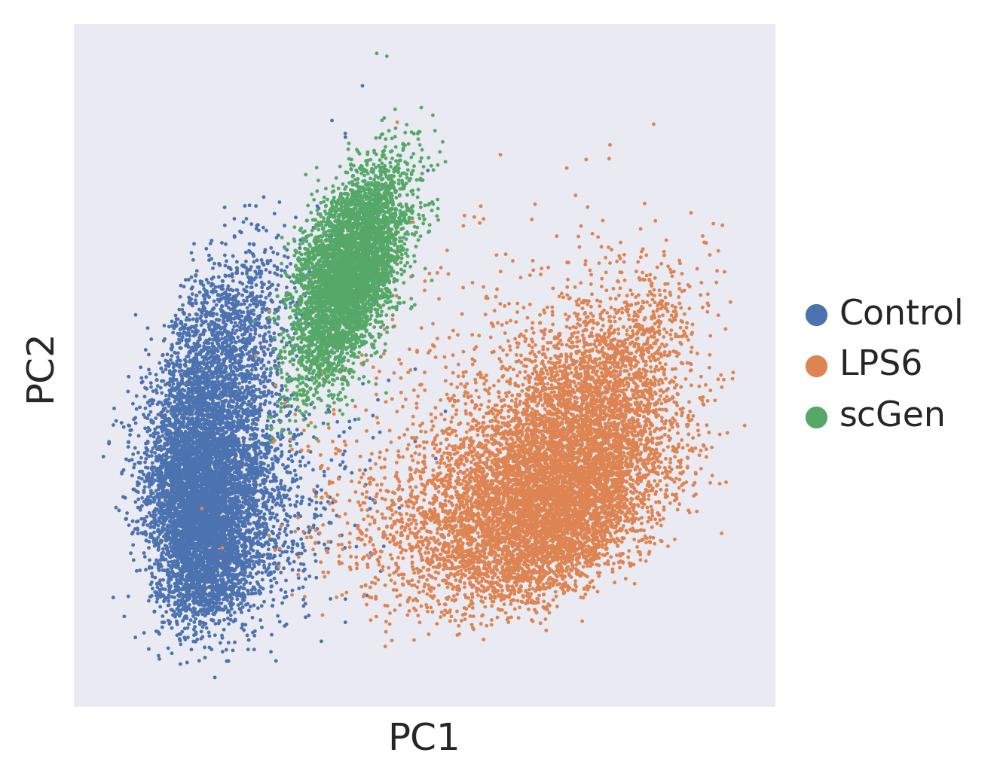
    


    
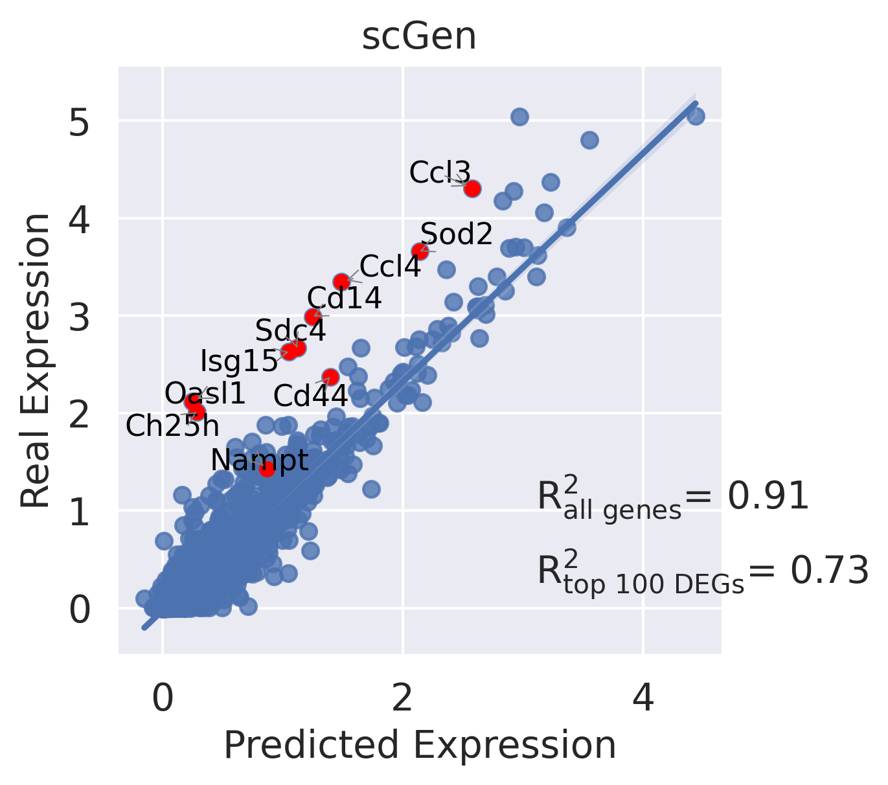
    


## scGen Results with Average Delta


```python
latent_ctrl = latent_bal_adata[(latent_bal_adata.obs[treatment_key] == ctrl_key)].X
latent_treat = latent_bal_adata[(latent_bal_adata.obs[treatment_key] == treat_key)].X
scgen_delta = np.average(latent_treat, axis = 0) - np.average(latent_ctrl, axis = 0)
```


```python
# latent_bal_adata[(latent_bal_adata.obs[treatment_key] == treat_key)].obs.species_condition.unique()
```


```python
treat_pred = scgen_delta + latent_cd
predicted_cells = vae.module.generative(torch.Tensor(treat_pred))["px"].cpu().detach().numpy()
pred = sc.AnnData(X=predicted_cells , obs=adata_bal_ctrl.obs.copy(), var=adata_bal_ctrl.var.copy(),obsm=adata_bal_ctrl.obsm.copy(),)
pred.obs["condition"] = 'pred'
ctrl_adata = adata[((adata.obs['species'] == cell) & (adata.obs["condition"] == "unst"))]
treat_adata = adata[((adata.obs['species'] == cell) & (adata.obs["condition"] == "LPS6"))]
eval_adata2 = ctrl_adata.concatenate(treat_adata, pred)
treatments = []
for i in eval_adata2.obs["condition"]:
    if i == 'unst':
        treatments.append("Control")
    elif i == "LPS6":
        treatments.append("LPS6")
    else:
        treatments.append("scGen")
eval_adata2.obs["Treatment"] = treatments
sc.tl.pca(eval_adata2)
sc.pl.pca(eval_adata2, color = "Treatment", frameon = True, title = "", save = "SF8B2.svg")
CD4T = adata[adata.obs["species"] ==cell]
sc.tl.rank_genes_groups(CD4T, groupby="condition", method="wilcoxon")
diff_genes = CD4T.uns["rank_genes_groups"]["names"]["LPS6"]
r2_value = vae.reg_mean_plot(
eval_adata2,
axis_keys={"x": "pred", "y": "LPS6"},
gene_list=diff_genes[:10],
top_100_genes = None,
labels={"x": "Predicted Expression", "y": "Real Expression"},
path_to_save="../figures/SF8C2.svg",
show=True,
legend=False, title = "scGen")
```

    WARNING: saving figure to file ../figures/pcaSF8B2.svg


    
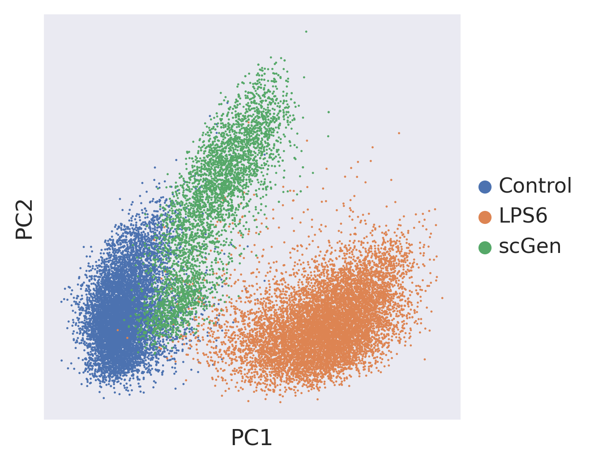
    


    
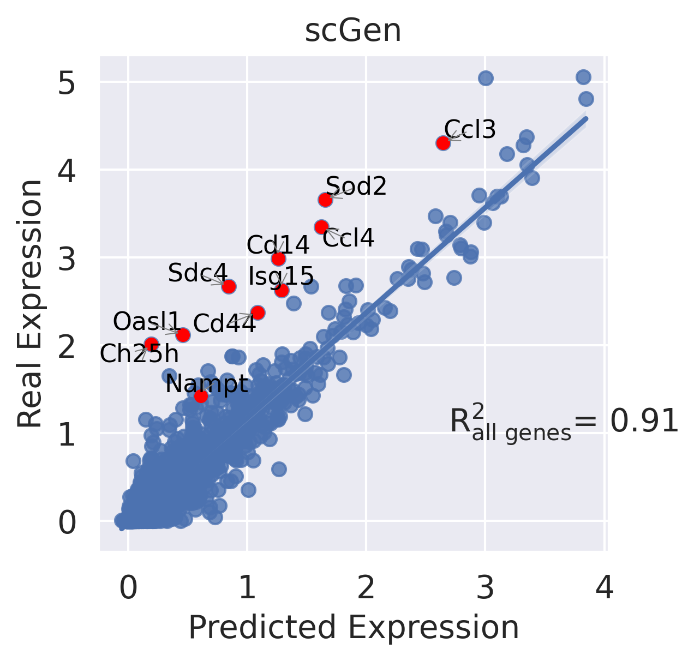
    


### scPreGAN Results


```python
from scPreGAN import *
```


```python
gan = Model(n_features=adata.X.shape[1], use_cuda=True)
train_data = gan.load_anndata(data_path="../data/train_species.h5ad",
            condition_key="condition",
            condition={"control":"unst", "case":"LPS6"},
            cell_type_key="species",
            out_of_sample_prediction = True,
            prediction_cell_type=cell
            )
```

    Random Seed:  3060
    Successfully created the model
    Successfully loaded the model


```python
# #Training scPreGan

# gan.train(train_data = train_data)

# torch.save(gan.D_A.state_dict(), "../data/gan_da_rat.pt")
# torch.save(gan.D_B.state_dict(), "../data/gan_db_rat.pt")
# torch.save(gan.G_A.state_dict(), "../data/gan_ga_rat.pt")
# torch.save(gan.G_B.state_dict(), "../data/gan_gb_rat.pt")
# torch.save(gan.E.state_dict(), "../data/gan_e_rat.pt")
```

    [100/20000] adv_loss: -0.0238  recon_loss: 0.3465 encoding_loss: 0.0103 G_loss: 0.3330 D_A_loss: -108.1751  D_B_loss: -108.4284
    [200/20000] adv_loss: -0.0382  recon_loss: 0.2965 encoding_loss: 0.0043 G_loss: 0.2626 D_A_loss: -93.5066  D_B_loss: -89.2510
    [300/20000] adv_loss: -0.0352  recon_loss: 0.2698 encoding_loss: 0.0036 G_loss: 0.2381 D_A_loss: -84.6317  D_B_loss: -83.2130
    [400/20000] adv_loss: -0.0327  recon_loss: 0.2668 encoding_loss: 0.0025 G_loss: 0.2366 D_A_loss: -78.1662  D_B_loss: -74.5129
    [500/20000] adv_loss: -0.0302  recon_loss: 0.2525 encoding_loss: 0.0019 G_loss: 0.2242 D_A_loss: -73.4822  D_B_loss: -70.3501
    [600/20000] adv_loss: -0.0206  recon_loss: 0.2416 encoding_loss: 0.0022 G_loss: 0.2232 D_A_loss: -69.2881  D_B_loss: -64.7405
    [700/20000] adv_loss: -0.0243  recon_loss: 0.2421 encoding_loss: 0.0021 G_loss: 0.2200 D_A_loss: -63.4964  D_B_loss: -60.3896
    [800/20000] adv_loss: -0.0142  recon_loss: 0.2307 encoding_loss: 0.0016 G_loss: 0.2180 D_A_loss: -58.9558  D_B_loss: -55.5171
    [900/20000] adv_loss: -0.0167  recon_loss: 0.2193 encoding_loss: 0.0016 G_loss: 0.2042 D_A_loss: -53.7842  D_B_loss: -51.2267
    [1000/20000] adv_loss: -0.0172  recon_loss: 0.2086 encoding_loss: 0.0015 G_loss: 0.1929 D_A_loss: -49.7916  D_B_loss: -47.0637
    [1100/20000] adv_loss: -0.0074  recon_loss: 0.2126 encoding_loss: 0.0022 G_loss: 0.2073 D_A_loss: -48.4547  D_B_loss: -43.4780
    [1200/20000] adv_loss: -0.0105  recon_loss: 0.2044 encoding_loss: 0.0017 G_loss: 0.1956 D_A_loss: -44.4699  D_B_loss: -41.5969
    [1300/20000] adv_loss: -0.0097  recon_loss: 0.1957 encoding_loss: 0.0014 G_loss: 0.1873 D_A_loss: -42.3269  D_B_loss: -37.2285
    [1400/20000] adv_loss: 0.0031  recon_loss: 0.2031 encoding_loss: 0.0048 G_loss: 0.2109 D_A_loss: -39.1141  D_B_loss: -36.2893
    [1500/20000] adv_loss: -0.0001  recon_loss: 0.1947 encoding_loss: 0.0015 G_loss: 0.1960 D_A_loss: -36.5831  D_B_loss: -32.9490
    [1600/20000] adv_loss: 0.0046  recon_loss: 0.1814 encoding_loss: 0.0026 G_loss: 0.1887 D_A_loss: -33.1014  D_B_loss: -31.7685
    [1700/20000] adv_loss: 0.0033  recon_loss: 0.1914 encoding_loss: 0.0017 G_loss: 0.1964 D_A_loss: -30.6015  D_B_loss: -29.7046
    [1800/20000] adv_loss: 0.0028  recon_loss: 0.1838 encoding_loss: 0.0016 G_loss: 0.1882 D_A_loss: -27.2895  D_B_loss: -27.7060
    [1900/20000] adv_loss: 0.0073  recon_loss: 0.1853 encoding_loss: 0.0012 G_loss: 0.1938 D_A_loss: -25.7496  D_B_loss: -27.4963
    [2000/20000] adv_loss: 0.0120  recon_loss: 0.1801 encoding_loss: 0.0017 G_loss: 0.1938 D_A_loss: -23.0978  D_B_loss: -25.4080
    [2100/20000] adv_loss: 0.0227  recon_loss: 0.1789 encoding_loss: 0.0014 G_loss: 0.2030 D_A_loss: -23.0014  D_B_loss: -24.6750
    [2200/20000] adv_loss: 0.0122  recon_loss: 0.1785 encoding_loss: 0.0015 G_loss: 0.1923 D_A_loss: -18.0069  D_B_loss: -24.2036
    [2300/20000] adv_loss: 0.0081  recon_loss: 0.1817 encoding_loss: 0.0012 G_loss: 0.1910 D_A_loss: -16.8236  D_B_loss: -21.8153
    [2400/20000] adv_loss: 0.0068  recon_loss: 0.1802 encoding_loss: 0.0016 G_loss: 0.1886 D_A_loss: -15.7430  D_B_loss: -22.1690
    [2500/20000] adv_loss: 0.0139  recon_loss: 0.1768 encoding_loss: 0.0013 G_loss: 0.1921 D_A_loss: -14.6871  D_B_loss: -21.7059
    [2600/20000] adv_loss: 0.0213  recon_loss: 0.1827 encoding_loss: 0.0016 G_loss: 0.2056 D_A_loss: -14.1933  D_B_loss: -21.2217
    [2700/20000] adv_loss: 0.0211  recon_loss: 0.1820 encoding_loss: 0.0019 G_loss: 0.2051 D_A_loss: -13.6804  D_B_loss: -20.8790
    [2800/20000] adv_loss: 0.0216  recon_loss: 0.1780 encoding_loss: 0.0014 G_loss: 0.2010 D_A_loss: -12.3563  D_B_loss: -19.8406
    [2900/20000] adv_loss: 0.0245  recon_loss: 0.1719 encoding_loss: 0.0020 G_loss: 0.1983 D_A_loss: -13.1034  D_B_loss: -21.5601
    [3000/20000] adv_loss: 0.0248  recon_loss: 0.1689 encoding_loss: 0.0021 G_loss: 0.1958 D_A_loss: -12.4081  D_B_loss: -19.2791
    [3100/20000] adv_loss: 0.0251  recon_loss: 0.1713 encoding_loss: 0.0019 G_loss: 0.1983 D_A_loss: -11.9336  D_B_loss: -19.8580
    [3200/20000] adv_loss: 0.0359  recon_loss: 0.1696 encoding_loss: 0.0020 G_loss: 0.2075 D_A_loss: -13.0851  D_B_loss: -19.3289
    [3300/20000] adv_loss: 0.0331  recon_loss: 0.1698 encoding_loss: 0.0015 G_loss: 0.2044 D_A_loss: -11.5174  D_B_loss: -20.3864
    [3400/20000] adv_loss: 0.0299  recon_loss: 0.1761 encoding_loss: 0.0021 G_loss: 0.2082 D_A_loss: -12.2965  D_B_loss: -19.8114
    [3500/20000] adv_loss: 0.0365  recon_loss: 0.1668 encoding_loss: 0.0020 G_loss: 0.2054 D_A_loss: -12.1880  D_B_loss: -20.8127
    [3600/20000] adv_loss: 0.0446  recon_loss: 0.1778 encoding_loss: 0.0018 G_loss: 0.2241 D_A_loss: -12.9537  D_B_loss: -20.7383
    [3700/20000] adv_loss: 0.0391  recon_loss: 0.1748 encoding_loss: 0.0018 G_loss: 0.2158 D_A_loss: -12.7856  D_B_loss: -20.0384
    [3800/20000] adv_loss: 0.0394  recon_loss: 0.1797 encoding_loss: 0.0027 G_loss: 0.2217 D_A_loss: -11.5444  D_B_loss: -20.3644
    [3900/20000] adv_loss: 0.0469  recon_loss: 0.1769 encoding_loss: 0.0020 G_loss: 0.2258 D_A_loss: -12.6670  D_B_loss: -21.0934
    [4000/20000] adv_loss: 0.0413  recon_loss: 0.1684 encoding_loss: 0.0015 G_loss: 0.2113 D_A_loss: -12.4237  D_B_loss: -21.4957
    [4100/20000] adv_loss: 0.0453  recon_loss: 0.1784 encoding_loss: 0.0015 G_loss: 0.2252 D_A_loss: -12.1669  D_B_loss: -20.0435
    [4200/20000] adv_loss: 0.0486  recon_loss: 0.1909 encoding_loss: 0.0017 G_loss: 0.2412 D_A_loss: -12.8943  D_B_loss: -21.8133
    [4300/20000] adv_loss: 0.0462  recon_loss: 0.1792 encoding_loss: 0.0024 G_loss: 0.2277 D_A_loss: -12.5277  D_B_loss: -21.3984
    [4400/20000] adv_loss: 0.0529  recon_loss: 0.1695 encoding_loss: 0.0018 G_loss: 0.2242 D_A_loss: -13.2052  D_B_loss: -21.8325
    [4500/20000] adv_loss: 0.0513  recon_loss: 0.1768 encoding_loss: 0.0018 G_loss: 0.2299 D_A_loss: -12.3329  D_B_loss: -21.5632
    [4600/20000] adv_loss: 0.0536  recon_loss: 0.1710 encoding_loss: 0.0020 G_loss: 0.2266 D_A_loss: -13.0512  D_B_loss: -21.6949
    [4700/20000] adv_loss: 0.0534  recon_loss: 0.1695 encoding_loss: 0.0017 G_loss: 0.2246 D_A_loss: -12.6687  D_B_loss: -21.5501
    [4800/20000] adv_loss: 0.0521  recon_loss: 0.1724 encoding_loss: 0.0019 G_loss: 0.2264 D_A_loss: -12.5512  D_B_loss: -21.9120
    [4900/20000] adv_loss: 0.0558  recon_loss: 0.2056 encoding_loss: 0.0019 G_loss: 0.2634 D_A_loss: -12.3539  D_B_loss: -21.5966
    [5000/20000] adv_loss: 0.0538  recon_loss: 0.1806 encoding_loss: 0.0018 G_loss: 0.2363 D_A_loss: -11.7618  D_B_loss: -20.3047
    [5100/20000] adv_loss: 0.0556  recon_loss: 0.1780 encoding_loss: 0.0019 G_loss: 0.2355 D_A_loss: -11.9076  D_B_loss: -22.2701
    [5200/20000] adv_loss: 0.0541  recon_loss: 0.1715 encoding_loss: 0.0023 G_loss: 0.2279 D_A_loss: -12.6001  D_B_loss: -22.1283
    [5300/20000] adv_loss: 0.0590  recon_loss: 0.1835 encoding_loss: 0.0026 G_loss: 0.2451 D_A_loss: -12.3211  D_B_loss: -21.4763
    [5400/20000] adv_loss: 0.0584  recon_loss: 0.1840 encoding_loss: 0.0017 G_loss: 0.2440 D_A_loss: -12.1296  D_B_loss: -22.1303
    [5500/20000] adv_loss: 0.0568  recon_loss: 0.1682 encoding_loss: 0.0014 G_loss: 0.2264 D_A_loss: -11.9058  D_B_loss: -21.7852
    [5600/20000] adv_loss: 0.0578  recon_loss: 0.1708 encoding_loss: 0.0017 G_loss: 0.2302 D_A_loss: -12.2129  D_B_loss: -21.5865
    [5700/20000] adv_loss: 0.0532  recon_loss: 0.1652 encoding_loss: 0.0017 G_loss: 0.2201 D_A_loss: -11.8861  D_B_loss: -21.3832
    [5800/20000] adv_loss: 0.0592  recon_loss: 0.1800 encoding_loss: 0.0015 G_loss: 0.2407 D_A_loss: -11.8592  D_B_loss: -22.5028
    [5900/20000] adv_loss: 0.0611  recon_loss: 0.1724 encoding_loss: 0.0018 G_loss: 0.2353 D_A_loss: -12.1742  D_B_loss: -21.7796
    [6000/20000] adv_loss: 0.0581  recon_loss: 0.1852 encoding_loss: 0.0015 G_loss: 0.2447 D_A_loss: -12.2476  D_B_loss: -20.6969
    [6100/20000] adv_loss: 0.0574  recon_loss: 0.1685 encoding_loss: 0.0015 G_loss: 0.2274 D_A_loss: -11.6020  D_B_loss: -21.1404
    [6200/20000] adv_loss: 0.0557  recon_loss: 0.1648 encoding_loss: 0.0013 G_loss: 0.2218 D_A_loss: -11.5391  D_B_loss: -21.7059
    [6300/20000] adv_loss: 0.0552  recon_loss: 0.1747 encoding_loss: 0.0022 G_loss: 0.2321 D_A_loss: -12.2373  D_B_loss: -22.0071
    [6400/20000] adv_loss: 0.0548  recon_loss: 0.1797 encoding_loss: 0.0019 G_loss: 0.2364 D_A_loss: -12.1547  D_B_loss: -20.7848
    [6500/20000] adv_loss: 0.0532  recon_loss: 0.1607 encoding_loss: 0.0019 G_loss: 0.2158 D_A_loss: -12.1215  D_B_loss: -21.3225
    [6600/20000] adv_loss: 0.0538  recon_loss: 0.1740 encoding_loss: 0.0016 G_loss: 0.2294 D_A_loss: -12.9073  D_B_loss: -22.5973
    [6700/20000] adv_loss: 0.0535  recon_loss: 0.1682 encoding_loss: 0.0012 G_loss: 0.2229 D_A_loss: -11.5948  D_B_loss: -22.3586
    [6800/20000] adv_loss: 0.0605  recon_loss: 0.1753 encoding_loss: 0.0012 G_loss: 0.2370 D_A_loss: -11.5107  D_B_loss: -21.3939
    [6900/20000] adv_loss: 0.0495  recon_loss: 0.1642 encoding_loss: 0.0016 G_loss: 0.2153 D_A_loss: -11.3190  D_B_loss: -21.5034
    [7000/20000] adv_loss: 0.0492  recon_loss: 0.1729 encoding_loss: 0.0015 G_loss: 0.2236 D_A_loss: -10.7056  D_B_loss: -21.3990
    [7100/20000] adv_loss: 0.0513  recon_loss: 0.1684 encoding_loss: 0.0015 G_loss: 0.2212 D_A_loss: -11.9519  D_B_loss: -21.0379
    [7200/20000] adv_loss: 0.0475  recon_loss: 0.1684 encoding_loss: 0.0013 G_loss: 0.2172 D_A_loss: -11.7898  D_B_loss: -19.9595
    [7300/20000] adv_loss: 0.0474  recon_loss: 0.1623 encoding_loss: 0.0016 G_loss: 0.2113 D_A_loss: -11.8793  D_B_loss: -20.9907
    [7400/20000] adv_loss: 0.0469  recon_loss: 0.1792 encoding_loss: 0.0013 G_loss: 0.2273 D_A_loss: -11.8935  D_B_loss: -20.1690
    [7500/20000] adv_loss: 0.0465  recon_loss: 0.1730 encoding_loss: 0.0015 G_loss: 0.2210 D_A_loss: -12.2184  D_B_loss: -21.4691
    [7600/20000] adv_loss: 0.0469  recon_loss: 0.1640 encoding_loss: 0.0014 G_loss: 0.2123 D_A_loss: -11.1894  D_B_loss: -20.3001
    [7700/20000] adv_loss: 0.0463  recon_loss: 0.1691 encoding_loss: 0.0015 G_loss: 0.2169 D_A_loss: -11.3900  D_B_loss: -21.5486
    [7800/20000] adv_loss: 0.0454  recon_loss: 0.1744 encoding_loss: 0.0016 G_loss: 0.2215 D_A_loss: -11.6896  D_B_loss: -20.6187
    [7900/20000] adv_loss: 0.0460  recon_loss: 0.1786 encoding_loss: 0.0017 G_loss: 0.2263 D_A_loss: -11.4558  D_B_loss: -20.7117
    [8000/20000] adv_loss: 0.0413  recon_loss: 0.1665 encoding_loss: 0.0020 G_loss: 0.2098 D_A_loss: -11.4162  D_B_loss: -19.7117
    [8100/20000] adv_loss: 0.0420  recon_loss: 0.1609 encoding_loss: 0.0016 G_loss: 0.2046 D_A_loss: -11.7241  D_B_loss: -20.1521
    [8200/20000] adv_loss: 0.0450  recon_loss: 0.1668 encoding_loss: 0.0020 G_loss: 0.2138 D_A_loss: -11.6045  D_B_loss: -20.1455
    [8300/20000] adv_loss: 0.0402  recon_loss: 0.1731 encoding_loss: 0.0015 G_loss: 0.2149 D_A_loss: -11.4212  D_B_loss: -19.9849
    [8400/20000] adv_loss: 0.0406  recon_loss: 0.1678 encoding_loss: 0.0014 G_loss: 0.2098 D_A_loss: -11.7868  D_B_loss: -19.8300
    [8500/20000] adv_loss: 0.0405  recon_loss: 0.1648 encoding_loss: 0.0020 G_loss: 0.2073 D_A_loss: -10.8320  D_B_loss: -19.2213
    [8600/20000] adv_loss: 0.0402  recon_loss: 0.1709 encoding_loss: 0.0019 G_loss: 0.2130 D_A_loss: -11.3348  D_B_loss: -20.3355
    [8700/20000] adv_loss: 0.0410  recon_loss: 0.1671 encoding_loss: 0.0015 G_loss: 0.2096 D_A_loss: -11.6441  D_B_loss: -19.3199
    [8800/20000] adv_loss: 0.0379  recon_loss: 0.1740 encoding_loss: 0.0021 G_loss: 0.2140 D_A_loss: -11.8881  D_B_loss: -19.6553
    [8900/20000] adv_loss: 0.0432  recon_loss: 0.1773 encoding_loss: 0.0018 G_loss: 0.2223 D_A_loss: -12.2151  D_B_loss: -21.6869
    [9000/20000] adv_loss: 0.0394  recon_loss: 0.1639 encoding_loss: 0.0020 G_loss: 0.2052 D_A_loss: -11.4922  D_B_loss: -19.5311
    [9100/20000] adv_loss: 0.0391  recon_loss: 0.1754 encoding_loss: 0.0025 G_loss: 0.2170 D_A_loss: -11.4344  D_B_loss: -20.0152
    [9200/20000] adv_loss: 0.0395  recon_loss: 0.1729 encoding_loss: 0.0026 G_loss: 0.2150 D_A_loss: -10.6682  D_B_loss: -20.2429
    [9300/20000] adv_loss: 0.0366  recon_loss: 0.1664 encoding_loss: 0.0021 G_loss: 0.2050 D_A_loss: -11.9154  D_B_loss: -20.4456
    [9400/20000] adv_loss: 0.0358  recon_loss: 0.1666 encoding_loss: 0.0018 G_loss: 0.2042 D_A_loss: -11.9083  D_B_loss: -20.3259
    [9500/20000] adv_loss: 0.0375  recon_loss: 0.1801 encoding_loss: 0.0031 G_loss: 0.2208 D_A_loss: -11.4016  D_B_loss: -19.6480
    [9600/20000] adv_loss: 0.0350  recon_loss: 0.1813 encoding_loss: 0.0021 G_loss: 0.2184 D_A_loss: -12.2340  D_B_loss: -20.0809
    [9700/20000] adv_loss: 0.0327  recon_loss: 0.1709 encoding_loss: 0.0024 G_loss: 0.2059 D_A_loss: -11.8934  D_B_loss: -20.2570
    [9800/20000] adv_loss: 0.0357  recon_loss: 0.1629 encoding_loss: 0.0023 G_loss: 0.2008 D_A_loss: -11.5790  D_B_loss: -20.6521
    [9900/20000] adv_loss: 0.0321  recon_loss: 0.1661 encoding_loss: 0.0022 G_loss: 0.2004 D_A_loss: -11.4205  D_B_loss: -19.7638
    [10000/20000] adv_loss: 0.0350  recon_loss: 0.1704 encoding_loss: 0.0018 G_loss: 0.2073 D_A_loss: -11.7917  D_B_loss: -21.1067
    [10100/20000] adv_loss: 0.0359  recon_loss: 0.1638 encoding_loss: 0.0021 G_loss: 0.2018 D_A_loss: -12.3479  D_B_loss: -19.1138
    [10200/20000] adv_loss: 0.0339  recon_loss: 0.1625 encoding_loss: 0.0019 G_loss: 0.1983 D_A_loss: -10.9133  D_B_loss: -19.8377
    [10300/20000] adv_loss: 0.0325  recon_loss: 0.1817 encoding_loss: 0.0019 G_loss: 0.2161 D_A_loss: -11.8474  D_B_loss: -20.7530
    [10400/20000] adv_loss: 0.0302  recon_loss: 0.1761 encoding_loss: 0.0021 G_loss: 0.2084 D_A_loss: -11.3460  D_B_loss: -19.3849
    [10500/20000] adv_loss: 0.0342  recon_loss: 0.1656 encoding_loss: 0.0023 G_loss: 0.2021 D_A_loss: -11.1505  D_B_loss: -19.6499
    [10600/20000] adv_loss: 0.0315  recon_loss: 0.1692 encoding_loss: 0.0023 G_loss: 0.2030 D_A_loss: -11.6456  D_B_loss: -20.1447
    [10700/20000] adv_loss: 0.0312  recon_loss: 0.1770 encoding_loss: 0.0036 G_loss: 0.2118 D_A_loss: -15.2892  D_B_loss: -22.5845
    [10800/20000] adv_loss: 0.0275  recon_loss: 0.1752 encoding_loss: 0.0032 G_loss: 0.2059 D_A_loss: -11.3593  D_B_loss: -20.9051
    [10900/20000] adv_loss: 0.0265  recon_loss: 0.1718 encoding_loss: 0.0018 G_loss: 0.2001 D_A_loss: -12.7211  D_B_loss: -21.2403
    [11000/20000] adv_loss: 0.0271  recon_loss: 0.1670 encoding_loss: 0.0024 G_loss: 0.1964 D_A_loss: -10.9926  D_B_loss: -21.7853
    [11100/20000] adv_loss: 0.0284  recon_loss: 0.1738 encoding_loss: 0.0030 G_loss: 0.2052 D_A_loss: -13.0072  D_B_loss: -21.4462
    [11200/20000] adv_loss: 0.0281  recon_loss: 0.1744 encoding_loss: 0.0024 G_loss: 0.2049 D_A_loss: -12.0438  D_B_loss: -20.5864
    [11300/20000] adv_loss: 0.0257  recon_loss: 0.1662 encoding_loss: 0.0023 G_loss: 0.1942 D_A_loss: -11.5773  D_B_loss: -20.2980
    [11400/20000] adv_loss: 0.0287  recon_loss: 0.1738 encoding_loss: 0.0030 G_loss: 0.2055 D_A_loss: -13.6893  D_B_loss: -21.6739
    [11500/20000] adv_loss: 0.0264  recon_loss: 0.1684 encoding_loss: 0.0028 G_loss: 0.1976 D_A_loss: -12.7059  D_B_loss: -21.7263
    [11600/20000] adv_loss: 0.0261  recon_loss: 0.1630 encoding_loss: 0.0041 G_loss: 0.1932 D_A_loss: -11.7351  D_B_loss: -21.6808
    [11700/20000] adv_loss: 0.0266  recon_loss: 0.1662 encoding_loss: 0.0036 G_loss: 0.1965 D_A_loss: -12.3227  D_B_loss: -21.3576
    [11800/20000] adv_loss: 0.0240  recon_loss: 0.1752 encoding_loss: 0.0025 G_loss: 0.2016 D_A_loss: -11.8245  D_B_loss: -22.1777
    [11900/20000] adv_loss: 0.0250  recon_loss: 0.1670 encoding_loss: 0.0023 G_loss: 0.1942 D_A_loss: -12.7580  D_B_loss: -20.9058
    [12000/20000] adv_loss: 0.0266  recon_loss: 0.1716 encoding_loss: 0.0028 G_loss: 0.2010 D_A_loss: -11.5222  D_B_loss: -20.8387
    [12100/20000] adv_loss: 0.0239  recon_loss: 0.1673 encoding_loss: 0.0024 G_loss: 0.1935 D_A_loss: -12.5051  D_B_loss: -21.4505
    [12200/20000] adv_loss: 0.0235  recon_loss: 0.1609 encoding_loss: 0.0027 G_loss: 0.1870 D_A_loss: -11.5762  D_B_loss: -21.5789
    [12300/20000] adv_loss: 0.0317  recon_loss: 0.1892 encoding_loss: 0.0040 G_loss: 0.2250 D_A_loss: -13.7001  D_B_loss: -22.7667
    [12400/20000] adv_loss: 0.0259  recon_loss: 0.1778 encoding_loss: 0.0030 G_loss: 0.2067 D_A_loss: -12.8568  D_B_loss: -23.1269
    [12500/20000] adv_loss: 0.0262  recon_loss: 0.1816 encoding_loss: 0.0024 G_loss: 0.2102 D_A_loss: -13.0925  D_B_loss: -20.8266
    [12600/20000] adv_loss: 0.0223  recon_loss: 0.1750 encoding_loss: 0.0024 G_loss: 0.1998 D_A_loss: -13.2685  D_B_loss: -20.7516
    [12700/20000] adv_loss: 0.0238  recon_loss: 0.1651 encoding_loss: 0.0025 G_loss: 0.1915 D_A_loss: -11.7419  D_B_loss: -21.9982
    [12800/20000] adv_loss: 0.0282  recon_loss: 0.1745 encoding_loss: 0.0026 G_loss: 0.2052 D_A_loss: -13.2552  D_B_loss: -22.2194
    [12900/20000] adv_loss: 0.0255  recon_loss: 0.1773 encoding_loss: 0.0038 G_loss: 0.2066 D_A_loss: -13.7069  D_B_loss: -21.7949
    [13000/20000] adv_loss: 0.0272  recon_loss: 0.1736 encoding_loss: 0.0023 G_loss: 0.2031 D_A_loss: -13.0551  D_B_loss: -21.0294
    [13100/20000] adv_loss: 0.0239  recon_loss: 0.1691 encoding_loss: 0.0024 G_loss: 0.1954 D_A_loss: -11.4410  D_B_loss: -21.5614
    [13200/20000] adv_loss: 0.0240  recon_loss: 0.1765 encoding_loss: 0.0018 G_loss: 0.2023 D_A_loss: -11.4681  D_B_loss: -21.7203
    [13300/20000] adv_loss: 0.0243  recon_loss: 0.1790 encoding_loss: 0.0019 G_loss: 0.2052 D_A_loss: -11.7007  D_B_loss: -20.7988
    [13400/20000] adv_loss: 0.0255  recon_loss: 0.1660 encoding_loss: 0.0023 G_loss: 0.1938 D_A_loss: -11.6956  D_B_loss: -20.8346
    [13500/20000] adv_loss: 0.0250  recon_loss: 0.1715 encoding_loss: 0.0026 G_loss: 0.1991 D_A_loss: -12.8404  D_B_loss: -22.1297
    [13600/20000] adv_loss: 0.0255  recon_loss: 0.1718 encoding_loss: 0.0028 G_loss: 0.2001 D_A_loss: -10.6984  D_B_loss: -21.0549
    [13700/20000] adv_loss: 0.0253  recon_loss: 0.1679 encoding_loss: 0.0022 G_loss: 0.1955 D_A_loss: -11.5727  D_B_loss: -21.6037
    [13800/20000] adv_loss: 0.0251  recon_loss: 0.1766 encoding_loss: 0.0022 G_loss: 0.2039 D_A_loss: -13.0105  D_B_loss: -23.8891
    [13900/20000] adv_loss: 0.0223  recon_loss: 0.1657 encoding_loss: 0.0024 G_loss: 0.1904 D_A_loss: -12.4314  D_B_loss: -22.2521
    [14000/20000] adv_loss: 0.0231  recon_loss: 0.1635 encoding_loss: 0.0023 G_loss: 0.1889 D_A_loss: -12.1050  D_B_loss: -21.1881
    [14100/20000] adv_loss: 0.0241  recon_loss: 0.1634 encoding_loss: 0.0025 G_loss: 0.1900 D_A_loss: -11.2742  D_B_loss: -20.8966
    [14200/20000] adv_loss: 0.0310  recon_loss: 0.1773 encoding_loss: 0.0038 G_loss: 0.2121 D_A_loss: -13.9516  D_B_loss: -22.6594
    [14300/20000] adv_loss: 0.0238  recon_loss: 0.1765 encoding_loss: 0.0024 G_loss: 0.2026 D_A_loss: -13.0705  D_B_loss: -21.1153
    [14400/20000] adv_loss: 0.0270  recon_loss: 0.1706 encoding_loss: 0.0024 G_loss: 0.2001 D_A_loss: -11.5381  D_B_loss: -21.8381
    [14500/20000] adv_loss: 0.0248  recon_loss: 0.1709 encoding_loss: 0.0024 G_loss: 0.1980 D_A_loss: -10.7628  D_B_loss: -21.0925
    [14600/20000] adv_loss: 0.0256  recon_loss: 0.1690 encoding_loss: 0.0020 G_loss: 0.1966 D_A_loss: -12.3722  D_B_loss: -21.1659
    [14700/20000] adv_loss: 0.0233  recon_loss: 0.1672 encoding_loss: 0.0025 G_loss: 0.1930 D_A_loss: -12.2467  D_B_loss: -20.9909
    [14800/20000] adv_loss: 0.0284  recon_loss: 0.1745 encoding_loss: 0.0020 G_loss: 0.2049 D_A_loss: -11.7965  D_B_loss: -21.9676
    [14900/20000] adv_loss: 0.0277  recon_loss: 0.1746 encoding_loss: 0.0022 G_loss: 0.2046 D_A_loss: -11.1138  D_B_loss: -20.4407
    [15000/20000] adv_loss: 0.0257  recon_loss: 0.1714 encoding_loss: 0.0020 G_loss: 0.1991 D_A_loss: -12.1143  D_B_loss: -20.6258
    [15100/20000] adv_loss: 0.0237  recon_loss: 0.1746 encoding_loss: 0.0035 G_loss: 0.2018 D_A_loss: -11.1458  D_B_loss: -20.8461
    [15200/20000] adv_loss: 0.0307  recon_loss: 0.1718 encoding_loss: 0.0027 G_loss: 0.2052 D_A_loss: -12.9859  D_B_loss: -20.7232
    [15300/20000] adv_loss: 0.0274  recon_loss: 0.1814 encoding_loss: 0.0032 G_loss: 0.2120 D_A_loss: -12.3387  D_B_loss: -22.6639
    [15400/20000] adv_loss: 0.0243  recon_loss: 0.1686 encoding_loss: 0.0035 G_loss: 0.1964 D_A_loss: -12.3349  D_B_loss: -22.5876
    [15500/20000] adv_loss: 0.0274  recon_loss: 0.1726 encoding_loss: 0.0023 G_loss: 0.2023 D_A_loss: -11.2997  D_B_loss: -20.7801
    [15600/20000] adv_loss: 0.0289  recon_loss: 0.1663 encoding_loss: 0.0026 G_loss: 0.1978 D_A_loss: -12.0270  D_B_loss: -20.6875
    [15700/20000] adv_loss: 0.0252  recon_loss: 0.1698 encoding_loss: 0.0019 G_loss: 0.1968 D_A_loss: -11.7578  D_B_loss: -20.0737
    [15800/20000] adv_loss: 0.0241  recon_loss: 0.1662 encoding_loss: 0.0025 G_loss: 0.1928 D_A_loss: -11.8110  D_B_loss: -21.0124
    [15900/20000] adv_loss: 0.0251  recon_loss: 0.1640 encoding_loss: 0.0022 G_loss: 0.1913 D_A_loss: -11.3624  D_B_loss: -20.9140
    [16000/20000] adv_loss: 0.0270  recon_loss: 0.1680 encoding_loss: 0.0023 G_loss: 0.1973 D_A_loss: -11.9620  D_B_loss: -21.3198
    [16100/20000] adv_loss: 0.0270  recon_loss: 0.1699 encoding_loss: 0.0025 G_loss: 0.1994 D_A_loss: -12.3831  D_B_loss: -20.5892
    [16200/20000] adv_loss: 0.0282  recon_loss: 0.1677 encoding_loss: 0.0020 G_loss: 0.1978 D_A_loss: -12.7482  D_B_loss: -20.4608
    [16300/20000] adv_loss: 0.0313  recon_loss: 0.1781 encoding_loss: 0.0030 G_loss: 0.2124 D_A_loss: -14.2345  D_B_loss: -21.4682
    [16400/20000] adv_loss: 0.0257  recon_loss: 0.1717 encoding_loss: 0.0022 G_loss: 0.1997 D_A_loss: -11.6224  D_B_loss: -20.8077
    [16500/20000] adv_loss: 0.0304  recon_loss: 0.1739 encoding_loss: 0.0023 G_loss: 0.2065 D_A_loss: -12.2905  D_B_loss: -21.3156
    [16600/20000] adv_loss: 0.0289  recon_loss: 0.1680 encoding_loss: 0.0025 G_loss: 0.1993 D_A_loss: -12.4972  D_B_loss: -20.4863
    [16700/20000] adv_loss: 0.0307  recon_loss: 0.1738 encoding_loss: 0.0026 G_loss: 0.2071 D_A_loss: -12.2735  D_B_loss: -20.9083
    [16800/20000] adv_loss: 0.0262  recon_loss: 0.1704 encoding_loss: 0.0027 G_loss: 0.1993 D_A_loss: -12.9444  D_B_loss: -21.3499
    [16900/20000] adv_loss: 0.0247  recon_loss: 0.1768 encoding_loss: 0.0024 G_loss: 0.2039 D_A_loss: -12.4784  D_B_loss: -21.5959
    [17000/20000] adv_loss: 0.0254  recon_loss: 0.1695 encoding_loss: 0.0022 G_loss: 0.1972 D_A_loss: -12.1536  D_B_loss: -21.8945
    [17100/20000] adv_loss: 0.0272  recon_loss: 0.1648 encoding_loss: 0.0021 G_loss: 0.1941 D_A_loss: -12.0534  D_B_loss: -21.2327
    [17200/20000] adv_loss: 0.0273  recon_loss: 0.1741 encoding_loss: 0.0027 G_loss: 0.2040 D_A_loss: -12.3437  D_B_loss: -20.1606
    [17300/20000] adv_loss: 0.0320  recon_loss: 0.1755 encoding_loss: 0.0027 G_loss: 0.2102 D_A_loss: -11.9851  D_B_loss: -21.2165
    [17400/20000] adv_loss: 0.0264  recon_loss: 0.1605 encoding_loss: 0.0023 G_loss: 0.1892 D_A_loss: -12.0887  D_B_loss: -21.8521
    [17500/20000] adv_loss: 0.0304  recon_loss: 0.1706 encoding_loss: 0.0025 G_loss: 0.2035 D_A_loss: -13.8096  D_B_loss: -20.2115
    [17600/20000] adv_loss: 0.0292  recon_loss: 0.1685 encoding_loss: 0.0023 G_loss: 0.2000 D_A_loss: -11.6279  D_B_loss: -20.1569
    [17700/20000] adv_loss: 0.0278  recon_loss: 0.1705 encoding_loss: 0.0019 G_loss: 0.2003 D_A_loss: -11.3740  D_B_loss: -20.7145
    [17800/20000] adv_loss: 0.0303  recon_loss: 0.1672 encoding_loss: 0.0029 G_loss: 0.2004 D_A_loss: -12.6720  D_B_loss: -20.6704
    [17900/20000] adv_loss: 0.0284  recon_loss: 0.1759 encoding_loss: 0.0019 G_loss: 0.2062 D_A_loss: -11.6906  D_B_loss: -20.1122
    [18000/20000] adv_loss: 0.0283  recon_loss: 0.1770 encoding_loss: 0.0043 G_loss: 0.2095 D_A_loss: -12.6829  D_B_loss: -21.3194
    [18100/20000] adv_loss: 0.0302  recon_loss: 0.1707 encoding_loss: 0.0023 G_loss: 0.2032 D_A_loss: -12.5079  D_B_loss: -20.5437
    [18200/20000] adv_loss: 0.0272  recon_loss: 0.1652 encoding_loss: 0.0018 G_loss: 0.1943 D_A_loss: -12.0940  D_B_loss: -20.6839
    [18300/20000] adv_loss: 0.0316  recon_loss: 0.1830 encoding_loss: 0.0035 G_loss: 0.2180 D_A_loss: -14.7120  D_B_loss: -21.7434
    [18400/20000] adv_loss: 0.0279  recon_loss: 0.1719 encoding_loss: 0.0022 G_loss: 0.2020 D_A_loss: -12.2051  D_B_loss: -19.7538
    [18500/20000] adv_loss: 0.0318  recon_loss: 0.1675 encoding_loss: 0.0028 G_loss: 0.2021 D_A_loss: -13.3307  D_B_loss: -20.6614
    [18600/20000] adv_loss: 0.0186  recon_loss: 0.1714 encoding_loss: 0.0030 G_loss: 0.1930 D_A_loss: -15.8012  D_B_loss: -21.8533
    [18700/20000] adv_loss: 0.0242  recon_loss: 0.1683 encoding_loss: 0.0029 G_loss: 0.1954 D_A_loss: -12.5730  D_B_loss: -20.4386
    [18800/20000] adv_loss: 0.0244  recon_loss: 0.1775 encoding_loss: 0.0022 G_loss: 0.2042 D_A_loss: -11.4722  D_B_loss: -19.9679
    [18900/20000] adv_loss: 0.0199  recon_loss: 0.1745 encoding_loss: 0.0027 G_loss: 0.1971 D_A_loss: -12.9563  D_B_loss: -21.3559
    [19000/20000] adv_loss: 0.0217  recon_loss: 0.1667 encoding_loss: 0.0025 G_loss: 0.1909 D_A_loss: -12.7221  D_B_loss: -20.4991
    [19100/20000] adv_loss: 0.0237  recon_loss: 0.1850 encoding_loss: 0.0032 G_loss: 0.2119 D_A_loss: -13.4279  D_B_loss: -20.2572
    [19200/20000] adv_loss: 0.0220  recon_loss: 0.1679 encoding_loss: 0.0031 G_loss: 0.1930 D_A_loss: -13.5769  D_B_loss: -20.8411
    [19300/20000] adv_loss: 0.0236  recon_loss: 0.1686 encoding_loss: 0.0021 G_loss: 0.1944 D_A_loss: -13.0230  D_B_loss: -21.0651
    [19400/20000] adv_loss: 0.0185  recon_loss: 0.1676 encoding_loss: 0.0023 G_loss: 0.1884 D_A_loss: -12.7316  D_B_loss: -20.0561
    [19500/20000] adv_loss: 0.0251  recon_loss: 0.1667 encoding_loss: 0.0028 G_loss: 0.1945 D_A_loss: -11.9865  D_B_loss: -19.7757
    [19600/20000] adv_loss: 0.0233  recon_loss: 0.1696 encoding_loss: 0.0031 G_loss: 0.1960 D_A_loss: -12.4942  D_B_loss: -20.7676
    [19700/20000] adv_loss: 0.0235  recon_loss: 0.1716 encoding_loss: 0.0026 G_loss: 0.1976 D_A_loss: -12.1943  D_B_loss: -19.8476
    [19800/20000] adv_loss: 0.0226  recon_loss: 0.1637 encoding_loss: 0.0026 G_loss: 0.1889 D_A_loss: -12.0065  D_B_loss: -19.6304
    [19900/20000] adv_loss: 0.0239  recon_loss: 0.1671 encoding_loss: 0.0023 G_loss: 0.1933 D_A_loss: -12.6808  D_B_loss: -19.5891
    [20000/20000] adv_loss: 0.0189  recon_loss: 0.1697 encoding_loss: 0.0018 G_loss: 0.1903 D_A_loss: -12.6852  D_B_loss: -19.4677
    Training finished.


```python
gan.D_A.load_state_dict(torch.load("../data/gan_da_rat.pt"))
gan.D_B.load_state_dict(torch.load("../data/gan_db_rat.pt"))
gan.G_A.load_state_dict(torch.load("../data/gan_ga_rat.pt"))
gan.G_B.load_state_dict(torch.load("../data/gan_gb_rat.pt"))
gan.G_B.load_state_dict(torch.load("../data/gan_gb_rat.pt"))
gan.E.load_state_dict(torch.load("../data/gan_e_rat.pt"))
```


    <All keys matched successfully>


```python
ctrl_adata = adata[((adata.obs['species'] == cell) & (adata.obs["condition"] == "unst"))]
pred = gan.predict(control_adata=ctrl_adata,
                   cell_type_key="species",
                   condition_key="condition")
pred.obs["condition"] = 'pred'
treat_adata = adata[((adata.obs['species'] == cell) & (adata.obs["condition"] == "LPS6"))]
eval_adata3 = ctrl_adata.concatenate(treat_adata, pred)
treatments = []
for i in eval_adata3.obs["condition"]:
    if i == 'unst':
        treatments.append("Control")
    elif i == "LPS6":
        treatments.append("LPS6")
    else:
        treatments.append("scPreGAN")
eval_adata3.obs["Treatment"] = treatments
sc.tl.pca(eval_adata3)
sc.pl.pca(eval_adata3, color = "Treatment", frameon = True, title = "", save = "SF8B3.svg")
CD4T = adata[adata.obs["species"] ==cell]
sc.tl.rank_genes_groups(CD4T, groupby="condition", method="wilcoxon")
diff_genes = CD4T.uns["rank_genes_groups"]["names"]["LPS6"]
r2_value = vae.reg_mean_plot(
eval_adata3,
axis_keys={"x": "pred", "y": "LPS6"},
gene_list=diff_genes[:10],
top_100_genes = diff_genes[:100],
labels={"x": "Predicted Expression", "y": "Real Expression"},
path_to_save="../figures/SF8C3.svg",
show=True,
legend=False, title = "scPreGAN")
```

    Predicting data finished
    WARNING: saving figure to file ../figures/pcaSF8B3.svg


    
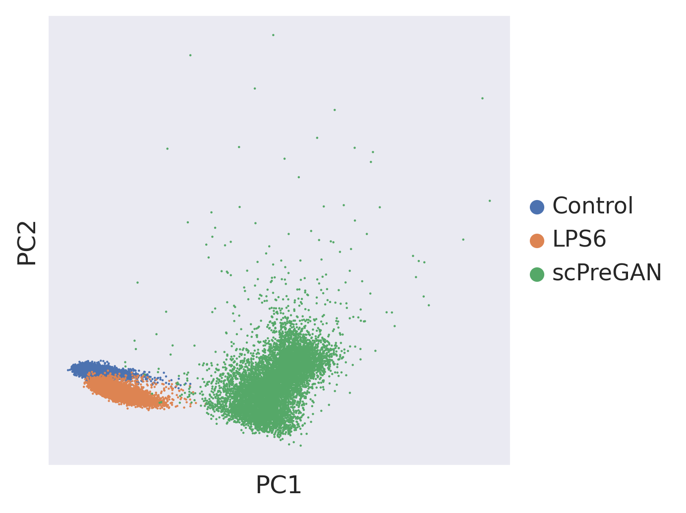
    


    
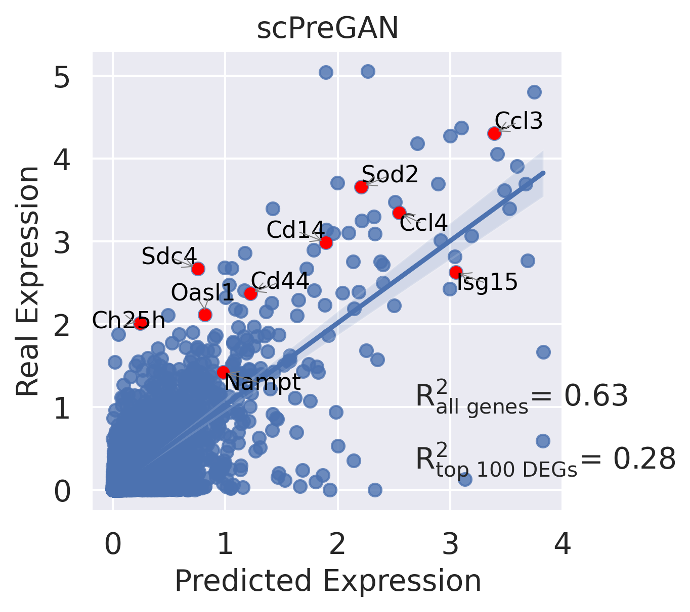
    


### CellOT Prediction


```python
cellot_dir = "../data/cellot-pred"
pred = sc.read_h5ad(f"{cellot_dir}/holdout-rat/model-cellot/evals_ood_data_space/imputed.h5ad")
pred.obs["condition"] = 'pred'
ctrl_adata = adata[((adata.obs['species'] == cell) & (adata.obs["condition"] == "unst"))]
treat_adata = adata[((adata.obs['species'] == cell) & (adata.obs["condition"] == "LPS6"))]

eval_adata4 = ctrl_adata.concatenate(treat_adata, pred)
treatments = []
for i in eval_adata4.obs["condition"]:
    if i == 'unst':
        treatments.append("Control")
    elif i == "LPS6":
        treatments.append("LPS6")
    else:
        treatments.append("cellOT")
eval_adata4.obs["Treatment"] = treatments
sc.tl.pca(eval_adata4)
sc.pl.pca(eval_adata4, color = "Treatment", frameon = True, title = "", save = "SF8B3.svg")
CD4T = adata[adata.obs["species"] ==cell]
sc.tl.rank_genes_groups(CD4T, groupby="condition", method="wilcoxon")
diff_genes = CD4T.uns["rank_genes_groups"]["names"]["LPS6"]
r2_value = vae.reg_mean_plot(
eval_adata4,
axis_keys={"x": "pred", "y": "LPS6"},
gene_list=diff_genes[:10],
top_100_genes = diff_genes[:100],
labels={"x": "Predicted Expression", "y": "Real Expression"},
path_to_save="../figures/SF8C3.svg",
show=True,
legend=False, title = "cellOT")
```

    WARNING: saving figure to file ../figures/pcaSF8B3.svg


    
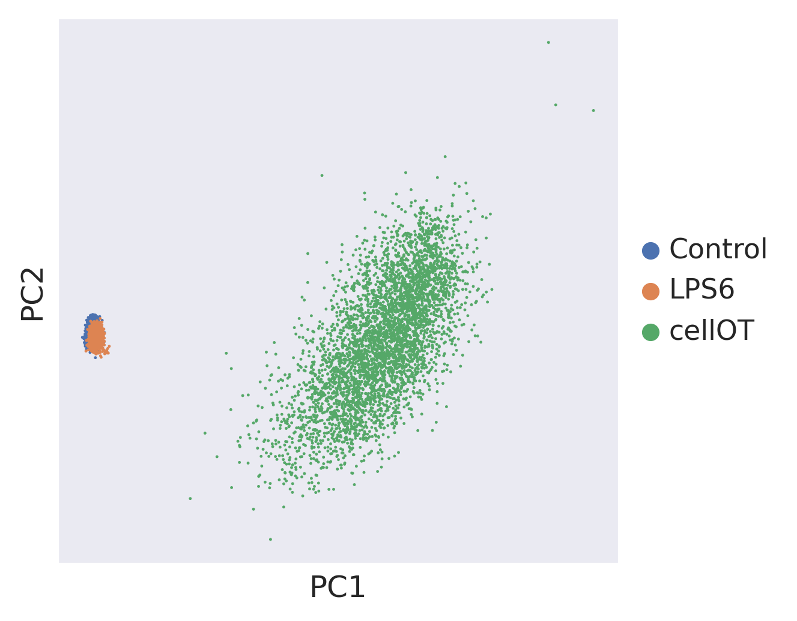
    


    
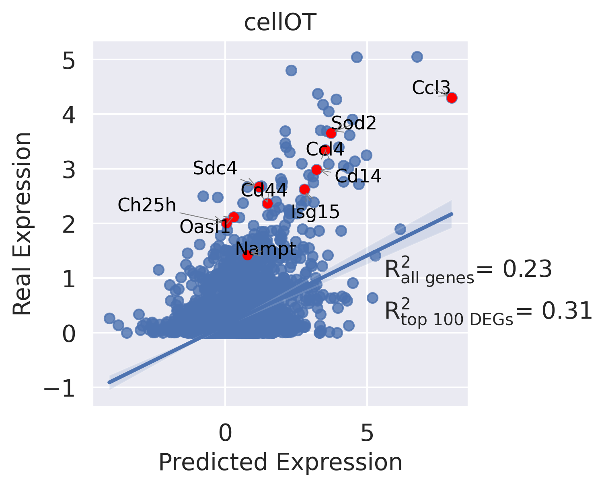
    


# Supplementary Figure 8C


```python
# df_list = []
# for cell in ["rat", "rabbit", "pig"]:
#     print(cell)
#     train_adata, test_adata = prepare_data(adata, "species", "condition", cell, "LPS6", normalized = True)

#     vae = VIDR(train_adata, linear_decoder = False)
# #     vae.train(
# #     max_epochs=100,
# #     batch_size=128,
# #     early_stopping=True,
# #     early_stopping_patience=25)
    
# #     vae.save(f"../../data/VAE_Binary_Prediction_IFNB_7000g_{cell}.pt")
#     vae = vae.load(f"../../data/VAE_Species_Prediction_LPS_7000g_{cell}.pt/", train_adata)
    
#     vae_name = "scGen"
    
#     ctrl_key = "unst"
#     treat_key = "LPS6"
    
#     cell_type_to_predict = cell
#     cell_type_key = vae.scvi_setup_dict_["categorical_mappings"]["_scvi_labels"][
#         "original_key"
#     ]
#     treatment_key = vae.scvi_setup_dict_["categorical_mappings"]["_scvi_batch"][
#         "original_key"
#     ]
    
#     vae.adata.obs["species_condition"] = adata.obs.species.astype(str) + adata.obs.condition.astype(str)
    
#     adata_bal = random_sample(vae.adata, "species_condition", "min")
#     adata_bal_ctrl = adata_bal[(adata_bal.obs[cell_type_key] == cell_type_to_predict) & (adata_bal.obs[treatment_key] == ctrl_key)]
#     latent_bal =  vae.get_latent_representation(adata_bal)
#     latent_bal_adata = sc.AnnData(X=latent_bal, obs = adata_bal.obs.copy())
#     latent_cd = latent_bal_adata[(latent_bal_adata.obs[cell_type_key] == cell_type_to_predict) & (latent_bal_adata.obs[treatment_key] == ctrl_key)].X

#     latent_mouse_cd = latent_bal_adata[(latent_bal_adata.obs[cell_type_key] == "mouse") & (latent_bal_adata.obs[treatment_key] == ctrl_key)].X
#     latent_mouse_trt = latent_bal_adata[(latent_bal_adata.obs[cell_type_key] == "mouse") & (latent_bal_adata.obs[treatment_key] == treat_key)].X

#     scgen_treat_delta = np.average(latent_mouse_trt,axis=0) - np.average(latent_mouse_cd,axis=0)
#     scgen_species_delta = np.average(latent_cd,axis=0) - np.average(latent_mouse_cd,axis=0)
    
#     treat_pred = 0.5*(scgen_species_delta + latent_mouse_trt + scgen_treat_delta + latent_cd)
#     predicted_cells = vae.module.generative(torch.Tensor(treat_pred))["px"].cpu().detach().numpy()
#     pred = sc.AnnData(X=predicted_cells , obs=adata_bal_ctrl.obs.copy(), var=adata_bal_ctrl.var.copy(),obsm=adata_bal_ctrl.obsm.copy(),)
    
    
#     pred.obs["condition"] = 'pred'
#     ctrl_adata = adata[((adata.obs['species'] == cell) & (adata.obs["condition"] == "unst"))]
#     treat_adata = adata[((adata.obs['species'] == cell) & (adata.obs["condition"] == "LPS6"))]
#     eval_adata = ctrl_adata.concatenate(treat_adata, pred)
    
#     CD4T = adata[adata.obs["species"] ==cell]
#     sc.tl.rank_genes_groups(CD4T, groupby="condition", method="wilcoxon")
#     diff_genes = CD4T.uns["rank_genes_groups"]["names"][treat_key]
    
#     r2_df = calculate_r2_singledose(
#         eval_adata, cell,
#         vae_name, 
#         "condition", 
#         {"x":"pred", "y":"LPS6"}, 
#         diff_genes=None, 
#         random_sample_coef = 0.8,
#         n_iter = 100
#     )
#     df_list.append(r2_df)
```

    rat
    INFO     Using batches from adata.obs["condition"]                                                                 
    INFO     Using labels from adata.obs["species"]                                                                    
    INFO     Using data from adata.X                                                                                   
    INFO     Computing library size prior per batch                                                                    
    INFO     Successfully registered anndata object containing 52691 cells, 6619 vars, 2 batches, 4 labels, and 0      
             proteins. Also registered 0 extra categorical covariates and 0 extra continuous covariates.               
    INFO     Please do not further modify adata until model is trained.                                                
    None
    INFO     Using data from adata.X                                                                                   
    INFO     Computing library size prior per batch                                                                    
    INFO     Registered keys:['X', 'batch_indices', 'local_l_mean', 'local_l_var', 'labels']                           
    INFO     Successfully registered anndata object containing 52691 cells, 6619 vars, 2 batches, 4 labels, and 0      
             proteins. Also registered 0 extra categorical covariates and 0 extra continuous covariates.               
    None
    rabbit
    INFO     Using batches from adata.obs["condition"]                                                                 
    INFO     Using labels from adata.obs["species"]                                                                    
    INFO     Using data from adata.X                                                                                   
    INFO     Computing library size prior per batch                                                                    
    INFO     Successfully registered anndata object containing 55007 cells, 6619 vars, 2 batches, 4 labels, and 0      
             proteins. Also registered 0 extra categorical covariates and 0 extra continuous covariates.               
    INFO     Please do not further modify adata until model is trained.                                                
    None
    INFO     Using data from adata.X                                                                                   
    INFO     Computing library size prior per batch                                                                    
    INFO     Registered keys:['X', 'batch_indices', 'local_l_mean', 'local_l_var', 'labels']                           
    INFO     Successfully registered anndata object containing 55007 cells, 6619 vars, 2 batches, 4 labels, and 0      
             proteins. Also registered 0 extra categorical covariates and 0 extra continuous covariates.               
    None
    pig
    INFO     Using batches from adata.obs["condition"]                                                                 
    INFO     Using labels from adata.obs["species"]                                                                    
    INFO     Using data from adata.X                                                                                   
    INFO     Computing library size prior per batch                                                                    
    INFO     Successfully registered anndata object containing 57308 cells, 6619 vars, 2 batches, 4 labels, and 0      
             proteins. Also registered 0 extra categorical covariates and 0 extra continuous covariates.               
    INFO     Please do not further modify adata until model is trained.                                                
    None
    INFO     Using data from adata.X                                                                                   
    INFO     Computing library size prior per batch                                                                    
    INFO     Registered keys:['X', 'batch_indices', 'local_l_mean', 'local_l_var', 'labels']                           
    INFO     Successfully registered anndata object containing 57308 cells, 6619 vars, 2 batches, 4 labels, and 0      
             proteins. Also registered 0 extra categorical covariates and 0 extra continuous covariates.               
    None


```python
# for cell in ["rat", "rabbit", "pig"]:
#     print(cell)
#     train_adata, test_adata = prepare_data(adata, "species", "condition", cell, "LPS6", normalized = True)

#     vae = VIDR(train_adata, linear_decoder = False)
# #     vae.train(
# #     max_epochs=100,
# #     batch_size=128,
# #     early_stopping=True,
# #     early_stopping_patience=25)
    
# #     vae.save(f"../../data/VAE_Binary_Prediction_IFNB_7000g_{cell}.pt")
#     vae = vae.load(f"../../data/VAE_Species_Prediction_LPS_7000g_{cell}.pt/", train_adata)
    
#     vae_name = "scVIDR"
    
#     ctrl_key = "unst"
#     treat_key = "LPS6"

#     cell_type_to_predict = cell
#     cell_type_key = vae.scvi_setup_dict_["categorical_mappings"]["_scvi_labels"][
#         "original_key"
#     ]
#     treatment_key = vae.scvi_setup_dict_["categorical_mappings"]["_scvi_batch"][
#         "original_key"
#     ]
    
#     vae.adata.obs["species_condition"] = adata.obs.species.astype(str) + adata.obs.condition.astype(str)
    
#     adata_bal = random_sample(vae.adata, "species_condition", "min")
#     adata_bal_ctrl = adata_bal[(adata_bal.obs[cell_type_key] == cell_type_to_predict) & (adata_bal.obs[treatment_key] == ctrl_key)]
#     latent_bal =  vae.get_latent_representation(adata_bal)
#     latent_bal_adata = sc.AnnData(X=latent_bal, obs = adata_bal.obs.copy())
#     latent_cd = latent_bal_adata[(latent_bal_adata.obs[cell_type_key] == cell_type_to_predict) & (latent_bal_adata.obs[treatment_key] == ctrl_key)].X
    
#     #Get deltas and control centroids for each cell tpye in the training dataset
#     deltas = []
#     latent_centroids = []
#     cell_types = np.unique(latent_bal_adata.obs[cell_type_key])
#     for cell_i in cell_types:
#         if cell_i != cell_type_to_predict:
#             latent_ctrl = latent_bal_adata[(latent_bal_adata.obs[cell_type_key] == cell_i) & (latent_bal_adata.obs[treatment_key] == ctrl_key)].X
#             latent_treat = latent_bal_adata[(latent_bal_adata.obs[cell_type_key] == cell_i) & (latent_bal_adata.obs[treatment_key] == treat_key)].X
#             deltas_i = np.average(latent_treat, axis = 0) - np.average(latent_ctrl, axis = 0)
#             deltas.append(deltas_i)
#             latent_centroids.append(np.average(latent_ctrl, axis = 0))
#     lr = LinearRegression()
#     reg = lr.fit(latent_centroids, deltas)
#     scvidr_delta = reg.predict([np.average(latent_cd, axis = 0)])[0]
    
#     treat_pred = scvidr_delta + latent_cd
#     predicted_cells = vae.module.generative(torch.Tensor(treat_pred))["px"].cpu().detach().numpy()
#     pred = sc.AnnData(X=predicted_cells , obs=adata_bal_ctrl.obs.copy(), var=adata_bal_ctrl.var.copy(),obsm=adata_bal_ctrl.obsm.copy(),)
    
#     pred.obs["condition"] = 'pred'
#     ctrl_adata = adata[((adata.obs['species'] == cell) & (adata.obs["condition"] == "unst"))]
#     treat_adata = adata[((adata.obs['species'] == cell) & (adata.obs["condition"] == "LPS6"))]
#     eval_adata2 = ctrl_adata.concatenate(treat_adata, pred)
    
#     CD4T = adata[adata.obs["species"] ==cell]
#     sc.tl.rank_genes_groups(CD4T, groupby="condition", method="wilcoxon")
#     diff_genes = CD4T.uns["rank_genes_groups"]["names"][treat_key]
    
#     r2_df = calculate_r2_singledose(
#         eval_adata2, cell,
#         vae_name, 
#         "condition", 
#         {"x":"pred", "y":treat_key}, 
#         diff_genes=None, 
#         random_sample_coef = 0.8,
#         n_iter = 100
#     )
#     df_list.append(r2_df)
```

    rat
    INFO     Using batches from adata.obs["condition"]                                                                 
    INFO     Using labels from adata.obs["species"]                                                                    
    INFO     Using data from adata.X                                                                                   
    INFO     Computing library size prior per batch                                                                    
    INFO     Successfully registered anndata object containing 52691 cells, 6619 vars, 2 batches, 4 labels, and 0      
             proteins. Also registered 0 extra categorical covariates and 0 extra continuous covariates.               
    INFO     Please do not further modify adata until model is trained.                                                
    None
    INFO     Using data from adata.X                                                                                   
    INFO     Computing library size prior per batch                                                                    
    INFO     Registered keys:['X', 'batch_indices', 'local_l_mean', 'local_l_var', 'labels']                           
    INFO     Successfully registered anndata object containing 52691 cells, 6619 vars, 2 batches, 4 labels, and 0      
             proteins. Also registered 0 extra categorical covariates and 0 extra continuous covariates.               
    None
    rabbit
    INFO     Using batches from adata.obs["condition"]                                                                 
    INFO     Using labels from adata.obs["species"]                                                                    
    INFO     Using data from adata.X                                                                                   
    INFO     Computing library size prior per batch                                                                    
    INFO     Successfully registered anndata object containing 55007 cells, 6619 vars, 2 batches, 4 labels, and 0      
             proteins. Also registered 0 extra categorical covariates and 0 extra continuous covariates.               
    INFO     Please do not further modify adata until model is trained.                                                
    None
    INFO     Using data from adata.X                                                                                   
    INFO     Computing library size prior per batch                                                                    
    INFO     Registered keys:['X', 'batch_indices', 'local_l_mean', 'local_l_var', 'labels']                           
    INFO     Successfully registered anndata object containing 55007 cells, 6619 vars, 2 batches, 4 labels, and 0      
             proteins. Also registered 0 extra categorical covariates and 0 extra continuous covariates.               
    None
    pig
    INFO     Using batches from adata.obs["condition"]                                                                 
    INFO     Using labels from adata.obs["species"]                                                                    
    INFO     Using data from adata.X                                                                                   
    INFO     Computing library size prior per batch                                                                    
    INFO     Successfully registered anndata object containing 57308 cells, 6619 vars, 2 batches, 4 labels, and 0      
             proteins. Also registered 0 extra categorical covariates and 0 extra continuous covariates.               
    INFO     Please do not further modify adata until model is trained.                                                
    None
    INFO     Using data from adata.X                                                                                   
    INFO     Computing library size prior per batch                                                                    
    INFO     Registered keys:['X', 'batch_indices', 'local_l_mean', 'local_l_var', 'labels']                           
    INFO     Successfully registered anndata object containing 57308 cells, 6619 vars, 2 batches, 4 labels, and 0      
             proteins. Also registered 0 extra categorical covariates and 0 extra continuous covariates.               
    None


```python
# r2_values_allCells_df = pd.concat(df_list)
```


```python
# r2_values_allCells_df.to_csv("../data/Species_Model_Results.csv")
```


```python
# r2_values_allCells_df = pd.read_csv("../data/Species_Model_Results.csv")
```


```python
# r2_df_hvgs = r2_values_allCells_df[r2_values_allCells_df["Gene Set"] == "All HVGs"]
```


```python
# r2_df_hvgs = r2_values_allCells_df[r2_values_allCells_df["Gene Set"] == "All HVGs"]
```


```python
# order = ['scVIDR', 'scGen',]# 'scPreGAN', "CellOT"]
# hue_order = ["rat", "rabbit", "pig"]
# ax = sns.boxplot(x = "Model", y = "R^2",  data = r2_df_hvgs, hue = "Cell", order = order, hue_order = hue_order)
# pairs = [
#     (('scVIDR','rat'), ('scGen', 'rat')),
#     (('scVIDR', 'rabbit'), ('scGen', 'rabbit')),
#     (('scVIDR', 'pig'), ('scGen', 'pig'))
# #    (('scVIDR','All HVGs'), ('scPreGAN', 'All HVGs')),
# #    (('scVIDR','DEGs'), ('scPreGAN', 'DEGs')),
# #    (('scVIDR', 'All HVGs'), ('CellOT', 'All HVGs')),
# #    (('scVIDR', 'DEGs'), ('CellOT', 'DEGs'))
# ]
# annotator = Annotator(ax, pairs, data=r2_df_hvgs, x="Model", y="R^2", hue = "Cell", order = order)
# annotator.configure(test='Mann-Whitney-gt', text_format='star', loc='outside')
# annotator.apply_and_annotate()
# plt.ylabel(r"$R^2$ All HVGs")
# plt.savefig("../figures/SF8D.svg", bbox_inches = "tight")
# plt.show()
```

    p-value annotation legend:
          ns: p <= 1.00e+00
           *: 1.00e-02 < p <= 5.00e-02
          **: 1.00e-03 < p <= 1.00e-02
         ***: 1.00e-04 < p <= 1.00e-03
        ****: p <= 1.00e-04
    
    scVIDR_pig vs. scGen_pig: Mann-Whitney-Wilcoxon test greater, P_val:1.000e+00 U_stat=0.000e+00
    scVIDR_rat vs. scGen_rat: Mann-Whitney-Wilcoxon test greater, P_val:1.281e-34 U_stat=1.000e+04
    scVIDR_rabbit vs. scGen_rabbit: Mann-Whitney-Wilcoxon test greater, P_val:1.281e-34 U_stat=1.000e+04


    
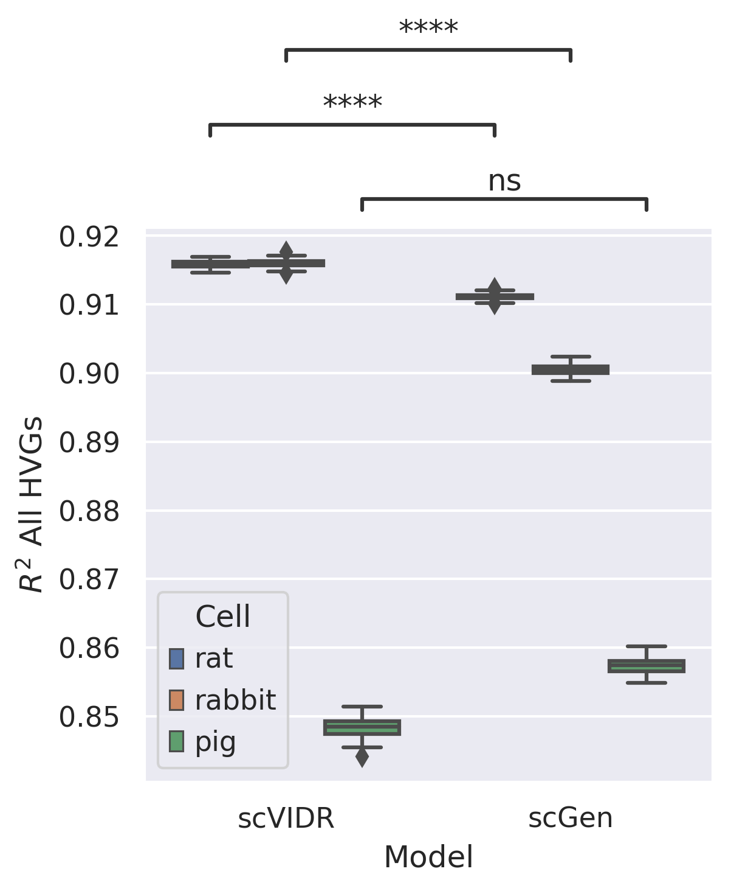
    


```python
# r2_df_degs = r2_values_allCells_df[r2_values_allCells_df["Gene Set"] == "DEGs"]
```


```python
# order = ['scVIDR', 'scGen',]# 'scPreGAN', "CellOT"]
# hue_order = ["rat", "rabbit", "pig"]
# ax = sns.boxplot(x = "Model", y = "R^2",  data = r2_df_degs, hue = "Cell", order = order, hue_order = hue_order)
# pairs = [
#     (('scVIDR','rat'), ('scGen', 'rat')),
#     (('scVIDR', 'rabbit'), ('scGen', 'rabbit')),
#     (('scVIDR', 'pig'), ('scGen', 'pig'))
# #    (('scVIDR','All HVGs'), ('scPreGAN', 'All HVGs')),
# #    (('scVIDR','DEGs'), ('scPreGAN', 'DEGs')),
# #    (('scVIDR', 'All HVGs'), ('CellOT', 'All HVGs')),
# #    (('scVIDR', 'DEGs'), ('CellOT', 'DEGs'))
# ]
# annotator = Annotator(ax, pairs, data=r2_df_degs, x="Model", y="R^2", hue = "Cell", order = order)
# annotator.configure(test='Mann-Whitney-gt', text_format='star', loc='outside')
# annotator.apply_and_annotate()
# plt.ylabel(r"$R^2$ All HVGs")
# plt.savefig("../figures/SF8D.svg", bbox_inches = "tight")
# plt.show()
```

    p-value annotation legend:
          ns: p <= 1.00e+00
           *: 1.00e-02 < p <= 5.00e-02
          **: 1.00e-03 < p <= 1.00e-02
         ***: 1.00e-04 < p <= 1.00e-03
        ****: p <= 1.00e-04
    
    scVIDR_pig vs. scGen_pig: Mann-Whitney-Wilcoxon test greater, P_val:1.000e+00 U_stat=0.000e+00
    scVIDR_rat vs. scGen_rat: Mann-Whitney-Wilcoxon test greater, P_val:1.281e-34 U_stat=1.000e+04
    scVIDR_rabbit vs. scGen_rabbit: Mann-Whitney-Wilcoxon test greater, P_val:1.000e+00 U_stat=0.000e+00


    
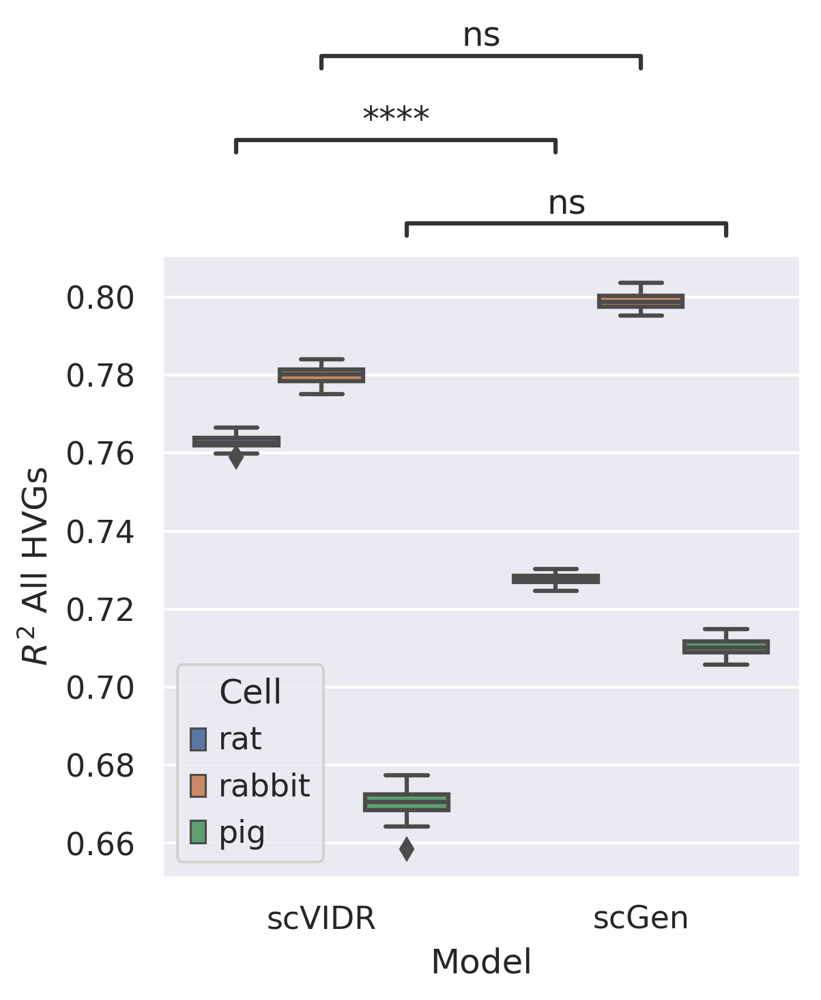
    


```python

```
