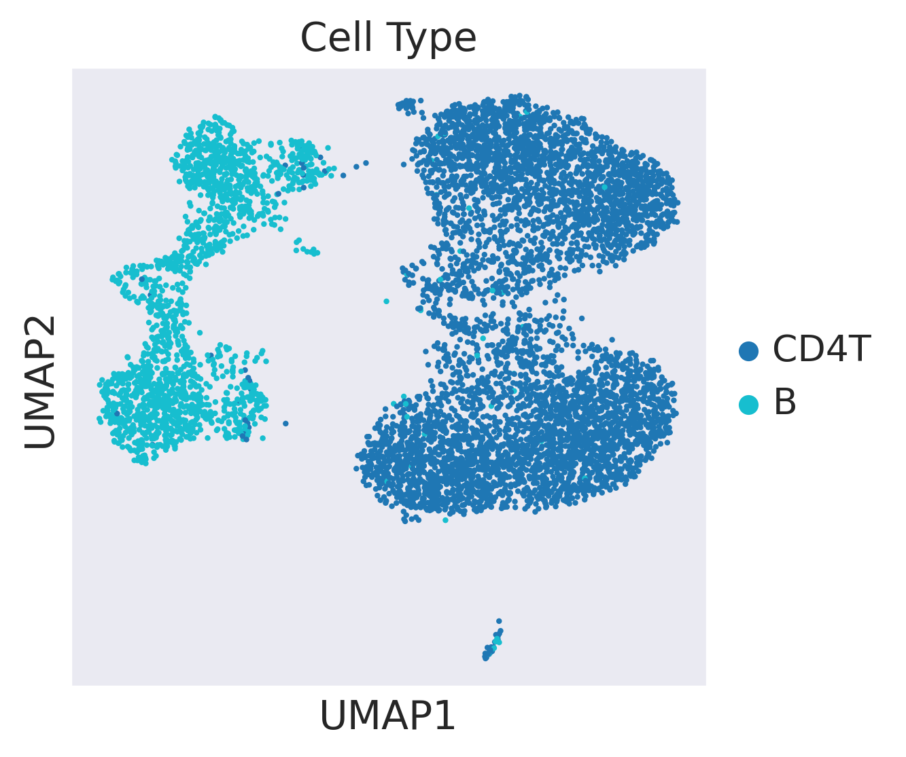
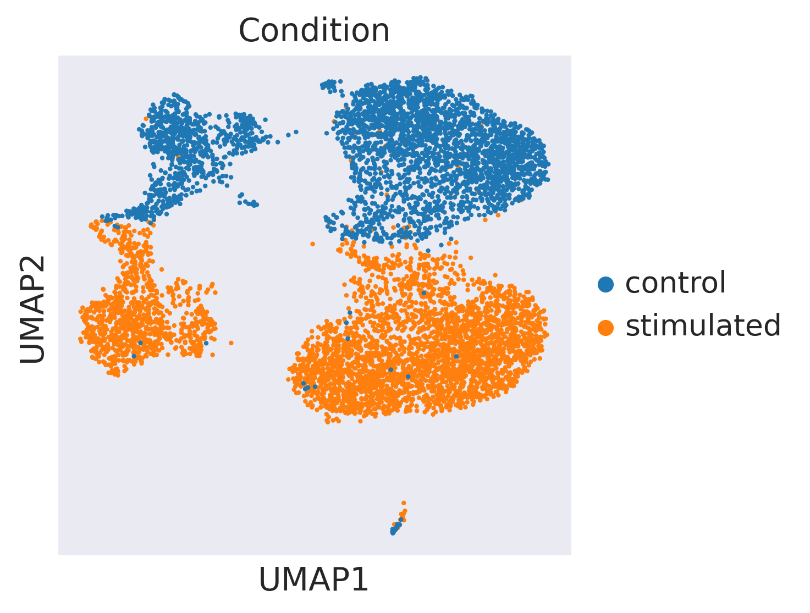
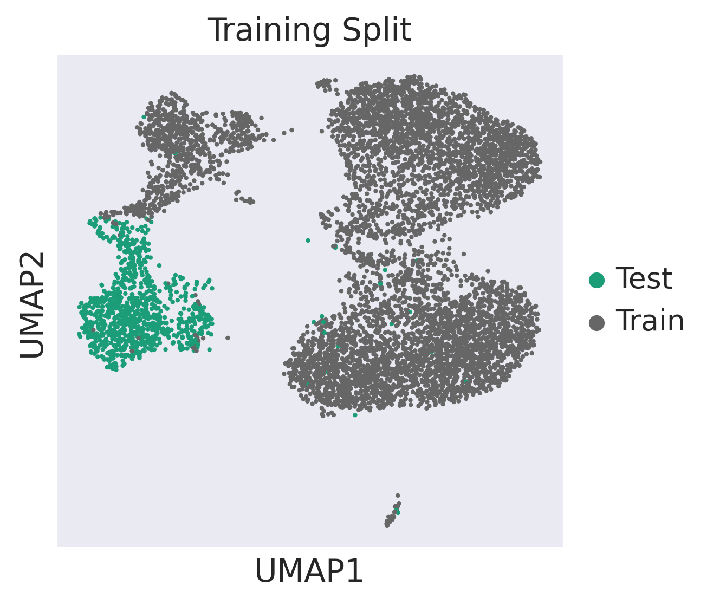
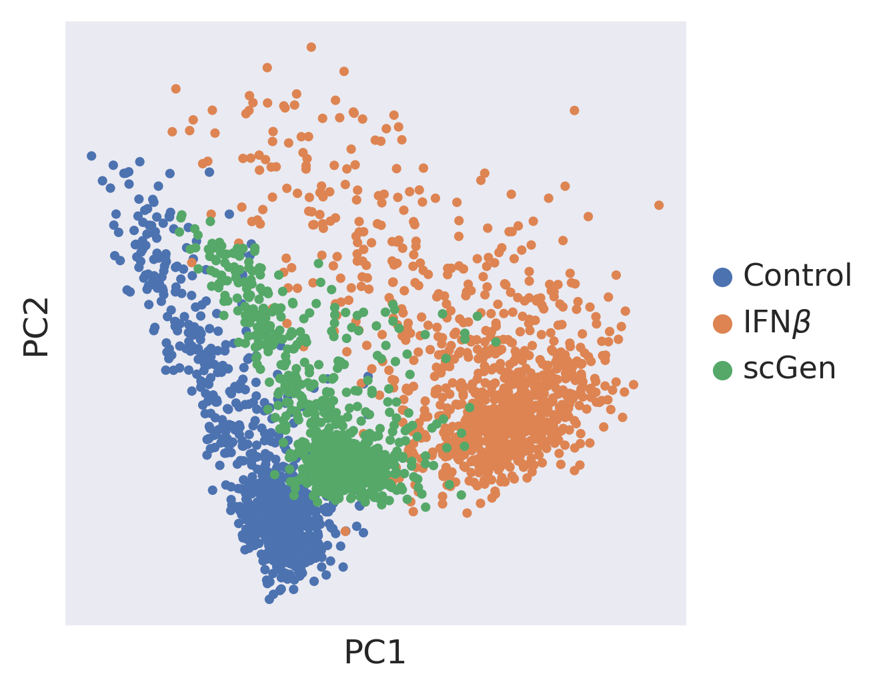
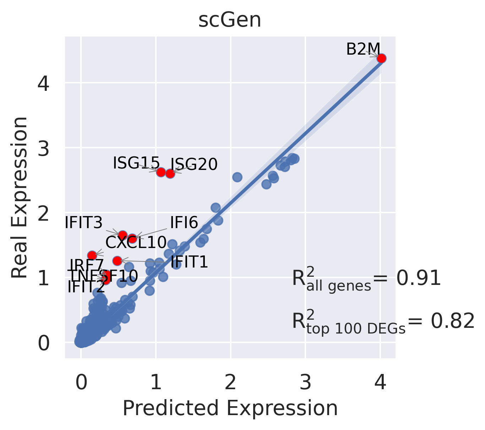
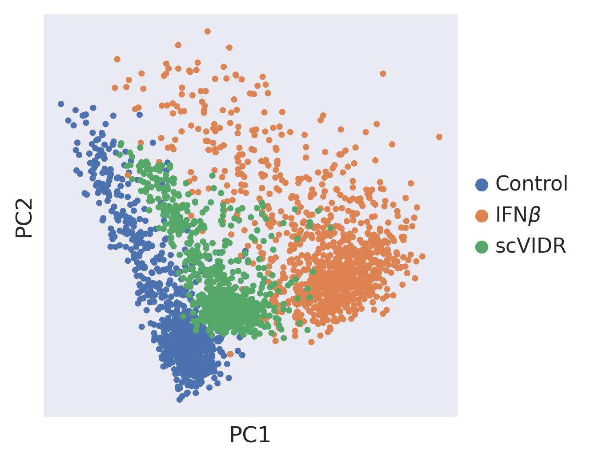
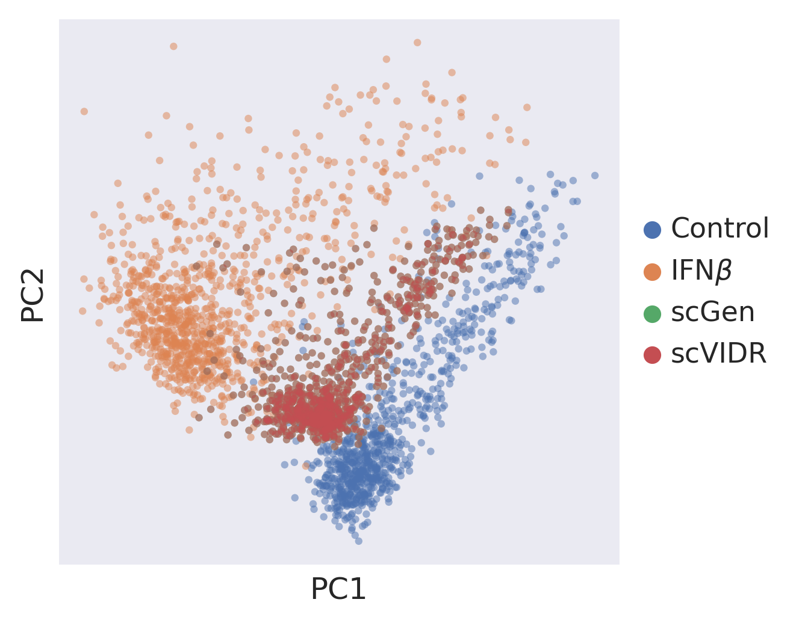

```python
#Create Access to my code
import sys
sys.path.insert(1, '../vidr/')

#Import the vaedr functions we have created
from vidr import VIDR
from utils import *


#Import important modules
import scanpy as sc
import pandas as pd
import numpy as np
import torch
import seaborn as sns
from scipy import stats
from scipy import linalg
from scipy import spatial
from anndata import AnnData
from scipy import sparse
from statannotations.Annotator import Annotator
from matplotlib import pyplot as plt

import scvi
sc.set_figure_params(dpi = 150)
sc.settings.figdir = "../figures/"
sns.set_style("dark")
```


```python
adata = sc.read("../data/kang2018.h5ad")
```

    /mnt/ufs18/home-091/kanaomar/mambaforge/envs/scVIDR/lib/python3.8/site-packages/anndata/compat/__init__.py:232: FutureWarning: Moving element from .uns['neighbors']['distances'] to .obsp['distances'].
    
    This is where adjacency matrices should go now.
      warn(
    /mnt/ufs18/home-091/kanaomar/mambaforge/envs/scVIDR/lib/python3.8/site-packages/anndata/compat/__init__.py:232: FutureWarning: Moving element from .uns['neighbors']['connectivities'] to .obsp['connectivities'].
    
    This is where adjacency matrices should go now.
      warn(


```python
adata = adata[((adata.obs["cell_type"] == "B") | (adata.obs["cell_type"] == "CD4T"))]
```


```python
#Training model
cell = "B"
train_adata, test_adata = prepare_data(adata, "cell_type", "condition", cell, "stimulated", normalized = True)
model = VIDR(train_adata, linear_decoder = False)
model.train(
max_epochs=100,
batch_size=128,
early_stopping=True,
early_stopping_patience=25)
    
```

    INFO     Using batches from adata.obs["condition"]                                                                 
    INFO     Using labels from adata.obs["cell_type"]                                                                  
    INFO     Using data from adata.X                                                                                   
    INFO     Computing library size prior per batch                                                                    
    INFO     Successfully registered anndata object containing 6382 cells, 6998 vars, 2 batches, 2 labels, and 0       
             proteins. Also registered 0 extra categorical covariates and 0 extra continuous covariates.               
    INFO     Please do not further modify adata until model is trained.                                                


    /mnt/ufs18/home-091/kanaomar/mambaforge/envs/scVIDR/lib/python3.8/site-packages/scvi/model/base/_base_model.py:149: UserWarning: Make sure the registered X field in anndata contains unnormalized count data.
      warnings.warn(


    None


    GPU available: True, used: True
    TPU available: False, using: 0 TPU cores
    LOCAL_RANK: 0 - CUDA_VISIBLE_DEVICES: [0,1,2,3]
    Set SLURM handle signals.


    Epoch 29/100:  29%|██▉       | 29/100 [00:30<01:13,  1.04s/it, loss=98.8, v_num=1]


```python
model.save(f"../../data/VAE_Binary_Prediction_IFNB_7000g_2cell.pt", overwrite = True)
```

## Supplemental Figure 9A


```python
#UMAP Projection of latent space
latent_X = model.get_latent_representation(adata)
latent_adata = sc.AnnData(X=latent_X, obs=adata.obs.copy())
cell_condition = [f"{j}_{str(i)}" for (i,j) in zip(adata.obs["condition"], adata.obs["cell_type"])]
training = ["Train" if i != cell+"_stimulated" else "Test" for i in cell_condition]
latent_adata.obs["Cell_Condition"] = cell_condition
latent_adata.obs["Training Split"] = training
```

    INFO     Received view of anndata, making copy.                                                                    
    INFO     Input adata not setup with scvi. attempting to transfer anndata setup                                     
    INFO     Using data from adata.X                                                                                   
    INFO     Computing library size prior per batch                                                                    
    INFO     Registered keys:['X', 'batch_indices', 'local_l_mean', 'local_l_var', 'labels']                           
    INFO     Successfully registered anndata object containing 7375 cells, 6998 vars, 2 batches, 2 labels, and 0       
             proteins. Also registered 0 extra categorical covariates and 0 extra continuous covariates.               


    /mnt/ufs18/home-091/kanaomar/mambaforge/envs/scVIDR/lib/python3.8/site-packages/scvi/model/base/_base_model.py:149: UserWarning: Make sure the registered X field in anndata contains unnormalized count data.
      warnings.warn(


```python
sc.pp.neighbors(latent_adata)
sc.tl.umap(latent_adata)
```

    WARNING: You’re trying to run this on 100 dimensions of `.X`, if you really want this, set `use_rep='X'`.
             Falling back to preprocessing with `sc.pp.pca` and default params.


```python
ax = sc.pl.umap(latent_adata, color=['cell_type', 'condition'], frameon=True,palette = "tab10", save ="SF3A1.svg", title = "Cell Type")
```

    WARNING: saving figure to file ../figures/umapSF3A1.svg


    /mnt/ufs18/home-091/kanaomar/mambaforge/envs/scVIDR/lib/python3.8/site-packages/scanpy/plotting/_tools/scatterplots.py:392: UserWarning: No data for colormapping provided via 'c'. Parameters 'cmap' will be ignored
      cax = scatter(


    

    


```python
ax = sc.pl.umap(latent_adata, color=['condition'], frameon=True, save ="S3A2.svg", title = "Condition")
```

    WARNING: saving figure to file ../figures/umapS3A2.svg


    /mnt/ufs18/home-091/kanaomar/mambaforge/envs/scVIDR/lib/python3.8/site-packages/scanpy/plotting/_tools/scatterplots.py:392: UserWarning: No data for colormapping provided via 'c'. Parameters 'cmap' will be ignored
      cax = scatter(


    

    


```python
ax = sc.pl.umap(latent_adata, color=['Training Split'], frameon=True,palette="Dark2", save ="S3A3.svg")
```

    WARNING: saving figure to file ../figures/umapS3A3.svg


    /mnt/ufs18/home-091/kanaomar/mambaforge/envs/scVIDR/lib/python3.8/site-packages/scanpy/plotting/_tools/scatterplots.py:392: UserWarning: No data for colormapping provided via 'c'. Parameters 'cmap' will be ignored
      cax = scatter(


    

    


# Supplemental Figure 3B


```python
ctrl_key = "control"
treat_key = "stimulated"
cell_type_to_predict = "B"
```


```python
cell_type_key = model.scvi_setup_dict_["categorical_mappings"]["_scvi_labels"][
    "original_key"
]
treatment_key = model.scvi_setup_dict_["categorical_mappings"]["_scvi_batch"][
    "original_key"
]
```


```python
ctrl_x = model.adata[model.adata.obs[treatment_key] == ctrl_key]
treat_x = model.adata[model.adata.obs[treatment_key] == treat_key]
```


```python
#Balancing across treatments 
adata_bal = ctrl_x.concatenate(treat_x)
adata_bal = random_sample(adata_bal, treatment_key, max_or_min = "min", replacement = False)
```

    /mnt/ufs18/home-091/kanaomar/mambaforge/envs/scVIDR/lib/python3.8/site-packages/anndata/_core/anndata.py:1785: FutureWarning: X.dtype being converted to np.float32 from float64. In the next version of anndata (0.9) conversion will not be automatic. Pass dtype explicitly to avoid this warning. Pass `AnnData(X, dtype=X.dtype, ...)` to get the future behavour.
      [AnnData(sparse.csr_matrix(a.shape), obs=a.obs) for a in all_adatas],
    /mnt/ufs18/home-091/kanaomar/mambaforge/envs/scVIDR/lib/python3.8/site-packages/anndata/_core/anndata.py:1785: FutureWarning: X.dtype being converted to np.float32 from float64. In the next version of anndata (0.9) conversion will not be automatic. Pass dtype explicitly to avoid this warning. Pass `AnnData(X, dtype=X.dtype, ...)` to get the future behavour.
      [AnnData(sparse.csr_matrix(a.shape), obs=a.obs) for a in all_adatas],


```python
#Getting control for validation 
adata_bal_ctrl = adata_bal[(adata_bal.obs[cell_type_key] == cell_type_to_predict) & (adata_bal.obs[treatment_key] == ctrl_key)]

#Getting latent representations
latent_bal =  model.get_latent_representation(adata_bal)
latent_bal_adata = sc.AnnData(X=latent_bal, obs = adata_bal.obs.copy())
latent_cd = latent_bal_adata[(latent_bal_adata.obs[cell_type_key] == cell_type_to_predict) & (latent_bal_adata.obs[treatment_key] == ctrl_key)].X
```

    INFO     Input adata not setup with scvi. attempting to transfer anndata setup                                     
    INFO     Using data from adata.X                                                                                   
    INFO     Computing library size prior per batch                                                                    
    INFO     Registered keys:['X', 'batch_indices', 'local_l_mean', 'local_l_var', 'labels']                           
    INFO     Successfully registered anndata object containing 6254 cells, 6998 vars, 2 batches, 2 labels, and 0       
             proteins. Also registered 0 extra categorical covariates and 0 extra continuous covariates.               


    /mnt/ufs18/home-091/kanaomar/mambaforge/envs/scVIDR/lib/python3.8/site-packages/scvi/model/base/_base_model.py:149: UserWarning: Make sure the registered X field in anndata contains unnormalized count data.
      warnings.warn(


```python
#No regression on latent space
ctrl_x = latent_bal_adata[(latent_bal_adata.obs[treatment_key] == ctrl_key) & ~(latent_bal_adata.obs[cell_type_key] == cell_type_to_predict)].X.copy()
treat_x = latent_bal_adata[latent_bal_adata.obs[treatment_key] == treat_key].X.copy()

#Find scGen delta
latent_ctrl = np.average(ctrl_x, axis = 0)
latent_treat = np.average(treat_x, axis = 0)
scgen_delta = latent_treat - latent_ctrl
```


```python
#Get deltas and control centroids for each cell tpye in the training dataset
deltas = []
latent_centroids = []
cell_types = np.unique(adata_bal.obs[cell_type_key])
for cell_i in cell_types:
    if cell_i != cell_type_to_predict:
        latent_ctrl = latent_bal_adata[(latent_bal_adata.obs[cell_type_key] == cell_i) & (latent_bal_adata.obs[treatment_key] == ctrl_key)].X
        latent_treat = latent_bal_adata[(latent_bal_adata.obs[cell_type_key] == cell_i) & (latent_bal_adata.obs[treatment_key] == treat_key)].X
        deltas_i = np.average(latent_treat, axis = 0) - np.average(latent_ctrl, axis = 0)
        deltas.append(deltas_i)
        latent_centroids.append(np.average(latent_ctrl, axis = 0))
lr = LinearRegression()
reg = lr.fit(latent_centroids, deltas)
scvidr_delta = reg.predict([np.average(latent_cd, axis = 0)])[0]
```

### scVIDR Results


```python
#Predict scVIDR results
treat_pred = scgen_delta + latent_cd
predicted_cells = model.module.generative(torch.Tensor(treat_pred))["px"].cpu().detach().numpy()
pred = sc.AnnData(X=predicted_cells , obs=adata_bal_ctrl.obs.copy(), var=adata_bal_ctrl.var.copy(),obsm=adata_bal_ctrl.obsm.copy(),)
pred.obs["condition"] = 'pred'


ctrl_adata = adata[((adata.obs['cell_type'] == cell) & (adata.obs["condition"] == "control"))]
treat_adata = adata[((adata.obs['cell_type'] == cell) & (adata.obs["condition"] == "stimulated"))]
eval_adata1 = ctrl_adata.concatenate(treat_adata, pred)
treatments = []
for i in eval_adata1.obs["condition"]:
    if i == "control":
        treatments.append("Control")
    elif i == "stimulated":
        treatments.append(r"IFN$\beta$")
    else:
        treatments.append("scGen")
eval_adata1.obs["Treatment"] = treatments

#PCA Projection
sc.tl.pca(eval_adata1)
sc.pl.pca(eval_adata1, color = "Treatment", frameon = True, title = "", save = "SF9B.svg")

#Regression Plot
CD4T = adata[adata.obs["cell_type"] ==cell]
sc.tl.rank_genes_groups(CD4T, groupby="condition", method="wilcoxon")
diff_genes = CD4T.uns["rank_genes_groups"]["names"]["stimulated"]
r2_value = model.reg_mean_plot(
eval_adata1,
axis_keys={"x": "pred", "y": r"stimulated"},
gene_list=diff_genes[:10],
top_100_genes = diff_genes[:100],
labels={"x": "Predicted Expression", "y": "Real Expression"},
path_to_save="../figures/SF9C1.svg",
show=True,
legend=False, title = "scGen")
print(r2_value)
```

    /mnt/ufs18/home-091/kanaomar/mambaforge/envs/scVIDR/lib/python3.8/site-packages/anndata/_core/anndata.py:1785: FutureWarning: X.dtype being converted to np.float32 from float64. In the next version of anndata (0.9) conversion will not be automatic. Pass dtype explicitly to avoid this warning. Pass `AnnData(X, dtype=X.dtype, ...)` to get the future behavour.
      [AnnData(sparse.csr_matrix(a.shape), obs=a.obs) for a in all_adatas],
    /mnt/ufs18/home-091/kanaomar/mambaforge/envs/scVIDR/lib/python3.8/site-packages/anndata/_core/anndata.py:1785: FutureWarning: X.dtype being converted to np.float32 from float64. In the next version of anndata (0.9) conversion will not be automatic. Pass dtype explicitly to avoid this warning. Pass `AnnData(X, dtype=X.dtype, ...)` to get the future behavour.
      [AnnData(sparse.csr_matrix(a.shape), obs=a.obs) for a in all_adatas],
    /mnt/ufs18/home-091/kanaomar/mambaforge/envs/scVIDR/lib/python3.8/site-packages/anndata/_core/anndata.py:1785: FutureWarning: X.dtype being converted to np.float32 from float64. In the next version of anndata (0.9) conversion will not be automatic. Pass dtype explicitly to avoid this warning. Pass `AnnData(X, dtype=X.dtype, ...)` to get the future behavour.
      [AnnData(sparse.csr_matrix(a.shape), obs=a.obs) for a in all_adatas],


    WARNING: saving figure to file ../figures/pcaSF9B.svg


    /mnt/ufs18/home-091/kanaomar/mambaforge/envs/scVIDR/lib/python3.8/site-packages/scanpy/plotting/_tools/scatterplots.py:392: UserWarning: No data for colormapping provided via 'c'. Parameters 'cmap' will be ignored
      cax = scatter(


    

    


    /mnt/ufs18/home-091/kanaomar/mambaforge/envs/scVIDR/lib/python3.8/site-packages/anndata/compat/_overloaded_dict.py:106: ImplicitModificationWarning: Trying to modify attribute `._uns` of view, initializing view as actual.
      self.data[key] = value


    

    


    (0.9138199316591675, 0.816085990613895)


```python
#Predict scVIDR results
treat_pred = scvidr_delta + latent_cd
predicted_cells = model.module.generative(torch.Tensor(treat_pred))["px"].cpu().detach().numpy()
pred = sc.AnnData(X=predicted_cells , obs=adata_bal_ctrl.obs.copy(), var=adata_bal_ctrl.var.copy(),obsm=adata_bal_ctrl.obsm.copy(),)

pred.obs["condition"] = 'pred'
ctrl_adata = adata[((adata.obs['cell_type'] == cell) & (adata.obs["condition"] == "control"))]
treat_adata = adata[((adata.obs['cell_type'] == cell) & (adata.obs["condition"] == "stimulated"))]
eval_adata2 = ctrl_adata.concatenate(treat_adata, pred)
treatments = []
for i in eval_adata2.obs["condition"]:
    if i == "control":
        treatments.append("Control")
    elif i == "stimulated":
        treatments.append(r"IFN$\beta$")
    else:
        treatments.append("scVIDR")
eval_adata2.obs["Treatment"] = treatments
sc.tl.pca(eval_adata2)
sc.pl.pca(eval_adata2, color = "Treatment", frameon = True, title = "", save = "sup3C1.svg")
CD4T = adata[adata.obs["cell_type"] ==cell]
sc.tl.rank_genes_groups(CD4T, groupby="condition", method="wilcoxon")
diff_genes = CD4T.uns["rank_genes_groups"]["names"]["stimulated"]
r2_value = model.reg_mean_plot(
eval_adata2,
axis_keys={"x": "pred", "y": r"stimulated"},
gene_list=diff_genes[:10],
top_100_genes = diff_genes[:100],
labels={"x": "Predicted Expression", "y": "Real Expression"},
path_to_save="../figures/S3B2.svg",
show=True,
legend=False, title = "scVIDR")
print(r2_value)
```

    /mnt/ufs18/home-091/kanaomar/mambaforge/envs/scVIDR/lib/python3.8/site-packages/anndata/_core/anndata.py:1785: FutureWarning: X.dtype being converted to np.float32 from float64. In the next version of anndata (0.9) conversion will not be automatic. Pass dtype explicitly to avoid this warning. Pass `AnnData(X, dtype=X.dtype, ...)` to get the future behavour.
      [AnnData(sparse.csr_matrix(a.shape), obs=a.obs) for a in all_adatas],
    /mnt/ufs18/home-091/kanaomar/mambaforge/envs/scVIDR/lib/python3.8/site-packages/anndata/_core/anndata.py:1785: FutureWarning: X.dtype being converted to np.float32 from float64. In the next version of anndata (0.9) conversion will not be automatic. Pass dtype explicitly to avoid this warning. Pass `AnnData(X, dtype=X.dtype, ...)` to get the future behavour.
      [AnnData(sparse.csr_matrix(a.shape), obs=a.obs) for a in all_adatas],
    /mnt/ufs18/home-091/kanaomar/mambaforge/envs/scVIDR/lib/python3.8/site-packages/anndata/_core/anndata.py:1785: FutureWarning: X.dtype being converted to np.float32 from float64. In the next version of anndata (0.9) conversion will not be automatic. Pass dtype explicitly to avoid this warning. Pass `AnnData(X, dtype=X.dtype, ...)` to get the future behavour.
      [AnnData(sparse.csr_matrix(a.shape), obs=a.obs) for a in all_adatas],


    WARNING: saving figure to file ../figures/pcasup3C1.svg


    /mnt/ufs18/home-091/kanaomar/mambaforge/envs/scVIDR/lib/python3.8/site-packages/scanpy/plotting/_tools/scatterplots.py:392: UserWarning: No data for colormapping provided via 'c'. Parameters 'cmap' will be ignored
      cax = scatter(


    

    


    /mnt/ufs18/home-091/kanaomar/mambaforge/envs/scVIDR/lib/python3.8/site-packages/anndata/compat/_overloaded_dict.py:106: ImplicitModificationWarning: Trying to modify attribute `._uns` of view, initializing view as actual.
      self.data[key] = value


    

    


    (0.9138199316591675, 0.816085990613895)


# Supplemental Figure 3C


```python
eval_list  = [eval_adata2[eval_adata2.obs.Treatment == "scVIDR"],
             ]
eval_adata = eval_adata1.concatenate(eval_list)
```

    /mnt/ufs18/home-091/kanaomar/mambaforge/envs/scVIDR/lib/python3.8/site-packages/anndata/_core/anndata.py:1785: FutureWarning: X.dtype being converted to np.float32 from float64. In the next version of anndata (0.9) conversion will not be automatic. Pass dtype explicitly to avoid this warning. Pass `AnnData(X, dtype=X.dtype, ...)` to get the future behavour.
      [AnnData(sparse.csr_matrix(a.shape), obs=a.obs) for a in all_adatas],
    /mnt/ufs18/home-091/kanaomar/mambaforge/envs/scVIDR/lib/python3.8/site-packages/anndata/_core/anndata.py:1785: FutureWarning: X.dtype being converted to np.float32 from float64. In the next version of anndata (0.9) conversion will not be automatic. Pass dtype explicitly to avoid this warning. Pass `AnnData(X, dtype=X.dtype, ...)` to get the future behavour.
      [AnnData(sparse.csr_matrix(a.shape), obs=a.obs) for a in all_adatas],


```python
sc.tl.pca(eval_adata)
sc.pl.pca(eval_adata, color = "Treatment", frameon = True, title = "", save = "S3C.svg", alpha = 0.5)
```

    WARNING: saving figure to file ../figures/pcaS3C.svg


    /mnt/ufs18/home-091/kanaomar/mambaforge/envs/scVIDR/lib/python3.8/site-packages/scanpy/plotting/_tools/scatterplots.py:392: UserWarning: No data for colormapping provided via 'c'. Parameters 'cmap' will be ignored
      cax = scatter(


    

    


```python

```
